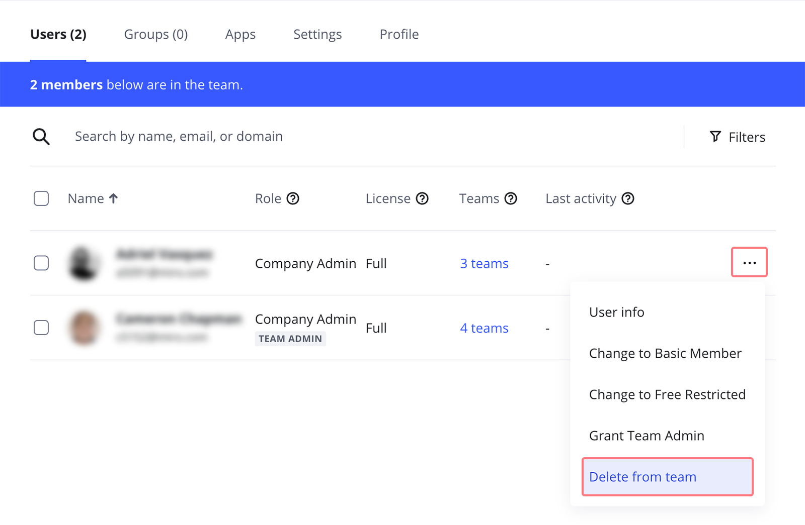

The advanced user management in Miro allows Admins to easily filter and manage all the users in one place. As an Admin, you can remove extra users anytime.

### Delete a user from a team

To delete a user from a particular team in your Enterprise subscription, open Team settings by hovering over the team name on the dashboard and then clicking the **Team members** icon.

The **Users** tab will open. Find the team member you'd like to delete and select **Delete from team** in the **three dots** (**...**) menu.

*Deleting a user from a team*

Note that deleting a user from a team does not completely delete them from the Enterprise organization and does not release a license. To delete a user from the organization (Company), [follow the steps below](#delete-a-user-from-company).

You can also select several users or up to 50 team users at once and bulk delete them.

### Delete a user from Company

:::warning
Before deleting users, check if you have enabled the [Block deactivated users](02-block-deactivated-users.md) setting. Deleted users are treated differently from deactivated users.
:::

To completely remove a user from your Enterprise plan you first need to [deactivate](01-deactivated-users.md) them in **Active users** section of **Company** settings. After that open **Deactivated users** tab and choose **Delete** from the **three dots** (**...**) menu in the user's row.

You can also bulk select up to 50 users and delete them all at once.

If the user is the owner of some boards/[templates](../../getting-started/start-here/your-first-board/04-templates.md)/[projects](../../using-miro/sharing-boards/16-projects.md) created in the Enterprise plan you will be given a choice to whom the content will be reassigned (you can select an Admin or a non-admin user). If you choose **Delete user and content**, the user's content will be removed. Admins will be able to [restore the deleted boards](../../using-miro/managing-boards/08-how-to-restore-a-deleted-board.md) within 90 days after the deletion.

The deleted user will lose all access to your plan assets right away (without being notified). Please note they will retain access to the boards that were shared [with a public link](../../using-miro/sharing-boards/03-sharing-boards-and-inviting-collaborators.md#sharing-boards-via-a-public-link) if the user saved the links to these specific boards.

If you are removing a managed user from your Enterprise subscription, they will be counted as [uncaptured](../canvas-25-admin-features/domain-control/01-domain-control.md) in your Domain control settings.
