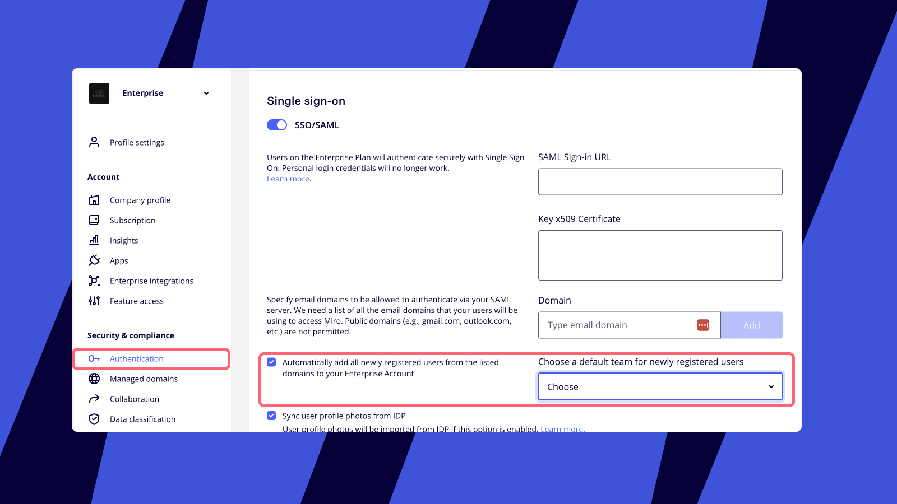
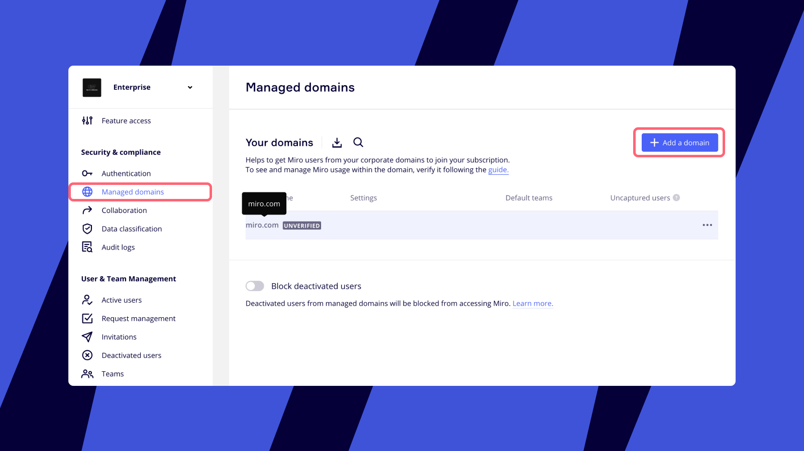

With auto-provisioning, all new users within your corporate domains are routed to your Enterprise subscription and get access to your company's assets.

Miro Enterprise provides several provisioning options: invitations, Just-in-Time provisioning (JIT), System for Cross-domain Identity Management (SCIM), and Domain control.

## Invitations

You can invite users to your subscription using the **Invite members** button on your dashboard. Invitations are sent immediately and do not require any additional setup.

Learn more about how you can share your work and collaborate in Miro by visiting [Manage invitations on Enterprise Plan](05-manage-user-invitations-on-enterprise-plan.md) and [Sharing boards and inviting collaborators](../../using-miro/sharing-boards/03-sharing-boards-and-inviting-collaborators.md).

*The option to invite members on Miro dashboard*

## Just-in-Time provisioning (JIT)

JIT provisioning, integrated with [Single Sign-on (SSO)](../security-integrations/single-sign-on-sso/09-single-sign-on-sso.md), automatically adds all new users registered under your corporate SSO domains to a specific team in your Enterprise Plan.
JIT provisioning can easily be enabled in your Miro SSO settings. Learn [how to set up SSO](../security-integrations/single-sign-on-sso/09-single-sign-on-sso.md).

*Enabling Just-in-Time (JIT) provisioning in SSO settings*

## System for Cross-domain Identity Management (SCIM)

SCIM, integrated with [Single Sign-on (SSO)](../security-integrations/single-sign-on-sso/09-single-sign-on-sso.md), enables you to automatically provision and manage users in your Enterprise Plan through your chosen Identity Provider (IdP).

With SCIM enabled, you can add users to particular teams, update their details and emails, and manage their activation status directly within your chosen Identity Provider. This feature automates the exchange of user information between your Miro account and your IdP.

SCIM automates the exchange of user information between Miro and your IdP, allowing you to manage employee access to your Enterprise Plan centrally from the IdP.

Learn more about [SCIM features](../security-integrations/system-for-cross-domain-identity-management-scim/02-scim.md), and review the configuration steps for [Entra ID](../security-integrations/system-for-cross-domain-identity-management-scim/03-setting-up-automated-provisioning-with-entra-id.md), [OKTA](../security-integrations/system-for-cross-domain-identity-management-scim/05-setting-up-automated-provisioning-with-okta.md), or [OneLogin](../security-integrations/system-for-cross-domain-identity-management-scim/06-setting-up-automated-provisioning-with-onelogin.md).

## Domain control

[Domain control](../canvas-25-admin-features/domain-control/01-domain-control.md) allows you to automatically add new users to your Enterprise subscription, limit the ability of corporate users to create separate Miro subscriptions, and monitor user activity within your domain.

With Domain control, you can set a provisioning rule for your corporate users:

- newly registered users in your domain can request access to your subscription
- newly registered users in your domain automatically join your subscription
- newly registered users in your domain automatically join your subscription and users in your domain are not allowed to create new Miro teams

*Domain control in Miro Security settings*

## How licensing works

When inviting new users, Company Admins can choose a license for the invitee depending on their subscription setup.

Users invited by non-admins or automatically provisioned to your subscription via JIT, SCIM, or Domain control, will be assigned the*default license*:

- **for plans with non-flexible licensing (non-FLP):** the default license is a Full license (if the organization has insufficient Full licenses, auto-captured users will get a [Free Restricted](../enterprise-subscription-management/enterprise-licensing/04-free-restricted-license.md) license).
- **for plans with the Flexible Licensing Program (FLP):** the default license can be Free or [Free Restricted](../enterprise-subscription-management/enterprise-licensing/04-free-restricted-license.md).

:::note
Learn more about our [Enterprise licensing models](../enterprise-subscription-management/enterprise-licensing/02-enterprise-licensing.md), [License management on the Flexible Licensing Program](../enterprise-subscription-management/enterprise-licensing/05-license-management-on-the-flexible-licensing-program-flp.md), how to manage license allocation and upgrades with [Request management](09-request-management-on-enterprise-plan.md), and how to track license usage with [Software asset management](../security-integrations/software-asset-management/01-software-asset-management-miro-enterprise.md).
:::

## Frequently asked questions

When Domain control is set to capture new users, does it function similarly to JIT by automatically assigning users with specific domains to a default team within the Enterprise subscription?

Yes, but Domain control doesn't require SSO to be configured for the Enterprise Plan, it can work without SSO.

Can we prevent auto-provisioned users from receiving a Full license until they begin actively working on a board?

Yes, this is possible with the [Flexible Licensing Program](../enterprise-subscription-management/enterprise-licensing/05-license-management-on-the-flexible-licensing-program-flp.md).

Can I set up several provisioning options for my Enterprise subscription?

Yes, you can use multiple provisioning options at the same time.
