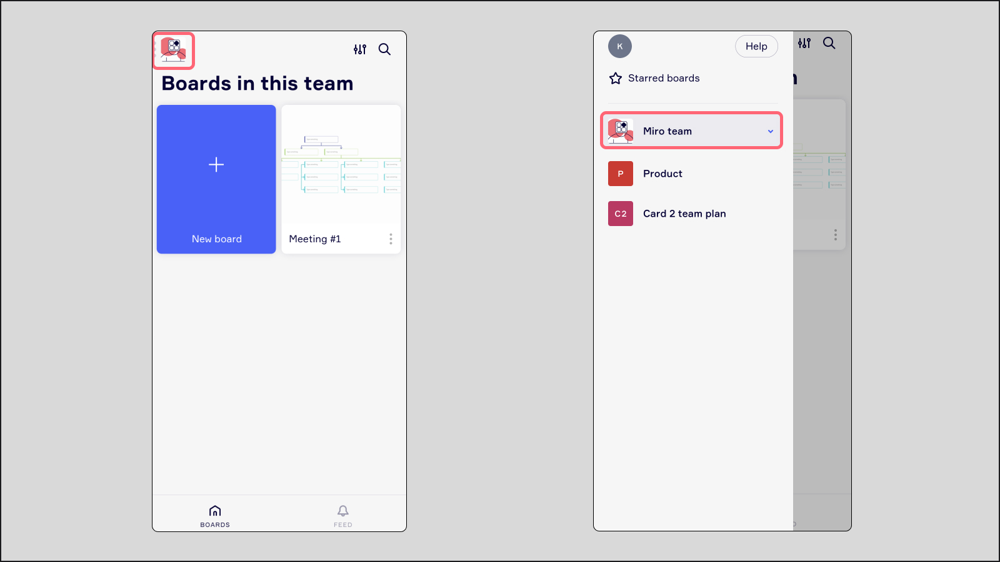
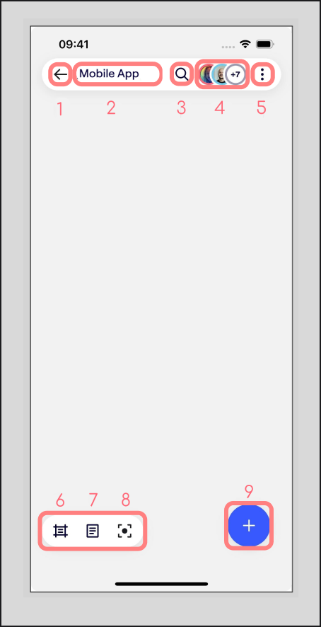
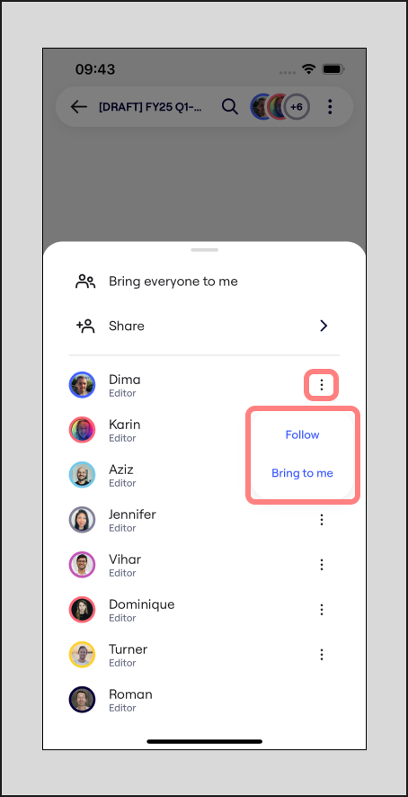
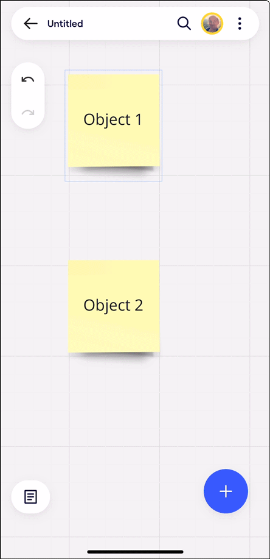
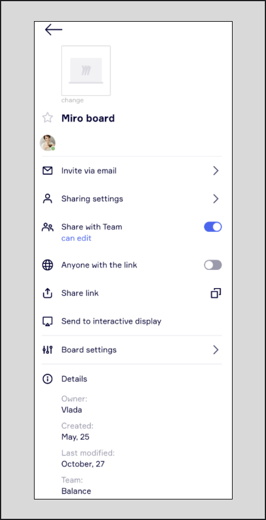
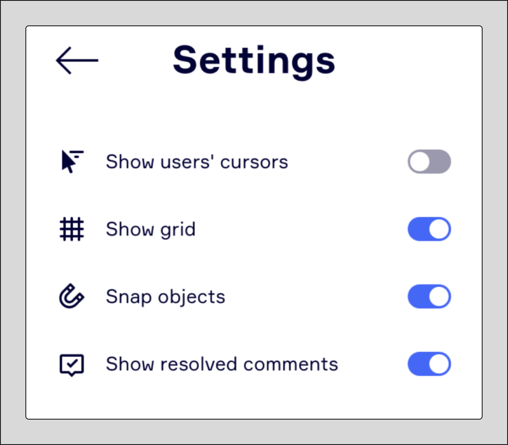
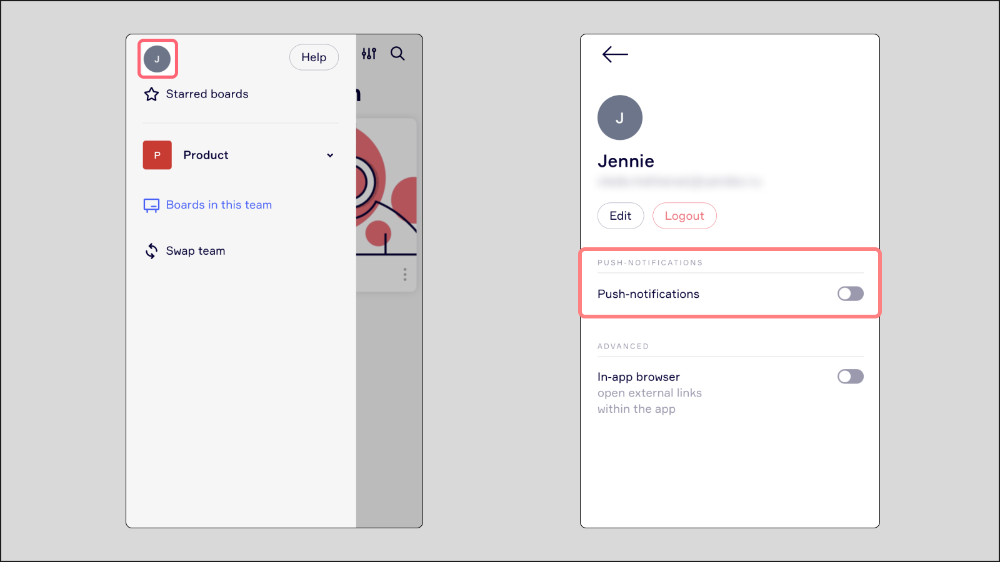

Enhance team collaboration anytime, anywhere with the Miro mobile app. Stay connected and in sync with your team's progress, engage in dynamic brainstorming with ideas and sticky notes, and offer continuous input through seamless commenting.

:::tip
The mobile app is available in all [languages](../../using-miro/managing-your-profile/03-language-settings.md) supported by Miro.
:::

## Download the Miro mobile app

|  |  |
| --- | --- |
| [google-play-badge.png](https://play.google.com/store/apps/details?id=com.realtimeboard&hl=en&gl=US&pli=1) | [Download_on_the_App_Store_Badge_US-UK_RGB_blk_092917.svg](https://apps.apple.com/us/app/miro-online-whiteboard/id1180074773) |

:::note
If you're having trouble using the Miro app on your phone, visit [troubleshooting mobile and tablet device issues](../../using-miro/tools/troubleshooting/16-troubleshooting-mobile-and-tablet-device-issues.md).
:::

## Features available in the Miro mobile app

- [Miro AI](../../using-miro/miro-ai/01-miro-ai-overview.md) and [Sidekicks](../../using-miro/miro-ai/08-ai-sidekicks.md)
- Text
- Shapes
- Sticky notes (including [tags](../../using-miro/essential-tools/14-sticky-notes.md#tags), [emojis](../../using-miro/essential-tools/14-sticky-notes.md#emoji-reactions), and [author labels](../../using-miro/essential-tools/14-sticky-notes.md#author-labels))
- Frames
- Comments, and [follow a comment thread](../../using-miro/facilitation-tools/asynchronous-tools/01-comments.md)
- Photo and file uploads
- Copy and paste between boards
- Connector lines
- Pen drawings and [highlighter](../../using-miro/essential-tools/10-pen.md#how-to-use-pen)
- [Lasso](../../using-miro/working-on-the-board/10-working-with-objects.md#using-the-lasso-tool-to-select-multiple-objects)
- [Stickies capture](../../using-miro/import-and-export/import/06-stickies-capture.md)
- [Single sign-on (SSO)](../../enterprise-administration/security-integrations/single-sign-on-sso/09-single-sign-on-sso.md)
- [Talktrack](../../using-miro/facilitation-tools/asynchronous-tools/02-talktrack-board-recordings.md#playing-the-talktrack)
- [Attention management](../../using-miro/facilitation-tools/04-attention-management.md) (Follow and Bring to me)
- Control for [Miro Slides](../../using-miro/formats/13-miro-slides.md)
- Dark mode

## Features with limited availability or functionality

Some Miro features are not supported on mobile. This includes templates, board export, presentation mode, video chat, voting, and starred boards. You cannot change your subscription or add licenses in the Mobile app or mobile browsers.

The mobile app currently provides *limited functionality* for some features:

|  |  |
| --- | --- |
| **Feature** | **Limited functionality** |
| Creating and sharing boards | No edit access for [Visitors](../../using-miro/sharing-boards/08-collaboration-with-visitors.md) |
| Spaces | Filtering boards by [space](../../using-miro/spaces/01-spaces.md) |

## Mobile requirements

- **iOS Users:** iOS 16 or later
- **Android Users:** Android 7 or later

If the app isn’t compatible with your phone, you can still access the following Miro features through your mobile browser:

- **View boards:** Access and view content.
- **Leave comments:** Tap and hold on your screen to add a comment.

## Navigating the mobile app

:::tip
Make sure you're using the latest version of the Miro mobile app to enjoy updated and improved navigation controls.
:::

### Filters

Use filters to sort and customize your dashboard. Access filters in the top-right corner of the dashboard.

*Filtering boards in the app*

### Switching between teams

To switch teams, tap the team icon in the top-left corner, then select your desired team from the list.

*Switching between teams in the app*

### Miro app toolbars

Use the below toolbar guide to navigate Miro on the mobile app:

1. Return to [dashboard](../start-here/miro-dashboard/01-what-is-on-your-dashboard.md)
2. Board title
3. [Search](../start-here/miro-dashboard/03-how-to-search-in-miro.md)
4. Participants ([Attention management](../../using-miro/facilitation-tools/04-attention-management.md))
5. [Board menu](../start-here/your-first-board/05-toolbars.md#board-toolbar-main-menu)
6. [Frames](../../using-miro/essential-tools/07-frames.md)
7. [Notes](../../using-miro/essential-tools/17-visual-notes.md)
8. [Talktrack playback](../../using-miro/facilitation-tools/asynchronous-tools/02-talktrack-board-recordings.md#playing-the-talktrack)
9. [Creation toolbar](../start-here/your-first-board/05-toolbars.md#creation-toolbar) ([limited tools and features](#features-available-in-the-miro-mobile-app))

*Board interface in the mobile app*

## Attention management in the app

Similar to the desktop experience, users can follow other users on the board, or bring individual users to their view.

*Attention management in the app*

## How to work on a board in the app

### Touch gestures for mobile app

- **Swipe** to pan around the board.
- **Long tap** and drag to select multiple objects.
- **Pinch** to zoom in and out.
- **Double tap** on a board to zoom in.
- **Double tap and swipe up or down** to zoom in or out.
- **Swipe up and down off the edge of the screen** to zoom in or out.
- Select an object and tap **Edit** to edit the object.
- **Double tap** on the object to add text.
- **Long tap** on the object to move it.

### How to edit board objects

When you open a board in the mobile app, it will be in view-only mode by default. This allows you to easily pan around the board without moving objects.

1. Select the object and tap **Edit**.
2. Double tap on the object to start adding text.
3. Long tap on the object to move it immediately.

### How to copy and paste between boards

Copying an element from one board to another is as simple as copying and pasting elements on the same board.

1. Open the board you want to copy an object from.
2. Select the object and then press the **three vertical dots** menu in the lower toolbar.
3. Select **Copy**.
4. Open the board you want to paste the object to.
5. Press the **Add (+) Icon** and then press **Paste**.
6. Move the pasted object to the appropriate place on your board.

If you want to copy and paste an image, file, or other non-text content from outside of Miro, you'll need to use the **Upload** function instead of copy and paste. You'll find the Upload option from the **Add (+)** menu.

### How to draw connector lines

Drawing connector lines between objects lets you create a link between them that is maintained even when objects are moved around the board.

1. Select the object you want to start the connection from.
2. Press the **Edit** icon.
3. Drag the **blue dot** that appears below the object and drag it to the object you want to connect to.
4. An arrow will appear, connecting the objects.
   
5. To delete the connector line, select it and then click the **Trash** icon in the lower toolbar.

### How to view board details

Press the three dot menu in the top right corner to view the board details, change the board cover and update board access.

*Board menu in Mobile app*

## Miro AI and Sidekicks

You can access Miro AI and Sidekicks in the mobile app. Click the Miro AI button to launch Sidekicks.

 *Launch Sidekicks in the Miro mobile app*

The Sidekicks panel opens. You can start prompting to generate board objects, like images and Formats, or provide recommendations and next steps based on your text and board content.

 *Prompt Sidekicks in the Miro mobile app*

Sidekicks generates content on the board based on your prompt.

 *Sidekicks generates your content in the mobile app*

**More information:**

- [Miro AI overview](../../using-miro/miro-ai/01-miro-ai-overview.md)
- [Sidekicks](../../using-miro/miro-ai/08-ai-sidekicks.md)

## Managing user and board preferences

### Board settings

Under **Board settings** you can enable or disable user cursors, board grid, [snap objects](../../using-miro/formats/diagramming/01-miro-for-mapping-diagramming.md#use-snap-to-grid), as well as choose whether to show resolved comments.

*Board settings in the Mobile app*

### Edit access requests

When someone requests edit access to a board, the board owner receives a push notification from the Miro app. They can then click the notification to easily navigate to the board and grant the requester edit access.

## Board voiceover support

Users who require assistance with visual elements can enable the voiceover function, available on iOS and Android. Simply turn on voiceover in your phone settings to use it with Miro.

When voiceover is turned on, it will read out loud what's on your screen when you select items. This helps you hear what's on the app, so you can create and view content more easily.

## Push notifications

When you first sign in to the app, we'll ask if you want to turn on push notifications. This way, you'll always know when a team member mentions you on a board. You can turn off these notifications anytime in the app **Settings**.

This only applies to push notifications on your smartphone. Learn how to turn off [email notifications and newsletters](../../using-miro/managing-your-profile/02-miro-notifications.md).

*Click the avatar to open the profile settings*

## FAQ

Can I add web links to my board using the mobile app?

Yes, to add a link, first copy it. Then, tap the create (**+**) button located at the bottom right corner of the board. Select **Upload** and then **Paste from clipboard**. Your link will be pasted onto the board.

How do I turn on dark mode?

By default, dark mode is enabled according to your phone's settings. If you'd like to turn dark mode on or off specifically for the Miro mobile app, click on the **Switch mode** button in the banner on your app's home screen, then select **Dark mode** or **Light mode**.
