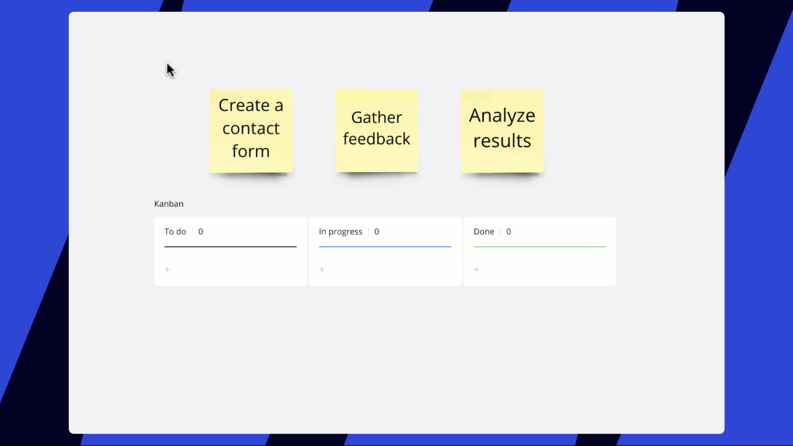
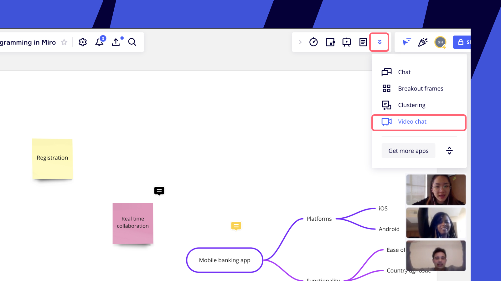

From sticky notes to reactions - Miro tools help you go creative and enhance the brainstorming process. Share your ideas, discuss and develop with your team together online.

## Miro features for ideation & brainstorming

As soon as you open your first Miro board you get access to various tools that allow you to think in many formats.

### Sticky notes

The easiest way to pop down your ideas is [sticky notes](../../using-miro/essential-tools/14-sticky-notes.md). Use the bulk mode to create many stickies at once.

*Adding sticky notes in bulk*

:::tip
Add [Stickies Packs](https://miro.com/templates/stickies-packs/) or [Brainwriting](https://miro.com/templates/brainwriting/) templates to place a pack of blank stickies on your board.
:::

Assign tags and emojis to sticky notes, change colors, and cluster your stickies. Once you are ready to put your ideas into action, feel free to transform them into tasks by converting your sticky notes into [cards](../../using-miro/essential-tools/02-cards.md) or [Jira Cards](../../integrations-apps/atlassian/03-jira-cards.md) and add them to [Miro Kanban](../../using-miro/advanced-tools/02-columns-formerly-kanban.md) - a universal task tracker.

*Converting sticky notes into cards*

You can even digitize your real-life brainstorming session with Miro: use [stickies capture](../../using-miro/import-and-export/import/06-stickies-capture.md) to convert physical sticky notes into editable Miro stickies.

*Miro stickies capture*

### Mind map

Visualize your ideation and brainstorming and develop your ideas with [Miro mind map](../../using-miro/advanced-tools/03-mind-map.md). Add your first node and build branches using intuitive controls and shortcuts: change your map color, align branches, move and reassign nodes.  [Learn more](../../using-miro/advanced-tools/03-mind-map.md).

*Miro mind map*

### Ideation & brainstorming templates

Use special techniques and frameworks to ensure effective individual or team online brainstorming. Miro templates library offers a variety of pre-made templates. Check out the templates on [this page](https://miro.com/templates/) or from the template picker right within your board. Open a template preview to see its description.

*Ideation & brainstorming templates*

:::tip
Review the [list of the most popular ideation & brainstorming techniques](https://miro.com/guides/online-brainstorming/techniques-methods) that we suggest using in Miro.
:::

## Brainstorming & ideation with your team

Miro is a perfect fit for online brainstorming sessions providing a set of collaborative tools designed to make your team meetings more effective.

### Timer

Three, two, one... Let's brainstorm! Sticking to the agenda is a key point of a productive online meeting. Set up [the timer](../../using-miro/facilitation-tools/16-timer.md) and spend several minutes on individual thinking. The timer can be initiated by invited board editors. You will find **timer** on the top right collaboration toolbar.

*Timer in Miro*

### Voting

Discover the best ideas with the [voting tool](../../using-miro/facilitation-tools/19-voting.md). Set up a voting session with several clicks: select duration, number of votes per person, and voting area.

*Voting in Miro*

### Reactions

Use [reactions](../../using-miro/facilitation-tools/12-reactions.md) to show your emotions here and now while your collaborators present their ideas. Just pick a reaction near your avatar in the top-right corner and it will be displayed for everyone on the board.

*Miro reactions*

### Video conferencing

[Miro video chat](../../using-miro/facilitation-tools/18-video-chat.md) is an in-built solution allowing you and your team members to feel in one room. To invite your board participants to a video chat session, click the **More apps** button, then choose **Video chat**. Be sure to turn on your camera and microphone, then click **Start**.

*Miro video chat*

If you use Zoom as a video conferencing solution, try the [Miro app for Zoom](../../integrations-apps/zoom/02-miro-app-for-zoom-user-guide.md) - the app provides all Miro’s collaboration capabilities within Zoom

:::tip
[Learn how to prepare for an online meeting in Miro](03-miro-for-workshops-meetings.md).
:::

## Useful resources

- [The guide to mastering online brainstorming](https://miro.com/guides/online-brainstorming/how-to-brainstorm)
- [5 types of brainstorming questions to kick-start ideation (Miro blog)](https://miro.com/blog/brainstorming-questions/)
- [Brainstorming templates](https://miro.com/templates/brainstorming/)
- [Getting the most out of remote brainstorming: a case study (Miro blog)](https://miro.com/blog/infinite-red-brainstorming-case-study/)
