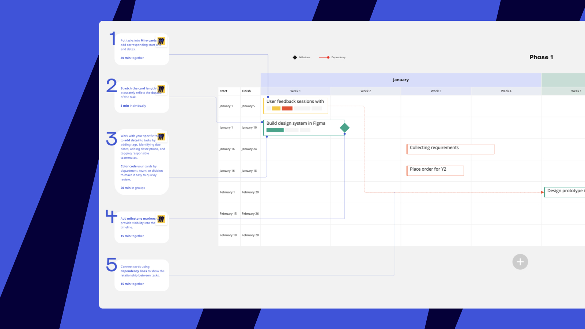

Run team planning sessions, track your progress and keep your entire planning workflow in Miro! This quick overview of tools for strategy & planning will help you to kick off the planning process. When you’re ready to start organizing your meeting, check out the [Helpful resources section](#helpful-resources-miro-blog) at the end of this article.

### Organize planning sessions

Miro is an online collaboration tool that enables teams to work together on infinite boards. Create a board, add a template, and [invite your team members](../../using-miro/sharing-boards/03-sharing-boards-and-inviting-collaborators.md) to the planning session. All the changes on the board are saved automatically. You and your team can get back to the planning board at any time and track progress.

**Collaboration tools**

Use Miro collaboration tools to make your meeting interactive and engaging. All the tools are available in the top-right corner of the board.

Kick off brainstorming with **sticky notes** by redirecting participants to **breakout frames** and setting a **timer**.

Use sticky **clustering** to categorize ideas and let collaborators vote with the **voting** tool.

Use **reactions** in real-time right on the board.

Be sure to take the meeting notes or map out the meeting agenda on the board **notes**.

For more information on Miro tools, see this section on [Using Miro](../../using-miro).

*Miro collaboration toolbar*

**Video chat solutions**

Take advantage of in-built video chat or [integrations](https://miro.com/marketplace/) with Zoom, Webex, or Microsoft Teams Meetings.

**Smart Meetings toolkit**

Try Miro Smart meetings and use one of our pre-made Smart meeting templates for planning such as [OKR Planning](https://miro.com/app/dashboard/?tpTemplate=okr-planning&isCustom=false&invite_link_id=322690853838), [Project Kickoff](https://miro.com/app/dashboard/?tpTemplate=project-kick-off&isCustom=false&invite_link_id=72265625490), and others.

**Templates**

Start with a template from Miro template library. Discover the variety of templates for strategy & planning on [our website](https://miro.com/templates/strategy-and-planning/) or choose a template right from the [template picker](../start-here/your-first-board/04-templates.md#from-the-template-picker-templates-and-blueprints) on your boards.

*
Strategy & planning templates on the template picker*

Explore Miro template library and pick a template that will be useful at a particular stage of your planning process. See examples below.

- Meeting templates for setting up the strategic plan:
  - [Strategic Planning](https://miro.com/templates/strategic-planning/)
  - [Strategy Diamond](https://miro.com/templates/strategy-diamond/)
  - [Balanced Scorecard](https://miro.com/templates/balanced-scorecard/)
- Templates for research and analysis
- - [SWOT Analysis](https://miro.com/templates/swot-analysis/)
  - [RICE Prioritization](https://miro.com/templates/rice/)
  - [PEST Analysis](https://miro.com/templates/pest-analysis/)

### Map out your plan with Miro tools

**Tools for smart diagramming**

Build a visual representation of your plans and projects with Miro [shapes](../../using-miro/essential-tools/11-shapes.md), [cards](../../using-miro/essential-tools/02-cards.md), and [connection lines](../../using-miro/essential-tools/05-connection-lines.md).

*Building a concept map with sticky notes and connection lines*

**Kanban**

Create a [Kanban](../../using-miro/advanced-tools/02-columns-formerly-kanban.md) to plan and prototype with your team and stay organized.

*Using Kanban for Monthly planner*

**Tables**

Use [tables](../../using-miro/advanced-tools/05-grid.md) to summarize and categorize information about your projects.

*Using tables for project planning*

**Integrations with task trackers**

Set up integration with Jira, Asana, or Azure to import tasks to Miro as cards and organize your plans and resources in one place. Easily embed cards into your planning process by adding them to Kanban.

*Adding Asana cards to Miro Kanban*

:::tip
Discover other Miro plugins and integrations in [Miro Marketplace](https://miro.com/marketplace/category/strategy-planning-apps/).
:::

**Templates for strategic planning**

Consider some examples of the templates for strategic planning with your team.

- [PI Planning](https://miro.com/templates/pi-planning/)
- [Project Kickoff Meeting](https://miro.com/templates/project-kick-off/) (Smart Meeting template)
- [Product Roadmap](https://miro.com/templates/product-roadmap/)

### Helpful resources (Miro blog)

- [How to hold a strategic planning meeting: A simple, step-by-step guide for facilitators](https://miro.com/blog/strategic-planning-meeting/)
- [How to facilitate an OKR planning workshop](https://miro.com/blog/facilitate-okr-planning-workshop/)
- [How to run a Project Kickoff Meeting](https://miro.com/blog/how-to-run-a-project-kickoff-meeting/)
- [How to run a successful planning workshop (even remotely)](https://miro.com/blog/how-to-run-a-remote-planning-workshop/)
- [How to use the Ansoff Matrix for strategic planning (with examples)](https://miro.com/blog/how-to-run-a-remote-planning-workshop/)
