You can transfer content from your Mural boards to Miro by using the copy-paste method. This guide provides best practices for this import method, explains the step-by-step process, and details what you can expect regarding the appearance and behavior of various objects once they are pasted into Miro.

## Guidelines for importing from Mural

Following these guidelines will help you achieve the best results when transferring content from Mural to Miro.

For structured data, like Mural Mind maps, the copy-paste method is generally the best approach to avoid breaking connections between elements.

:::note
To import content into Miro using this method, the Mural content must be under a Full or Free Restricted license in Mural.
:::

The copy-paste method is also recommended for importing individual widgets that are not supported by the [Mural to Miro import guide (PDF)](02-mural-to-miro-import-guide-–-pdf.md), or for widgets that do not import with high fidelity using the PDF method.

Be aware of some limitations with the copy-paste method: certain styling attributes and any images that were originally uploaded to Mural (rather than linked via URL) will not be copied to your clipboard and therefore will not transfer to Miro.

## Copy and paste Mural content to Miro

The following procedure explains how to copy content from a Mural board and paste it onto a Miro board.

**Prerequisites**

Ensure that you have edit access to both the source board in Mural and the destination board in Miro.

To copy content from a Mural board and paste it onto a Miro board:

1. In Mural, select the objects you want to copy.
   > 💡 To select all objects on the Mural board, use the keyboard shortcut **Ctrl+A** (Windows) or **Cmd+A** (Mac).
2. To copy the selected objects, use the keyboard shortcut **Ctrl+C** (Windows) or **Cmd+C** (Mac).
   Your Mural objects are now copied to your clipboard.
3. In Miro, open the board where you want to paste the content. Use the keyboard shortcut **Ctrl+V** (Windows) or **Cmd+V** (Mac) to paste.

   You have successfully copied and pasted content from Mural to Miro.
   > ✏️ Content pasted from Mural may require some manual adjustment in Miro. Certain styling and formatting aspects might appear differently after pasting.

## Object appearance after pasting

Mural objects generally copy and paste into Miro with some variations from their original state. This section describes the expected results for some common objects and provides best practices where applicable.

### Areas

Areas from Mural copy-paste as Miro frames and shapes.

A Mural area with 100% transparency will show a transparent but visible border when pasted into Miro. If the Mural area has a title, this title appears and behaves in Miro as a frame title.

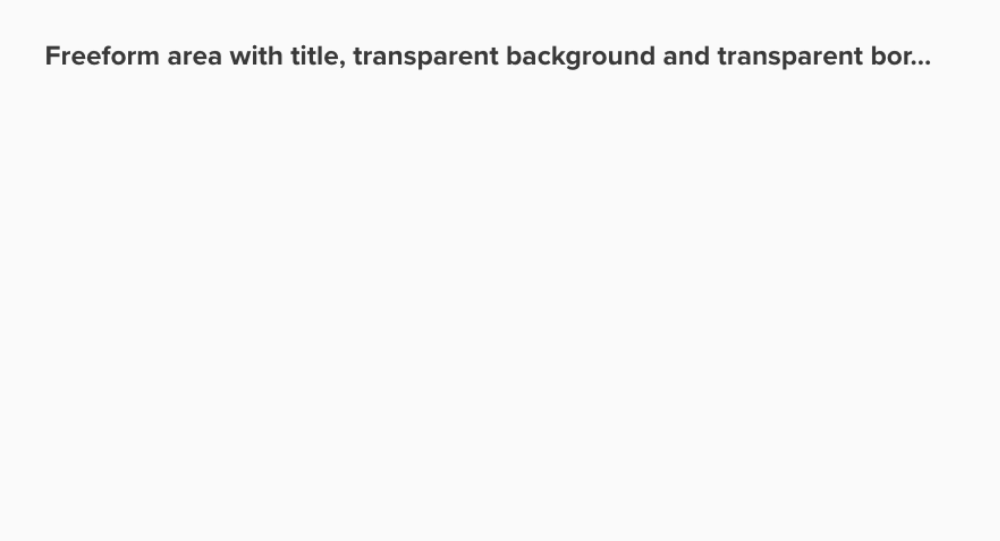

*A Mural freeform area with title, and 100% transparent background and border*

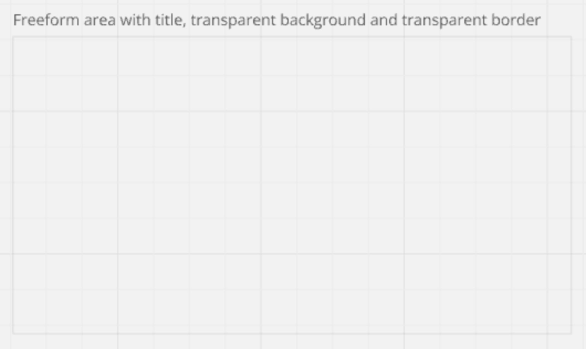

*A pasted area from Mural to Miro*

### Connectors

Connectors from Mural copy-paste as Miro connectors.

For connector labels, vertical and horizontal positions will paste to Miro as centered. Miro only supports a centered position for connector labels.

Regarding connector types, Miro supports *solid*, *dotted*, and *dashed* lines. Mural additionally includes a *loosely dashed* connector type. Miro maps connector types pasted from Mural as follows: *solid* maps to *solid*, and Mural's *loosely dashed* type maps to Miro's *dashed* type. Other direct matches (like dotted to dotted) are also preserved.

Miro supports each type of Mural connector curve, though their appearance in Miro might differ slightly.

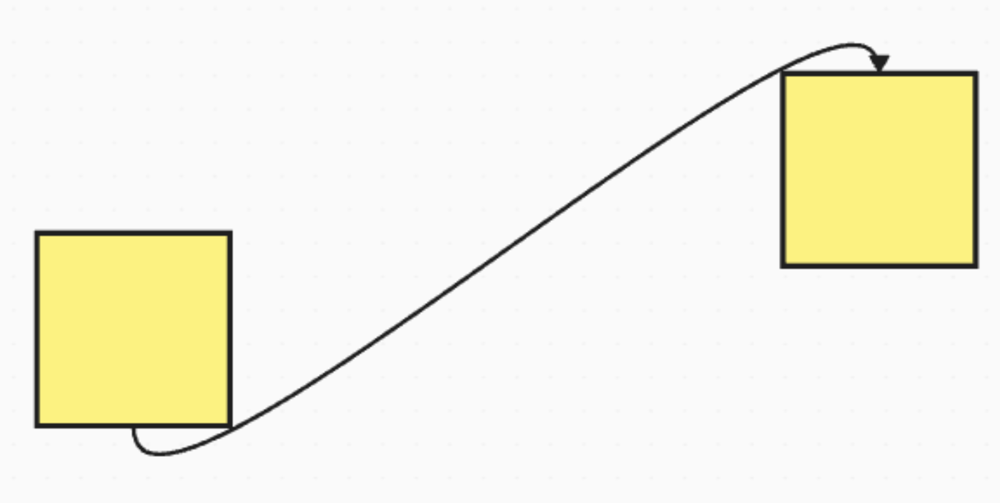

*Mural connector curve*

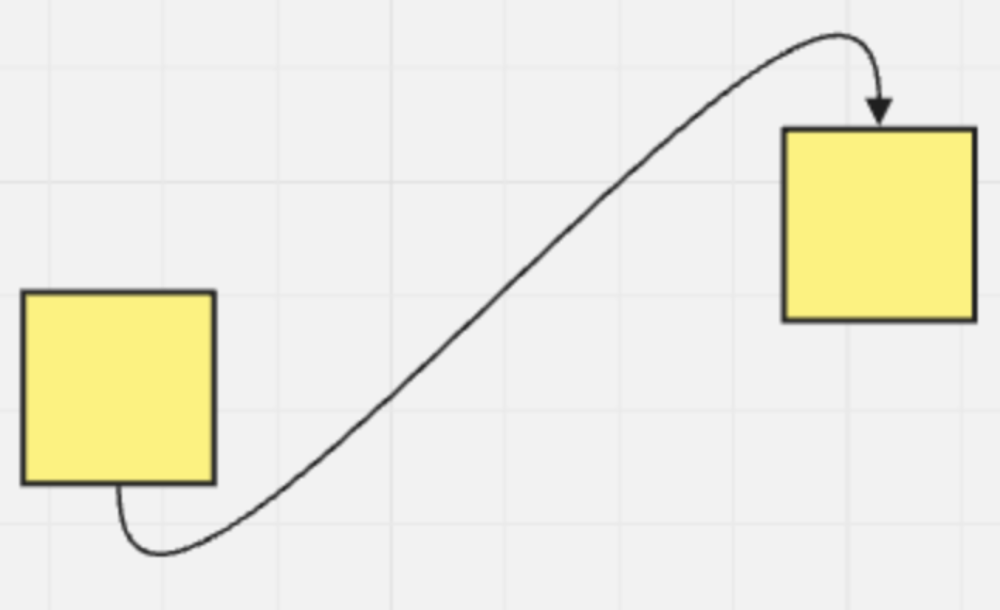

*Miro connector curve*

### GIFs & images

GIFs and images that were originally added to Mural from a URL can be copy-pasted into Miro.

:::note
A GIF or image in Mural that was uploaded directly from a device or added from Mural's toolbar cannot be copy-pasted to Miro using this method.
:::

### Mind maps

Mind maps from Mural copy-paste as Miro Mind Maps, including the root node, each child node, and their text.

Styling for the root node is mostly preserved. However, the shape radius may differ, and text font size is not preserved from Mural to Miro.

Child nodes from Mural paste as Miro text nodes, and their styling is not preserved.

Connector color and thickness in the mind map may also differ.

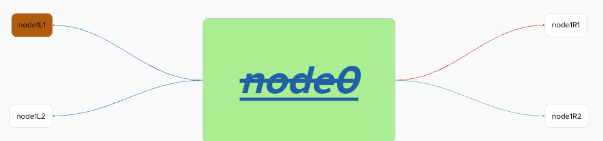
*Mind map copied in Mural*

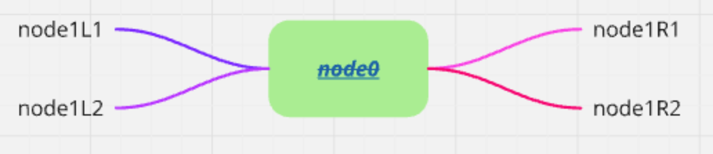

*Mind map copy-pasted to Miro*

For Mural Mind maps that have multiple levels of nodes, the node order may change when pasted into Miro.

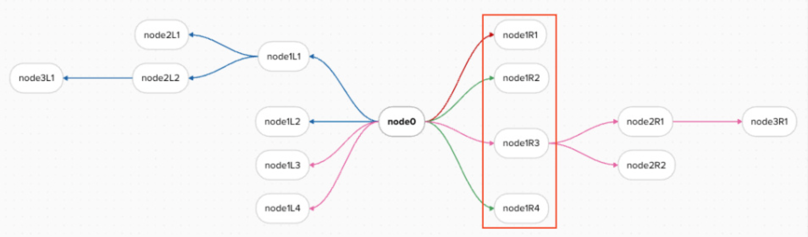

*Mind map in Mural with multiple node levels*

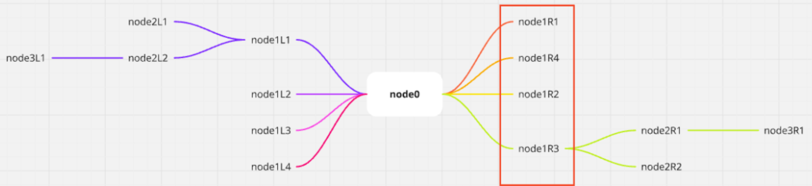

*Mind map with multiple node levels copy-pasted from Mural to Miro*

:::tip
Mind maps copy-pasted from Mural to Miro may lose their original scale. To resize the Mind Map after pasting, you can stretch it manually on the Miro board.
:::

### Shapes

Shapes from Mural generally paste as Miro shapes. Miro supports most Mural shapes directly.

However, Mural includes 16 specific shapes that do not have a direct equivalent in Miro. These shapes will paste into Miro as rectangles.

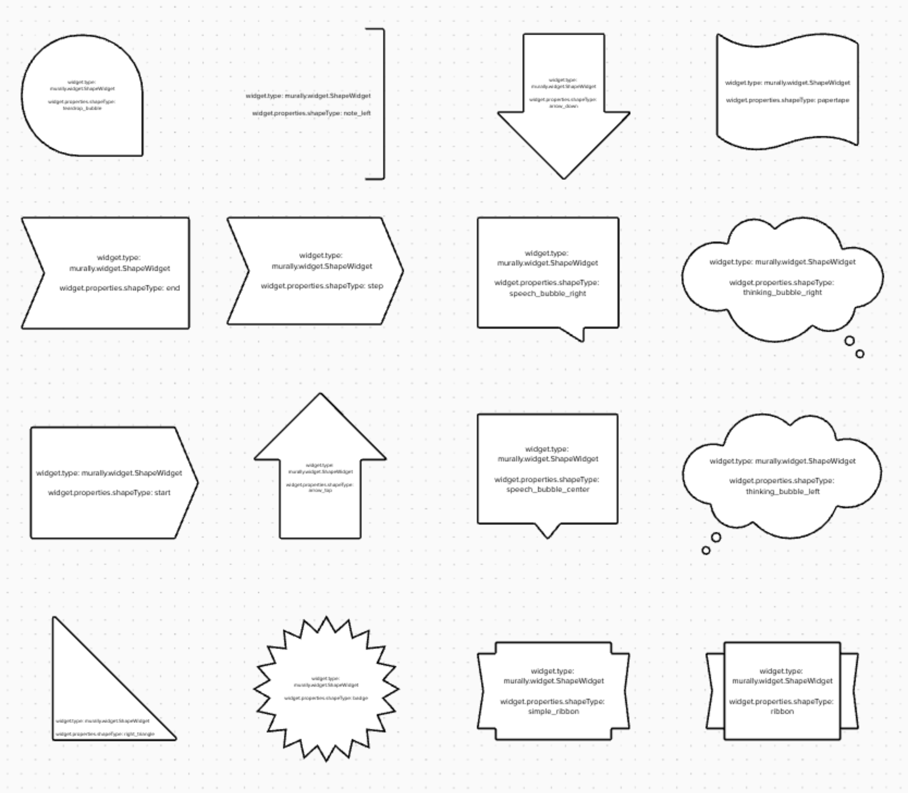

*The 16 shapes that copy-paste from Mural to Miro as rectangles*

### Sticky notes

Sticky notes from Mural paste as Miro Sticky notes.

Miro will map the sticky note color and opacity level to their nearest available matches in Miro.

The following differences may also appear when you copy-paste Mural sticky notes to Miro:

- Circular sticky notes from Mural will paste into Miro as square Sticky notes.
- Lists within sticky notes are not preserved as interactive lists, though individual line items will appear on separate lines within the Miro sticky note.
- Text font size is not preserved, as Miro Sticky notes set font size automatically based on content and sticky note size.
- Rotation applied to sticky notes in Mural is not preserved upon pasting.

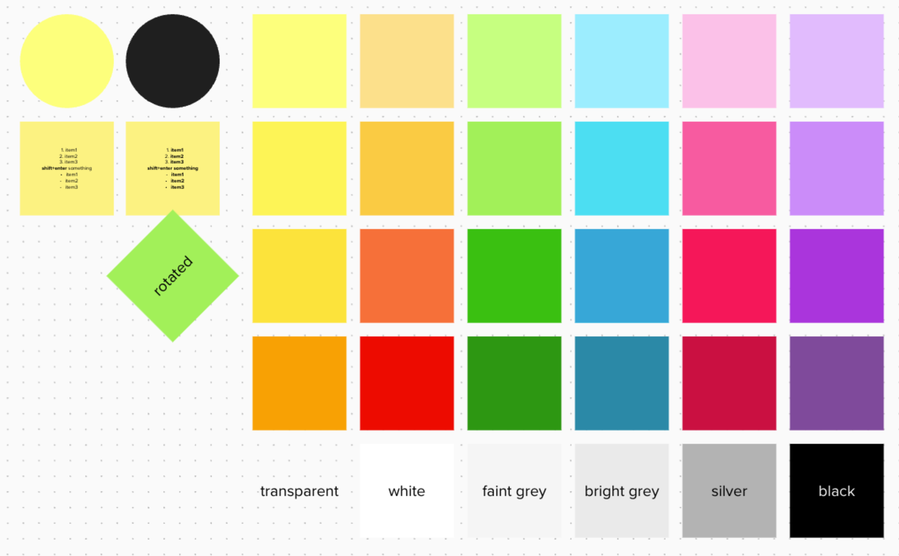

*Sticky notes copied in Mural*

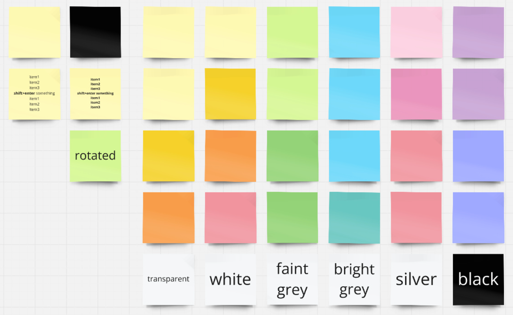

*Sticky notes copy-pasted to Miro*

### Tables

Tables from Mural paste as Miro tables.

The following differences may appear when you copy-paste tables from Mural to Miro. For each of these items, you can typically restore your preferences manually in Miro after pasting:

- Tables positioned on top of other objects in Mural (like areas, shapes, or images) may be partially hidden behind those objects when pasted into Miro. You may need to adjust their layering (bring to front).
- Border color is ignored; borders will paste as grey.
- Background opacity is ignored. Transparent cells in Mural will be pasted as white cells in Miro. However, the background color itself (if not transparent) is generally preserved.
- Text font family is ignored; text will paste using Miro's default table font (RobertPro).
- Inline text formatting such as bold and italic is ignored within table cells.

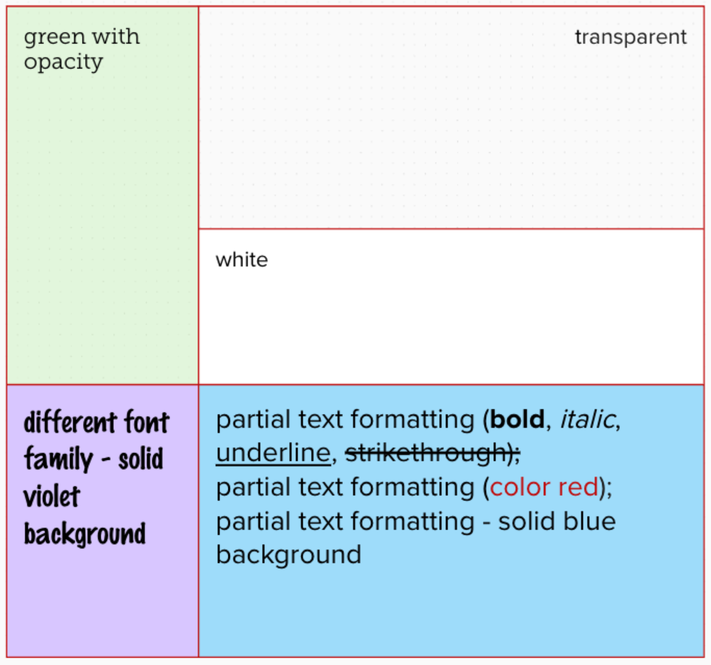

*Table with mixed formatting copied in Mural*

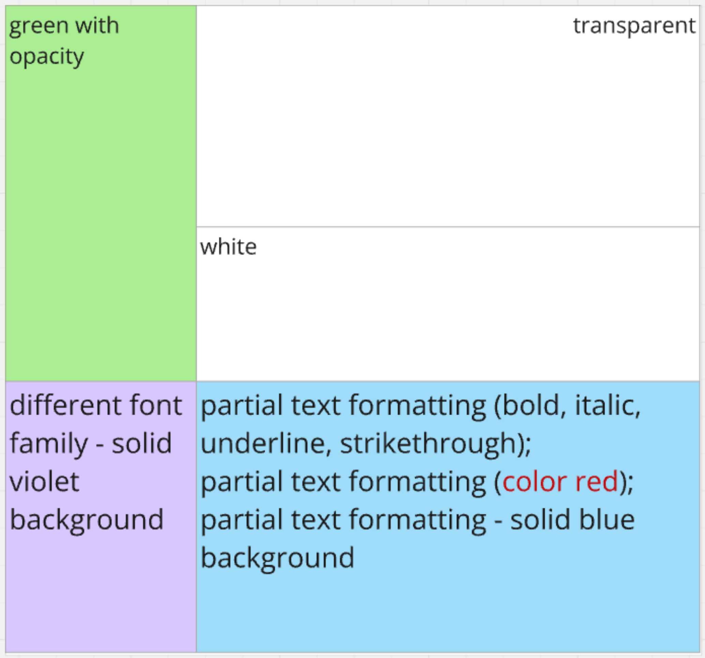

*Table with mixed formatting copy-pasted to Miro*

### Text

Text objects from Mural paste as Miro text objects. The original Mural font families are not preserved. Miro maps the Mural font family to the nearest matching font available in Miro and scales the pasted text for optimal results on the Miro board.
