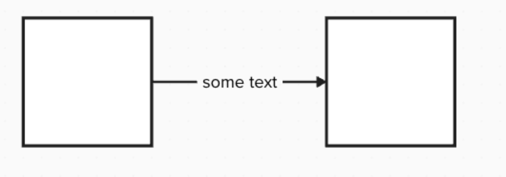
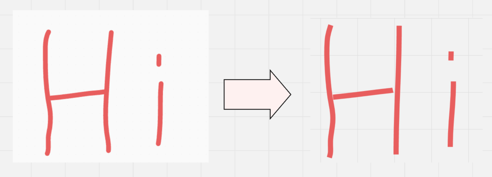
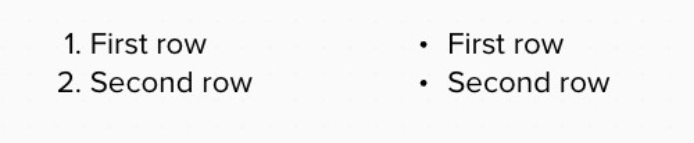
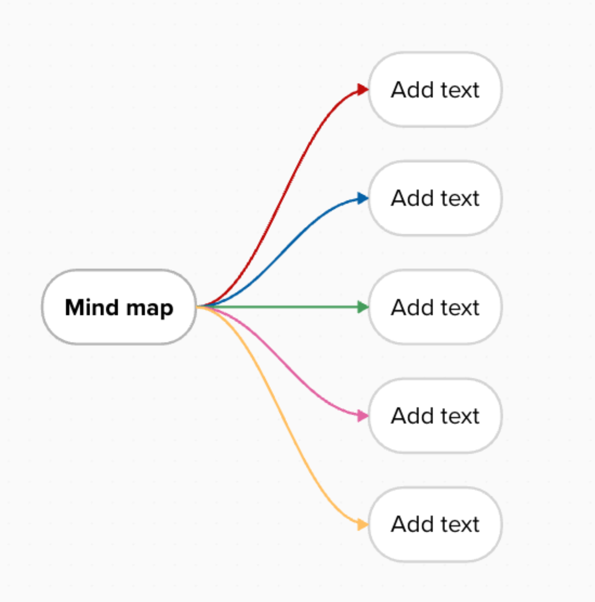
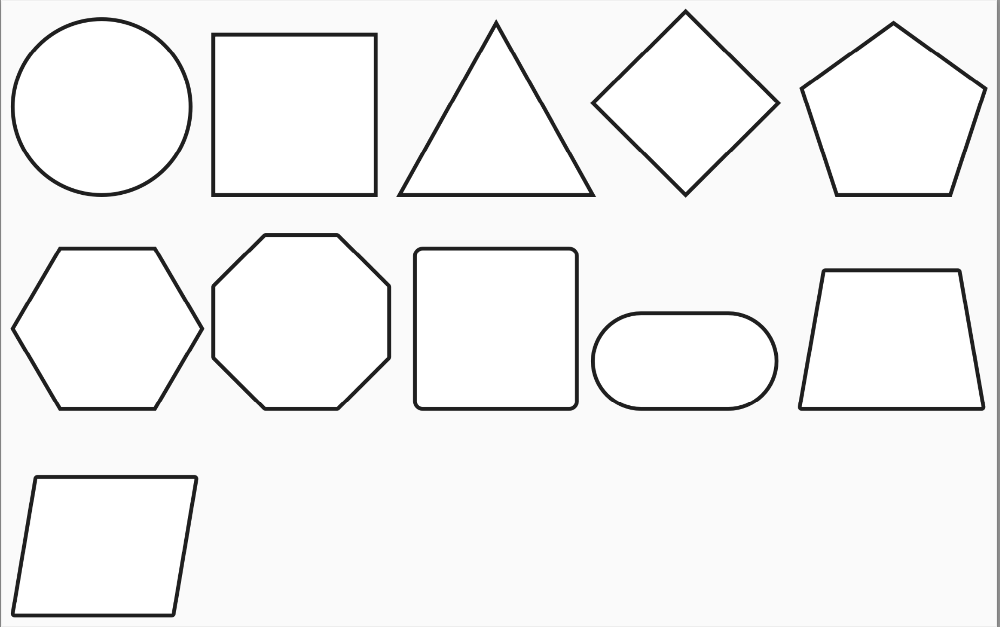
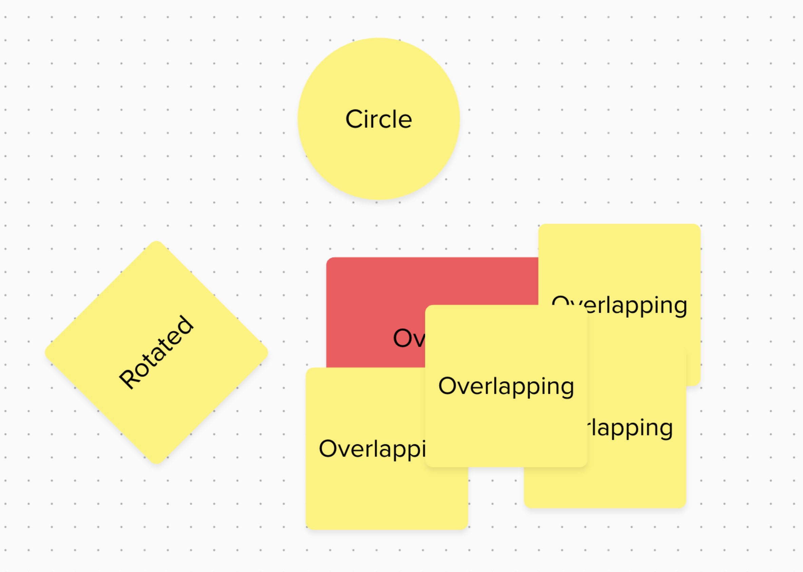
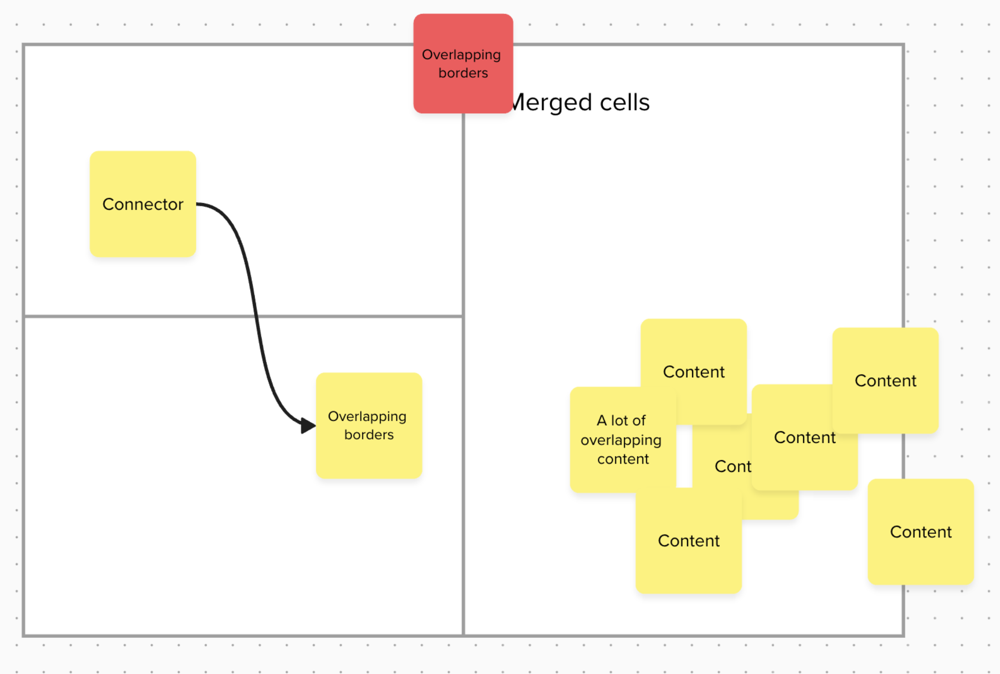

You can import your existing Mural boards into Miro by exporting them from Mural as PDF files and then importing those PDFs into Miro. This article provides guidance for achieving the best results with PDF imports, explains the import procedure, and describes what you can expect when various Mural elements are imported into Miro using this method.

The PDF import method is particularly effective for content that may not transfer well via copy-paste or API-based imports. Miro's PDF importer analyzes the shapes and their coordinates within the Mural PDF and attempts to reconstruct the original layout. For example, it may interpret intersecting lines as a table structure.

Please note that some objects may appear differently in Miro after import, and precise styling or layout may require manual adjustments or recreation within Miro. In general, simpler content with less complex styling tends to yield more accurate import results.

## Guidelines for importing from Mural

To achieve the best results when importing Mural content as PDFs, it's helpful to understand how the importer works and what content transfers most effectively. The PDF importer primarily matches basic shapes and lines.

:::note
To import content into Miro, your Mural content must be under a Full or Free Restricted license in Mural.
:::

Clear spacing between elements in your Mural allows the Miro importer to parse the content more accurately. A Mural board with many elements crowded closely together may produce mixed or less accurate import results.

For the highest fidelity import, ensure that your Mural content **does not** contain the following attributes, as they may not transfer well via PDF:

- Custom fonts
- Complex styling that transforms basic shapes (e.g., heavily rounded corners on rectangles, uniquely bent arrows)
- Numerous overlapping shapes and lines
- Rotated elements

:::tip
If you need to preserve exact styling, complex layouts, or precise coordinates of your Mural content, the most reliable method is to export the content from Mural as a static image (e.g., PNG, JPG) and then import that image into your Miro board.
:::

## Import Mural boards to Miro as PDFs

This section explains how to import your Mural content into Miro using the PDF import feature.

### Prerequisites for PDF import

Before you begin the import process, please ensure you meet the following prerequisites:

- You must have edit access to the source board in Mural (to export it as a PDF).
- You must have edit access to the destination board in Miro where you intend to import the content.
- You need to have already downloaded your Mural board(s) as PDF files.

**More information:** For instructions on exporting from Mural, see Mural's documentation on [Export and download your mural's content](https://support.mural.co/s/article/export-and-download-your-mural-s-content) (external link).

### Import the PDF

Follow these steps to import your Mural PDF files into Miro:

1. From your Miro dashboard, click the **+ Create new** button.
2. From the dropdown menu, select **Import**, and then choose **Import from Mural**.
   The **Import boards from Mural** modal dialog will open.
3. Follow the on-screen instructions within the modal. You will be prompted to upload your Mural PDF files.
   You can optionally choose to add your imported content to a specific Miro Space. If you do not specify a Space, the imported content will be added to your main team area.
4. Once you have uploaded your files and configured options, select **Import boards**.
   The import process will begin. You will receive an email notification from Miro when the import is complete.

You have now successfully imported your Mural content into Miro via PDF.

## Expected results

When Mural objects are imported into Miro via PDF, some variations in styling and formatting are expected due to differences between the platforms and the nature of PDF conversion. This section describes the typical import results for common Mural objects and offers some best practices.

### Areas

The outermost area in your Mural export will typically import as a Miro Frame. Other, inner areas are usually imported as regular shapes in Miro.

:::note
Nested areas (areas within areas) may sometimes be incorrectly identified or structured during the import. The PDF importer relies on visual coordinates to determine parent-child relationships of widgets, which can be ambiguous with complex nesting.
:::

### Connectors

The PDF importer primarily recognizes and recreates solid-line connectors. Dotted or dashed connectors may not import as expected.

If a connector in Mural includes text embedded directly on the line, the PDF importer may interpret this as two separate lines with the text object nearby, rather than a single connector with text.

*A connector with text that the PDF importer "breaks" into two lines.*

### Drawings

Hand-drawn elements from Mural generally import as a collection of lines or curves in Miro.

For complex drawings, the PDF importer may sometimes incorrectly link parts of the drawing to overlapping or nearby objects, interpreting them as connectors where none were intended.

*A drawing may import as linked to a nearby or overlapping object.*

### GIFs

The PDF importer will recognize GIFs from Mural but will import them as static images (typically the first frame of the GIF).

:::note
The PDF file format itself does not support animated GIFs. This is a limitation of PDF, not the Miro importer.
:::

### Images

Images from your Mural board will import as images in Miro. However, their exact position on the board might change slightly due to differences in coordinate systems between Mural and Miro, and the PDF conversion process.

### Lists

Lists (both numbered and bulleted) from Mural generally import as lists in Miro. For the best results, ensure your lists in Mural use default markers (standard numerals for ordered lists, and basic bullets for unordered lists).

*A numbered list and bulleted list with default markers, numerals and bullets respectively.*

### Mind Maps

The PDF import method works best for Mural mind maps that have a single root node and visible borders on all nodes. Complex mind maps with multiple roots or hidden borders may not import accurately.

*A basic mind map is easier to import as PDF*

The PDF importer can have difficulty accurately parsing mind maps because they often contain many lines and objects in close proximity. If your PDF mind map is poorly imported, consider trying to copy and paste the mind map content directly from Mural to Miro. While the copy-paste method may require manual adjustments to styling and scale in Miro, the overall structural fidelity might be higher for some mind maps.

### Shapes

The PDF importer is designed to import basic Mural shapes (e.g., rectangles, ovals, triangles) as editable Miro shapes.

*Only basic shapes import as editable content*

More advanced, custom, or heavily styled shapes from Mural, as well as rotated shapes, may import as static images rather than editable Miro shapes.

### Sticky Notes

Standard Mural sticky notes generally import as Miro sticky notes. For the highest fidelity, use Mural sticky notes with default aspect ratios (e.g., 3x3 or 5x3 common sizes).

*Sticky notes with the default size can be easily imported*

:::note
Round sticky notes from Mural will import as regular shapes in Miro, as Miro does not have a native round sticky note object.
:::

Overlapping or rotated sticky notes may not import with high fidelity and might require manual repositioning or adjustments in Miro.

*Import results vary for rotated sticky notes, and sticky notes that overlap.*

### Tables

Simple tables from Mural with clear grid lines generally import with high fidelity as Miro tables or a collection of shapes and lines that form a table structure.

Tables with complex geometry may import as a series of disconnected lines and text boxes. For best results when importing tables, ensure the tables in your Mural export **do not** have the following attributes:

- Merged cells
- Invisible or hidden borders
- Rounded corners on cells or the table border

*Complex tables do not import with high fidelity.*

### Text

Text objects from Mural generally import as editable text in Miro, often within a single text block or shape corresponding to the original Mural text box.

For the highest fidelity text import, use default fonts and standard margins in Mural.

:::note
Font size may vary after import, and you might need to adjust it manually in Miro.
:::

The PDF importer may separate text that uses custom fonts or has complex styling (e.g., multiple styles within a single text box) into several smaller text blocks.
