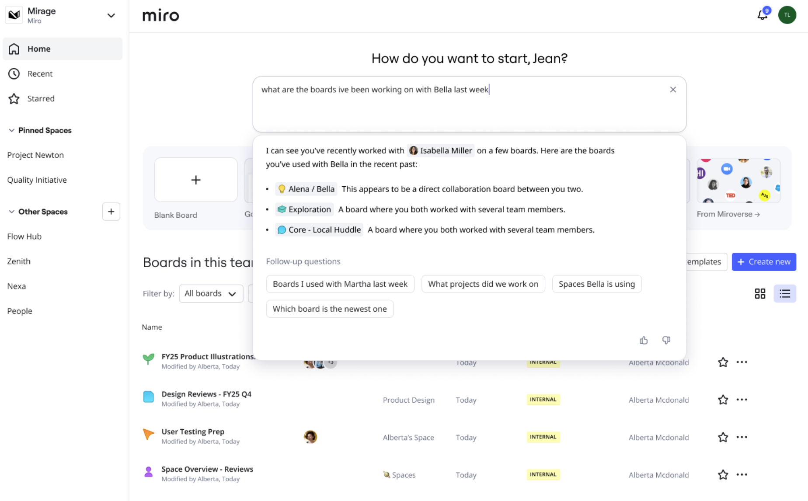
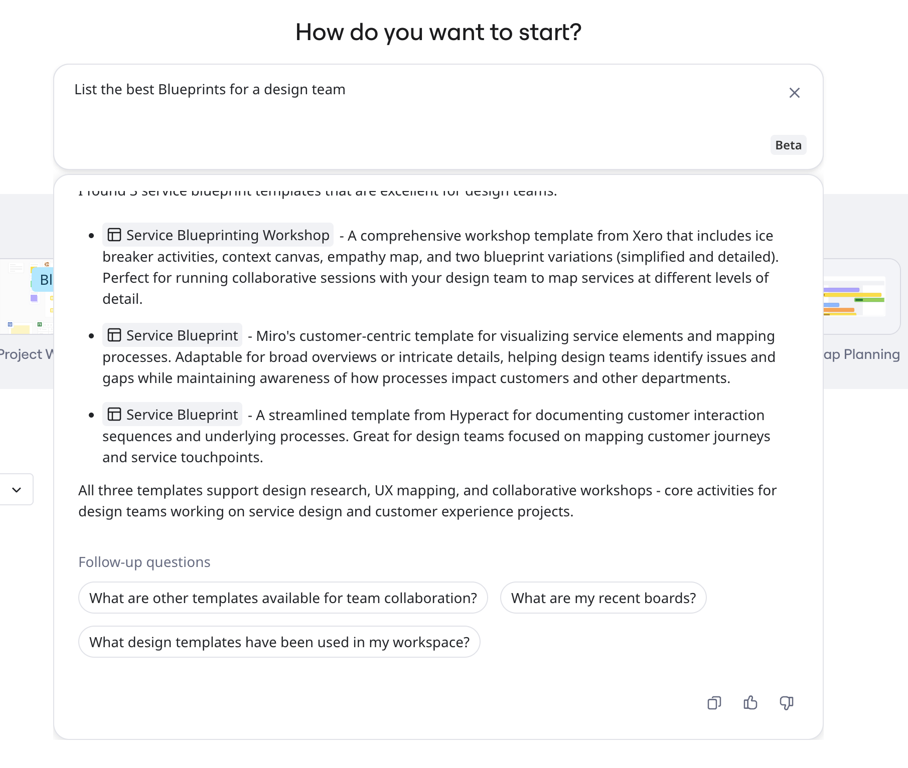

AI search enhances Miro's dashboard with AI to surface the most relevant results. You can use natural language to describe what you want to find, whether boards, templates, Spaces, or people.

*AI search makes it easier to find what you need without knowing exact keywords.*

Describe your work goals and AI search will get the most relevant content and templates, and answer follow-up questions to fine-tune your results.

:::note
AI search is available on paid plans. Free plan members must upgrade to access AI search.
:::

For general information about search functionality, including Advanced search, see [How to search in Miro](03-how-to-search-in-miro.md). This article describes AI search.

## Key features

- **Natural language search**
  Describe what you're looking for in your own words. AI search interprets queries like 'Boards I worked on last week with Steve' with context and makes recommendations.
- **Follow-up questions**
  AI search asks follow-up questions to ensure you have actually what you need to get started or continue.
- **Template recommendation**
  Get recommendations for the most relevant templates based on your search. For example, search 'I need help roadmapping with my team', or 'Which is the best template for a retrospective?'.

## How to use AI search

At the top of your **Home** dashboard, type your query in the AI search box. You can use natural, plain language or keywords to describe what you're looking for, or what you want to create.

AI search returns your results with context, recommendations, and follow-up questions.

*AI search provides context and recommendations.*

Click to select a result. Depending on the type, the content opens ready for you to start collaborating. For example, a template link opens a new board with the readymade template.

:::tip
Copy your AI search results, at the bottom click **Copy**.
:::

## (Enterprise) Enable AI search

For Enterprise subscriptions, Company admins can specify whether Everyone, Specific teams, or No one, can use AI search in their organizations.

Go to **Admin Console** > **Miro AI** > **Capabilities** > **AI Search.**

## FAQ

**Why can't I find what I'm looking for?**

To find content inside boards, like text within a Sticky note, use [Advanced Search](03-how-to-search-in-miro.md) instead. AI search finds boards by title, description, and metadata, not content inside boards. Also, check that you're searching inside the correct team or organization. AI search searches only inside the currently selected team.

**Why don't I see AI search on my Home dashboard?**

For Enterprise subscriptions, verify with your Company admin that AI search is enabled for your team or organization. For Free, you must upgrade to a paid plan to use AI search.

**Can I create a board from AI search?**

Yes. Describe what you want to create, and AI search will recommend the best templates to get started.
