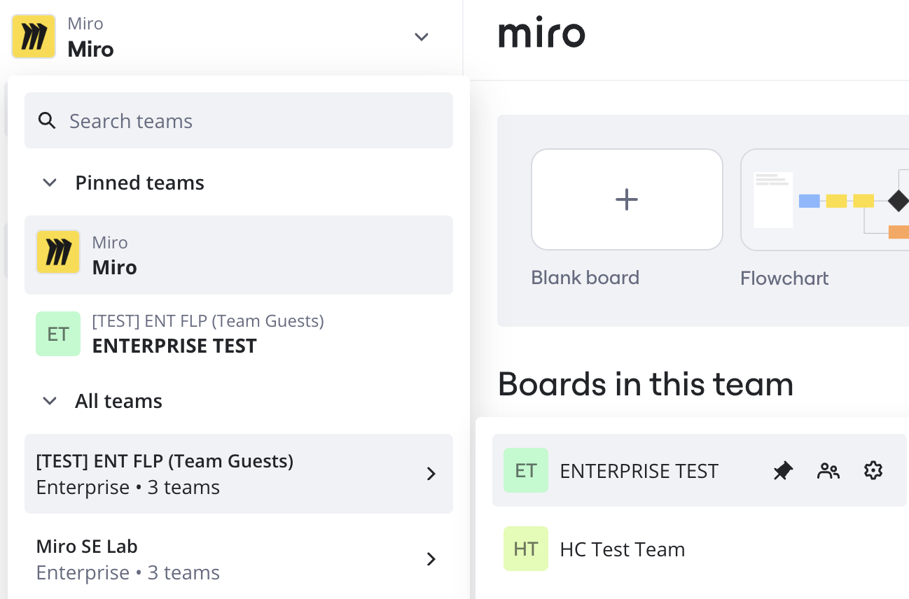

## What's the difference between a profile and a team?

**Profile** is your email address. All teams you're invited to or you set up are attached to your profile.

**Team** is a space where team members can collaborate, and create and store their boards and [Spaces](../../../using-miro/spaces/01-spaces.md). A Miro user can be a member of multiple teams.

## Upgrading a team

When you [upgrade](../../../plans-billing/manage-your-subscription-and-plan/03-upgrade-your-plan.md) a team, you and your team members get access to paid features for all boards stored in that team. Remember, the upgraded subscription is linked to a **team** and not to your profile. So your other teams may still be on the [Free Plan](../../../plans-billing/miro-plans/09-free-plan.md).

## How to switch between Miro teams

To switch between Miro teams, from the Home or Spaces dashboard select the current team name in the upper-left corner. The team picker drop-down menu opens.

*The Miro team picker enables you to organize, pin, and switch between teams.*

In the team picker, under **All teams** hover over an organization to see all teams in that organization. You can pin a team for faster access.

To pin a team to **Pinned teams**, hover over the team and select the pin button. Hovering over a team in the team picker also enables you to access **Team members** and **Team settings**.

:::tip
You can drag and reorder teams under **Pinned teams**.
:::

:::note
Pinned teams and the order of pinned teams is saved on the client, and does not persist from device to device.
:::

**More information:**

- [How to create a team in Miro](02-how-to-create-a-team-in-miro.md)
- [What is on your dashboard](01-what-is-on-your-dashboard.md)
