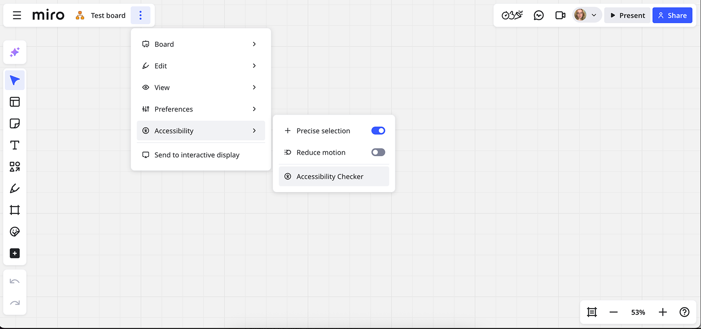
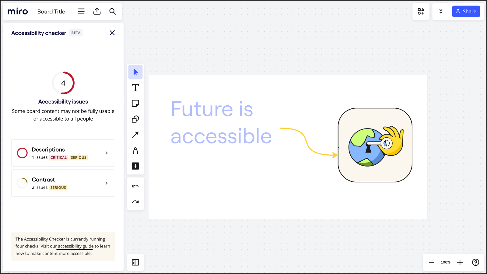
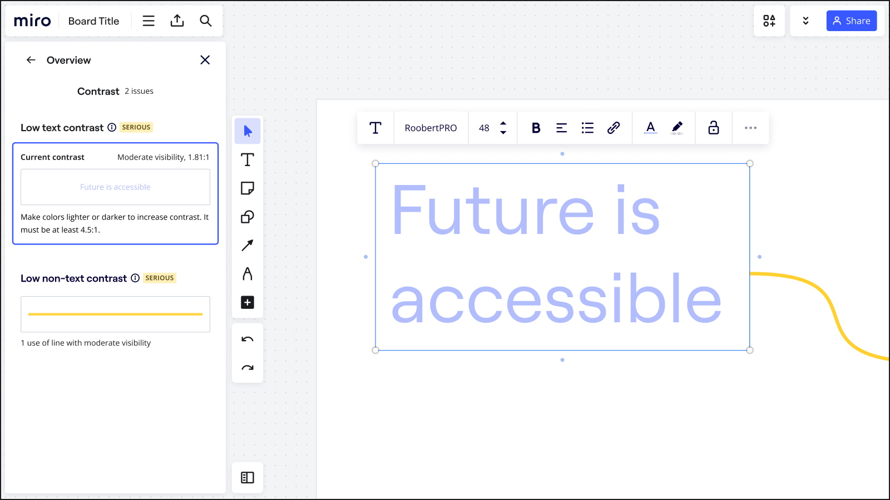
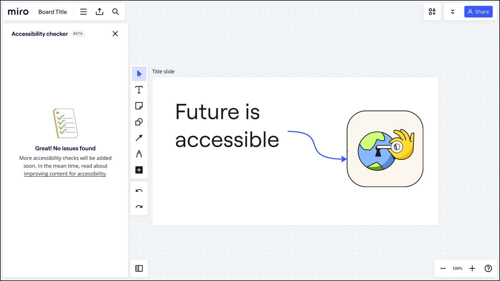
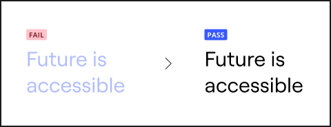
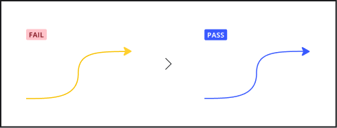
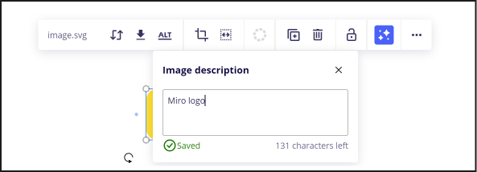
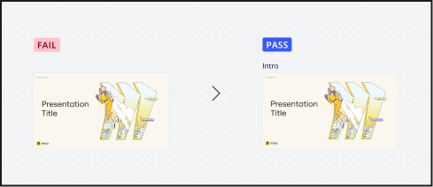

Ensuring accessibility for everyone is a core part of Miro's mission. Miro has developed tools to help you create experiences that everyone can participate in. The Miro Accessibility Checker is designed to help you ensure your Miro boards are as inclusive and accessible as possible.

## What is the Miro Accessibility Checker?

The Miro Accessibility Checker is an innovative tool aimed at empowering all users to collaborate effectively, without the limitations imposed by accessibility barriers. It performs a variety of checks on your Miro boards to identify areas that may not meet accessibility standards, providing you with actionable insights on how to improve your content for all users.

## Why use the Miro Accessibility Checker?

Creating an accessible experience is not just about compliance. The Miro Accessibility Checker guides you towards creating more inclusive content, ensuring that every participant, regardless of their access needs, has a seamless and engaging experience.

## To use the Miro Accessibility Checker:

1. Navigate to the **vertical three dots** () menu > **Accessibility** > **Accessibility Checker**.
   *Accessibility checker can be found in Board Toolbar > Main menu > Accessibility > Accessibility checker*
2. The Miro Accessibility Checker will automatically scan your board for potential accessibility issues. This includes checks for color contrast, images descriptions, and frame titles, ensuring that your content is perceivable by everyone.
3. After the scan is complete, the checker will present a detailed report of its findings. This report includes specific recommendations on how to address any identified issues. The report will split the issues into two categories: Descriptions and Color contrast.
   *Accessibility checker shows 4 accessibility issues found on the board*
4. Follow the checker's recommendations to modify your board. This might involve adjusting colors or adding descriptions to objects.
5. Activating on a selected issue will take you to that issue on the board, making it easy to make a change.
   
   *A text object with insufficient contrast is selected on the board*
6. After making the suggested adjustments, you can run the checker again to ensure that all issues have been resolved.
   *Accessibility checker shows no issues*

## Accessibility checks

Four accessibility checks are currently supported on a Miro board.

### Color contrast

Color contrast is defined as the difference in luminosity or brightness between two colors. If the ratio is too low, then it can be difficult or impossible to distinguish between the two colors. This may make it difficult for some users to perceive text or shapes on a Miro board. The current W3C WCAG 2.2 AA guidance is as follows:

- Text must be at least 4.5:1 against the background
  *Text with insufficient contrast saying “Future is accessible” and marked “Fail”, same text with sufficient contrast marked “Pass”*
- Graphic elements must be at least 3:1 against the background
  *An arrow with insufficient contrast marked “Fail”, same arrow with sufficient contrast marked “Pass”*

### Image descriptions

- Image descriptions provide assistive technologies, such as screen readers and voice control, with information that can be communicated to users.

*Image description dialog. Select an image on the board, press Ctrl+Enter to move focus to context menu, press Right arrow until you reach Description button*

### Frame titles

- Providing frame titles make it easy for users to navigate around a Miro board.

*Unnamed frame marked “Fail”, same frame labeled “Intro” marked “Pass”*

## Categorization of issues

Issues in the Miro Accessibility Checker are classified into two distinct levels of importance:

- Critical: Issues which will have a blocking impact on the board, making it impossible for some users to effectively use.
- Serious: Issues which may have a negative impact on the user experience for assistive technology users.

Note that using the Miro Accessibility Checker will not catch all accessibility issues, and there may be some additional steps required to make your Miro board accessible to everyone. For more information, refer to the guide on how to create accessible, inclusive Miro experiences.

## Supported objects

- sticky notes
- text
- shape
- pen lines
- connector lines
