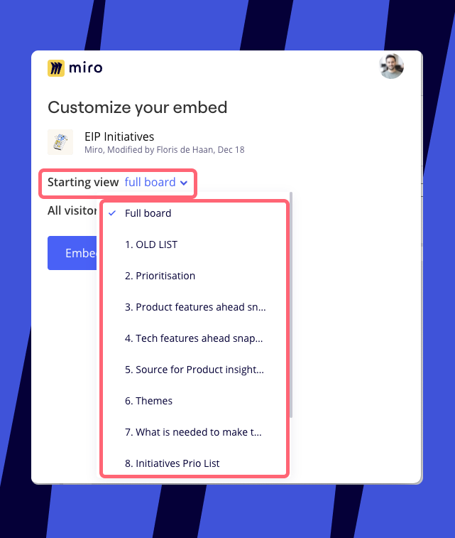
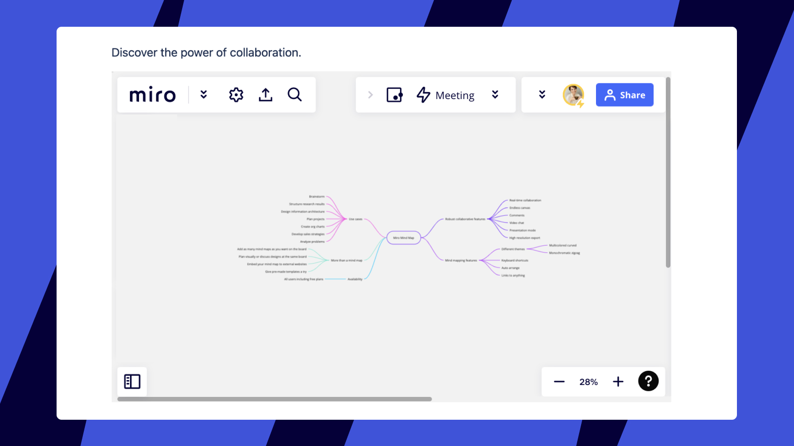
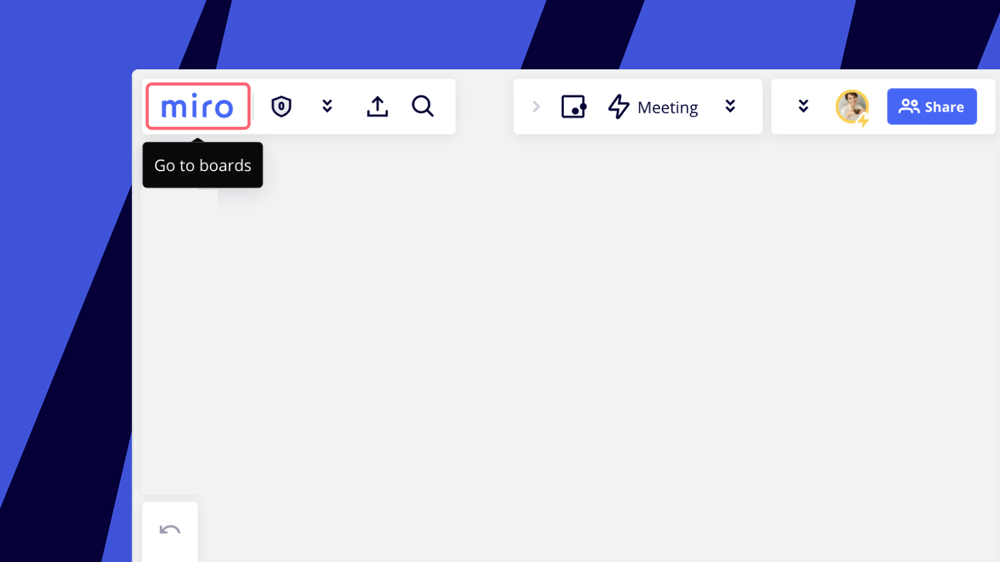
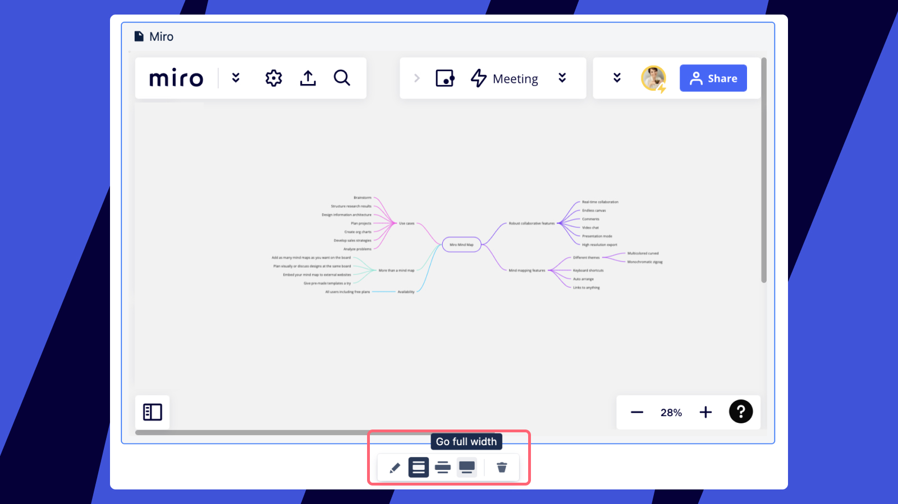
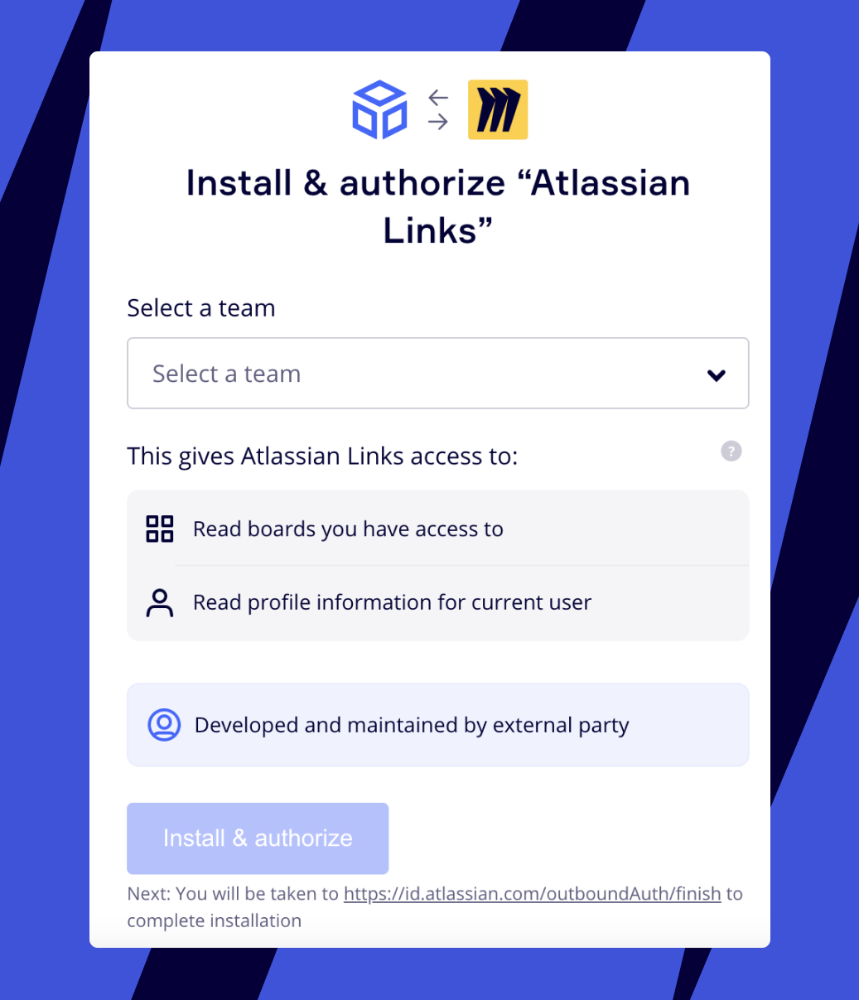
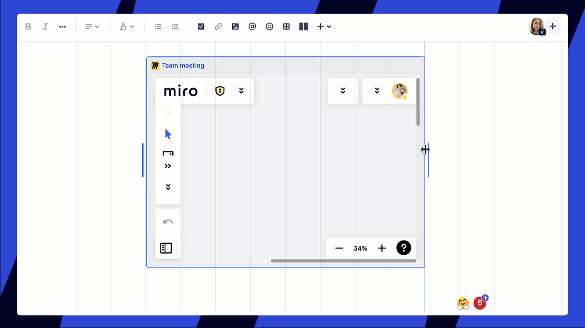
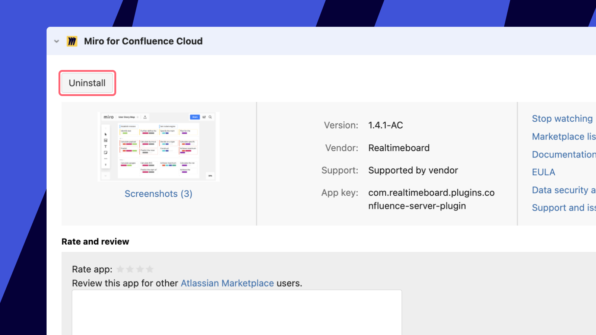

Miro and Confluence work together with 2-way sync to ensure that you get the most up-to-date content from both platforms, wherever you work.

## How Miro works with Confluence

Embed your Miro boards and Confluence documents, and keep track of changes with instant syncing. You can set embed access levels so the right users have access to the right information at all times.

[Embed Confluence docs in Miro boards](#embed-confluence-docs-in-miro-boards)

[Embed Miro boards in Confluence docs](#embed-miro-boards-in-confluence-docs)

## Embed Confluence docs in Miro boards

You can embed Confluence docs in Miro by simply pasting a link to the Miro board. Note that **embedding Confluence docs in Miro requires Confluence Cloud.**

When you paste a Confluence link onto a Miro board, it appears as a [Miro smart link](https://help.miro.com/hc/articles/360017730993). When pasting a Confluence link for the first time, you will need to click **Connect** to authorize Confluence access.

:::warning
For security purposes, we don’t show the details of a Confluence link on public Miro boards, and users can only view the title of a Confluence link on private boards. Users will only see the title of the page when they authorize their Confluence account, after which they'll be able to expand and edit the Confluence document (depending on the access level permissions provided).
:::

*Connecting the Confluence page in Miro*

Once Confluence is authorized, users who access the board will now be able to see the document Title, Provider icon, and Link source. Users will also be able to expand the Miro smart link to full screen mode.

:::tip
Miro smart link titles are extracted from the URL. If you edit the title of the Confluence document, you'll need to paste the link again to see the updated title in your Miro smart link.
:::

*A connected Confluence page as a Miro smart link*

When users click on the expand icon, they will be asked to authorize their own Confluence account before they can view and edit the document within Miro.

*The expanded Confluence document*

## Embed Miro boards in Confluence docs

You can embed Miro boards in Confluence docs with the [Miro Plugin for Confluence](#step-1-set-upthe-miro-plugin), or directly via [Atlassian Smart Links](#embed-miro-boards-via-atlassian-smart-links). This can be done with Confluence Cloud, Server, or DC.

### Step 1: Set up the Miro Plugin

First, install the [Miro for Confluence app](https://marketplace.atlassian.com/apps/1217530/miro-for-confluence?tab=reviews&hosting=cloud) from the Atlassian marketplace.

**How to install the Miro for Confluence app**

> **Who can do it**: Confluence Admin

1. Log into your Confluence instance as an admin
2. Click the admin dropdown and choose **Add-ons (Apps)**
3. Select **Find new apps** or **Find new add-ons**
4. Search **Miro for Confluence**
5. Click **Get app**

*The Miro for Confluence app*

You will see the following message when the app has been successfully installed:

*The app has been successfully installed*

### Step 2: Embed a board in the Confluence page

There are three ways to embed a Miro board in a Confluence page:

1. By typing **/miro** directly on the Confluence doc.
   
   *Typing /miro on the Confluence page to embed a board*
2. By searching for Miro from the app toolbar. From the Confluence doc, click **Insert** and select **Miro** from the list of apps.
   
   *Selecting Miro from the app list to embed a board*
3. By pasting a Miro link directly into Confluence with [Atlassian Smart Links](#embed-miro-boards-via-atlassian-smart-links).

### Step 3: Select a board from the board picker

The board picker will open. Select the board you wish to embed from the dropdown, or search for a board. Users will only see the boards available to them in Miro, and can only embed boards if they have editor access to them.

*Choosing a board to embed from the board picker*

Select the **Starting view** for the embedded board.

*Setting the starting view for the embedded Miro board*

Choose the access level for **All visitors** to the Confluence page.

- **Can view:** Allows any visitor on the Confluence page to see the board.
- **Require access:** Limits viewing to those who have board access in Miro.

*Setting the access level to the Miro board on the Confluence page*

### Step 4: Embed the board

Once you click **Embed board** the Miro board will be inserted on the Confluence page as an iFrame. Users can view and navigate around the board.

:::note
For users on the Enterprise Plan, access levels will follow organization-wide access settings, and therefore some permissions may be restricted. Learn more about [embedded board management for Enterprise Plan](https://help.miro.com/hc/articles/4405088016274).
:::

*Miro board embedded into a Confluence page*

To open the board directly in Miro, click the Miro logo.

*The option to open the board in Miro*

#### **User experience in Confluence Cloud vs Confluence Server**

The window size menu for embedded boards is different for Confluence Cloud and Confluence Server.

In Confluence Cloud you will see the following window size menu with the option to **Go full width**:

*Window size menu in Confluence browser*

In Confluence Server you will see a menu with the option to select a small, medium, or large (**S/M/L**) window size:

*Window size menu in Confluence app*

## Embed Miro boards via Atlassian Smart Links

You can also embed Miro boards in Confluence using the Atlassian Smart Links feature. The feature allows you to automatically embed a board without the need to install an app.

Go to a Confluence page and simply paste a board link, or type **/link** to insert. If you use the feature for the first time, you will be asked to connect a Miro team. Click **Connect to preview,** authorize in Miro, and choose a team from which you will embed your boards.

:::note
Only users who have access to the embedded board on the Miro side will be able to work with the embedded Miro board preview after connecting their Miro and Atlassian accounts. If you'd like to make the board preview available for all Confluence users you can use the Miro app.
:::

*Choosing a team to embed boards from*

When you paste a Miro board link into a Confluence page, it will turn into a widget automatically. Click the link to see the display options. You can choose to display the Miro board as a **URL**, **inline** text, a **card** or an **embed**.

*Miro board widget in Confluence*

If you choose to display the board as an embed, you can change the embed size by dragging its sides.

*Changing Miro embed size in Confluence*

:::warning
If third-party cookies are blocked in your browser there can be unexpected issues displaying embedded boards.
:::

## Disabling the Miro app for Confluence

To disable the app go to **Atlassian Marketplace** > **Manage apps** > **Miro for Confluence Cloud** > **Uninstall.**

**
*Miro for Confluence app on the list of the installed Atlassian apps*

## Migration and board impact in Confluence

Whether you are migrating from an On-premise to Cloud instance, or Cloud to Cloud, the Miro plugin does not require dedicated migration steps. Confluence displays Miro boards via iFrames, which are URL-based embeds, meaning that Confluence stores only the board link, while the board remains in Miro.
