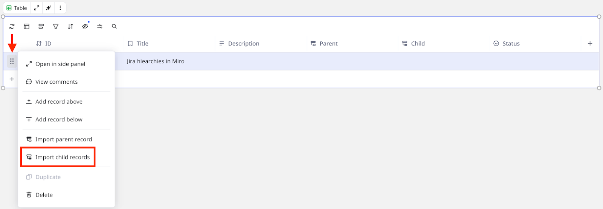
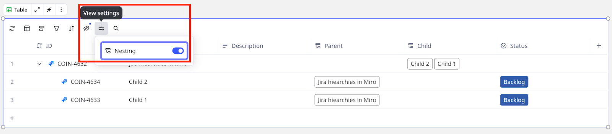
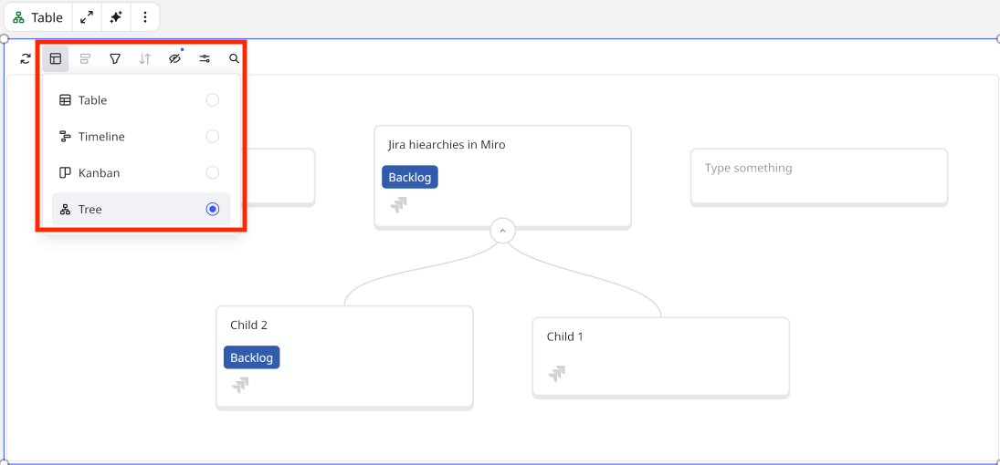

You can import your Jira issues into the Miro Table Format. A table enables you to have end-to-end visibility of your strategic initiatives and workflows, from high-level epics to specific ticket details.

**More information:** [Jira Cards FAQ](https://help.miro.com/hc/articles/360013463739).

## Import Jira issues to your board as table

1. On a Miro board, on the Creation bar click Tools, Media and Integrations (+).
2. Search and select Jira Cards.
   If you are connecting to Jira for the first time, then you are required to authenticate.
   The **Select issues** modal opens.
3. Search and select your Jira issue(s).
   **Select issues** includes only the Jira issues you have permission to access.
4. Add your issue(s) as the **Table** Format.
    *The add-as selector enables you to choose the Table Format.*
5. Click **Add** ***x**.*

## Import Jira child records

After you import parent issues as Table, you can import child issues.

Follow these steps:

1. In the Table, for the row where you want to import child issues, in the first column click the the vertical six-dots. A menu opens.
2. Click **Import child records**.
   The **Select issues** modal opens.
    *After you import issues, you can import child issues to your table.*
3. Select the child issues you want to import.
4. Click **Add** ***x*****.**

### Toggle nested view

To toggle the nested view for parent and child issues, click the **View settings** button. Then toggle **Nesting** to the on position.

 *Toggle nesting view for parent and child issues.*

:::tip
In nested view, you can collapse and expand child records. A parent issue has an indicator to show whether child issues exist.
:::

## Change table layout

To change the table layout, click the **Layout** button. Then select a layout.

For example, you want to a tree layout.

 *Change the layout for your Jira issues table.*

:::note
(Enterprise) Tree view is in public beta and available only on an Enterprise Advanced license. For more information, see [Understanding Enterprise Licenses](https://help.miro.com/hc/articles/33311996124306).
:::
