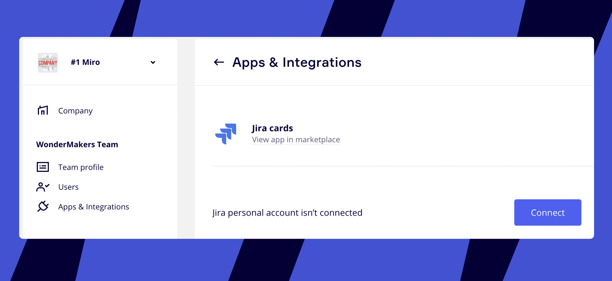
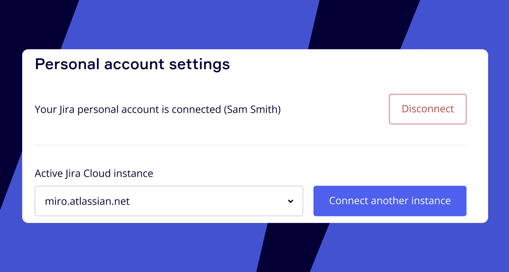
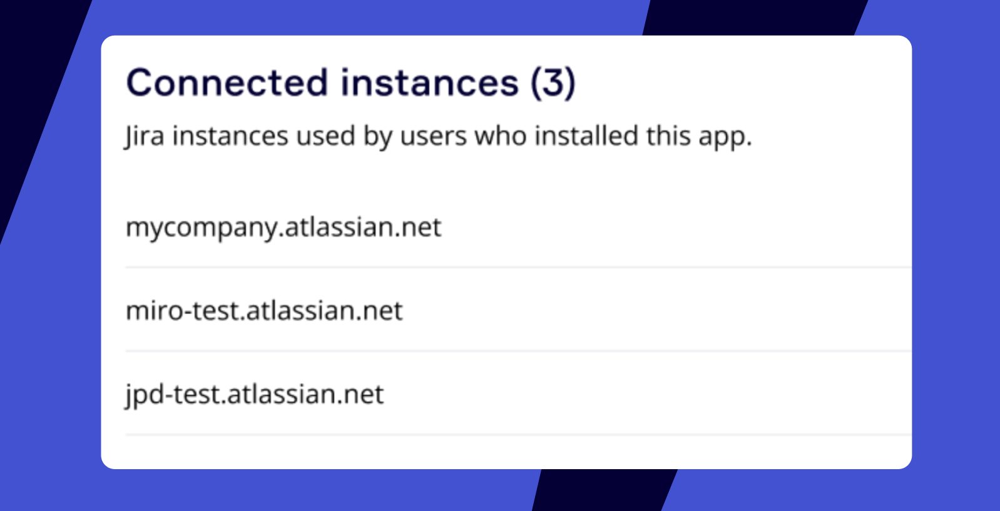

:::warning
If any technical issues arise please refer to our article about [Possible issues and how to resolve them](https://help.miro.com/hc/articles/360017572654).
:::

:::tip
Learn more about Jira Cards in the articles [Jira Cards FAQ](https://help.miro.com/hc/articles/360013463739)
:::

## Connecting Jira and Miro

### Installing the app

1. To enable the integration, on your [dashboard](https://help.miro.com/hc/articles/360017571294-What-is-on-your-dashboard) in the upper right corner, click on your avatar > **Apps & Integrations**:
   *Managing your apps*
2. Find "Jira cards" in the **Search** line and click the blue **Connect** button in the right-down corner of the popup menu.
3. You will see a window to **Add "Jira Cards"**. Here you need to confirm the installation or select the team where you want to install the integration (in case you are a member of several teams). Click to **Add** the integration. At the top of the dashboard, you will see the confirmation message that the **App has been installed:**
   
   *The confirmation message*

### Connecting your Jira profile

1. Click your avatar on the dashboard again and go to **Settings > Teams >** *Your team name* **> Apps & Integrations > Jira Cards** and click to **Connect:**
   **
   *The integration's settings*
2. You will be sent to the Jira page to authorise the connection. Sign in to Jira and click **Accept**.

### Connecting Jira instances to your Miro team

With OAuth 2.0 you can now connect several of your Jira instances to the same team and boards. After authorizing the app in Settings, you will see the option to **Connect another instance.**

1. Launch the Jira Cards Picker from the Creation toolbar (you may need to add the app using the **More apps +** button).
2. In the Picker, click **Settings**.
3. You'll be taken to the **Apps & Integrations** section of your settings. Look for the option to **Connect another instance** and select any additional Jira instances you'd like to connect.*Jira cards settings in a Miro account*

Team Admins can also see all the instances the members of the team have connected:

:::warning
Note that every end-user will need to authenticate from the Miro boards with every connected Jira instance if they try and work with the instance's cards.
:::

:::note
Only one instance can be Active at a time so users can pull cards from it. Existing cards from inactive instances can still be worked on on the Miro boards.
:::

### Setting up real-time updates from Jira

To get the full realtime benefits of our bi-drectional sync you must configure webhooks for the Jira instances you add. This will ensure that any updates you make in Jira are propagated in Miro in real time.

:::note
You must be an Admin on Miro *and* Jira to be able to add webhooks to your instances.
:::

1. Launch the Jira Cards Picker from the Creation toolbar (you may need to add the app using the **More apps +** button).
2. In the Picker, click **Settings**.
3. You'll be taken to the **Apps & Integrations** section of your settings.
4. In the **Connected instances** section you should see a list of any instances you have added previously.
5. Next to each instance there is a button to **Add webhook.** Clicking this will set-up real time updates from Jira to Miro for that instance.
6. If you want to remove webhooks from this instance in the future you can follow the steps above and click the **Remove webhook** button that is next to the connected instances for which you have added a webhook.

After that, you're done! Now you can add Jira tasks as cards on the whiteboard. All the changes made in Jira are reflected in Jira Cards on the board and vice versa.

## What data does Miro access?

Miro accesses issue data, like key, summary, status, priority, assignee, and comments, project and board information, sprint data, and basic user information for displaying names and avatars.

Miro does not access system configuration, backups, or infrastructure settings.

All data access is limited to what the authorizing Jira user is permitted to see. Miro cannot access anything beyond that user's permissions.

## Uninstalling the plugin

Go to your **Team Settings > Apps & Integrations > Jira Cards** and click **Uninstall for team.**

:::tip
Don't forget to take a look at the main article on [how to use Jira cards](https://help.miro.com/hc/articles/360017572434)!
:::
