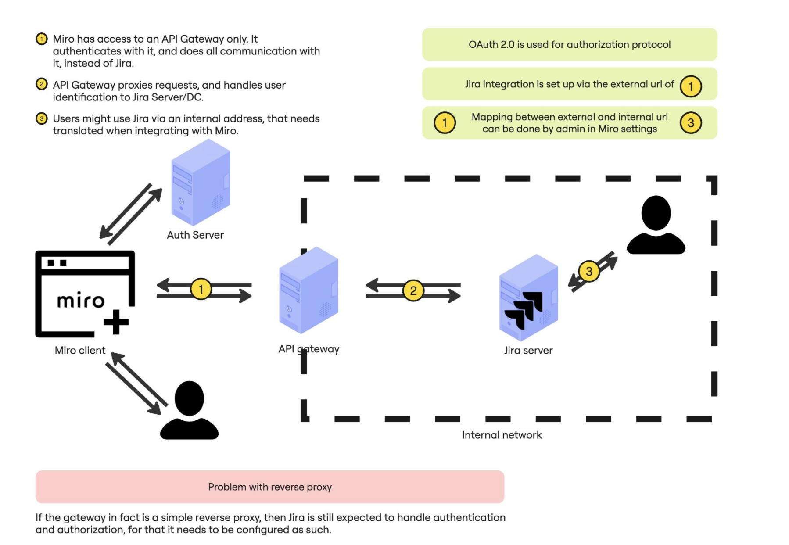
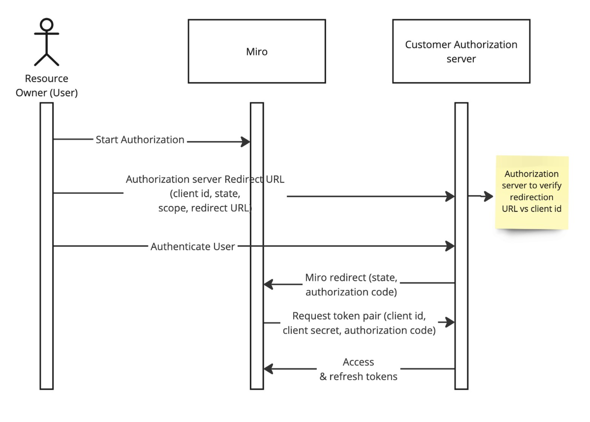

This article provides technical detail for using a third-party authorization server with OAuth 2.0 to integrate Jira with Miro.

To learn how to set up a connection, see [Connect to Jira on-premise with third-party authorization servers using OAuth 2.0](https://help.miro.com/hc/articles/25692796700306).

## How Jira integration with Miro using on-premise authorization and OAuth 2.0 works

The following graph shows the communication flow between Miro and an on-premise Jira authorization server.



*Miro and Jira integration using an on-premise authorization server via an API gateway*

## Configuration parameters

To configure the authorization flow between Miro and Jira using a third-party authorization server with OAuth 2.0, you must specify the following parameters:

- **Authorization server**
  - Authorization request URL
  - Token request URL
  - Scope
- **Authorization app configuration**
  - Client ID
  - Client secret
- **Jira instance**
  - Jira public URL
  - Jira base URL; internal URL

:::note
Miro provides the redirect URL that the authorization server validates agains the registered app.
:::

**More information:** See [Connect to Jira on-premise with third-party authorization servers using OAuth 2.0](https://help.miro.com/hc/articles/25692796700306).

## User authorization requests between Miro and on-premise authorization server

For an integration between Miro and Jira using a third-party authorization server, the following graph shows the user authorization request flow.



*User authorization request*

### Authorization request

```
https://{authorization_URL}?
    response_type=code&
    client_id={CLIENT_ID}&
    redirect_uri={Miro Redirect URI}&
    scope={scope}&
    state={state}
```

The user can add parameters to the authorization request as key-value pairs in the configuration.

### Token request

```
curl --request POST \
    --url '{token request URL}' \
    --header 'content-type: application/x-www-form-urlencoded' \
    --data grant_type=authorization_code \
    --data 'client_id={CLIENT_ID}' \
    --data 'client_secret={CLIENT_SECRET}' \
    --data 'code={Obtained Authorization Code}' \
    --data 'redirect_uri={Miro Redirect URI}' \
```

After Miro receives the authorization code, Miro provides the state and requests a token pair.

### Refresh tokens exchange

```
curl --request POST \
    --url '{token request URL}' \
    --header 'content-type: application/x-www-form-urlencoded' \
    --data grant_type=refresh_token \
    --data 'client_id={CLIENT_ID}' \
    --data 'refresh_token={current valid refresh token}' \
```

Ensure that the refresh token operation is enabled; enable offline access to APIs.

### Jira API requests

```
curl --request GET \
    --url {Jira Public URL}/rest/api/{apiversion}/... \
    --header 'authorization: Bearer {accessToken}' \
    --header 'content-type: application/json'
```

Each request uses the provided Jira public URL as the base URL, and the user access token as the bearer token.
