:::note
The following OAuth1.0 authentication method will no longer be supported in Miro starting on July 31, 2025. OAuth1.0 is a [deprecated authentication protocol in Jira](https://developer.atlassian.com/cloud/jira/software/jira-rest-api-oauth-authentication/#:~:text=Deprecation%20Warning&text=Additionally%2C%20if%20you%20have%20existing,OAuth%202.0%20and%20JWT%20respectively.) and should not be used. This change is part of a broader transition to OAuth2.0, which is recommended in line with security best practices. Users are advised to migrate to OAuth2.0 to ensure continue support and compatibility with Miro's services.
:::

## Configuring Miro on Jira

:::warning
If any technical issues arise please refer to our article about [Possible issues and how to resolve them](https://help.miro.com/hc/articles/360017572654).
:::

:::tip
Learn more about Jira Cards in the articles [Jira Cards FAQ](https://help.miro.com/hc/articles/360013463739) and [How to set up webHook for Jira Cards](https://help.miro.com/hc/articles/360017731113).
:::

Jira Cloud setup Jira Server and Jira Data Center

:::note
Please note thatJira menus may differdepending on the Jira version you are using however the general flow should be the same. The instructions below can be also found in [Atlassian Support](https://confluence.atlassian.com/adminjiraserver071/using-applinks-to-link-to-other-applications-802592232.html).
:::

### Step 1 - Application link

First, create an application link and configure it.

1. Go to **Jira Settings** > **Products** > **Integrations** > **Application links** > **Create link:
   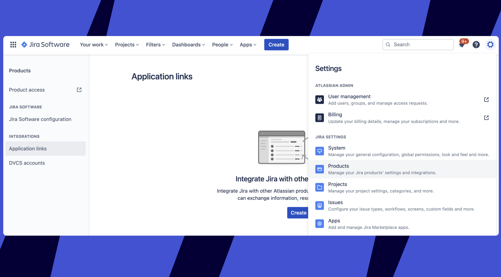***Note that the Jira interface may differ depending on your Jira version*
2. Choose **Direct application link** and enter `https://miro.com/` in the **Application URL** field.
   Important: you must enter the URL in this exact format. Click **Continue**.
   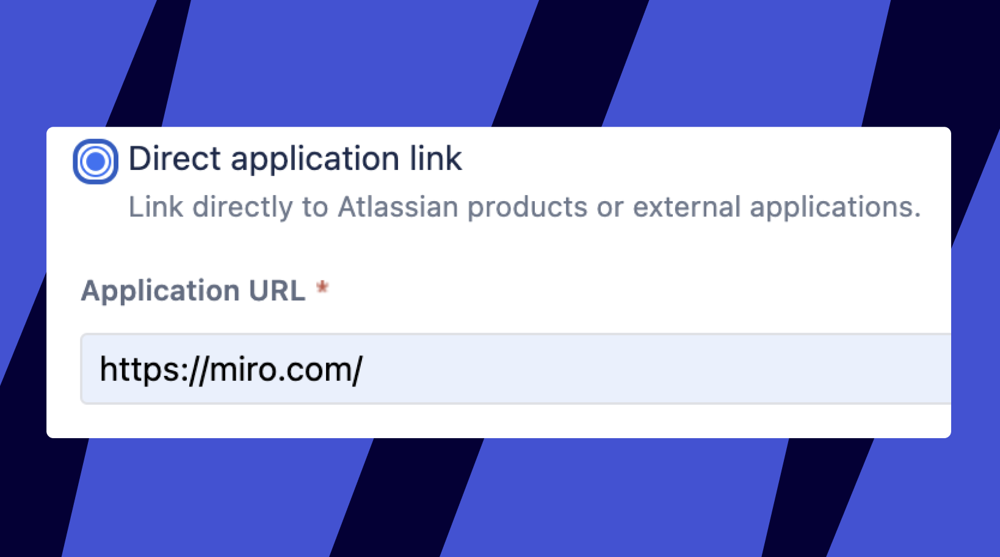
    *Creating the link*
3. In the next menu, simply click **Continue** again.
4. In the **Review link** menu, double-check that the URL is still exactly `https://miro.com/` and enter the **Application name** of your choosing. Scroll down, and at the bottom, check the box **Create incoming link**. *Skip the rest of the fields* and click **Continue**.
   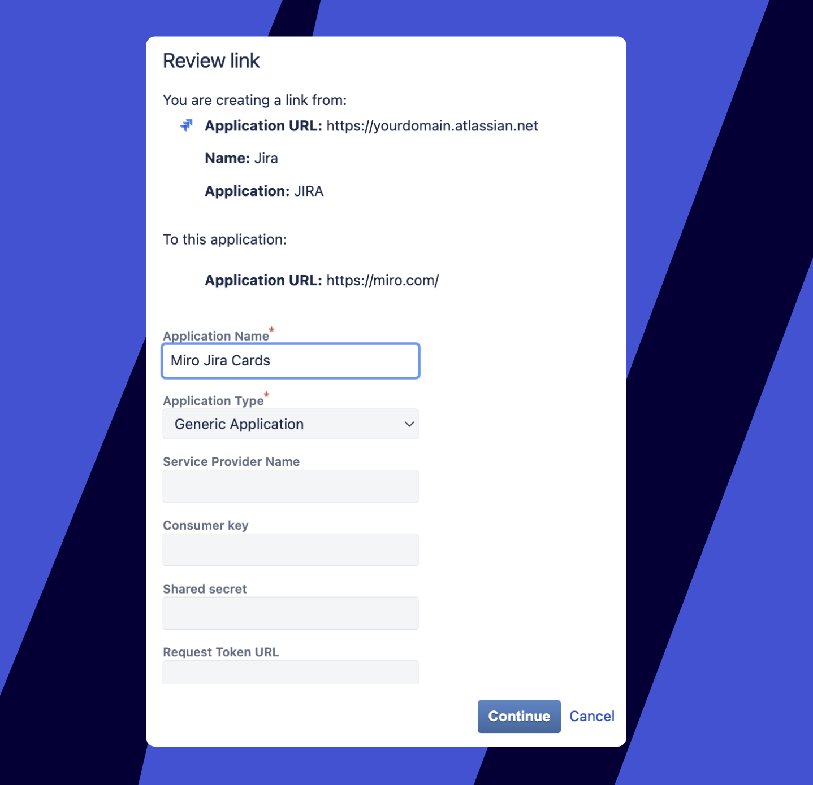  *Only the Application name field must be filled out*
5. Here you will see the fields for the Miro values. To get the values, log in to Miro.
   - For team-level integration, go to **[Team settings](https://help.miro.com/hc/articles/360021841280)** > **Apps & Integrations** > **Jira cards.**
   - For organization-level integration, go to [**Company settings**](https://help.miro.com/hc/articles/360021841280-I-am-a-new-Miro-Admin-Where-to-start) > **Apps** > **Manage apps** > **Jira cards** > **Settings**.
     > If you do not have Jira Cards on your Apps list, scroll to the section's top, click **Install apps**, and proceed to install the app from Miro Marketplace. After you see the Jira Cards on the list, click to open it.

     The plugin tab will open, and you can see **Step 1** to get the values required:

     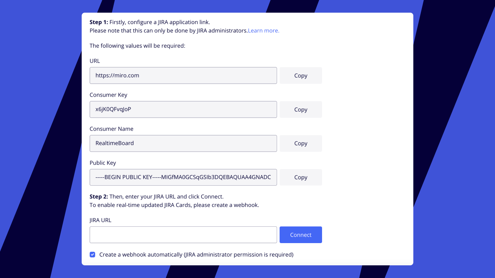*Jira Cards values*
     Copy the values and add them to the Atlassian **Review Link** menu.
6. You will see the processing message for a moment or two:
   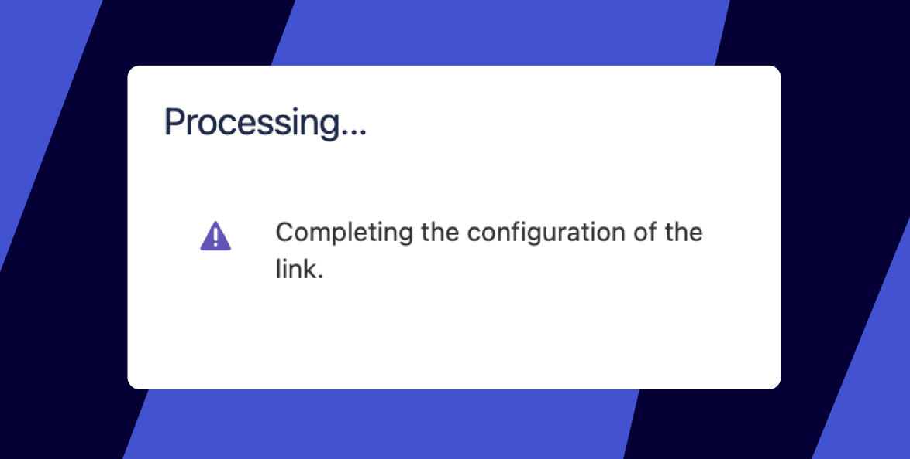
    *The last step of the link creation*

This completes the steps on the Atlassian side. The link will appear on the list of your Application links.

### Step 2 - Connection

Go back to your Jira Card Settings in Miro, and choose one of the two options: create a webhook manually or automatically. If you choose manually, uncheck the option. Please see more information in [this article](https://help.miro.com/hc/articles/360017731113). We strongly recommend using the automatic webhook, so you do not have to reset it in case of big updates to the plugin.

Finally, enter your Jira URL and click **Connect:**

*Connecting Jira Cards*

To get the Jira URL, please copy the base URL of your Jira instance. We accept the following formats:

`https://your-server.example.com/`
[https://your-server.example.com/
https://your-ip-address/](https://your-server.example.com/)[https://your-ip-address/](https://your-server.example.com/)

If your Jira URL is not accepted, please refer to [this article.](https://help.miro.com/hc/articles/360017572654) Please also check that Miro has enough access to your Jira to [establish the connection.](https://help.miro.com/hc/articles/360017572694)

Now you have connected your Jira instance to your Miro team.

:::warning
While Atlassian has discontinued support for Jira Server as of February 2024, Miro will continue to support the Jira Cards integration for Jira Server for the foreseeable future.
:::

1. Go to `https://your-jira-server/plugins/servlet/applinks/listApplicationLinks`[.](https://your-jira-server/plugins/servlet/applinks/listApplicationLinks) If "Application links" is not selected, click it. 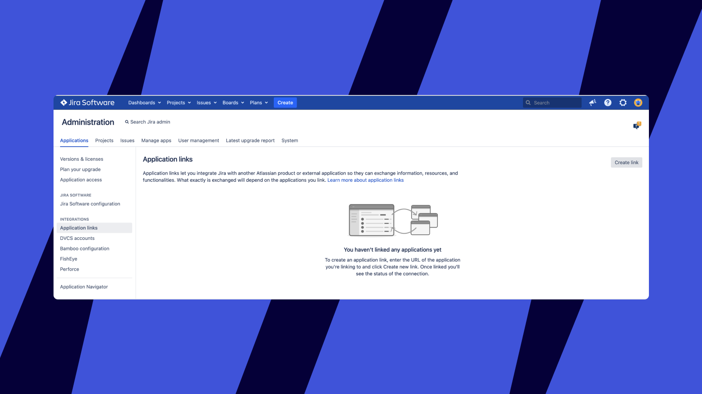*Jira Server Application links*
2. Click **Create link**. Select "Atlassian product" and provide the **Application URL**, "https://miro.com". Click **Continue**. 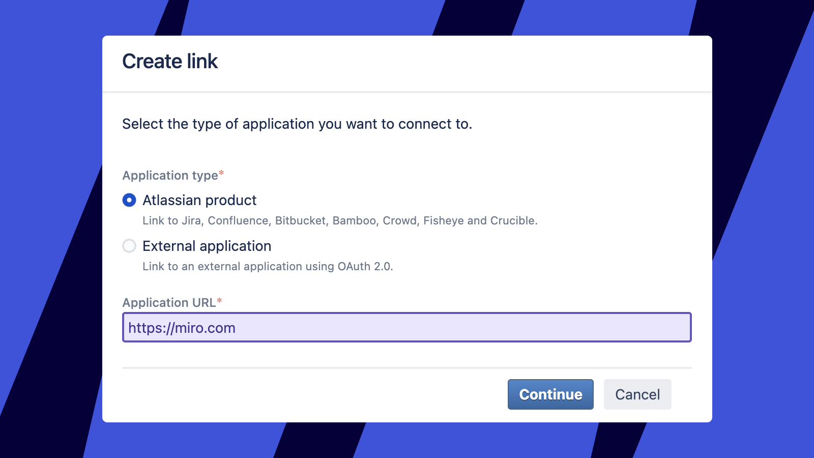*Configuring the Application URL*
3. You will be taken to the "Link applications" dialog box. Add an **Application Name** (i.e. Miro Jira Card), and select "Generic Application" for **Application Type**.
   You should see your Jira Application URL under "You are creating a link from:", and you should see `https://miro.com` under "To this application:". Click **Continue**.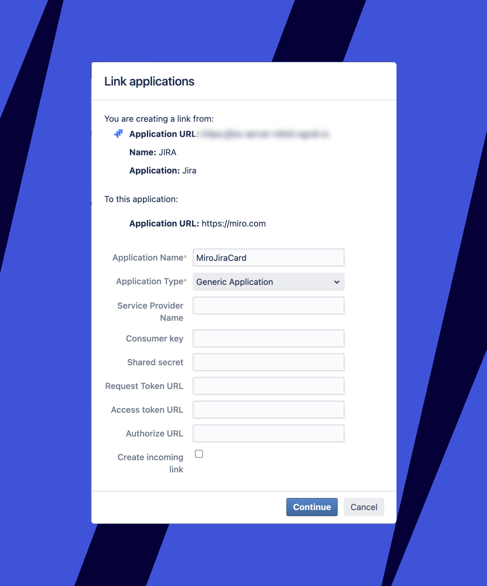*Configuring Link applications details*
4. The link configuration will process. When it finishes, you will see your new link in the "Application links" area of Jira Server. 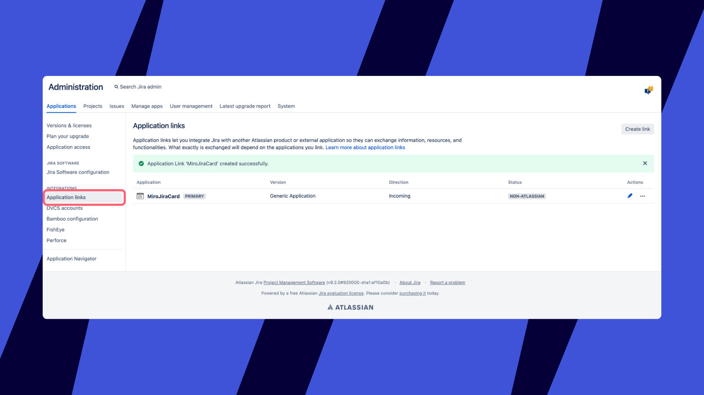*Your configured application in Jira Server*
5. Next, you'll need to configure your application details. Click the pencil icon for your application to edit the application details.
6. In the Configure dialog box, click the **Incoming authentication**option. Fill in the **Consumer Key, Consumer Name, Public Key,** and optionally a description.
   - For team-level integration, this information is available at [**Team settings**](https://help.miro.com/hc/articles/360021841280) > **Apps & Integrations** > **Jira cards**.
   - For organization-level integration, this information is available at [**Company settings**](https://help.miro.com/hc/articles/360021841280-I-am-a-new-Miro-Admin-Where-to-start) > **Apps** > **Manage apps** > **Jira cards** > **Settings**.
     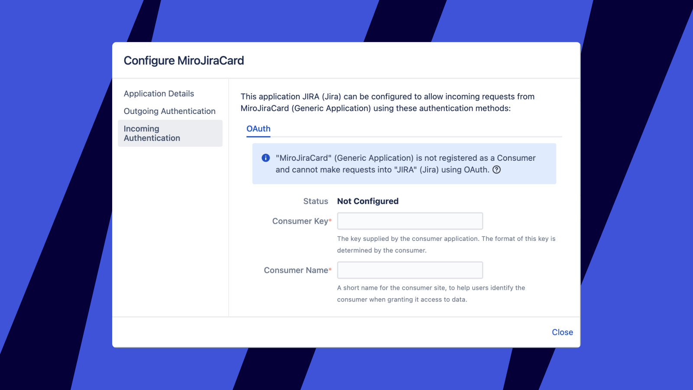*Configuring incoming authentication details in Jira Server*
     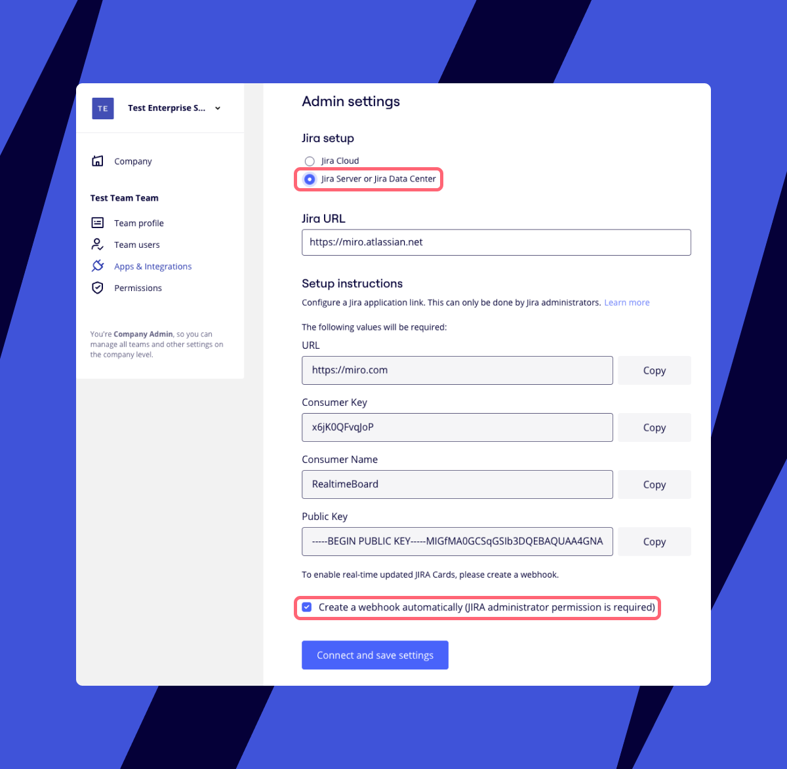*Jira application link details in Miro*
7. Scroll to the end of the Incoming authentication options and click **Save**. Your verification status should now be confirmed, and this Jira Server can now be used within Miro for use with Jira Cards. Be sure to choose "Jira Server" and "OAuth 1.0" on the Miro side.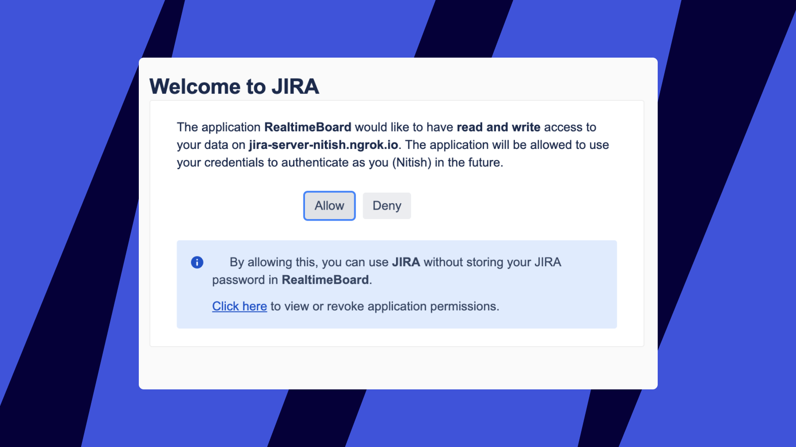

### User authorization

After the integration is connected, each of your end-users needs to connect their personal Jira profile to establish the proper permissions - this ensures that each user's access on the Miro end is *exactly the same as on the end of your Jira instance*. When end-users try to import or edit a Jira Card for the first time, they will be asked to log in to Jira using their individual user credentials.

After that is done, the users can add tasks as cards on the whiteboard. All the changes made in Jira are reflected in Jira Cards on the board.

:::note
If a user doesn’t have Jira credentials and the user has access to the board on which the card was added, they will see the card title, issue type, priority, assignee, and all attributes that are configured to be shown on the Jira Card. However, they won’t be able to expand the card to see other attributes and edit it unless they authorize. If the user doesn’t connect their Jira credentials, they will not see the assignee avatar and the general look of the card will be different.
:::

### Using one Jira instance for several Miro Teams

You can install Cards on the team level, or at the organization level. If you have multiple teams, then you can leverage organization-level settings to avoid repeating the setup procedure for each team. The existing Application Link is used for all teams.

After you connect your team or organization to a Jira instance, a new WebHook is created in your Jira WebHooks for that Miro team or organization. Creating a WebHook establishes a channel for update requests.

If you specify organization-level settings, teams that are already connected retain their current settings. However, they can switch to the organization-level settings at any time.

Additionally, if needed teams can override organization-level settings, in order to connect to a different Jira instance.

If you're an Enterprise customer who wants to migrate multiple team-level connections to the default organization-level connection, contact your account team.

:::warning
If you want to connect several teams separately, we recommend giving the webhook for each team a unique name. Go to your Jira WebHooks page and edit each newly created webhook.
:::

Connecting several Jira instances to one Miro team is not supported.

## Disabling the plugin

For team-level integration, go to **Team Settings** > **Apps & Integrations** > **Jira Cards**. Then select **Remove for team**.

For organization-level integration, to restrict Jira app usage, go to **Company settings** > **Apps** > **Manage apps** > **Jira cards**. Then move the toggle to the off position.

:::warning
If you disable Jira for the organization, then users from all Enterprise teams are unable to use Jira cards. To learn more about app management and restriction, see [App management](https://help.miro.com/hc/articles/4404659741458).
:::

**More information:** See [How to use Jira cards](https://help.miro.com/hc/articles/360017572434).
