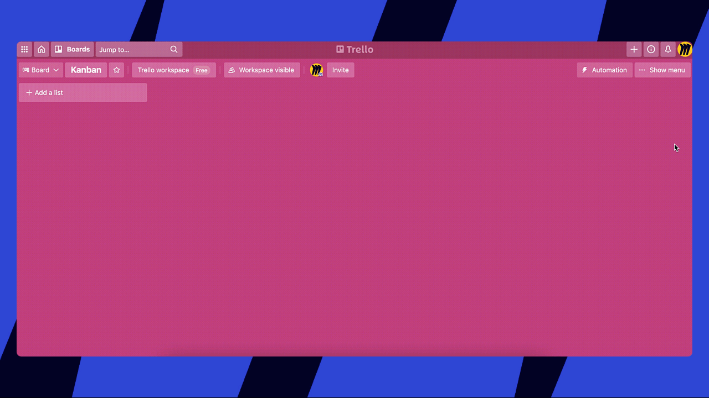

With the Miro Power-Up, you can easily attach Miro boards to Trello cards, view/comment/edit the boards and create new ones right from within Trello. No need to switch between the tools!

## How to install

To enable the Power-Up, open **M****enu**on the right-hand side of a Trello board. Select **Power-Ups**.

*Trello Power-Ups*

Find **Miro** on the list and click **Add**.

*Installing the Miro Power-Up*

## How to use the Power-Up

### Attaching boards to Trello cards

Open a card and click **Miro**in the **Power-Ups** section.

*Miro Power-Up*

You will see a picker with Miro boards and will be able to switch between your teams on the picker. If you're not authorized in Miro, you will need to sign in first.

Select a board and set the sharing settings for the board in the drop-down menu. You can make the board available for viewing and commenting by anyone on Trello's side.

:::note
For [Enterprise Plan](https://help.miro.com/hc/articles/360017571534) Miro users, your access settings will follow organization-wide access controls which might imply that some sharing options may be restricted. Learn more: [Managing Enterprise sharing policy for embed integrations](https://help.miro.com/hc/articles/4405088016274).
:::

*Setting up access rights for a Miro board*

Your board is now attached to the chosen card:

*Trello card with a Miro board attached*

### Creating new boards from Trello

To create a new board from within Trello, click **Miro** in **Power-ups** sectionand create a **New board** from the picker.

*Creating a board from the picker*

### Viewing, commenting and editing boards

Click the **Preview** button to view/comment/edit a board depending on the set access rights. The board window will open as an overlay allowing you to work and collaborate as if you were in Miro.

*Preview and edit a Miro board in Trello*

You can also open the board in Miro in a new tab for your convenience.

### Detaching boards

To detach a board, click **Remove** in the upper-right corner, and the attachment will be instantly removed from the card (on the Miro side the board will be unaffected).

*The option to remove the attached board*

## How to disable the Power-Up

To disable the Miro Power-Up, find **Miro** among your Power-Ups and click **Settings** > **Disable**.

*The option to **Uninstall**the Miro Power-Up in Trello*

:::warning
Note that the option to import Trello cards to Miro is not supported.
:::
