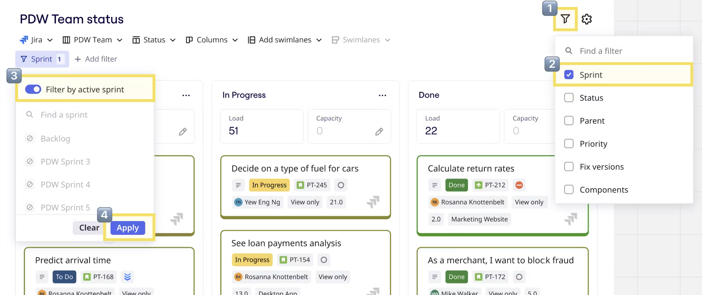

With planner for Jira, facilitators and teams can run and participate in planning events on a Miro board, while also syncing updates to their Jira board in real-time — saving hours of manual work.

During team and company planning events like Program Increments (PI), Big Room, Roadmapping and Sprints, development teams discuss and align with each other.

:::tip
Planner is now available for [Azure DevOps](../microsoft/09-planner-for-azure-devops.md).
:::

## How to create a planner for Jira

1. Navigate to the [creation toolbar](../../getting-started/start-here/your-first-board/05-toolbars.md#creation-toolbar) on the left side of your board.
2. Click **More apps** (**+**) and search ‘Planner’.
3. Click **Planner** to launch the app.
4. A cursor will appear on the board. Click anywhere to place a blank planner.
5. Click the **Jira board** dropdown and select a board to connect to the planner. If you haven’t yet authorized your Jira account in Miro, you will be prompted to log in.
6. The first **Columns** field is your *column type*. After selecting the Jira board, the column type will default to **Status**, and will show up to 3 columns. Click the first **Columns** field to select a different column type from the dropdown (you can choose Sprint, Status, Priority, Fix versions, Components, or a custom field).
7. Use the second **Columns** field to refine your Planner. For example, if you've picked 'Sprint' as your Column field, you can then select which sprints to display.
8. Add **Swimlanes** to your planner, in addition to columns, to further organize tasks against a second Jira field (you can choose Sprint, Status, Priority, Fix versions, Components, or a custom field).

:::note
Currently the planner only supports one Jira board. However, you can create multiple planners on a single Miro board.
:::

*Creating a planner*

## How to work with the planner

Drag Jira cards across columns to update them. For example, dragging a Jira card from the backlog to a sprint in the planner will update it in both Miro and Jira.

*Moving Jira cards between sprints*

Choose a field for **Swimlanes** to divide your work into rows as well as columns. Moving cards between swimlanes will update both the *column* and *swimlane* fields of the Jira issue.

*Choosing a field for swimlanes*

By default, the planner shows all issues in your backlog. To focus on the current sprint, in the top-right select the filter icon, and tick **Sprint**. Then select the **Sprint** filter and enable **Filter by active sprint**. Select **Apply** to apply your sprint filter.

*Filter issues by active sprint.*

You can also use the **Issue type** dropdown and select which issue types to display in your planner. For example, you can filter by Story only.

*Filtering by issue type*

Participants can comment on Jira cards to track ongoing discussions and notes.

*Commenting on a Jira card in the planner*

:::note
Miro cards, sticky notes and other objects cannot be placed within a planner.
:::

## Capacity and load

Make informed prioritization decisions during Sprint and PI planning by visualizing story point totals in easy-to-read columns. Boost your team's efficiency and ensure optimal work distribution.

### Enable the story points field in Jira cards

1. Go to the [creation toolbar](../../getting-started/start-here/your-first-board/05-toolbars.md#creation-toolbar) on the left side of your board.
2. Click **More apps** (**+**) and search ‘Jira cards’.
3. Click **Jira cards** to launch the app.
4. Click **Configure cards**.
5. Scroll down, and toggle on **Story Points**.

*Enabling story points for Jira cards*

### Using Capacity and Load

Once you [enable story points](#enable-the-story-points-field-in-jira-cards), you can create a new planner or refresh a board with an existing planner. As long as at least one issue on the board has assigned story points, you'll instantly see the **Capacity** and **Load** fields at the top of each column in your planner.

*Balancing capacity and load*

### Understanding Capacity and Load

**Capacity**: Manually input the capacity for each column in your planner. If the capacity is less than the load, the column will turn red, signaling that you have exceeded your team's capacity. This visual cue prompts you to consider reallocating issues to maintain a balanced workload.

**Load**: This represents the sum of story points for all cards in a given column. Cards without story points will count as 0 in this calculation.

## Jira configuration

To set up the planner, start by picking a Jira board to import issues from. This can either be from a Jira Scrum or Kanban board.

When creating a planner you can choose which Jira field to use for your columns and rows (swimlanes), including:

- Sprints
- Status
- Fix version
- Component
- Priority
- Assignee
- Any custom field with a single-value dropdown selection
- Any custom field with a multi-value dropdown selection

We do not currently support other Jira fields or date-related fields.

The Sprint option will only appear if the sprint field is available on the edit issue screen in Jira. This is commonly pre-configured for Jira Server/Data Center but often Cloud requires the sprint field to be added manually. Read more about [how to configure issue screens](https://support.atlassian.com/jira-cloud-administration/docs/configure-issue-screens/).

:::note
Closed sprints cannot be displayed in the Planner.
:::

### How to create a planner using a custom JQL

To make a planner using a custom JQL, start by making a Jira board with your JQL query. After the Jira board is created, follow the instructions above for [creating a planner](#how-to-create-a-planner-for-jira). When you get to step 5, remember to choose the Jira board you created using your customized JQL query.

## Planner syncing

### From Miro to Jira

When you drag a card between custom fields in Miro, Jira is updated automatically. This may take a few seconds.

### From Jira to Miro

If you make changes to a sprint in Jira, you'll see an **Updates available** notification in the planner context menu. This may take a few seconds after you make the changes in Jira.

Click the planner to open the context menu, and click the **Sync with Jira** icon to sync the latest changes.

*Syncing updates from Jira to Miro*

## Dependency mapping

Participants can visually map dependencies between tasks on the planner. Learn more about [Dependencies for Jira](../../using-miro/facilitation-tools/10-dependencies-for-jira.md).

## Known limitations

### Dragging cards into the Planner

Dragging cards from the Miro canvas into the Planner is not fully supported.

When you drag a card into the Planner, Miro attempts to update the card with the target column and row values. If the update succeeds, no error is shown. However, there are cases where the update may not work as expected. In these cases, you won't see an error message, but the card's field values may not have changed in Jira. Always verify that the changes are reflected in Jira after dragging cards into the Planner.
