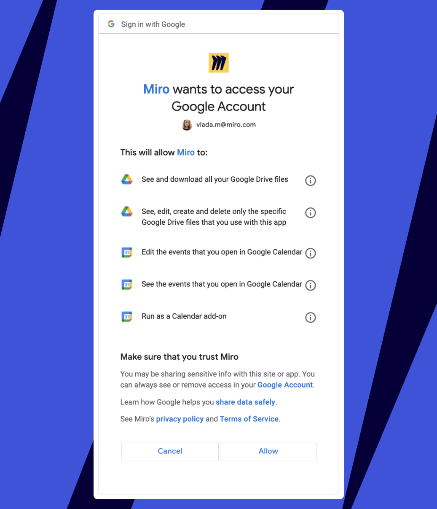
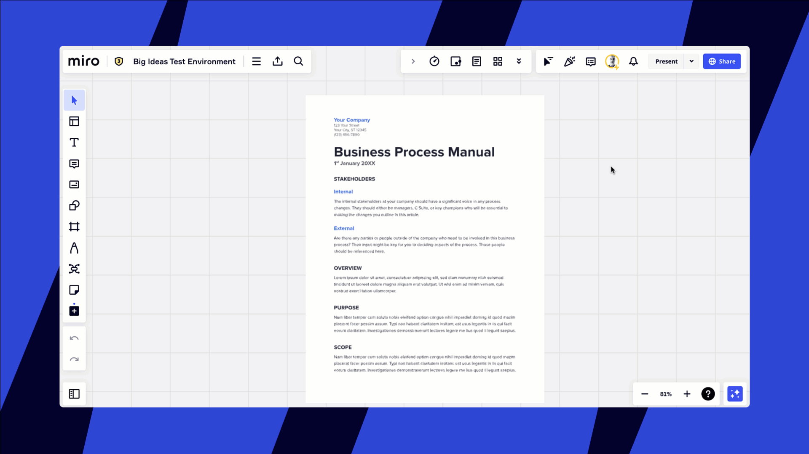
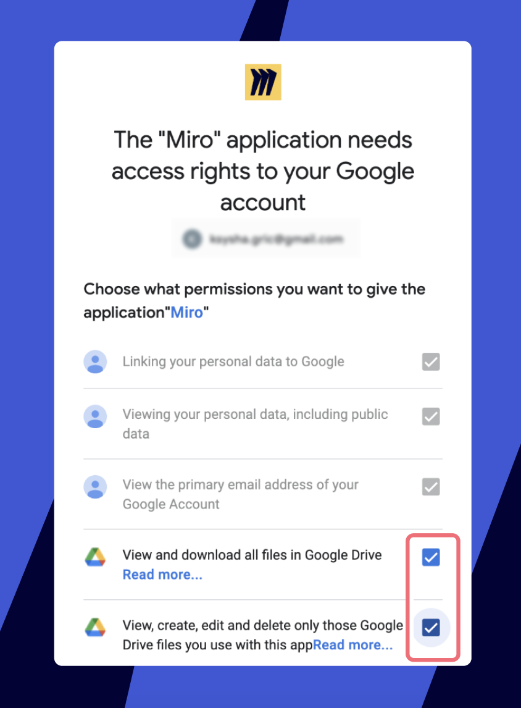

**Google Drive** allows you to store files securely online, access them from anywhere, and collaborate with others. With Google Drive integration, we make it easier for you to focus on your tasks and track your documents right on the board.

### Enabling Google Drive

To start adding files from Google Drive, you'll need to install the plugin and connect your Google Drive to Miro.

Install the app from [Miro Marketplace](https://miro.com/marketplace/google-drive/?backUrl=%2Fmarketplace%2F). After clicking **Get app** you'll be suggested to choose a team to install the plugin for.*Choosing a team when installing the Google Drive plugin*

You can also install the plugin from a board. In the Creation bar, select **Tools, Media and Integrations** (**+**). A panel opens. In the **Tools** tab, search for Google Drive. Select **Upload**, then select **Google Drive**.

Then, connect Google Drive to Miro. There're 2 simple ways.

1.  From your profile settings. In the Board bar, select the hamburger icon. The sidebar opens. Select your avatar, then select **Settings**. Your profile settings open in a new window. Select the **Integrations** tab. For **Google Drive**, select **Connect**.

*Google Drive on the Integrations page*

2. Connect your Miro profile to Google Drive from within the board by clicking **Google Drive** in the **Upload**menu on the toolbar:

*The Google Drive icon on the toolbar*

Confirm authorization for the needed Google account and **Allow** the app to access your files:

*Google Drive Permissions*

Please note that those are the standard permissions for Google Drive.

- **See and download all your Google Drive files** - for a Google Drive file picker on a board. It allows for [importing documents from Google Drive to Miro](#adding-files-from-google-drive-and-shared-drives)

- **See, edit, create, and delete only the specific Google Drive files you use with this app** - to have the ability to [save a Miro board to Google Drive](#saving-your-board-to-google-drive).

The Google Drive application only manages the files that we create on the Drive (links to boards, etc).  Miro does not have an opportunity to manage any content within your Google Drive. To implement the integration, we use **Google Drive API v3**. In this API the scopes are grouped in such a way that write access permissions cannot be requested separately from full disk access permissions. If you'd like to take a look, check out out the permissions in Google's article, [Scopes for Google APIs](https://developers.google.com/identity/protocols/googlescopes).

If you need to change the Google account connected to Miro, go to **Profile settings** > **Integrations**, click **Log out** next to **Google Drive** and connect to another account.

*Google Drive connection in Profile settings*

### Adding files from Google Drive and Shared drives

> **Available on:** browser version, [Desktop app](../../getting-started/apps-for-devices/05-desktop-app.md), [Tablet app](../../getting-started/apps-for-devices/11-tablet-app.md), [Mobile app](../../getting-started/apps-for-devices/08-mobile-app.md) (limited functionality)

:::warning
Anyone with access to a Miro board can extract its imported documents, even if they're restricted on the Google side. To protect your files, it's important to avoid sharing the board with individuals who should not have access to the documents.
:::

To add a file from Google Drive:

1. Paste the document URL right onto the board (note that pasting a URL into a [shape](../../using-miro/essential-tools/11-shapes.md) or a [sticky note](../../using-miro/essential-tools/14-sticky-notes.md) will not embed your document to the board but will add the link as simple text). When you copy a link to a specific sheet from Google spreadsheets and paste it to Miro board, the pasted spreadsheet will still start from the first page in Miro.

   or:
2. Click the **Upload**button on the toolbar (shown in the screenshot above) and choose **Google Drive**. You will then see the picker menu. Select all the documents you would like to add and click **Select**. You can also use the search bar to find documents on your Google Drive.

:::tip
To add a Google Drive document on a board in the [Mobile app](../../getting-started/apps-for-devices/08-mobile-app.md), paste the document URL via the Upload menu.
:::

*Selecting a document in Google Drive*

Add documents from **Shared drives** - switch to the tab and choose files.

*Team Drive in the Google Drive picker*

### Editing Google documents

> **Available on:** browser version, [Desktop app](../../getting-started/apps-for-devices/05-desktop-app.md)

You can embed Google Documents, Spreadsheets and Slides right on the board, move and resize them and also swipe the documents' pages.

Click the document and you will see a context menu with the options to switch pages, **pin** a page, **extract pages**, **edit**content, **reload**, **update**or go to **source**.

To start editing the document, click the pen icon on the context menu or double-click the document. The document opens in a pop-up and you can edit it as if on your Google Drive. Click **Close**or grey area to finish editing. All the changes are automatically saved and visible on the board and in Google documents.

*Editing an embedded Google Document*

If you prefer you can also click the **source**button and the document will open for editing in the next tab.

If you made any edits directly from your Google Drive (especially when working offline), refresh the embed on the board using the **Update**button in the context menu. Embedded Google Drive files don’t get updated on Miro boards automatically (unless the file is edited from within Miro).

*Update button*

### Managing access rights

Please note that access rights in Google Drive and in Miro are set *separately*. It means that to let someone edit a Google Document on the board you need to share the document with them in Google Drive with *editor's* rights and also [invite them as an e*ditor* to the board](../../using-miro/sharing-boards/03-sharing-boards-and-inviting-collaborators.md).

If you allow someone to edit the document in Google but invite them to the board with [viewing or commenting rights](../../using-miro/sharing-boards/01-board-access-rights.md) only - they will not be able to activate the document's edit mode. Vice versa, if you invite a person to the board as an editor but do not share the document with them in Google Drive - Google will not allow them to edit it.

Please make sure that you and your team members are provided with the access level that is required for successful collaboration.

### Saving your board to Google Drive

> **Set up by:** board owners

In the Board bar, select the vertical three dots. The **Main** menu opens. Select **Board** > **Export** > **Save to Google Drive**.

In Google Drive, you can now click the saved board and it will open in a separate browser tab. If you delete the board from Google Drive it will still be available in Miro. However, if you delete the board in Miro, you won't be able to access it from Google Drive anymore.

:::warning
If you're not the Board owner, you will get the error message as below.
:::

*Insufficient save rights error message*

### Uninstalling the plugin

To uninstall the plugin for a team, find it in the **Apps & Integrations** section of the Team settings and click **Uninstall for team**.

*Uninstalling Google Drive for a team*

To disconnect Miro from Google Drive, open the **Integrations** page of your Profile settings and click**Log out** near the Google Drive icon.

*Disconnecting Google Drive from Miro*

### Features unavailable for embedded Google Drive files

**General**

- Google Drive Start page
- Moving files between folders
- Sharing
- Help search

**Google Presentations**

- Presentation Mode

### Possible issues and how to resolve them

**Unable to upload error**

If you get the error message **Sorry, it seems that you don't have rights to upload this file or the file was deleted. Please check access right and try again** when trying to upload a Google Drive file to a Miro board, ask your Google Administrator to allow users to access Google Drive with the Drive SDK API:

1. Sign in to the [Google Admin console.](https://admin.google.com/)
2. Click **Home > Apps > Google Workspace**. Make sure **Drive and Docs** are **ON for everyone.**
3. Click **Drive and Docs > Features and Applications**. In the **Drive SDK** section, make sure that **Allow users to access Google Drive with the Drive SDK API** is **ON**.

*Unable to upload warning message*

**Authorization issue**

If you can't connect your Google Drive to Miro, please make sure to provide Miro access to **View and download all your Google Drive files** and to **View, edit, create, and delete only the specific Google Drive files you use with this app** when connecting your Google Drive. For this, go to your [Miro Profile settings](../../using-miro/managing-your-profile/01-profile-settings.md) > **Integrations**, remove the connection with Google Drive, and set it up again.

*Miro access to Google Drive account*

### Frequently asked questions

1. *Can I open an embedded file in Google Drive?*
   - Yes, select the document and click the **source** button on the context menu.
2. *Can I paste Miro board content into a Google Drive file?*
   - You can [copy the board content as text or an image](../../using-miro/working-on-the-board/09-copy-as-text-or-as-an-image.md) and paste it into a Google Drive file.
