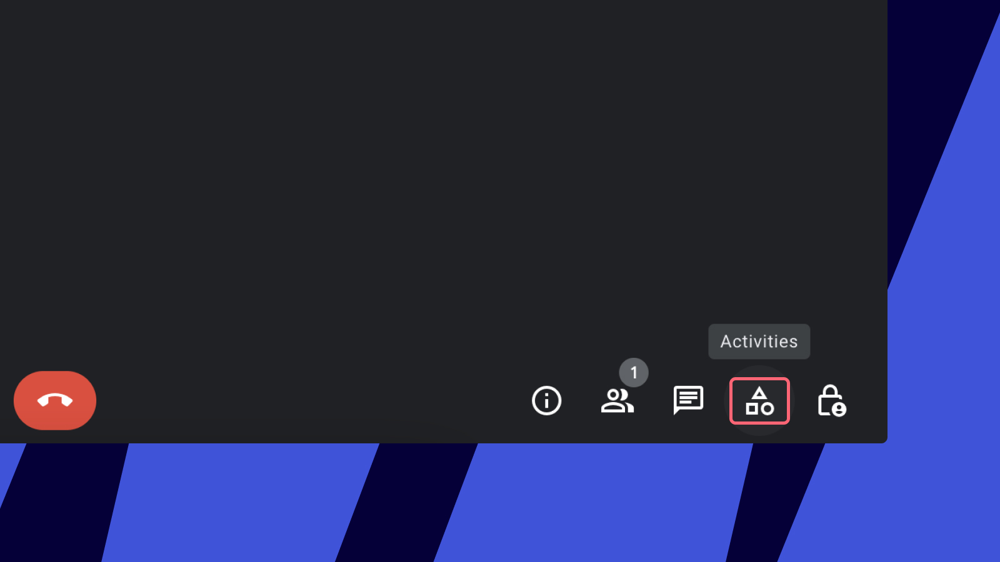

Make your meetings even more engaging and interactive with Miro in Google Meet. View and open any of your Miro boards or even start a new one, and collaborate with anyone - even without a Miro profile. Save your work for later and access it at any time.

Google Meet integrations are now a part of the Google Workspace add-on; this means that users who already have the Miro add-on installed will continue to have access to Google Meet. Users who do not have the Miro add-on installed will need it in order to access the Google Meet add-on.

Read more about [how to install the Miro for Google Workspace add-on](07-miro-for-google-workspace.md).

## Important things to note

- You do not need to be a meeting owner to open a Miro board inside Google Meet - any meeting participant can open Miro boards
- Users without a Miro profile or those who are not signed in will still be able to see and participate on the Miro board as [guests](../../using-miro/sharing-boards/07-collaboration-with-guests.md) without creating a profile, as long as the appropriate permissions have been set on the board
- If you create a Miro board without a profile, you will first be asked to provide your email to Miro and then you will be emailed information to save your work and create a Miro profile within 24 hours
- Admins have the option to restrict certain teams or individual users in an organization from using Miro with Meet, [learn more](https://support.google.com/a/answer/6089179?hl=en)

:::warning
Miro in Google Meet is not supported in Chrome Incognito mode or Companion mode, and is only supported on Chrome and Edge browsers.
:::

## How to set up Miro for Google Meet

1. Start a Google Meet meeting.
2. To open Miro, click on the **Activities** tab.

   
   *Activities in Google Meet*
3. Select Miro on the list of apps.

   *Miro add-on in Google Meet*
4. Here, you will have the option to sign in to your Miro profile or start a board without a profile.
   If you create a Miro board without a profile, you will be emailed information to save your work and create a Miro profile within 24 hours.

   To register a new Miro profile, choose to sign in and then click **Sign up** in the top right corner of the login window.

   
   *Sign-in option for new Miro users*
5. Once you are signed in, you will see all of your boards. Select the board you want to use in the meeting. You can only select boards that you're allowed to edit. 
   *The board picker in Miro for Google Meet*
6. Select the right level of board access for everyone in the meeting and click **Embed board**. You can choose between four options: allow view/comment/edit access, or leave the board private and available for signed-in Miro users who have access to the board on the Miro side.
   > ⚠️ **Anyone can comment** option is not supported if you embed a board located in a [free team](../../plans-billing/miro-plans/09-free-plan.md).

   > ✏️ If you select Private in this flow but the board is [set to public availability on the Miro side](../../using-miro/sharing-boards/03-sharing-boards-and-inviting-collaborators.md#sharing-boards-via-a-public-link), it will default to public availability in Google Meet as well. However, the access level that you set for the embedded board on the Google Meet side does not affect the board sharing settings set on the Miro side. [Learn more](../integrate-miro-with-other-apps/01-user-permissions-for-boards-embedded-in-third-party-apps.md).

   > ✏️ For [Enterprise plan](../../enterprise-administration/user-management/05-manage-user-invitations-on-enterprise-plan.md) Miro users, your access settings will follow organization-wide access controls which might imply that some sharing options may be restricted. Learn more: [Managing Enterprise sharing policy for embed integrations](../../enterprise-administration/managing-apps-on-enterprise-plan/05-how-to-allow-or-restrict-embedding-miro-boards-in-supported-apps.md).

   *Board access settings inside Google Meet*
7. Click **Start activity** to share the Miro board with everyone in the meeting. The meeting will open in center stage. You’ll see a confirmation message with all the users you invited to work on the board.

   *Starting an activity on a Miro board in Google Meet*Meeting attendees will receive a pop-up notification requesting them to join the board to collaborate.

   

Here's how Miro for Google Meet looks for presenters and attendees:

*Presenter view in Miro for Google Meet*

*Attendee view in Miro for Google Meet*

## Ending the activity in Google Meet

If you are finished working in the Miro board, you can end the activity and stay on the Google Meet call.

1. Click **End activity**
2. A new pop-up will open asking you to confirm. Click **Continue** to end the activity and return to your call. This will end the Miro collaboration, but you can always start a new collaboration or select a different board by clicking the **Activities** icon in the bottom-right corner of Meet.

   *Ending collaboration on a Miro board in Google Meet*

Learn more about [Miro for Google Meet](https://support.google.com/meet/answer/12312774).
