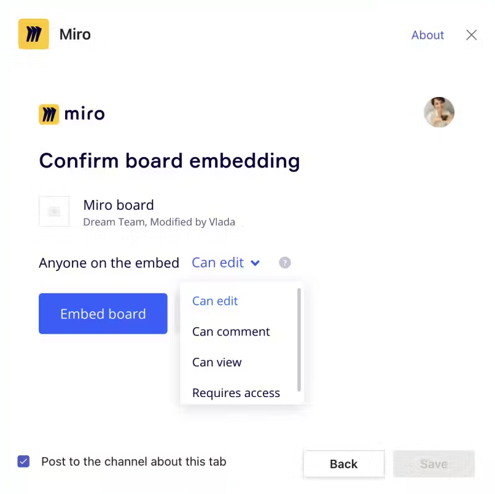

Embed a new or existing Miro board in a Microsoft Teams (MS Teams) meeting. Start collaborating instantly without leaving the call.

## How to add a Miro board to a Microsoft Teams meeting

#### Prerequisites

Ensure that you complete the following prerequisites:

- You have Miro for Microsoft Teams enabled. To learn how, see [Miro for Microsoft Teams overview](06-miro-for-microsoft-teams-overview.md).
- You are a member of the Miro team that owns the board you want to embed.
- You are Board owner or Board editor for the board you want to embed.

#### Procedure

Follow these steps:

1. In Microsoft Teams, select a team.
2. Select the plus icon (**+**)
   The **Add a tab** modal opens.
3. Select **Miro**.
4. Select **Get Started**.
   You are prompted to log in to Miro if you are not already logged in.
5. Select a Miro board or create a new board to embed.
   > ✏️ You must have the Board owner or Board editor role, and be a member of the Miro team that owns the board that you want to embed.
6. Select permissions for anyone on the embed.
   
7. Select **Save**.
   The board embeds on a tab is MS Teams.

   You have successfully added a Miro board to a Microsoft Teams meeting.
