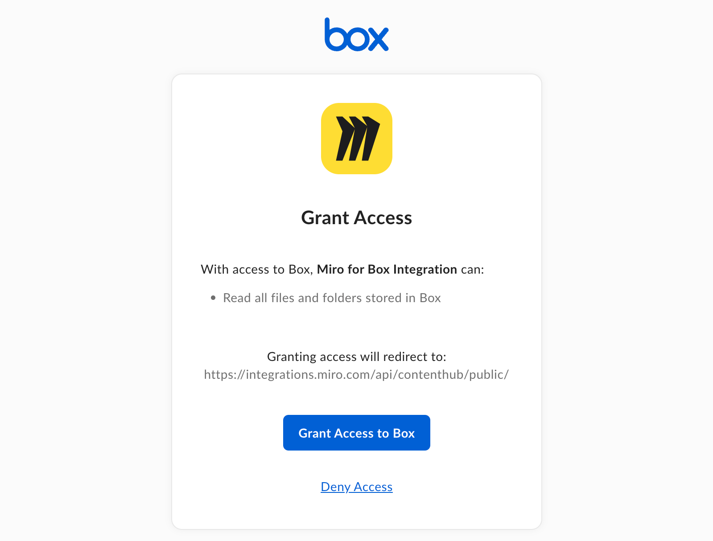

The Box integration allows you to add files from your Box account directly to Miro boards. You and your team can collaborate on documents without switching tools—add comments, annotate, and view updates in real time.

With the updated integration, Box files are embedded using Box’s native interface. This means:

- You can interact with documents right on the board.
- Comments and annotations sync automatically.
- There's no need to download, edit, and re-upload files.

## Install and authorize Box

:::warning
Only Miro team admins can install the Box app.
:::

To start using the Box integration:

1. **Copy the URL** of the Box file you want to add.
2. **Paste the URL** onto your Miro board.
   A dialog will prompt you to install the Box app for your Miro team.
3. **Select the team** you want to install the app to.
4. Click **Install & authorize** to add the integration at the team level.
   

## Connect your Box account

After installing and authorizing the Box integration:

1. Click **Connect** to link your Box account to Miro.
   You will be redirected to a page where you need to grant Miro access to your Box account.
   
2. Fill in your **Box account credentials** and click **Authorize**.
3. Click **Grant access to Box** for Miro to access your Box files.

Once connected, your file will be embedded on the board with full Box functionality. You can **comment**, **annotate**, and **review** documents directly inside the embed. Any changes are reflected in real time, allowing your team to collaborate without leaving the board.

:::tip
You can open the file in **Focus mode** to view and interact with the document in a larger, distraction-free view.
:::

.png)
:::tip
While the app is in **Beta**, files trigger a Box security check before they appear on the board.
:::

## Disconnect the integration

You can disconnect the Miro integration at any time from your Box account settings.
