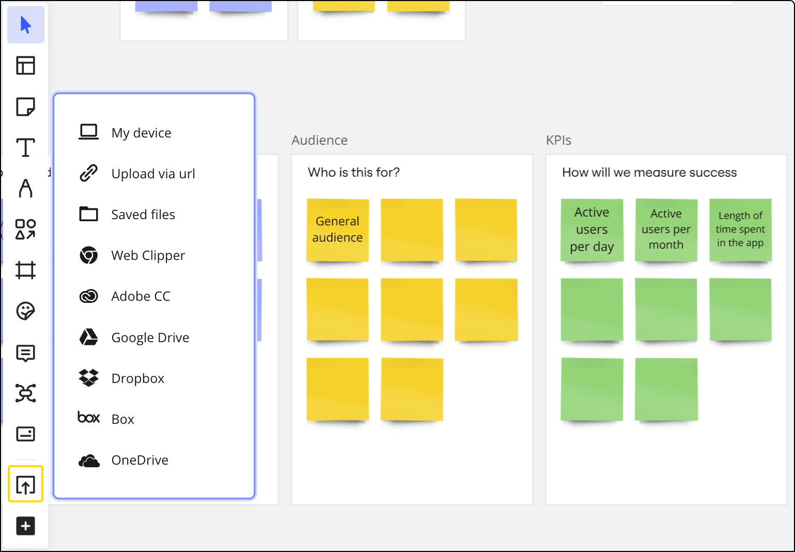

[Integration with **Dropbox**](https://miro.com/works-with-dropbox/) allows you to import files from your Dropbox account and add them to the boards for further discussion and collaboration. Start a conversation on the board, add [comments](../../using-miro/facilitation-tools/asynchronous-tools/01-comments.md) to your files, images, and documents, mention people and iterate faster.

To start using the plugin in a team, you'll need to install it for the team and to connect your Dropbox account to Miro.

### Installing the plugin

You can install the app from [Marketplace](https://miro.com/marketplace/dropbox/). Find Dropbox and click **Get app.** You will need to choose a Miro team for which you'd like to install the plugin.

:::warning
Non-admin users can't install the app if it's not allowed in the **Apps & Integrations** settings.
:::

*Choosing a team when installing the Dropbox plugin*

You can also install the app from within a board.

Follow these steps:

1. In the Creation bar, select **Tools, Media and Integrations** (**+**).The **Tools, Media and Integrations** panel opens.
2. In the **Tools** tab, search and select Uploads.
   The **Uploads** panel opens.
3. Select **Dropbox** from the panel.

*The Dropbox icon on the toolbar*

Click **Get app** on the next modal. The app will be installed for the corresponding team.

The next step is to authorize with your Dropbox credentials in Miro.  You can do that by clicking Dropbox on the **Upload** menu. If this is the first time you use Dropbox with Miro you will see a pop-up menu asking you to authorize your Dropbox account.

*Dropbox authentication window*

You can also connect your Dropbox account with Miro on your profile [Integrations page](https://miro.com/app/account/profile/integrations/): scroll down to Dropbox and click **Connect**.

*Connecting Dropbox with Miro*

### Adding files

To add files to the board, click the **Upload** icon on the toolbar, choose **Dropbox**, select the files in your Dropbox and click **Choose**.

*The Dropbox folder pop-up menu*

### Disabling the plugin

To uninstall the plugin for a team, go to the **Team settings**, find Dropbox in the **Apps & Integrations** section, and click **Unistall for team**.

*Uninstalling Dropbox in Team settings*

To disconnect your Dropbox account, go to the profile [Integrations page](https://miro.com/app/account/profile/integrations/) and click **Log out**.

*Disconnecting Dropbox from Miro*
