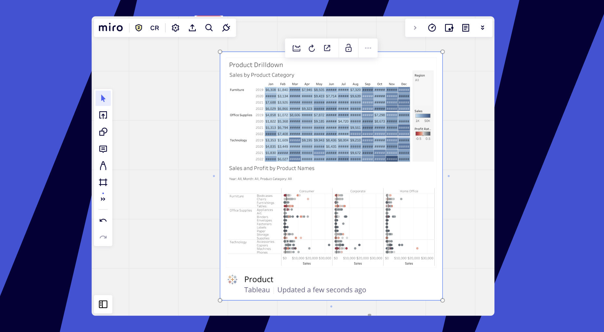
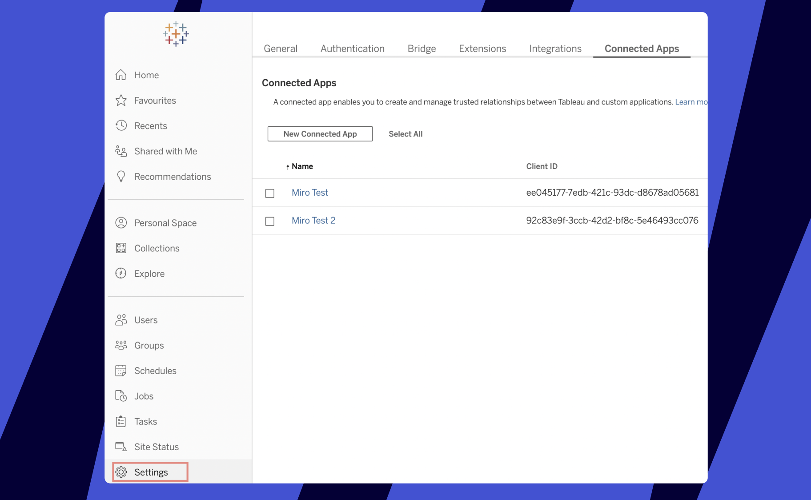
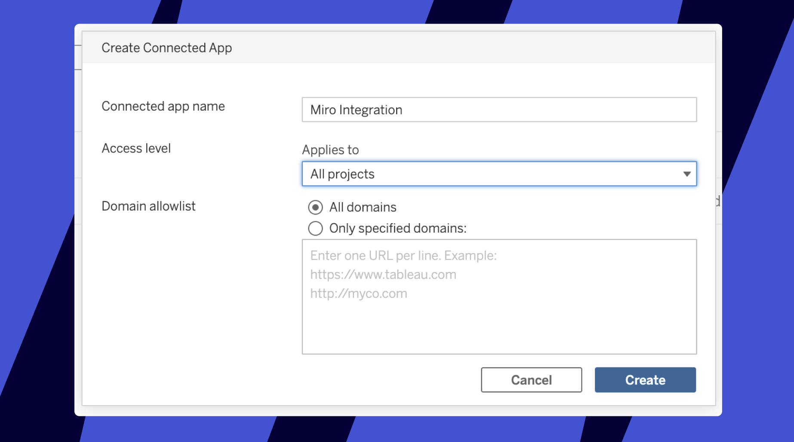
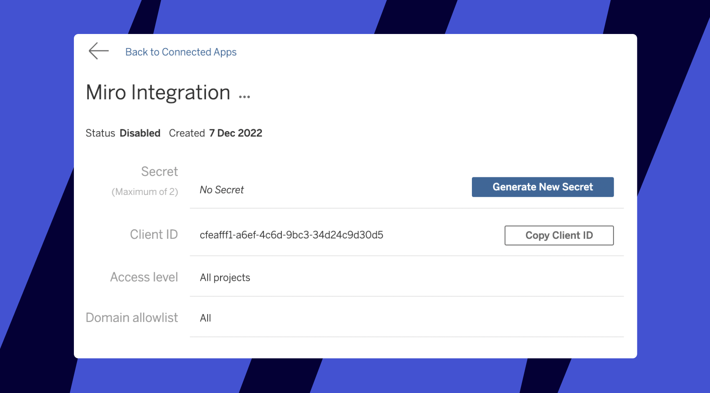

Integrate Miro and Tableau so you and your users can add Tableau charts and dashboards to Miro boards as beautiful embeds.

*Example of a Tableau dashboard embed*

## How to add the Miro app in Tableau

1. In Tableau go to **Settings** > **Connected Apps** > click the **New Connected App** button:
   
*The option to create a new app in Tableau*
2. You will see a pop-up to define the name and the security levels (project access and domains' allowlist) of the new app. You may set the app however you like.
   
   *The new app pop-up*
3. Click to **Generate new secret** for this app:
   
   *The newly created app*
4. As a result, you will have the following values:
   - Secret ID,
   - Secret Value
   - Client ID

   Please provide the values to Miro. For security, we recommend using `https://onetimesecret.com/`
   When we have the values we will complete the integration on the backend and let you know when you can start using it.

> ✍️ The option to complete the integration autonomously without requiring our help is soon to be released.

## How to add embeds on the board

Simply paste any Tableau link onto the Miro board. The URL will automatically be converted into an embedded dashboard.
