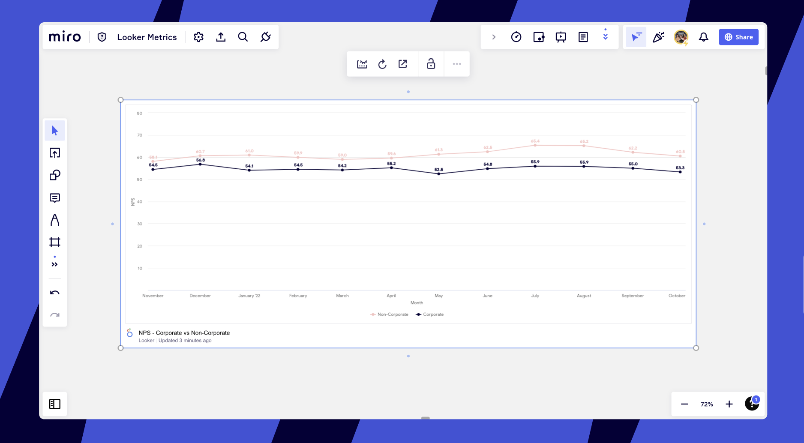
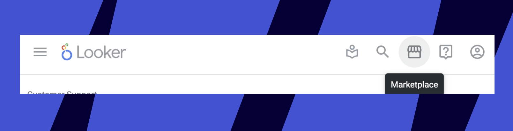
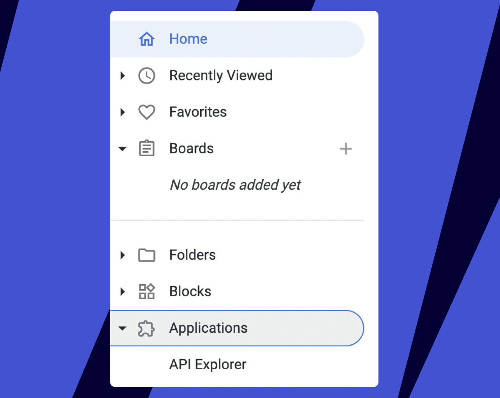
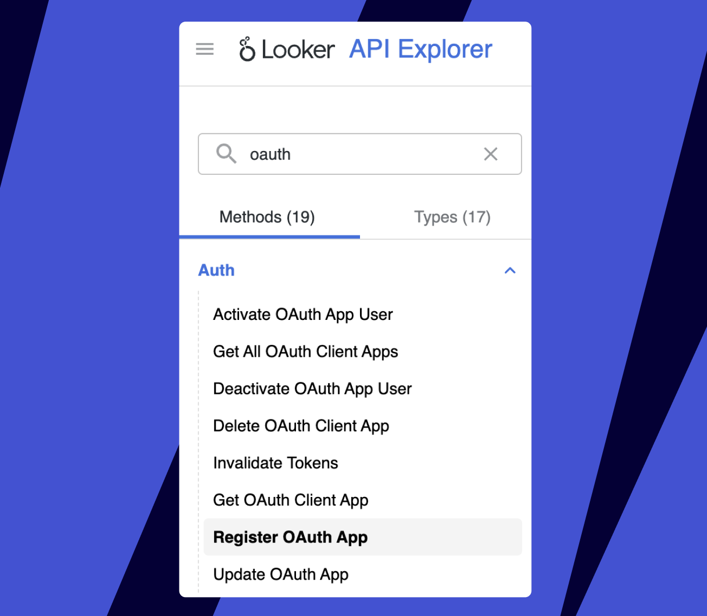
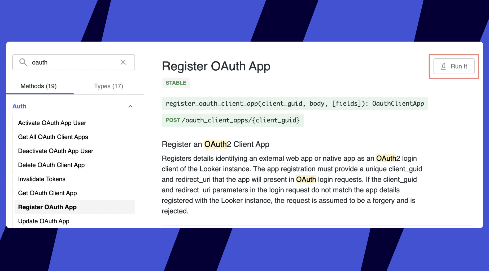
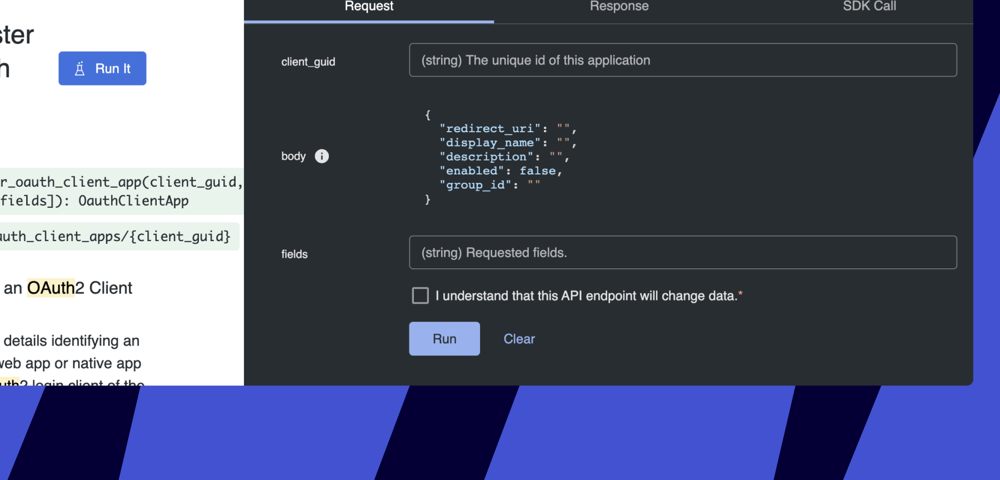

Integrate Miro and Looker so you and your users can add Looker charts and dashboards to Miro boards.


*Example of a Looker chart embed*

:::warning
Embedding separate tiles is not supported by Tableau API.
:::

## How to enable the integration

1. Go to the **[Looker Marketplace](https://marketplace.looker.com/),** search for the **API Explorer** extension and click to **Install**.

   *The Marketplace icon on the Looker website*
2. Return to the **Home** page > **Applications** > **API extension**:

   
   *The opened Application section showing installed extensions*
3. In the **Search** box on the left, type in **oauth** and in the results click **Register OAuth App**:

   
   *The search results in the OAuth category*Click **Run It** on the top-right of the page:

   *The registration description page*
4. You will see a menu for request input data:

   *The input menu*Enter the following values:

**client_guid**: 15609152-a12a-4fa1-b364-337e7896d25d
**body**:

```
{
"redirect_uri": "https://miro.com/api/contenthub/public/oauth/callback",
"display_name": "Miro",
"description": "Miro Looker Integration",
"enabled": true,
"group_id": ""
}
```

**fields**: leave empty

Tick the required checkbox **I understand that this API endpoint will change data.**

Click the **Run** button. A successful response should return the body back and 200 (OK).

> ✍️ If response has "enabled" false, you can run the "Update Oauth App" API with above values, and the same API to enable/disable Miro client.

## How to add embeds on the board

Simply paste any Looker link onto the Miro board. The URL will automatically be converted into an embedded dashboard.

### Supported link types

|  |  |
| --- | --- |
| Look | - https://\{tenant\}.looker.com/looks/\{look-id\} |
| Explore | - https://\{tenant\}.looker.com/explores/standard/\{explore-name\}/?qid=\{query-slug-id\} - https://\{tenant\}.looker.com/x/\{query-slug-id\} |
| Dashboard | - https://\{tenant\}.looker.com/dashboards/\{dashboard-id\}?\{filter-name-1\}=\{filter-value-1\}&\{filter-name-2\}=\{filter-value-2\} - https://\{tenant\}.looker.com/dashboards-legacy/\{dashboard-id\}?\{filter-name-1\}=\{filter-value-1\}&\{filter-name-2\}=\{filter-value-2\}   *dashboards-next is unsupported* |
| Dashboard Element Link (Miro proxy link) | - https://www.miro.com/api/contenthub/public/looker/ \{tenant\}/dashboard_elements/\{dashboard_element_id\}?width=\{width\}&height=\{height\}&dashboard=\{dashboard_id\}&filters=\{filters-query-param-from-dashboard\} |
