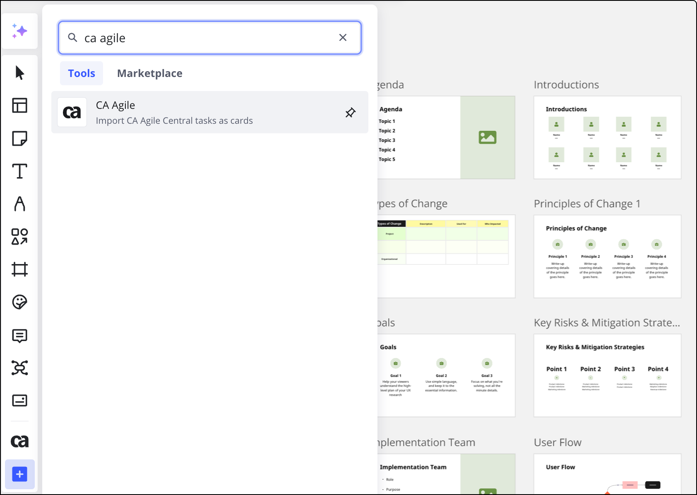

Take advantage of CA leading agile software and methodology right on the board. Convert your CA Agile Central tasks into handy cards and enjoy backlog prioritization, story mapping, and other team activities that help your team consistently and develop high-quality projects quickly.

## Connecting CA Agile

CA Agile authorization is carried out via OAuth 2.0 protocol (Authorization Code grant), and all requests go through SSL. There are two levels of connecting your Miro data and your CA Agile Central account: user profile level and team level.

It's important to note that the connection to CA Agile is one-way only: CA Agile --> Miro. You can import the cards to a Miro board and edit them via the Source button, described below in the [Editing cards section](#editing-cards). You cannot directly edit CA Agile cards in Miro.

### Team level

> **Set up by:** Team Admins

:::warning
Please note that for each team in Miro you will need to use different Rally user accounts to connect the same Rally instance.
:::

To establish the connection at the team level the Team Admin will need to find the app **CA Agile** in the [Miro Marketplace](https://miro.com/marketplace/) and install it for the team: click **Get app** and then select a team and click **Install & authorize**.

*Installing Rally for a team*

You can also install the app from within a board:

1. In the Creation bar, select **Tools, Media and Integrations** (**+**).The **Tools, Media and Integrations** panel opens.
2. In the **Tools** tab, search and select CA Agile.
   The **CA Agile** panel opens.

*Install the app from within a board*

Then open the **Team Settings > Apps & Integrations** and **Connect**the integration from there. If you are not authorized in Rally, you will be prompted to log in to your Rally account.

*Connecting the integration on the team level*

During this setup, a webhook is created on the Rally end, which then sends updates to Miro for imported cards.

When the integration is set up at the team level, any team member is able to see Rally cards imported by other participants on the boards and the cards' current state.

Please note that the Rally account used when setting up integration at the team level must have access to all Rally projects from which the cards will be imported. If any Rally project will not be accessible for this Rally account, then the cards imported from such project will not be updated on the board and will be displayed as frozen for all users of the team.

### Profile level

> **Set up by:** each user

:::warning
Before connecting the integration be sure to sign into Rally in a separate browser tab.
:::

If a user requires the option to import Rally cards on the board themselves, then they also need to configure the integration at the profile level. To connect your Miro profile, open the [Profile settings](https://miro.com/app/account/profile/), switch to **Integrations**, find **CA Agile Central (Rally)** and click **Connect**:

*Connecting the integration at the profile level*

When the profile-level connection is established the user is able to use the Rally icon on their toolbar and open the Rally library picker. There the user can see all the Rally elements (user stories, tasks, defects) available for the Rally account used to set up the integration on the profile level. In other words, using the Rally picker, the user will be able to import only those items that are available to them in Rally.

## Adding CA Agile cards to the board

To add a card on the board you simply copy the task's URL-address and paste it on the board (standard [shortcut combinations](https://help.realtimeboard.com/support/solutions/articles/1000206698-shortcuts-hotkeys) work as well).

To filter tasks or add cards in bulk choose**CA Agile**in the creation toolbar.

You will see CA Agile Central picker where you can set the search filters such as Project, Type, Iteration, Release, etc. Choose one or several and click **Export**:

*CA Agile Central picker*

The tasks will automatically be added to the board. If the task name is a long one, drag the bottom side of the card to see it in full.

*
Rally cards on the board*

> Note that Miro's Rally integration does not offer the ability to create or directly edit Rally cards in Miro.

## Editing cards

To edit the card content, please click the source link on the card:

*The edit icon on the card*

The source task will be opened in a new tab where it can be edited. All changes are applied to the card instantly.

## Disabling the integration

To remove the connection to your Rally iterations you will want to **Disable**the integration and **Uninstall** it in the **Team settings > Apps & Integrations**.

*The option to disable the integration*

## Possible issues and how to resolve them

1. *The Miro-Rally picker does not show some of my Projects*
   - Our Rally integration uses [Rally SDK picker](https://rally1.rallydev.com/docs/saas/apps/2.1/doc/index.html#!/api/Rally.ui.picker.project.ProjectPicker) to populate the data and it only works with Open state projects and unfortunately is not customizable. To display a Project on Miro end please change its state to Open.
2. *The updates for the cards or some cards' fields are not going through to Miro*- If you are using the Rally Cards integration with several Miro teams please check that all the teams are connected to your Rally instance using a *different* Rally user account. It is possible that the updates issue in the chosen team happens because the connecting credentials are already used in another Miro team. Reconnect the integration using a different set of Rally user credentials if required.
3. *Endless loading when trying to open the Rally picker in Miro.*- Follow the troubleshooting steps below.

   1. Open the Subscription menu (`https://rally1.rallydev.com/#/subscription`).

   2. Click the **Actions** menu dropdown and choose **Edit**.

   3. Scroll down to the **CORS Allowed Origins** field.

   4. Enter `https://miro.com,https://*.miro.com` (`http://miro.com`) in the field.

   5. Click **Save & Close**.
