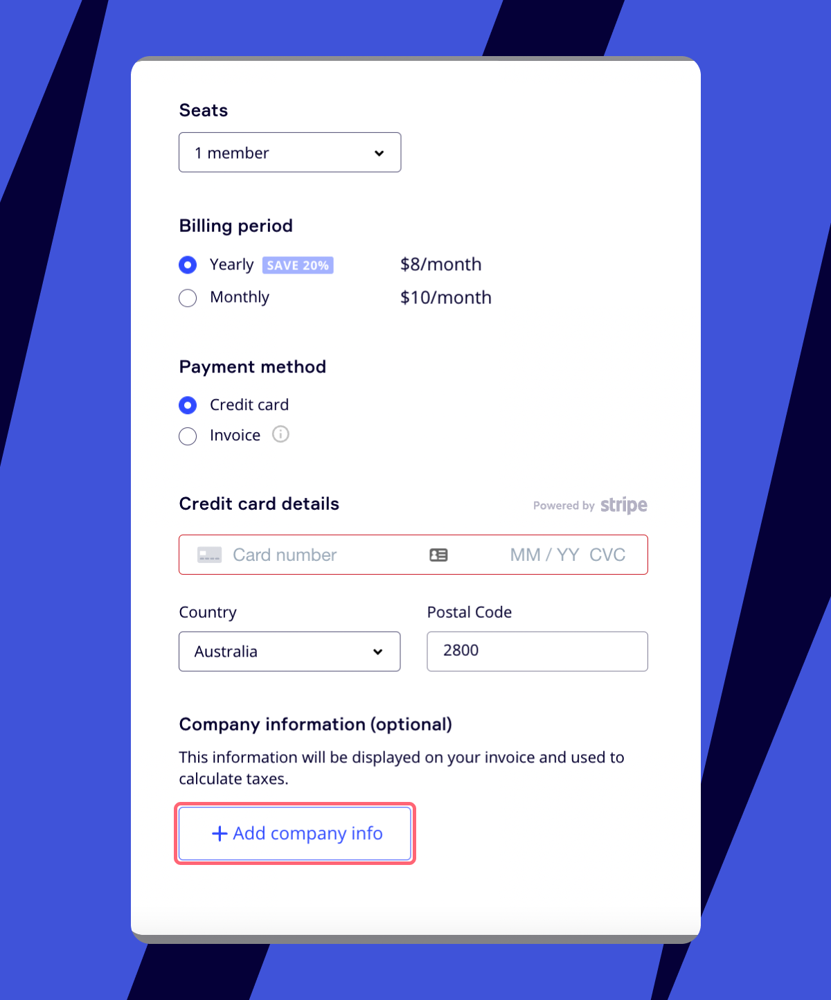

## Sales Tax, Value Added Tax and Goods & Services Tax

Miro assesses applicable taxes on subscription fees as required by local law. Depending on your location, you may be charged taxes when purchasing a paid Miro plan. When Miro collects these taxes, the entire amount is remitted to the relevant taxing authorities on your behalf.

- Sales Tax, Goods & Services Tax (GST), or Value Added Tax (VAT) are not included in prices shown on our pricing page
- The *company address* provided in the billing information section of your profile is used to determine the correct tax rate, if applicable
- Only the Team Admins on Starter Plan, Company Admins on Business Plan, and [Billing Admins](../../administration/admin-faq/01-admin-faq.md) can update information such as the billing country and tax identification number associated with your subscription

## Value Added Tax (VAT)

If your organization is located within the European Union, Norway, Turkey, or the United Kingdom, Value-added tax (or VAT) will be added to your purchases (e.g. subscriptions, additional seats, and renewals), and you’ll see the tax as a separate line item on your invoices.

### VAT Exemption

If you are a registered business, you may be exempt from VAT (i.e. reverse charge may apply) on your future purchases if a valid VAT ID is entered via the [Billing settings](../manage-your-subscription-and-plan/01-manage-your-subscription.md) page.

If your billing address is in the EU, please note that the VAT ID you provide must be registered on the [VIES database](https://ec.europa.eu/taxation_customs/vies/) to be considered valid. You may need to apply to your relevant tax authority for your VAT ID to be included on the VIES database in certain EU countries where this process is not automatic.

### How to enter your VAT ID at point of purchase

After selecting your team size, billing cycle, payment method:

1. Enter your country in the billing information section (a VAT ID field will appear).
2. Enter your VAT ID.

### How to update your VAT ID

1. Click your profile avatar, and then click **Admin console**.
2. On the left sidebar, click **Billing,** and then click the **Billing information** tab.
3. Fill out the company address and enter the VAT ID (please ensure the 2 letter country code associated with your VAT ID is included).

### Miro’s VAT ID

Miro is registered for VAT through the One Stop Shop (‘OSS’) scheme in the EU and does not have a VAT registration in each individual EU Member State. The OSS scheme is available for taxable persons that are not established in the EU to collect and remit VAT on electronically supplied services to non-business customers in EU Member States. Miro has selected the Netherlands as its country of identification for the OSS.

## Goods & Services Tax (GST)

If your organization is located within Australia or New Zealand, Goods & Services Tax or GST will be added to your purchases (subscriptions, additional seats & renewals) and you’ll see the tax as a separate line item on your invoices.

### GST Exemption

If you are a registered business and your company address is in Australia or New Zealand, you may be exempt from paying GST on Miro purchases via the ‘Reverse Charge’ mechanism.

### How to enter your tax id

If a valid Australian Business Number (ABN) or New Zealand GST number is entered at the checkout, or via the Billing settings page, GST will not be charged for current or future purchases.

If no company information or Tax id is provided, GST will be charged on all purchases.

#### **At the checkout**

After selecting your team size, billing cycle, and payment method details you will now have the chance to add your company details (optionally):

1. Click on the **+ Add company info** button and complete the fields shown. You will need to have ‘Australia’ or ‘New Zealand’ selected as the country.
   
   *Company information fields in billing settings*
2. Fill in the **Company Name** and **Address** details and add your ABN or GST ID (NZ) to the **Tax ID** field.
   - If you are in Australia you will need to click the checkbox if you are registered for GST to be eligible for the reverse charge mechanism.
   - New Zealand customers will not see this checkbox.
     *Company information with GST registration box*
3. Miro will now do a check with our tax provider automatically to make sure the tax ID provided is valid. If valid, the tax amount shown in the payment summary will be reduced to zero.
   - Invalid IDs or when a checkbox is not provided will result in GST being charged.
     *Order summary with tax excluded*

### How to update your Tax ID

1. Open [team settings](../../administration/get-started-as-a-miro-admin/01-i-am-a-new-miro-admin.-where-to-start.md). You will need to be a Billing Admin.
2. Go to the **Billing** tab **> Billing information**.
3. Fill out the Company Address and Tax ID fields.
4. Select the box to declare that your company is registered for GST (Australia only)
5. Miro will perform a check with our tax provider automatically to make sure the tax ID provided is valid. If valid, future purchases will not have tax applied.
   - Invalid IDs or when a checkbox is not provided will result in GST being charged.
   - Miro will not adjust historical purchases if the tax IDs were not provided at the time of purchase.*Declaring company GST registration*

### Miro’s GST ID

Miro is registered for GST through the simplified registration process as a non-resident business that is electronically supplying services. As such, Miro has an ATO Reference Number (ARN) and will only collect GST on supplies to non-business customers.
