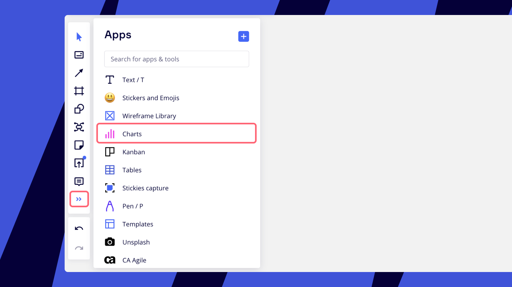

Create dashboards for operational meetings, prove ideas with data and visualize key figures using editable charts in Miro.

### How to use charts

Click **charts** on the toolbar, select a chart type, and click it or drag it to the board.

*Charts on the toolbar*

Select the object to open the context menu, click the three dots, and click **Edit**or double-click the object to enter the editingmode.

*Entering the editing mode*

Choose the name and customize the legend to make your chart more informative. Enable and disable **Title** and **Legend**toggles. You can also clear all notes in one click.

*Editing a chart*

To delete a row, select all cells of a row, click the **Trash**icon, and choose **Delete row.**

*Row deletion*

### Frequently asked questions

1. *Can I add negative values to charts?*- No, you can only add positive numbers.
2. *Can I change the color of the chart elements?*- No, the colors are chosen automatically.
3. *How do I export my chart?*- Please check board export options [here](../import-and-export/export/03-how-to-export-your-board.md).
