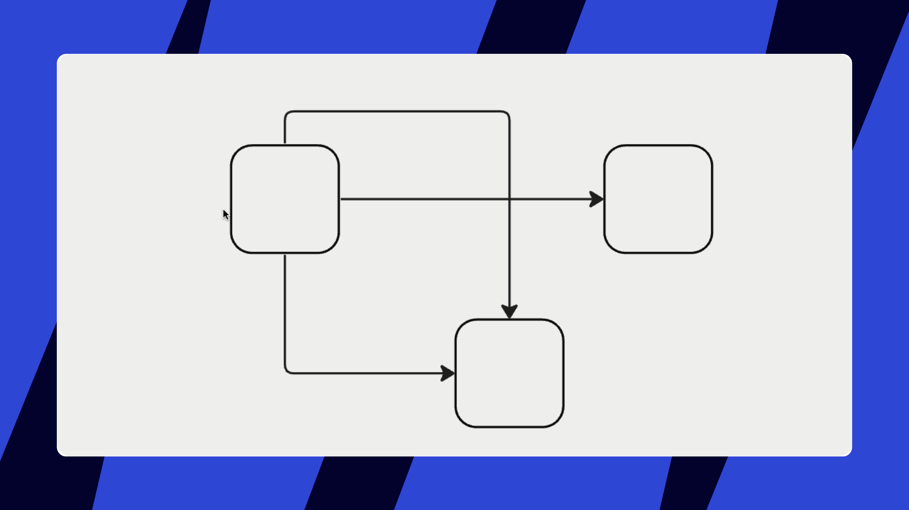

**Connection lines** allow you to link objects on the board. This is helpful for building diagrams and flowcharts.

:::tip
To learn more about connection lines in mind map check out [this article](../advanced-tools/03-mind-map.md).
:::

### Creating and editing connection lines

To create a line, select **connection line** on the toolbar or use the [hotkey](../working-on-the-board/06-shortcuts-and-hotkeys.md) **L**. You can also select an object and click one of the blue dots around it to draw a line.

*Creating connection lines*

Change arrowheads, the line type (straight, orthogonal, curved), thickness, color, etc. on the context menu.

*Modifying connection lines*

To draw a straight horizontal, vertical, or diagonal line, start drawing a line and hold **Shift**.

To disable snapping to other objects hold **Ctrl** *(for Windows)* or **Cmd** *(for Mac*).

*Drawing a straight line and a standalone line*

If you want to create a specific path for the line, you can do so by working with the blue and white bullet points on the line. To remove extra bends and turns and reset a line, simply double-click the *white* bullet points (use double tap on tablet).

*Changing a connection line*

To disconnect a line and attach it to another object, drag the line end.

*Attaching a connection line to another object*

To delete a connection line, select it, click three dots on the context menu, and click **Delete** (or simply hold **B****ackspace/Delete**).

### Inserting shapes

You can add shapes, cards, and other objects on connection lines. Select a connection line and choose **Insert shape** on the context menu. Make sure that there is enough space between two connected objects.

*Inserting an object between two shapes*

### Adding text labels

Each diagram item is meaningful, and the lines are not an exception. To establish clearer relations between objects on your boards, use text labels.

Double-click any connection line or click**+T** in the context menu to start entering the text. Move the text along the line by dragging it. You can add multiple text labels to a line.

*Adding a text label to the line*

You can change the *text size, color* on the context menu and fix it horizontally or let the text follow the line curves. To delete the text, select it and press **Delete** on the keyboard.

*Text controls*

:::tip
Create a timeline by adding multiple text labels and changing their positions on the line by dragging.
:::

### Creating connection lines between objects

You can connect [shapes](11-shapes.md), [cards](02-cards.md), [sticky notes](14-sticky-notes.md), [text blocks](16-text.md), and other objects (but not [frames](07-frames.md)) with connection lines. Select an object and drag the blue dot.

*Connecting two icons with a line*

If you select a shape, a sticky note, or a card and hover over a blue dot near the object, it will show you where a new shape or a connection line will be created:

- If there is another object near the selected one, you will be suggested to create *a connection line*
- If there are no objects near the selected one, you will be suggested to create *the same object linked to the chosen one*

Click the dot to automatically create a line or an object. *Drag the dot* to connect the object to another one *manually*.

*One-click creation and connection in Miro*

If you drag a line and attach it to a non-center blue dot, the line will cross the objects if you move them.

*Two shapes are linked via a side blue dot*

If you link the line to the center blue dot, the line will not cross the objects when you move them.

*Two shapes are connected via a center blue dot*

### Line jumps

Line jumps help clarify which object each line refers to when lines intersect. When turned on, they appear automatically on intersecting lines.

Line jumps work with straight and orthogonal lines only.

#### How to toggle line jumps on or off

1. Click the connection line
2. The context menu will open
3. Click the **Type** icon
4. Select **Line jumps** to toggle the feature on or off

*Turning off Line jumps*

### Frequently asked questions

1. *How to create a connection line with arrowheads on both ends?*
   - Select the line, choose **None** on the context menu, and add the arrowhead.
   
*The line start*
2. *How to prevent connection lines from linking to objects?*
   - To disable snapping while moving a connection line, hold down **Ctrl** *(for Windows)* or **Cmd** *(for Mac).*
3. *Can I change the font and alignment of the text label on a line?*- No, this is not possible at the moment.
4. *Can I change the size of arrowheads?
   -*The size of the arrowheads is changed when you change the thickness of your connection line.
5. *How do I change the line thickness?*
   - Select a line, choose **Type** on the context menu, and adjust thickness.
   .jpg)
   *Changing thickness of a connection line*
6. *Can I apply one style to all connection lines on my board?*- Yes, use the following workaround: select a line, click three dots on the context menu, and copy a style of the line. Then select all objects on the board (you can use a shortcut **Ctrl + A** (*for Windows*) or **Cmd + A** (*for Mac*), [filter](../working-on-the-board/21-work-smarter-not-harder.md) connection lines, and choose **Paste style** under the three dots of the context menu.
7. *What happens if you [lock](../working-on-the-board/17-locking-content-on-the-board.md) a connection line?*- You cannot edit the line type, color, thickness, etc., but you can still move objects to which the line is attached.
8. *Can I hide connection lines?*- No, you can only delete connection lines.

:::tip
Watch the video to see how connection lines work on the board.

<iframe allowfullscreen="" frameborder="0" height="315" src="//fast.wistia.com/embed/iframe/tvxhkx5k0t" width="560"></iframe>
:::
