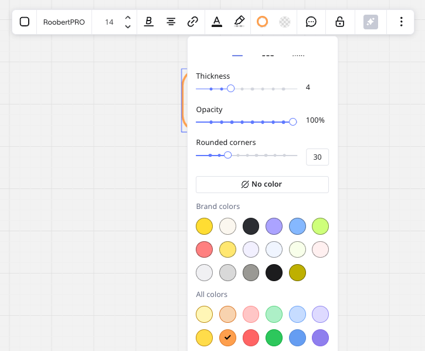
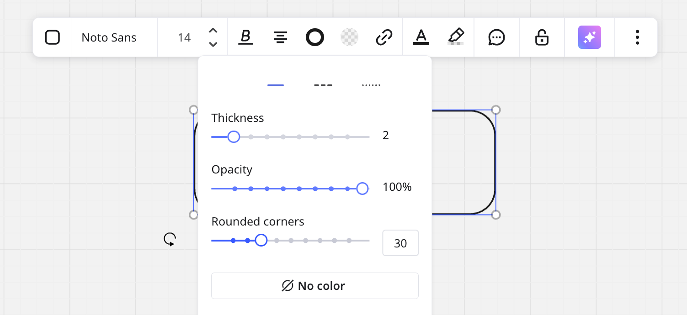

The shape tool allows you to create various shapes that can be used in flowcharting, diagramming, and for many other purposes.

## Adding shapes

There are several simple ways to add shapes to the board:

- Select **shape**on the toolbar or [press S on your keyboard](../working-on-the-board/06-shortcuts-and-hotkeys.md), choose the one you would like to add, and click your board
- Drag and drop a shape from the toolbar right to the board

*Adding a shape*

To see the full list of shapes click **All shapes**- this will open the **Diagramming** panel.

*Opening the full list of shapes*

You can add new shapes to the library by clicking **More shapes**. Basic shapes, Flowchart, Connectors are available for everyone.  [Other shape packs](../formats/diagramming/01-miro-for-mapping-diagramming.md#available-shape-packs) (BPMN, Data flow, AWS, etc.) are only available for Business, Enterprise, and Education plans.

*Adding new shape packs to the Diagramming panel*

## Styling shapes

You can customize the look of your shapes using various styling options to make them fit your needs and add a personal touch to your boards. Select a shape to change its style, color, and transparency. You can [select several shapes](../working-on-the-board/10-working-with-objects.md) at once and style them all. You can also style the borders by choosing the color, transparency, thickness, radius of rounded corners, and type.

*Styling shapes*

Here's how you can style your shapes and all the options available for customization:

### Border Style

**Thickness:** You can adjust the border thickness using a slider. Increase or decrease the thickness to make the border more prominent or subtle.

### Opacity

Adjust the opacity of the shape with a slider. This allows you to make the shape more transparent or completely opaque.

### Corner Style

**Rounded Corners:** You can adjust the corner radius of rectangle, rounded rectangle, or square shapes to create a softer look. Use the slider to control the roundness—set it to 0 for sharp, angular corners, or increase the value for progressively rounded edges, giving your shapes a smoother, more polished appearance.

### Color

**Border Color:** Choose a color for the border from the available color options, including your brand colors and a full color palette.

**Shape Fill Color:** Choose a color to fill the shape, matching your design preferences.

### Changing shape size or rotation

Use the white nodes to change the dimensions of a shape. Drag the arrow icon to rotate the shape.

*Changing the shape's size and rotating the shape*

To change a shape size without changing its ratio, hold down **Shift** just like you would in any other graphics software.

Use **Alt** (*for Windows*)/**Option** (*for Mac*) to change a shape's ratio while keeping its center attached to the same place.

### Converting shapes

You can also convert a shape into a [card](02-cards.md), [text box](16-text.md), [sticky note](14-sticky-notes.md), or any other shape.

*The option to convert a shape*

### Send shape back or bring to front

Send the shape back and bring to front - click the three dots on the context menu and choose an option. Or use shortcuts **Pg Up** and **Pg Dn** (*for Windows*)/**fn + ↑** and **fn + ↓** (*for Mac*).

*The options to send the shape back and bring to front*

:::note
Arrange shapes on your board. This feature helps you style boards and diagrams precisely, especially with a large amount of overlapping content. Learn more in [Work smarter, not harder](../working-on-the-board/21-work-smarter-not-harder.md).
:::

## Adding text to shapes

To add text to a shape, select it and start typing. Shapes have a limit of 6,000 symbols.

Feel free to use different text formatting options: you can change the text size, font, style, alignment, color and highlight the text. Note that bullet points are not supported in shapes, please use [text](16-text.md) instead.

*Text in a shape*

## Quick diagram creation

As soon as you select a shape, a [sticky note](14-sticky-notes.md), or a [card](02-cards.md) and hover over a blue dot near the object, it will show you where a new shape or a [connection line](05-connection-lines.md) will be created. Click the dot to create the line or the object. If you wish to connect the object to the one which is different from the suggested, drag the dot and draw a connection line.

*One-click creation and connection in Miro*

## Object dimensions

Use object dimensions to create the same size shapes across your board with precision. You can [enable object dimensions](../formats/diagramming/01-miro-for-mapping-diagramming.md#use-object-dimensions-for-precision) in your board settings.

*Aligning shapes using object d**imensions*

## Frequently asked questions

1. *Can I change the radius on the corners of a rectangle, rounded rectangle, or square?*
   - Yes, you can change the radius of rounded corners:

   a. Select a square, rectangular, or rounded rectangular shape on your board.

   b. In the context menu, click the **Border style, opacity, corners, and color** icon.

   c. Adjust the radius using the slider or enter a specific value in the number input field (range: 0–100+).
   
2. *How do I move a shape?*
   - Select the shape and simply drag it. Please make sure that the shape is not [locked](../working-on-the-board/17-locking-content-on-the-board.md#use-protected-lock) and that you activated the [select tool](../working-on-the-board/21-work-smarter-not-harder.md#switching-between-selectpan-modes).
3. *How do I create a perfect circle?*
   - Choose a circle on the toolbar and click the board. If you modified the circle shape before and the custom one is created when you click the board, reload the board and add a circle again.
4. *How do I align several shapes?*
   - Learn [here](../working-on-the-board/08-structuring-board-content.md#aligning) how you can align board objects.
