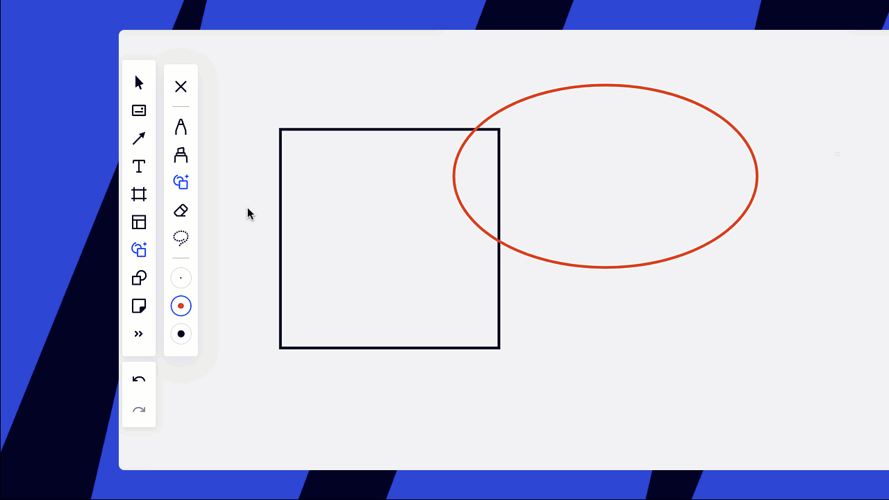

With smart drawing, you can enjoy one-tool work on the board that looks great from the very start. The smart drawing mode automatically converts your pencil drawings into accurate shapes, sticky notes, and lines.

*Smart drawing in Miro*

To start/stop using smart drawing choose the **pen**tool in the toolbar and switch to **smart drawing**. Start drawing without breaking the line, one stroke counts as one object. We recommend working at 100% zoom level.

*Smart drawing on the toolbar*

Check what objects are recognizable by double-clicking the smart drawing icon.

*Objects that can be recognized by smart drawing*

Use presets to create objects of different color and thickness. You can create up to 3 presets and edit them whenever you need. Double-click a preset to edit it.

*Smart drawing presets*

To erase smart objects scribble over them. Make sure you cover at least 50% of the object otherwise it will not be erased.

:::note
Please note that the default eraser works only with standard pen drawings, not with smart objects.
:::

*Erasing smart objects*

To leave the smart drawing mode and switch to free drawing, choose [pen or highlighter](10-pen.md).

*Switching to the standard pen*

You can also create [shapes](11-shapes.md) and [lines](05-connection-lines.md) using the corresponding tools.
