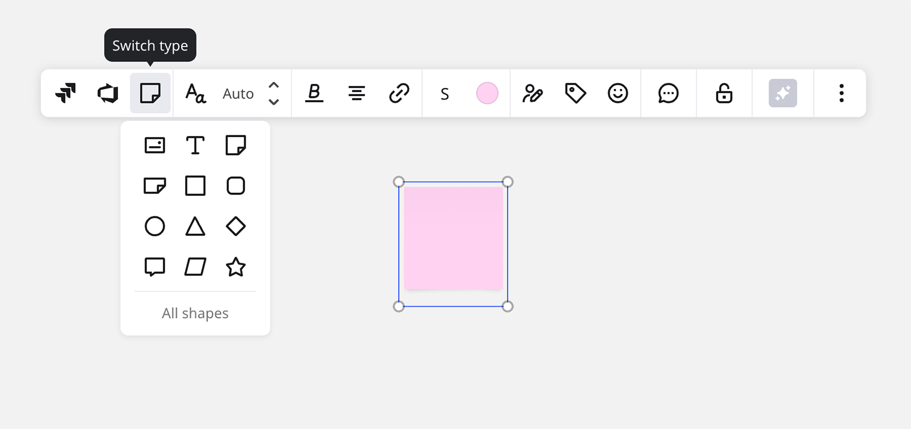
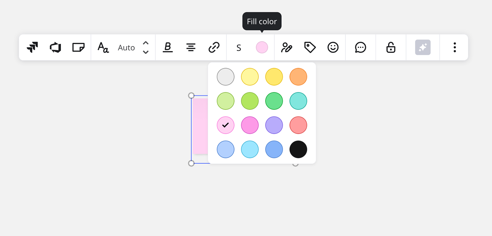
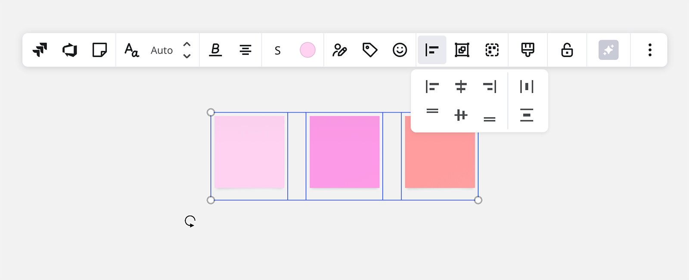
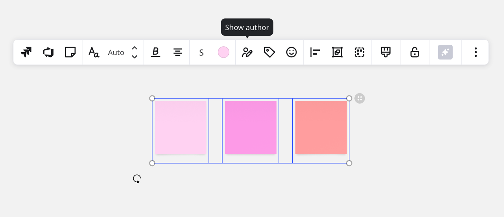
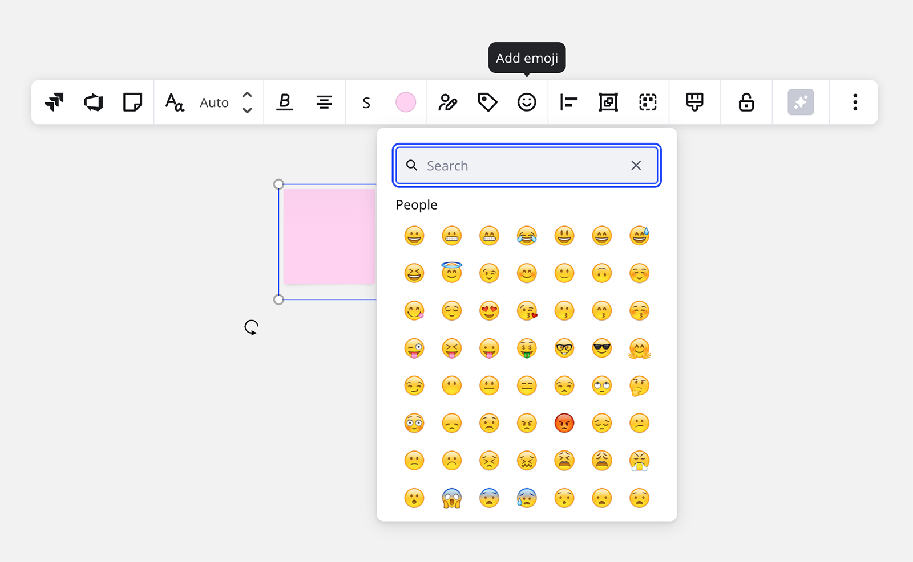

Sticky notes are great for quick brainstorming, taking notes, and arranging information visually. If you are familiar with Kanban boards or other techniques that involve putting stickies on a whiteboard, you will feel right at home.

### Getting started

Click the **sticky note** () icon on the toolbar or [press N on your keyboard](../working-on-the-board/06-shortcuts-and-hotkeys.md) to start using the tool. You can also add a sticky note by dragging and dropping it right from the toolbar or by clicking the board and dragging your cursor holding the left mouse button.

You can change the shape of a sticky note by clicking the icon on the sticky's context menu.

*Converting a square sticky note into a rectangular note*

There are 16 colors available for sticky notes thoroughly selected to ensure the best text readability and consistency in the design of your boards (no custom colors).

*Sticky note colors*

To add text to your sticky note, select it and start typing. The limit of symbols is about 3,000 per sticky note depending on the text size. You can enable **Auto** font size in the context menu.

To modify several sticky notes (change the size, color, add tags, etc.), select them following steps from [this guide](../working-on-the-board/10-working-with-objects.md).

:::tip
[Enable dimensions](../formats/diagramming/01-miro-for-mapping-diagramming.md#use-object-dimensions-for-precision) to create the same size sticky notes across your board with precision.
:::

To delete a sticky note, click the three dots on the context menu and choose **Delete** or simply [select the sticky](../working-on-the-board/21-work-smarter-not-harder.md#switching-between-selectpan-modes) and press **Backspace**.

:::tip
To align a bunch of sticky notes into a row or column, [select the stickies](../working-on-the-board/10-working-with-objects.md) and use the **Align** feature on the context menu.
:::

*Aligning sticky notes*

### Bulk mode

To add multiple stickies in a row:

1. Click the **Tools, Media and Integrations** () icon.
2. Search for and open **Bulk mode**.
3. Enter the content for each sticky note.
4. Hit Enter to separate ideas. The limit of symbols per sticky depends on the font size.
5. Click **Done** when finished, and your ideas will be added to the board as stickies.

### Sticky Stack

You can add a stack of blank stickies to the board using the Sticky Stack feature. To add a Sticky Stack:

1. Click the **Sticky** icon in the **Creation toolbar**.
2. Click on **Stack**.
3. Click on the board where you would like to place the Sticky Stack.

Users can then drag stickies from the Sticky Stack onto the board rather than having to add them from the Creation toolbar or using keyboard shortcuts.

### Pasting from a spreadsheet (Google Sheets, Excel, etc.)

You can copy data from any spreadsheet and paste it on the board as a cluster of stickies, where each sticky note represents a single cell.

1. Copy cells from the spreadsheet using **Ctrl + C** *(for Windows)* or **Cmd + C** *(for Mac)*
2. Open a Miro board, click the canvas (you **do not need** to open the bulk mode)
3. Press **Ctrl + V** *(for Windows)* or **Cmd + V** *(for Mac)*
4. Choose **Paste as sticky notes** to paste sticky notes on the board

Each cell will be imported as a sticky note. The maximum number of cells that you can paste at a time is **5,000** (but not more than 50 rows and 100 columns); the maximum number of characters is **6,000**.

### Author labels

Easily add the sticky creator's name to stickies with one click. Any editor with access to the board can reveal or hide the author label on sticky notes by enabling/disabling the **show author** option on the context menu.

*Revealing the author label*

The author label on a sticky with text displays the name of the user who created the sticky. However, if the text on the sticky note is replaced by another user, the author label gets automatically updated. If user B selects an empty sticky note created by user A, and enables the author label, it will represent user B's name instead of user A's. If a [visitor](../sharing-boards/08-collaboration-with-visitors.md) types on a sticky note and enables an author label, the name will be reflected as 'visitor' (unless the [visitor has a name](../sharing-boards/09-visitor-names-beta.md) or signs in to Miro).

Author labels are disabled by default and it's not possible to enforce author labels for all users on the board. Even with that, there are still ways to track who created and edited the sticky note (in the [board history](../managing-boards/11-board-history-activity.md) and in **Info** on the context menu).

### Tags

Use **Tags** to structure your tasks and ideas. Highlight a sticky note click the **Tag**icon create a new tag or choose an existing one and apply it to as many stickies as you like. The tag search allows you to quickly locate a group of stickies. You can add up to 8 tags to each sticky.

*Using tags*

To find all the stickies that contain a specific tag, use [board search](../working-on-the-board/19-searching-text-on-the-board.md).

To delete a tag from a sticky, select **add tag** on the context menu and click the tag you wish to remove.

To **completely** remove a tag from **all** objects on the board, click the pen icon and choose **Delete tag**.

### Emoji reactions

You can add an **Emoji** reaction to stickies to respond to any note. Emoji can be used for various purposes: voting, checking off to-do items, and just for fun.

To react with emoji, choose a sticky note and find **add emoji** in the menu. Selecting an emoji will place it on the bottom of the sticky note. It is possible to add votes to the existing emoji and add several reactions to one sticky note.

*Adding emoji reactions to stickies*

To remove an emoji you've added, simply click it (make sure that use the [select tool](../working-on-the-board/05-using-miro-with-a-mouse-trackpad-or-touchscreen.md#switching-between-the-pan-and-select-tool)).

### Quick diagram creation

If you select a sticky note, a shape, or a card and hover over a blue dot near the object, it will show you where a new object or a connection line will be created. Click the dot to create the object or/and the connection line. Drag the dot to connect the selected object to another existing one.

:::tip
Learn more about diagramming capabilities: [Miro for mapping & diagramming](../formats/diagramming/01-miro-for-mapping-diagramming.md).
:::

### Frequently asked questions

1. *Can I format text inside sticky notes?*
   - You can change the size, alignment, and style (bold, italic, underline) of text inside sticky notes. Other formatting options are not available.
2. *Can I export text from sticky notes?*
   - Yes, [select the stickies](../working-on-the-board/10-working-with-objects.md), click the three dots on the context menu, and choose **Export to CSV**. You can also [export your board content as an image or PDF](../import-and-export/export/03-how-to-export-your-board.md).
3. *Can* [*pen drawings*](10-pen.md)*, images, icons get automatically attached (stick) to sticky notes?*
   - No, but you can put your drawing/image/etc. on the sticky note, [select both objects](../working-on-the-board/10-working-with-objects.md), and [group them](../working-on-the-board/08-structuring-board-content.md#grouping). The drawing will get attached to the sticky note.
4. *Can* [*commenters*](../sharing-boards/01-board-access-rights.md) *add sticky notes and emojis?*
   - No, commenters can only leave [comments](../facilitation-tools/asynchronous-tools/01-comments.md) and cannot use other widgets.
5. *How can I add a bunch of sticky notes to my board?*
   - You can use [bulk mode](#bulk-mode) to add prefilled stickies or use the **Stickies Packs** [template](../../getting-started/start-here/your-first-board/04-templates.md) to add multiple empty sticky notes (use search to find it on the [template picker](../../getting-started/start-here/your-first-board/04-templates.md)).
6. *The sticky note icon disappeared from my toolbar. How can I get it back?*
   - Click the three dots on the toolbar and find the tool using the search panel. You can drag it back on your toolbar. [Learn more](../../getting-started/start-here/your-first-board/05-toolbars.md).
7. *I suddenly cannot edit my sticky notes. Why?*
   - Please make sure that:
   - your [editor's](../sharing-boards/01-board-access-rights.md) rights were not revoked (if you can use other tools on the toolbar, it means that you're still an editor)
   - your sticky notes are not [locked](../working-on-the-board/17-locking-content-on-the-board.md)
   - you switched to the [select tool](../working-on-the-board/05-using-miro-with-a-mouse-trackpad-or-touchscreen.md#switching-between-the-pan-and-select-tool) before editing a sticky
     If that does not help, please try troubleshooting steps from [this article](../tools/troubleshooting/07-how-to-troubleshoot-and-report-a-bug.md).

:::tip
Watch the video and start collaborating right away:

<iframe allowfullscreen="" frameborder="0" height="315" src="//fast.wistia.com/embed/iframe/251imijwz3" width="560"></iframe>
:::
