Intelligent Widgets add new functionality to your Miro Canvas. There are multiple widgets available including Dot voting, Poll, Sticky stack, Spinner wheel, Alignment scale, Flip card, and more. These widgets can make your meetings more efficient and engaging.

## Adding Intelligent Widgets

Adding an intelligent widget is done through the Tools, Media and Integrations (+) icon in the toolbar.

1. Click on the **Tools, Media and Integrations** (**+**) icon.
2. Search for the widget type you want to add.
3. Once you select the widget type, click where you want to place the widget on your board.

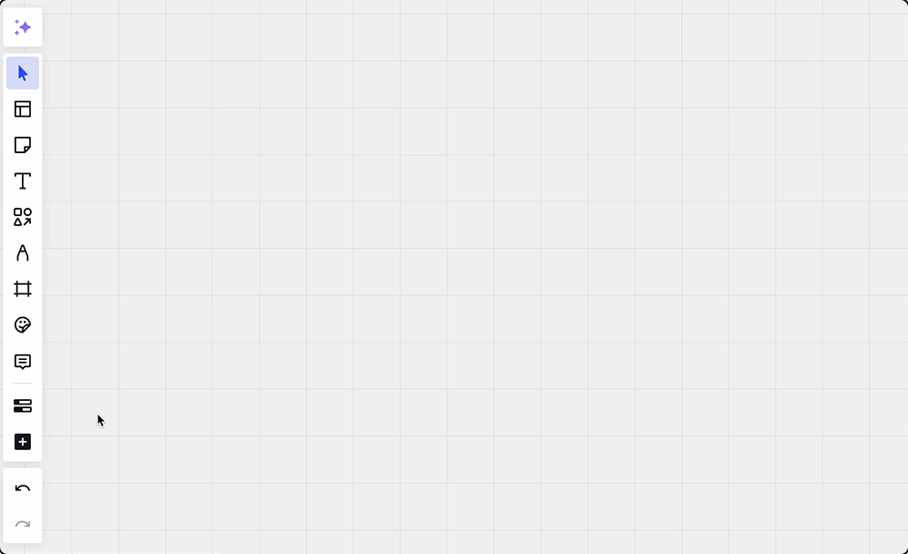

*Adding a widget with the Tools, Media and Integrations (+) icon*

When you delete the People, Dot voting, Story points, or T-shirt sizing widgets the items dragged from these widgets to other places on the board will remain and only the widget itself will be deleted.

## People widget

The People widget allows you to easily add your team members to an object on your Miro canvas. Use it anytime you need to assign a task or to add a team member to an object.

When you drag a team member onto an object, their avatar will automatically appear. If you drag a team member onto a Jira or Miro card, it will automatically update the assignee field with their information.

If you need to change the team member, you can do so by clicking on the avatar and then clicking the Change person icon in the context menu. The avatar border color can also be changed from the context menu.

Online board users will show up automatically in the People widget. You can also search for anyone in your organization to add them via the People widget. Pin anyone in your organization so that they stay in the People widget.

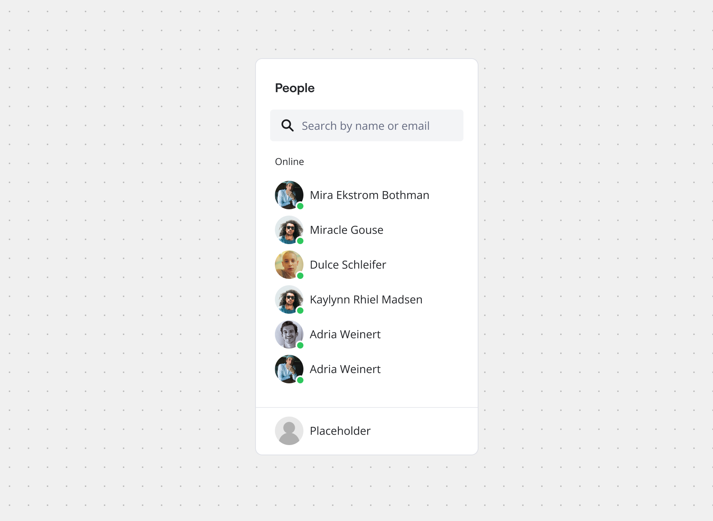

*An example of the People widget*

## Dot voting widget

The Dot voting widget makes it easy for team members to cast their votes during meetings like retrospectives. Multiple people can vote simultaneously with the Dot voting widget. The voting process is more efficient since users can drag and drop dots (rather than copying and pasting an image).

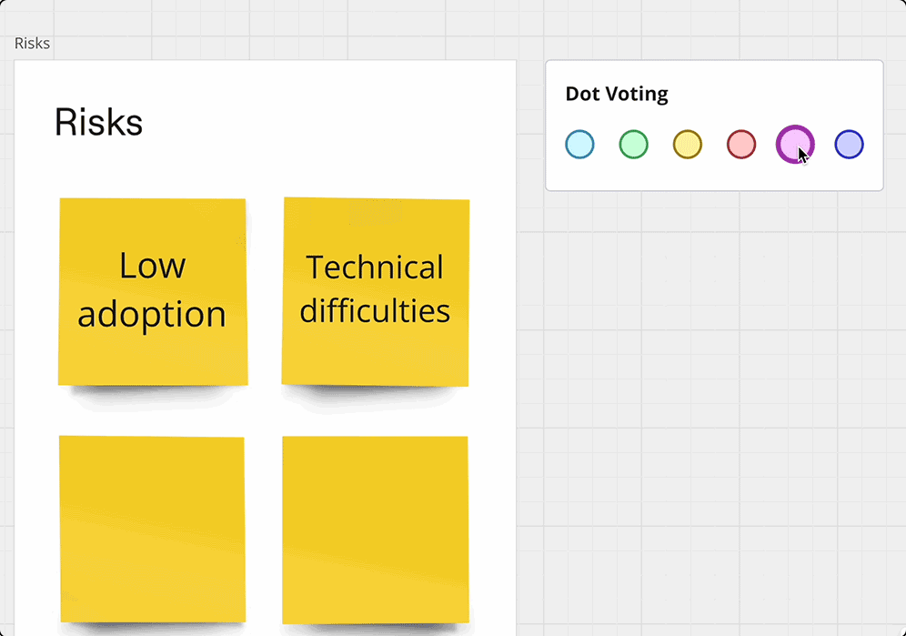

*Dot voting is done through simple drag and drop*

When a Dot is dragged onto a Sticky note or card, it will attach to it. If the object is moved, the Dot moves with it. This makes it easy to rearrange or reorganize objects without losing track of their votes.

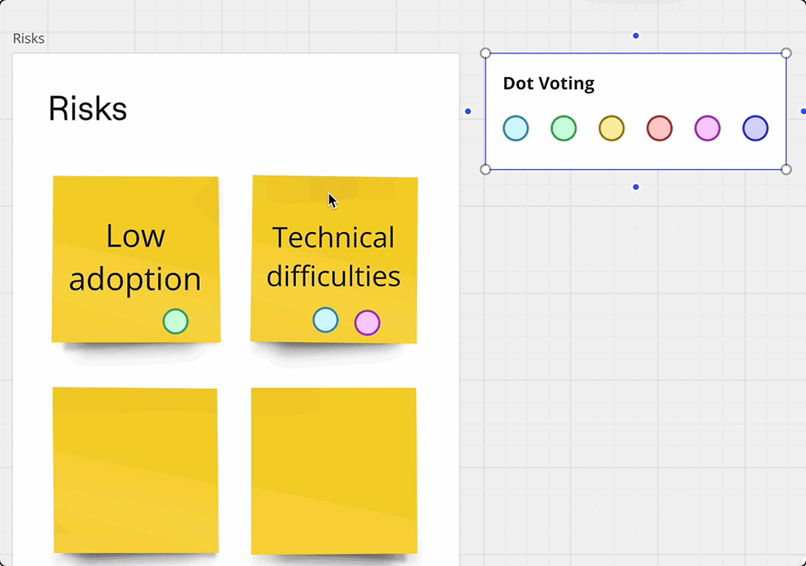

*Moving a Sticky moves the dot votes with it*

## Story points widget

When running a sprint planning meeting, the Story points widget makes it easy for team members to vote on story points for each task or project. Similar to the Dot Voting widget, the Story Points widget allows team members to drag and drop their story point votes directly onto a card or Sticky. Multiple team members can vote simultaneously.

When an estimate is dropped onto a card or Sticky, it attaches to the object. If the objects are rearranged or moved, their estimate dots will move with them.

When you drag a story point onto a Jira or Miro card, it will automatically update the story points field on the card.

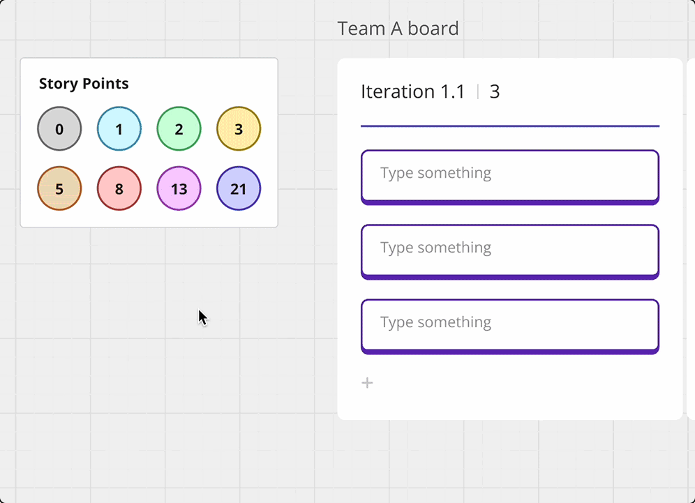

*Story points dragged onto a card automatically fill the relevant field*

## T-shirt sizing widget

The T-shirt sizing widget facilitates using t-shirt sizes to estimate story points on cards within a Miro board. It’s similar to the Story points widget, but uses t-shirt sizes XS, S, M, L, and XL for workload estimates.

It works in the same way as the Story points widget. Drag and drop the t-shirt size onto the card you want to estimate.

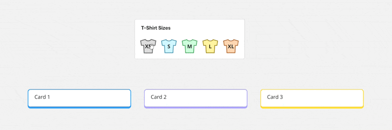

*T-shirt sizes can be dragged directly onto cards*

## Poll widget

The Poll widget allows you to embed survey questions directly onto your boards.

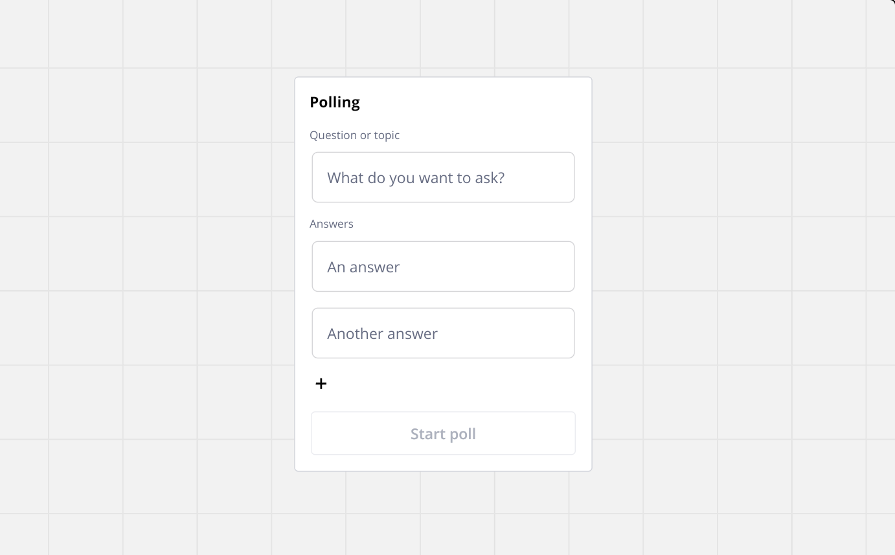
*The first panel shown when creating a poll*

To create a poll:

1. Enter your survey question.
2. Enter your survey answer options. You’ll need to enter at least 2 options but can add up to 10.
3. Click on **Start Poll** to enable voting for other users.

When users have voted and your poll is complete, you can finish the poll and results will be shown on the board.

## Sticky Stack widget

Stickies can be created by dragging from the stack and placing them onto the board.

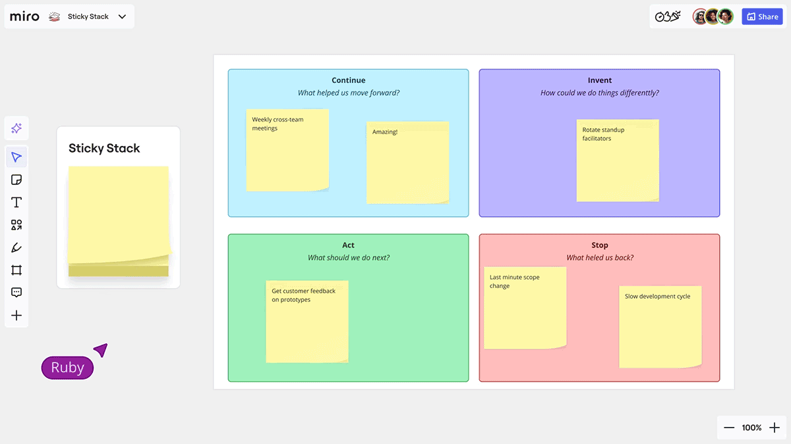

*The Sticky Stack widget makes adding stickies to the board a single-step process*

Sticky Stack can be added via the Sticky icon:

1. Click on the **Sticky** icon in the **Creation toolbar**.
2. Click on **Stack** in the panel that opens.
3. Click on the board where you'd like to place the Sticky Stack.
4. Once you've placed the Sticky Stack, you can use the context menu to change the shape (rectangular or square), the size (small, medium, or large), and the color of the Stickies.

Sticky stacks can be assigned tags via the context menu. The context menu also allows you to toggle on or off showing the author for each sticky pulled from the stack.

## Spinner Wheel widget

Randomly select a person or option from an on Canvas spinning wheel. The Spinner wheel automatically adds people currently on the board, or you can use it with custom text. Up to 20 people or text options can be included.

You can edit the options for the Spinner Wheel via the **Edit** icon in the context menu. To choose between people or custom options, go to the drop down menu at the top of the edit panel.

You need at least two people or options to spin the wheel. Items are removed from the wheel once they’re selected by default. This can be changed in the Edit menu.

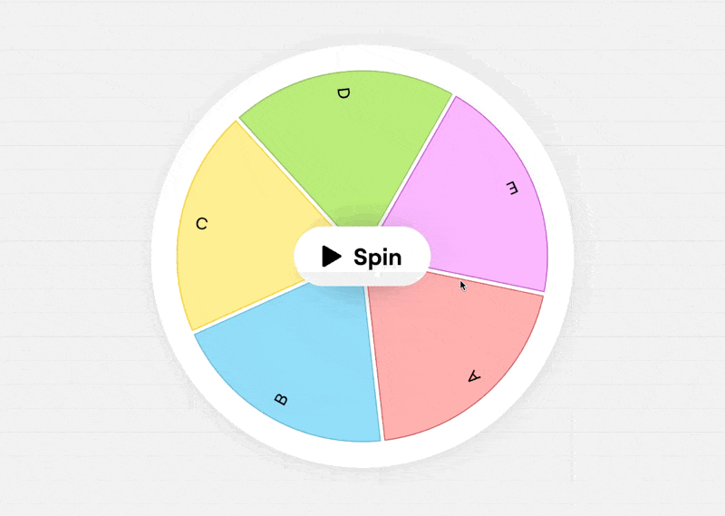

*Use the Spinner Wheel widget to randomly select people or options*

## Alignment Scale widget

Gauging team sentiment about a topic during a collaborative session is easier with the Alignment scale widget. Users on the board can add themselves at any point along the Alignment Scale to show where they sit on the scale. The title and scale labels can be edited by clicking on them. There are five gradient color palette options to choose from.

You can delete your vote by clicking your avatar. Votes can be changed by clicking elsewhere on the scale or by dragging and dropping your avatar.

Anonymous voting can be turned on or off by clicking the Vote anonymously icon in the context menu. Votes can also be cleared from the context menu.

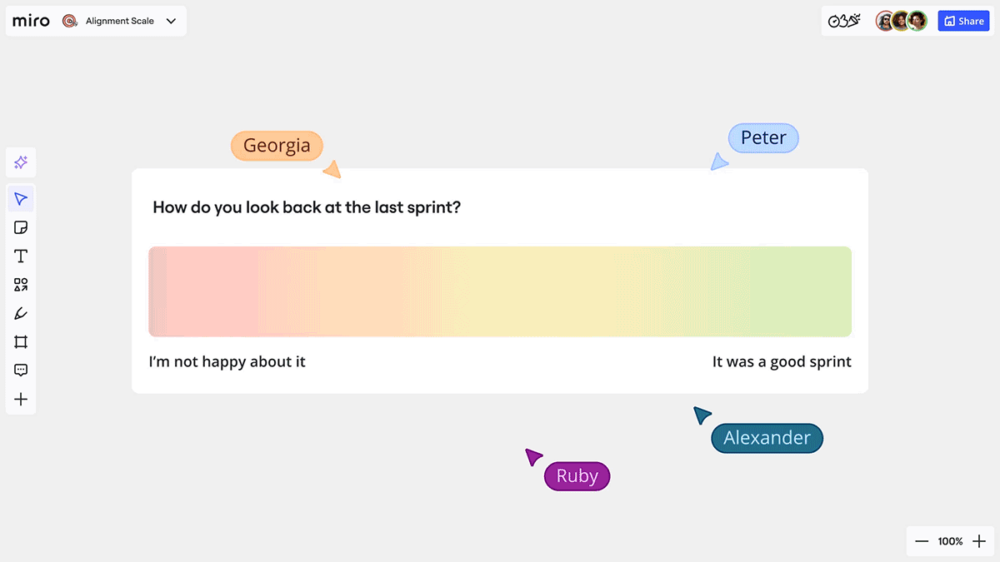

*Use the Alignment Scale widget to visually gauge team sentiment*

## Flip card widget

The Flip card widget gives you a dynamic, interactive way to reveal text on the Canvas. The Flip card widget allows you to create flippable cards with a title and text on both sides. Flip cards can include images on either (or both) sides of a card—drag images on or off cards to add or remove them. Both the color and orientation of Flip cards can be customized.

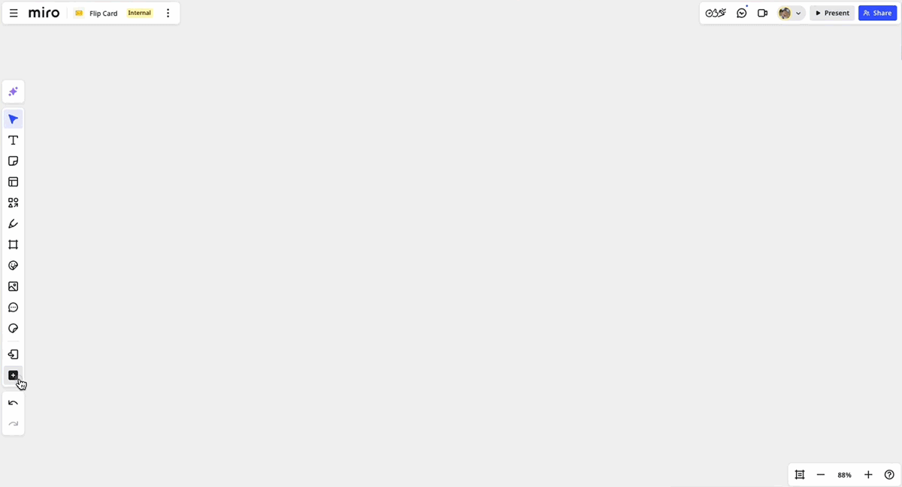

*Using a Flip card widget on the Canvas*

If you need to randomize the order of your Flip cards, you can do so using shuffle. Select the cards your want to shuffle, then click the **Shuffle** icon in the Context menu.
