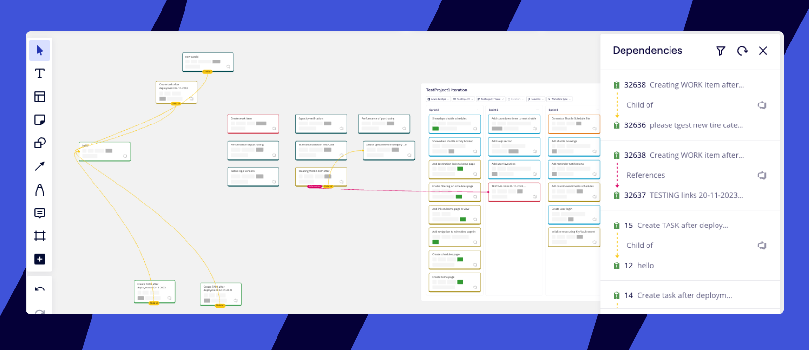
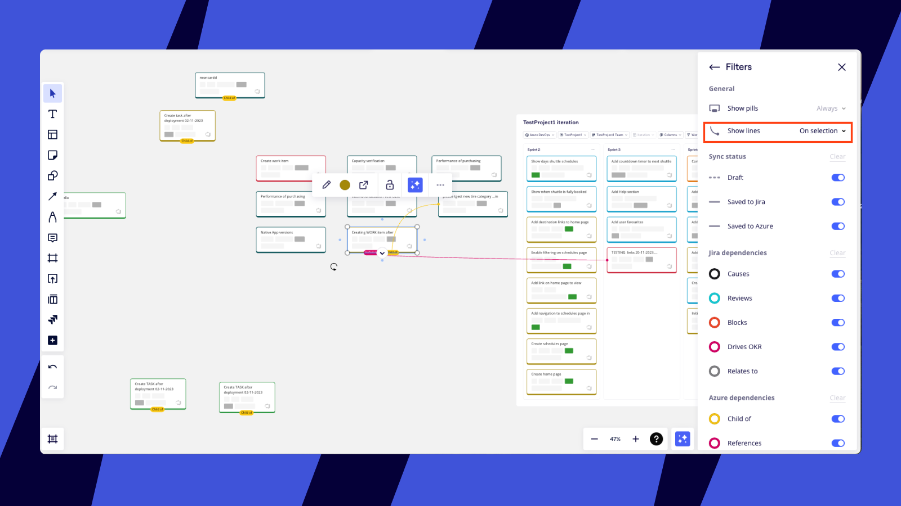
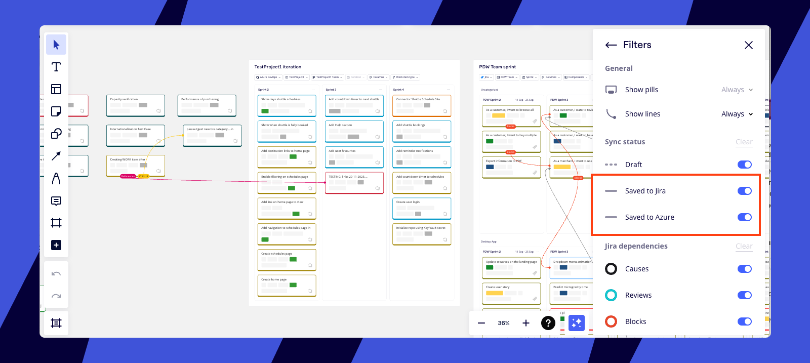

Map dependencies between Azure cards on your [planner](../../integrations-apps/microsoft/09-planner-for-azure-devops.md), or anywhere on your Miro board. With the Dependencies app you can identify, visualize, discuss, and record dependencies between teams in real-time during planning exercises.

:::note
To use dependencies for Azure DevOps, first [set up your Azure integration](../../integrations-apps/microsoft/03-azure-cards.md).
:::

## How dependencies work

Dependencies appear as a layer of connecting lines, and show relationships between Azure cards.

They are only visible when you open dependencies on the board. Participants can filter different dependency types to discuss blockers and relationships.

*Mapped dependencies in Azure*

## How to view and filter dependencies

:::note
You can only view and filter dependencies you have already created in Azure. Soon you'll be able to create and edit dependencies between Azure cards directly in Miro.
:::

1. Go to the Creation toolbar on the left-hand side of the board.
2. Click the **Dependencies** icon. If the Dependencies icon isn't in your Creation toolbar, you'll need to add it from **Tools, Media and Integrations** (**+**).
3. The Dependencies panel will open, and any existing dependencies will appear as lines on the board.
4. Click the **Filter** icon at the top of the Dependencies panel.
5. Use the toggles to filter by **Dependency type**, represented by different line colors.
6. Use the **Show lines** dropdown to control when dependencies are displayed. Select **Always** to view all active dependencies. Choose **On selection** to see dependencies only when you click on a specific Azure card or dependency type.

*Filtering mapped dependencies*

## Jira and Azure cards on the same board

If your team uses Azure DevOps and Jira, and you've set up both integrations in Miro, you can manage cards and dependencies from both systems on one board.

Dependencies link either two Jira cards or two Azure cards. When you open the dependencies app on a board with both Azure and Jira cards that have dependencies, we'll show all existing links between these cards.

To filter dependencies from just one system, use the **Saved to Jira** and **Saved to Azure** toggles.

*Both Jira and Azure dependencies on a single Miro board*
