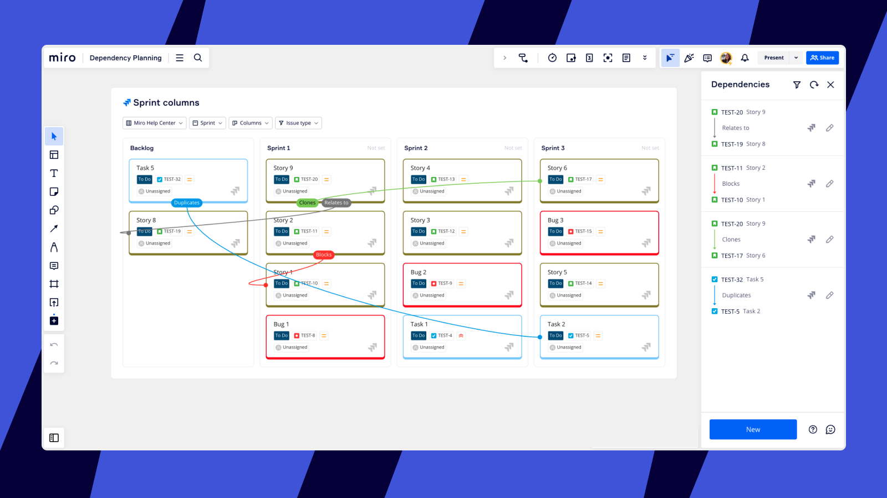
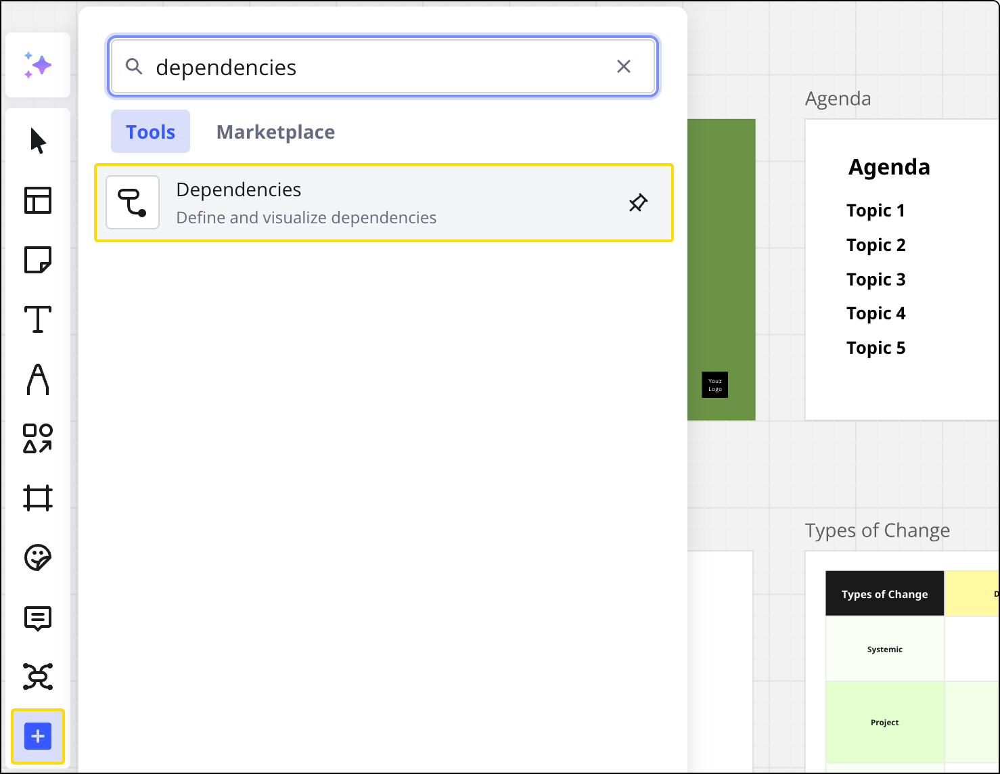
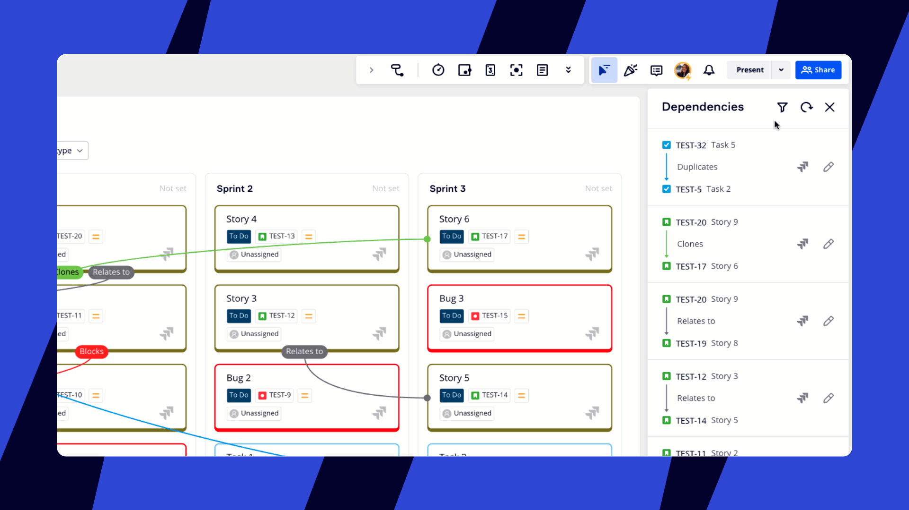

Map existing dependencies or create new ones between Jira cards on your [planner](../../integrations-apps/atlassian/21-planner-for-jira.md) or anywhere on your Miro board, and they'll instantly sync in Jira. With the Dependencies app you can identify, visualize, discuss, and record dependencies between teams in real-time during planning exercises.

## How dependencies work

Dependencies appear as a layer of connecting lines, and show relationships between Jira cards.

They are only visible when you open dependencies on the board. Participants can filter different dependency types to discuss blockers and relationships.

*Dependencies mapped between Jira cards on a Planner widget*

## How to create a new dependency

1. Go to the Creation toolbar on the left-hand side of the board.
2. Click the **Dependencies** icon. If the Dependencies icon isn't already in your Creation toolbar, you'll need to add it from **Tools, Media and Integrations** (**+**).
3. The Dependencies panel will open.
4. Click **New dependency**.
5. Click **First card** and select a Jira issue from the dropdown or via search.
6. Select the **Dependency type** based on those available in your Jira instance (for example, blocks, clones, duplicates, or relates to).
7. Click **Second card** and select a Jira issue from the dropdown or via search.
8. Click **Save draft**, or **Save to Jira**directly.

:::tip
Draft dependencies are saved only in Miro. You can create draft dependencies as suggestions to other participants and teams during planning exercises. Once they’ve been reviewed and discussed you can then either save them to Jira or delete them.
:::

*Creating a new dependency and saving it to Jira*

## How to view and filter dependencies

1. Go to the Creation toolbar on the left-hand side of the board.
2. Click the **Dependencies** icon. If the Dependencies icon isn't already in your Creation toolbar, you'll need to add it from **Tools, Media and Integrations** (**+**).
3. The Dependencies panel will open, and any existing dependencies will appear as lines on the board.
4. Click the **Filter** icon at the top of the Dependencies panel.
5. Use the toggles to filter by **Dependency type** and **Sync status**.
6. Use the **Show lines** dropdown to control when dependencies are displayed. Select **Always** to view all active dependencies. Choose **On selection** to see dependencies only when you click on a specific Azure card or dependency type.

Dotted lines show draft dependencies, and solid lines show dependencies that have been synced to Jira. The line color represents the dependency type.

*Filtering the dependency view* *on the Planner widget*

## How to edit, save, revert or delete a dependency

1. Go to the Creation toolbar on the left-hand side of the board.
2. Click the **Dependencies** icon.
3. The Dependencies panel will open.
4. Click the **Edit** icon next to a dependency.

*Editing a dependency*

You can change the **First card** and **Second card** of a dependency, as well as the **dependency type.**

***Changing the First card and Dependency type*

Click **Save to Jira** to save and sync a draft dependency to Jira.

*Saving a draft dependency to Jira*

Click **Revert to draft** to revert a synced dependency back to draft.

*Reverting a synced dependency in Jira back to draft*

Click the **Trash** icon to delete a dependency.
*Deleting a dependency*
