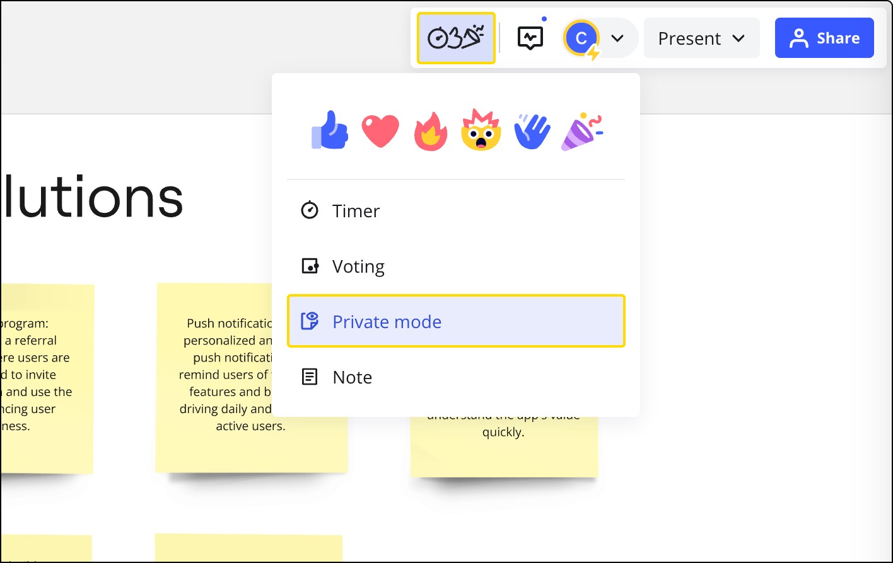
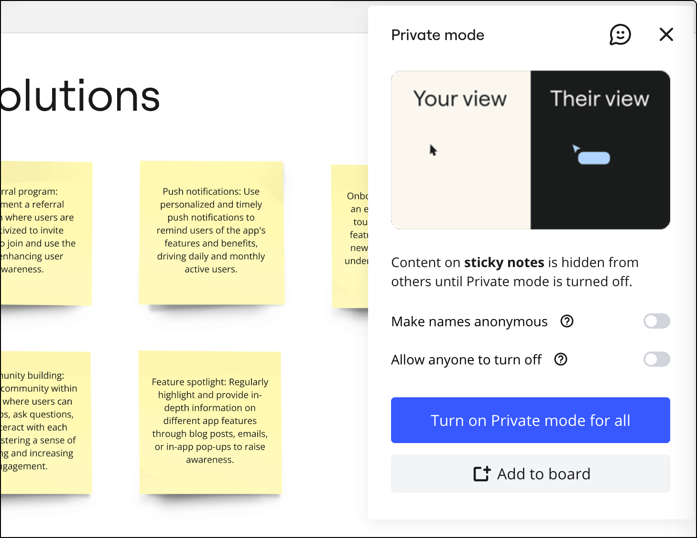
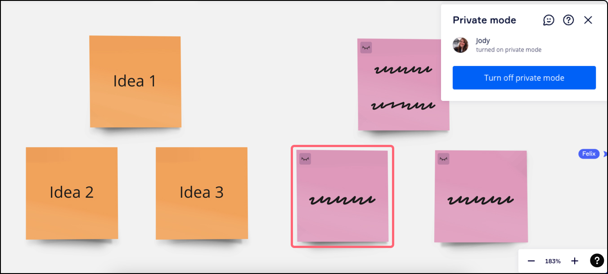
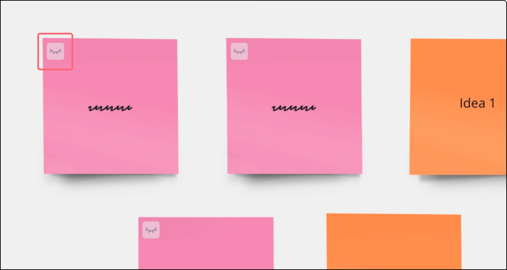
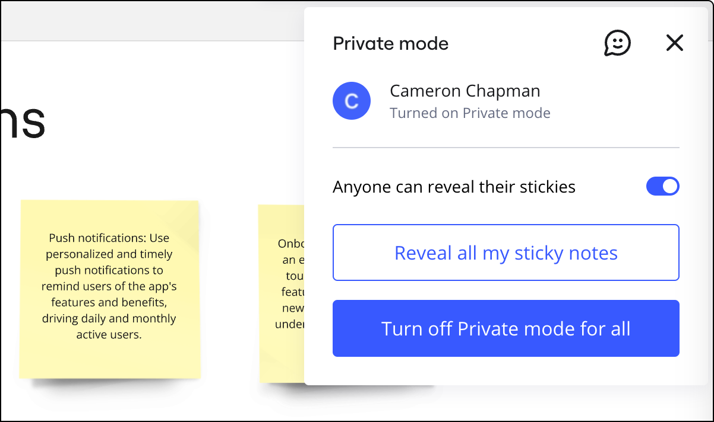

Whether you’re brainstorming new ideas together or leading a retrospective, private mode can reduce group bias, create a safe space to be authentic during feedback, and give participants privacy when formulating their thoughts.

This article will be updated when the rollout is complete.

## How to use private mode

Users with [edit access](../sharing-boards/01-board-access-rights.md#board-access-rights) can turn on private mode at any time. As soon as private mode starts, all new sticky notes and any edits to existing sticky notes are hidden. Once private mode has ended, all hidden sticky notes are revealed. A private mode widget can also be added to the board to make enabling private mode more efficient during a meeting.

:::warning
While private mode obscures identities and other information on the board, it is not a data protection feature.
:::

### Options available when starting private mode

> **Who can do it:** Board editors

When a user starts private mode, they'll see two options to further customize the experience for participants:

#### **Make names anonymous**

The **Make names anonymous** option helps create a safe space for open and honest communication among users.

When toggled on, sticky note text is made anonymous, and remains anonymous forever — even after private mode is turned off.

- [Author label](../essential-tools/14-sticky-notes.md#author-labels) is no longer available
- [Follow](04-attention-management.md#follow-a-collaborator) is no longer available
- Sticky note cursor names and avatars are anonymous
- Cursor positions on the board reshuffle as soon as private mode starts
- 'Created/Modified by' sticky note details are anonymous
- Anonymous content is excluded from [Board history](../managing-boards/11-board-history-activity.md), and names are not revealed in [Highlight changes](../managing-boards/11-board-history-activity.md#board-activity-list)

#### **Allow anyone to turn off**

The **Allow anyone to turn off** setting lets you control who can end the private mode session. You can choose to toggle it on or off when starting private mode.

**When toggled on**, other users can end the private mode session.

**When toggled off,** only you can end the private mode session. However, [board owners](../sharing-boards/01-board-access-rights.md#board-access-rights) and Company Admins on Enterprise Plan can still end the session at any time, regardless of this setting.

### Options available after starting private mode

> **Who can do it:** Board editors

#### **Anyone can reveal their stickies**

When private mode is initiated by a user, the **Anyone can reveal their stickies** option becomes available in their private mode dialog. When they toggle the feature on, a **Reveal all my sticky notes** button appears for all users. They can then click this button to reveal their own sticky notes at any time, even while private mode is still active. All other sticky notes will remain hidden.

This feature is useful during retrospectives or other team collaboration exercises, where participants may wish to take turns discussing their points, observations, or feedback.

## How to start private mode

1. Go to the [collaboration toolbar](../../getting-started/start-here/your-first-board/05-toolbars.md) in the top-right corner of the board.
2. Click the **Facilitation tools and Reactions** icon.
3. Select **Private mode**.
   
   *The private mode button from the collaboration toolbar*
4. A **Private mode** dialog will open.
5. Toggle on or off **Make names anonymous**
6. Toggle on or off [**Allow anyone to turn off**](#allow-anyone-to-turn-off)
7. Click **Turn on private mode for all***
*Turning on private mode**

## What does private mode look like for users?

When private mode is turned on, users will see a pop-up message and the **Private mode** dialog will open. They can also see who started private mode.

While private mode is on, users can only see their own sticky notes. All other sticky note text is hidden.

*Hidden sticky note text*

The closed eye icon in the top left of a sticky note indicates that the content is private and visible to the author only.

*The eye icon on a private sticky note*

## How to end private mode

If you do not see the option to end private mode, **Allow anyone to end** was toggled off when the session was started. Once private mode ends, all content will be visible to users.

If make names anonymous was turned on during private mode, sticky note author names will remain anonymous forever.

1. Open or navigate to the **Private mode** box
2. Click **Turn off private mode**
3. A second dialog will open. Click **Turn off for all**
4. Users will see a notification to let them know private mode is ending, as well as who ended the session
5. A 5-second countdown will appear in the **Private mode** dialog. Once the timer ends, the sticky notes are revealed

*Ending private mode*
