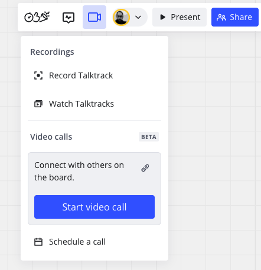
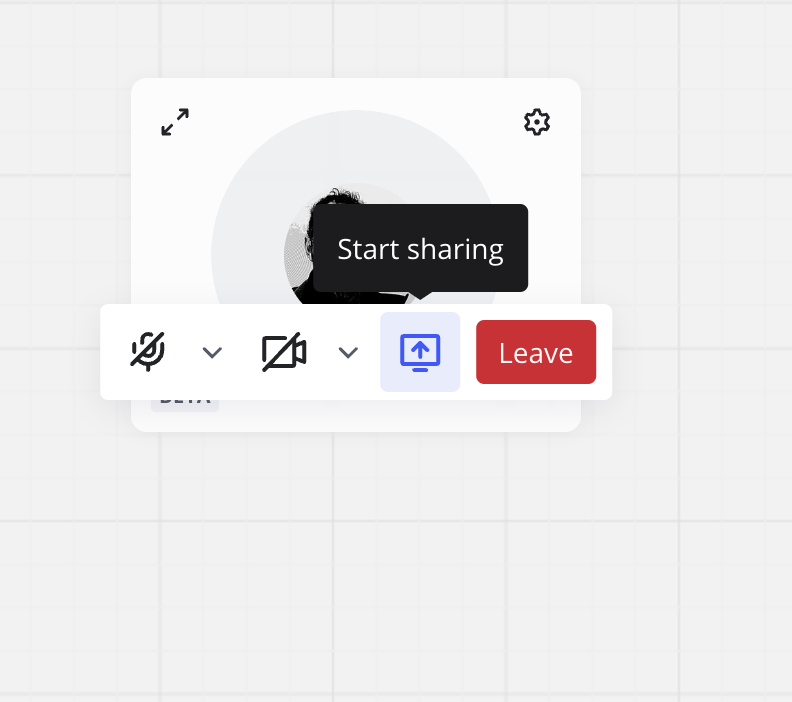

Start and participate in video calls directly inside a Miro board. With just a few clicks, you can invite all board collaborators to a quick sync or scheduled call. You can share your screen, apply color filters to your avatar, and toggle your camera and microphone.

Video Calls enables you to facilitate real-time work and communication without leaving your Miro board. Team discussions, decisions, and actions happen simultaneously without additional software.

## Key features

Video Calls includes the following key features:

- Video call for up to 25 board participants
- Background blur and camera filters
- Screen share for any tab or window you want to present
- Integration with Google Calendar and Outlook
- Record video calls
- Live transcription to a Doc on the board

## Disabling and enabling Video Calls for your organization

As a Company Admin, you can disable and enable Video Calls for your organization.

Follow these steps:

1. In Miro, access your profile settings.
   From the dashboard, select your avatar in the top-right and select **Settings**.
   From a board, select your avatar in the Collaboration bar and select **Profile settings**.
2. Select **Apps and integrations** > **Apps**.
3. Select **Manage apps**.
4. For **Video Calls**, toggle **Allowed** to the off position.

   You have successfully disabled Video Calls for your organization.

:::note
To re-enable Video Calls, follow the same procedure. For step 5, toggle **Allowed** to the on position.
:::

### Adding Video Calls

When Video Calls is enabled, Team Admins, Content Admins, and User Admins can add the Video Calls app for all teams or selected teams.

Follow these steps:

1. In Miro, access your profile settings.
   From the dashboard, select your avatar in the top-right and select **Settings**.
   From a board, select your avatar in the Collaboration bar and select **Profile settings**.
2. Select **Apps and integrations** > **Apps**.
3. Select **Add apps**.
4. Search and select **Video Calls**.
5. Select **Add**.
   The **Select where to add Video Calls** window opens.
6. Do one of the following:

   **Add Video Calls for all teams in your organization**

   1. Select **All teams in &lt;org name&gt;**.
   2. Select **Next Step**.
   3. Then select **Add**.

   **Add Video Calls for specific teams only**

   1. Select **In specific teams...**
   2. Select **Add teams**.
      The **Choose teams to add Video Calls** window opens.
   3. Search and select your team(s).
   4. Click **Add teams**.
      You return to the **Select where to add Video Calls** window, which now shows a list of your selected teams.
   5. Select **Next Step**.
   6. Select **Add**.

## Using Video Calls

### Start a video call

The following Miro Business and Miro Enterprise roles can start a video call:

- Board owner
- Board Co-owner
- Board editor

:::note
Commenters and viewers can start video calls only if they are members of the organization for a given board.
:::

To start a video call, follow these steps:

1. On the Collaboration bar select the camera icon.
2. Under **Video  calls**, select **Start video call**. 
   ***Start video call** button for Video Calls*
   For a first-time user, a dialog opens that enables to allow Miro to access your microphone and camera. Ensure that you allow access.
   The **Get Ready** modal opens.
3. Set your audio and video preferences.

   > 💡 To start the call with your microphone and/or camera disabled, click the microphone or camera icons.
4. Select **Start video call**.

   You have successfully started a video call.

:::tip
To enhance Agile sync rituals, the Stand-up, Planning, and Retro Miro intelligent templates include an action shortcut called **Start group call** that starts a video call immediately.
:::

### Join a video call

When a video call is initiated, the **VIDEO CALL** notification appears on the Miro board. To join the video call, in the notification select **Join**.

If you miss the notification, follow these steps:

1. On the Collaboration bar, select the camera icon.
2. Under **Video calls**, select **Join**.
   .png)
   *The **Join** button during an active call.*
   The **Ready to join?** modal opens.
3. Set your audio and video preferences.
4. Select **Join the call**.

   You have successfully joined an active call.

### Share your screen

To learn about screen sharing in Video Calls, see [Mic & camera controls for Video Calls](#mic-camera-controls-for-video-calls).

### Leave a video call

To leave an active video call, in the Collaboration bar select the camera icon. Under **Video calls**, select **Leave**.

:::tip
You can also leave an active call from the action bar. For more information see, [Mic & camera controls for Video Calls](#mic-camera-controls-for-video-calls).
:::

### Schedule a video call

To schedule a video call, on the Collaboration bar select the camera icon. Under **Video calls**, select **Schedule a call**.

***Schedule a call** button for Video Calls*

For your first time scheduling a video call, the **Select your calendar** modal appears. You can select Google Calendar, or Outlook Calendar. Your choice is saved for future scheduled calls.

The calendar invitation opens in a new window. You can edit and save the invitation.

:::tip
Your calendar invitation includes a link to the video call.
:::

## Changing orientation, size, and placement of Video Calls

In a video call, drag-and-drop the call box anywhere you want on the Miro board.

To change the orientation and size of the call box, follow these steps:

1. In an active call, in the call box select the gear icon to access **Layout Settings**.
2. Select **Horizontal** or **Vertical** to adjust the call box orientation.
3. Select **small**, **medium**, or **large** to adjust the call box size.

   You have successfully changed the orientation and size of the call box.

:::tip
In an active call, you can drag any corner of the call box to manually change the size.
:::

## Mic & camera controls for Video Calls

In an active call, hover over your avatar to reveal the Video Calls action bar.

The action bar enables you to modify the following call settings:

- **Microphone**
  Mutes or unmutes your microphone. If you have additional devices connected, select the down-arrow to choose which microphone you want to use, and choose an audio output.
- **Camera**
  Switches your camera on or off. If you have additional devices connected, select the down-arrow to specify which camera you want to use. The camera down-arrow also includes the following options:
  - **Apply color filter**
    Enables you to apply a color filter to your avatar. To choose a color filter, ensure your camera is on, and **Apply color filter** is enabled. Then click on your avatar to apply and change filters.
  - **Blur background**
    Adds a blur effect to the background of your avatar.
- **Start sharing**
  Enables you to share your screen with call participants. To share your screen, select the **Start sharing** icon.
  
  ***Start sharing** icon for Video Calls*

  > 💡 Depending on your browser, you may have the option to specify whether to share given tab, window, or your entire screen.

  > 💡 In screen share mode, select **Minimize screen share** to collaborate on your Miro board while actively sharing your screen. Your screen is minimized only for you. Each participant can control whether your shared screen is minimized.
- **Leave**
  Enables you to leave the video call.

## Record a Video call

> **Who can do it:** Board owners, Board co-owners, Board editors
> **Which platforms:** Browser

When recording a Video call, everything you do on the canvas will be included in the final video. That includes any menus you open and any interactions you have on the canvas or toolbars.

In addition to recording the canvas, the video and audio streams from all participants in the call will be recorded. Screen shares from anyone in the call will also be recorded.

To record a Video call in progress:

1. Click on your **avatar** in the Video call window to open the context menu.
2. Click on the **Record** icon.
   A dialogue will open.
   
   *The record icon in a Video call*
3. Select whether you want to **Start live transcript too** on the call.
   Optional: select the language for the Live transcript.
   
   *Select whether you want to include a live transcript in your recording*
4. Click **Start recording**.
   A browser modal will open.

   > ✏️ In Firefox, Safari, and other non-Chromium browsers, you'll need to share your screen once in the call in order to record actions on the canvas.
5. Click on the Miro screen in the browser modal and then click **Allow**.
6. The recording will begin.

To stop recording when in picture-in-picture mode:

1. Click on the **vertical three dots** () icon in the picture-in-picture window to open the main menu.
2. Click **Stop recording**.

To stop recording from the Video call modal on the canvas:

1. Click the **Stop recording** icon.
   A confirmation dialogue opens.
2. Click **Stop recording**.

The canvas recording will stop when the person sharing their canvas leaves the call (another user can share their canvas if needed). The Video recording will end if all users leave the call.

### Watch a Video call recording

The recorded video is available within a few minutes after the recording is completed and is visible to all board members. To view recordings:

1. Click on the **Video** icon in the upper right toolbar.
2. Click **Watch Talktracks**.
   A panel will open with the Talktrack recordings.
3. Select the **Call recording** tab.
4. Select the recording you'd like to watch.

### Live transcript

Live transcript can be taken while a call is being recorded. It will appear on the canvas as a new Doc, visible to all board users. When starting a new recording, select the **Start Live transcript too** checkbox.
