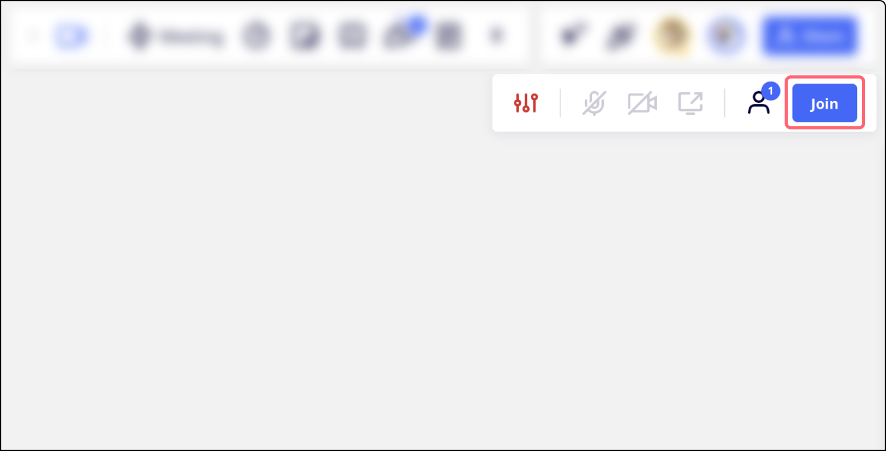
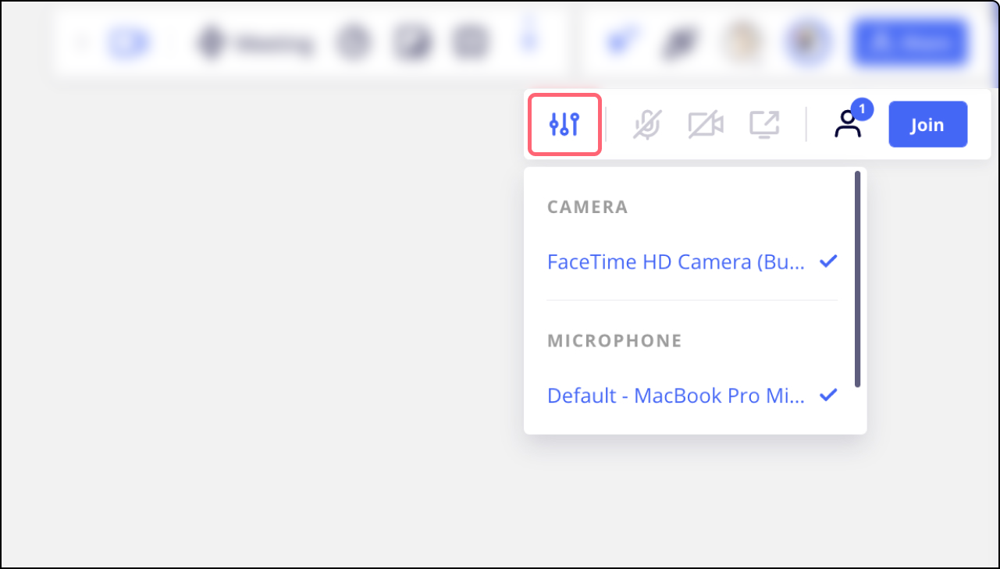
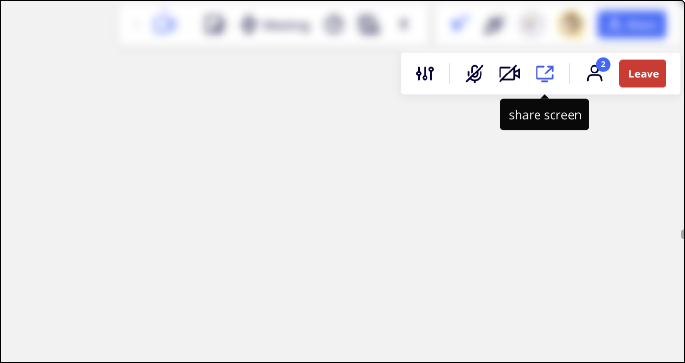

Conduct seamless [collaborative remote sessions](../../getting-started/feature-intros/03-miro-for-workshops-meetings.md) with Miro built-in video chat without having to maintain two links or switch between apps.

:::note
The new [Video Calls](17-video-calls-beta.md) feature replaces Video Chat. Video Chat is now deprecated.
:::

Video chat better supports your distributed or remote team by creating an opportunity for real-time collaboration and helping everyone feel more engaged.

:::warning
For the best experience with [Miro video chat](https://miro.com/marketplace/video-chat/), we recommend hosting a remote meeting with up to **25** users simultaneously participating in a video chat session.
:::

## Organizing a call

To start a video chat, find the **video chat** icon in the creation toolbar on the left-hand side of your board (you may need to add it from the **Tools, Media and Integrations** (**+**) icon if you haven't pinned it already), and click **Start**.

## Joining a call

If your collaborator starts a video call, you will see the video chat menu in the top right corner of the board. Click **Join** to join the call.

*Joining the video call*

Click on the camera/mic buttons to enable/disable them or got to settings to choose another camera or mic. If Miro doesn't have access to a camera/mic, learn how to enable it [here](#how-to-allow-access-to-your-camera-and-microphone).

*Choosing another camera to use in video chat*

During the call, use the corresponding buttons to **start/stop** **video** and **mute/unmute** **microphone**.

You will see other video chat participants on the board and will be able to scroll the list with the arrows.

*Video chat participants on the board*

You will also have an option to let your collaborators follow your actions (seeing exactly what you see) by clicking the **share screen**button.

*Screensharing feature*

To leave the call, click **Leave**.

:::note
If your collaborator has started the call, but you don't see the notification, please refresh the page or click the **video chat** icon in the bottom toolbar.
:::

## Video chat availability

|  |  |  |  |
| --- | --- | --- | --- |
| **PC Browser****✔** | **PC Desktop app****✔** | **on Tablet****✔** | **on Mobile** **✘** |
| Google Chrome, Firefox, Opera, Safari | When downloaded from [the official site](https://miro.com/apps/). No support in MS Store version | iOS: Safari, [Tablet app](../../getting-started/apps-for-devices/11-tablet-app.md) Android: Google Chrome. | Not available |

## How to allow access to your camera and microphone

When using the video chat for the first time, you will see the browser pop-up in the upper-left corner of the board. By clicking **Allow**, you allow access to the default camera and mic of your browser.

*Allowing Miro to use your camera and microphone*

In case you accidentally click **Block** on the pop-up or Miro doesn't have access to camera/mic for any other reason, follow the instructions below.

### For Chrome

Click the camera/mic icon on the browser address bar and change the setting.

Alternatively, you can go to the [browser settings](chrome://settings/) **> Privacy and security > Site settings > Permissions > Camera/Microphone**.

*Camera and microphone in Chrome browser settings*

Then choose a camera or a microphone and remove Miro from the **Block** section.

*Removing Miro from the Block section in camera settings in Chrome*

### For Safari

Open Miro website, click **Safari** in the upper-left corner, select **Settings for This Website**:

*Opening Miro website settings in Safari*

Choose **Allow** in the Camera menu:

*Allowing Miro to use your camera in Safari*

Another way is to open Miro in Safari, go to **Preferences**, then click **Websites**. Choose **Camera** or **Microphone** and allow Miro to use them. Note that you need to have Miro open in the browser at that moment.

*Allowing Miro to use you mic in Safari*

### For Firefox

Click the camera and mic icons on the browser address bar and press the cross icons. Then you may need to reload the page and allow using camera and mic.

*Changing camera and mic permissions in Firefox*

You can also manage access via the browser settings. Click the menu icon in the upper-right corner of the browser, choose **Settings**, select **Privacy & Security**, scroll down to **Permissions**. Open camera/microphone **Settings**:

*Camera and Microphone permissions in Firefox*

Find Miro on the list of blocked websites and change the status to **Allow**.

You can allow camera access to the [Miro Desktop app](../../getting-started/apps-for-devices/05-desktop-app.md) in your device System Preferences (Mac) or Settings (Windows).

## Technical requirements and troubleshooting

Video chat does not require any additional software or settings management except access to your microphone and webcam. Make sure to allow miro.com to use your microphone and camera in your browser (a pop-up window to request access is shown at the start of the call).

The video chat performance depends on CPU, RAM, and network connection. If your video stream is freezing or lagging, try to connect to **another network**, use a **different device** (with better CPU and RAM), switch **VPN** on/off.

You can check your CPU in the Task Manager (when you are using video chat and when not, when you have other apps working and when not) to see the capacity.

The network connection can be checked at [Cloudharmony.com](https://cloudharmony.com/speedtest-for-aws). You will only need the test for Amazon EC2 (eu-west-1). The following points are important:

*Checking network connection*

Generally, if your results meet our [system requirements](../troubleshooting-technical-questions/technical-guidelines/01-system-requirements.md), the chat should be working smoothly. If your device complies with the requirements, but the video chat underperforms, [reach out to Miro Support](https://help.miro.com/hc/en-us/requests/new?referer=help-center-article).

If you cannot hear or see your video chat participants, please run a test on [this website](https://tokbox.com/developer/tools/precall/), then scroll to the bottom of the screen, click **Save this data as simple text**, and [share the results with Miro Support](../tools/troubleshooting/06-contacting-miro-support.md).

## Frequently asked questions

**Can I uninstall video chat for my team?**

Yes, Admins can uninstall video chat in [Team settings](../../administration/get-started-as-a-miro-admin/01-i-am-a-new-miro-admin.-where-to-start.md) **> Apps & Integrations**. Open **Video chat** and click **Uninstall for team**.

**Is it possible to minimize/enlarge video chat participants' windows?**

No, this is not possible at the moment.

**Do I need to send a video chat link to my participants?**

No, Miro video chat does not have a special link. Share your board with your meeting participants and start a video chat session. The participants will be able to [join the video chat](#joining-a-call) from the board.

**Can I change my camera when using video chat?**

Yes, you can change it in the video chat settings. Please be sure to [allow access to your camera](#how-to-allow-access-to-your-camera-and-microphone).

*Video chat settings*
