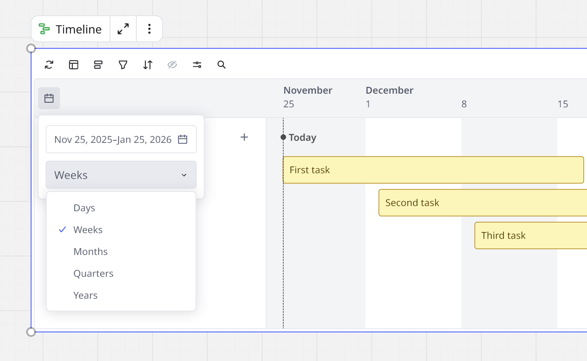
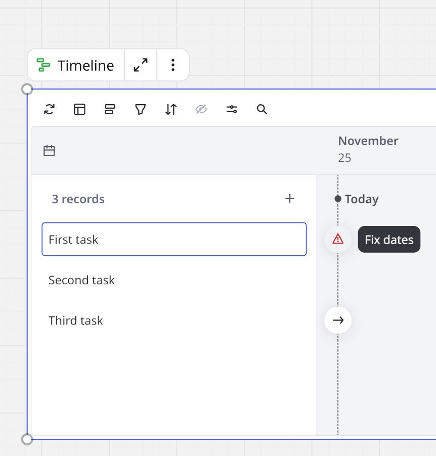
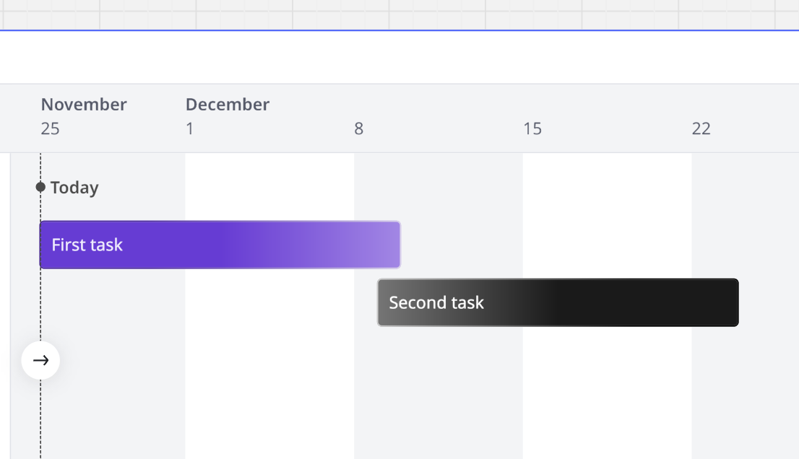
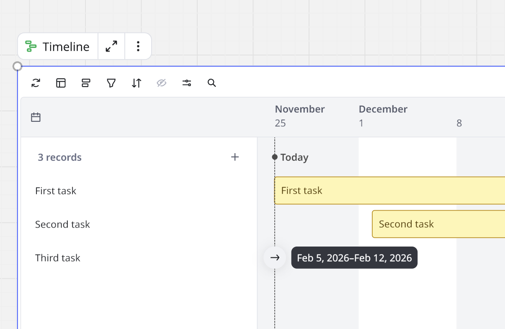
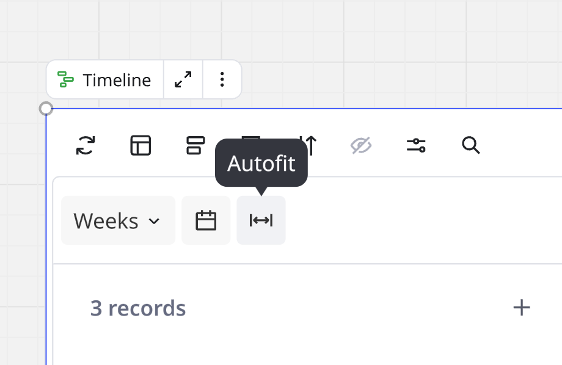

The Timeline widget provides several controls that enable you to manage your work.

### Change start and end dates

To change the time range shown on the Timeline, elect the **calendar icon** () on the upper left side of the Timeline widget to choose your start and end dates. The Timeline scales automatically to match your selection.

You can also use the dropdown to select whether to scale the Timeline to **Days**, **Weeks**, **Months**, **Quarters**, or **Years**.

*Change the Timeline scale*

To change the start and end dates for a specific record, drag either end of the time bar.

The Timeline shows a warning icon for records with date errors, for example an end date before a start date. Click the warning icon to switch dates in the correct order.

*Click the warning icon to set correct dates.*

For records with no start date, or no end date, the Timeline shows a time bar filled with a gradient at the missing date.

*Click the gradient time bars to add the missing start or end date.*

For records with no dates, the Timeline shows a plus (**+**) button. Click the plus button. A time bar is added to the Timeline. You can now edit the time bar to set start and end dates.

### Jump to record

Some long timelines have records with out-of-view time bars. To jump from the records column to the corresponding time bar without scrolling, click the right-arrow button.

*Click the right-arrow button to jump to a time bar that is out-of-view.*

### Autofit

To adjust your Timeline so all time bars fit perfectly, above the records column click **Autofit**.

*The **Autofit** button enables you to fit all time bars on your Timeline automatically.*

### Change record color

Click the record or time bar for a color circle to appear. Click the color circle for a color picker and select a color.

### Reposition records

In the records column, drag and drop a record to reposition it on the timeline. You can optionally drag and drop a time bar.

*Rearranging records on a Timeline*

### Filter records

You can filter the contents of a Timeline by one or more fields to help narrow the tasks you would like to work with. You can do this by clicking the filter icon on the top of the Timeline. You can choose whether you want to filter by one or more fields and then choose which field you want to filter by. Once a filter is applied you should see a counter on top of the filter by icon on the timeline to reference how many filters are applied.

To remove a filter follow the same steps and click the trash can next to the filter you would like to remove.

### Sort records

You can sort the contents of a timeline by clicking the sort icon at the top of a timeline then choosing which field you would like to sort records within the timeline by. You can then choose whether you want the records to be sorted in either ascending or descending order according to the field you have sorted by. Once a sort has been applied you will see a counter appear on top of the sort by icon to indicate that a sort is applied.

You can remove a sort by following the same steps and clicking the delete sort option from the drop down.

### Copying and pasting Timelines

When you copy and paste a timeline you will see a pop-up that will provide you with two options:

- To paste as a synced view of the original timeline.
- To create a new timeline using the original timeline as a template.

You can copy and paste within and across boards.

Choosing to paste as a sync view of the original timeline ensures that all the records within the new timeline remain synced with the records in the original timeline, however, you can customize the view of the new timeline without impacting the original. For example you can apply a filter, sort, group or change the layout of the new timeline without changing those properties on the original timeline. You can use this to create multiple views/layers of data of the same information all whilst the records remain synced across timelines and boards.

Choosing to paste as a new timeline will create a copy of the original timeline however the records in the new timeline will not sync back to the original. Therefore you have just used the original timeline as a template to create a new timeline with the same layout. No edits made to the new timeline will reflect on the original and vice versa.

### Group records

A group adds an additional level of hierarchy to your timeline, for example, if you want to order a roadmap by start date or end date.

To create a group, click the **Group** icon at the top of the Timeline then select which field you would like to group the records by. Choosing a group by field will separate the Timeline into relevant groups, which you can expand and collapse. To remove a group, follow the same steps and click **Clear grouping**.

*Grouping records on a Timeline*

:::tip
You can drag and drop a record to another group.
:::

## Add milestones

You can add milestones to your timeline to keep track of upcoming dates and deadlines.

1. Hover on the timeline widget for a dotted line and flag icon to appear.
2. Click on your selected date and name your milestone.
3. Edit the milestone name by double clicking. The blinking cursor indicates that the text is ready for editing.
4. Change color by clicking and selecting a color from the color circle.
5. Change the milestone date by clicking on the milestone and then opening the calendar picker that appears above it.
