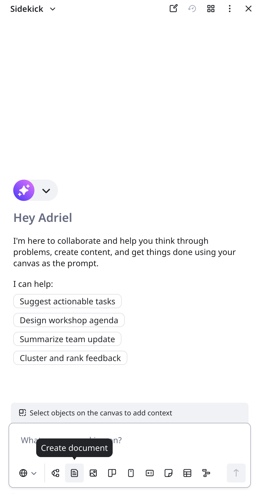
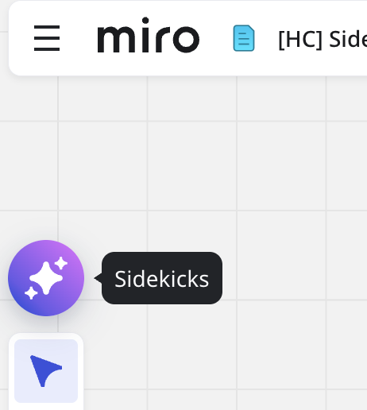
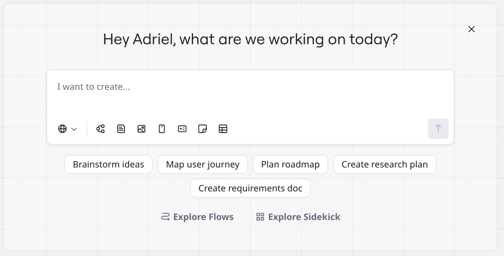
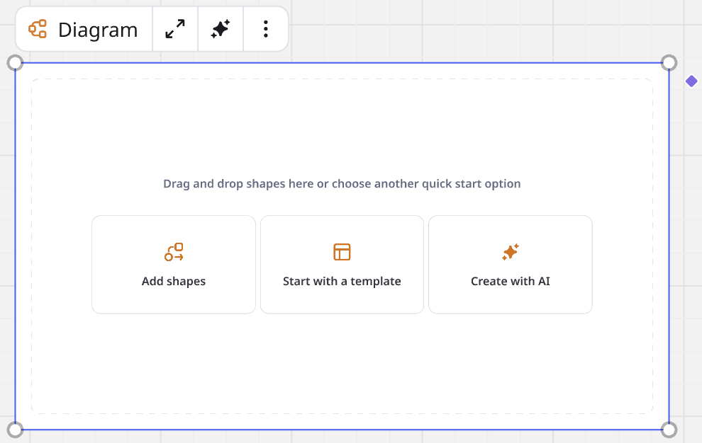

Miro has consolidated all Format agents into one [Sidekick](../miro-ai/06-sidekicks-overview.md) experience. Previously, each Format, like [Docs](12-docs-in-miro.md), [Slides](13-miro-slides.md), [Data Tables](14-tables.md), or [Prototypes](../miroverse/prototyping/03-miro-prototypes.md), had its own dedicated AI agent.

Now, Sidekicks unify the AI-creation experience into one, seamless interface. To generate any Format using AI, [open the Sidekick panel](#access-sidekicks) and start prompting.

## All Formats lead to Sidekicks

Sidekicks now handle all generative tasks previously managed by standalone Format agents. Now, you use one Sidekick as your principle co-creator on the canvas. You can select a Format to begin, or prompt the Sidekick with a description of your task, and the Sidekick will recommend the best Format.

 *Sidekicks is now where all AI-assisted content creation takes place*

:::tip
The canvas is your prompt. You can select objects on the canvas to give context to your prompts.
:::

A unified Sidekick experience ensures that you spend less time choosing tools, and more time shaping ideas. With one intelligent assistant, you get faster, more consistent results, and a smoother route from idea to polished, shareable execution.

The standalone Format agents are sunset.

:::note
Sidekicks consume AI credits. For more information, including credit allocation per plan, see [Miro AI credits](../../plans-billing/billing-and-payments/03-miro-ai-credits.md).
:::

## Key benefits

- **Seamless switching**
  Tasks may require more than one Format. For example, you want a Doc that describes a Diagram. The unified Sidekick experience ensures that context persists between tools.
- **Reduce ambiguity**
  As your AI co-creators, Sidekicks ask follow-up questions to clarify your prompts.
- **Knowledge access**
  The Sidekick prompt box enables you to connect Knowledge resources from your organization.
- **AI chat history**
  Chat history enables Sidekicks to learn your team's workflow and how large projects are structured. You can also review what options you have previously explored, and resume on any board.
- **Iteration**
  Iterate without leaving the conversation. For example, 'Add a column' to a table, or 'Make the header bigger' for a prototype. Commit your artifact(s) when the job is done.

## Access Sidekicks

The primary way to access Sidekicks is above the [Creation bar](../working-on-the-board/02-miro's-new-simplified-user-interface.md). Click **Sidekicks**.

 *The **Sidekicks** button above the Creation bar opens the Sidekick panel.*

The Sidekick panel opens and offers suggestions to get started. You can start prompting, or inside the prompt box select a Format.

:::tip
You can also deselect a Format. For example, you chose **Create image** and changed your mind, or you have completed image creation; click **Create image x** to reset Format selection, and choose your next Format.
:::

You can also access Sidekicks from the following entry points:

- **New board**
  Every new Miro board opens with the Sidekick modal ready to assist you.
  *New Miro boards help you get started with Sidekicks*
- **Creation bar**
  Click **Formats and Flows**, or **Tools, Media, and Integrations (+)**.

Some Formats, like Diagram and Slides, include **Create with AI** as a starting option when you add a new, blank instance to the canvas.

 *Some Formats start with multiple options, including **Create with AI**.*

## Enterprise Sidekick feature access

For Enterprise subscriptions, Company admins can toggle access to Sidekicks for all team members in their organization.

Go to **Admin Console** > **Miro AI** > **Sidekicks**.

:::note
Pre-existing settings are not removed. As Company admin, if you previously had Format Agents toggled off, then the new Sidekicks toggle is already off for your organization. No action is needed unless you want to change this setting.
:::

:::tip
Share this article or communicate the Sidekick enhancements to members in your org.
:::
