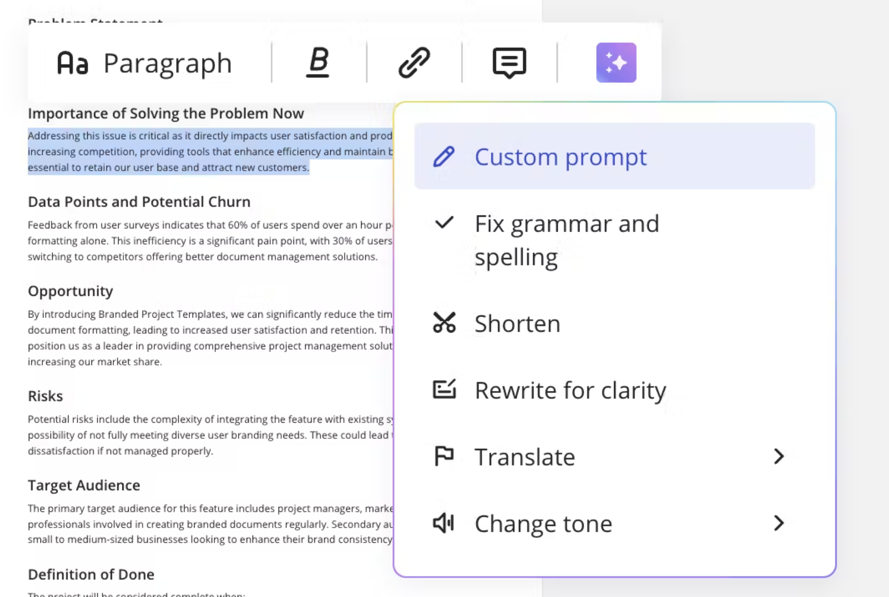
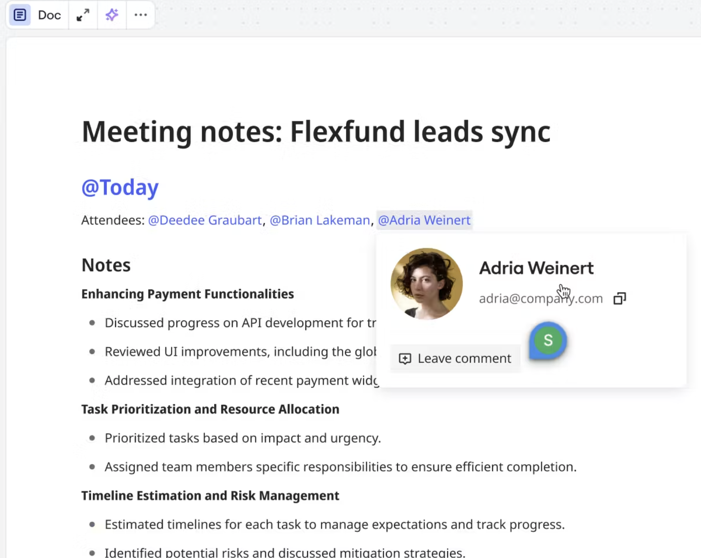

Bring your board content into the more structured format of a Doc. Using objects on the canvas as your input, you can create summaries, research reports, and product briefs to kickstart assembling and analyzing your insights.

## Access Docs

To add a new Doc:

1. Click on the **Tools, Media and Integrations** () icon.
2. Search for and select **Docs**.
3. Click anywhere on the canvas to add it.

Docs are also included in some board templates.

*Adding a new document from the Docs icon*

You can also add a Doc with Miro AI:

1. Click on the **Miro AI** () icon in the Creation toolbar.
2. Select the **Formats** tab.
3. Select **Doc**.
4. Enter your prompt or select from the pre-existing options and customize to meet your needs.
5. Press **enter** to create your Doc with Miro AI.

*Adding a document with Miro AI*

To add a Doc from the context menu:

1. Create a Doc by selecting multiple objects on the board (like Stickies).
2. Click on the **Miro AI** () icon in the context menu.
3. Select **Document** from the submenu.
4. Pick a template or use a **Custom Prompt**.
5. The Doc is created and placed on the board.

*Adding a Doc via the context menu*

To add a Doc with Miro AI:

1. Open the **Create with AI** panel.
2. Select the **Document** content type.
3. Use one of the predefined prompts or write your own.
4. Select objects (such as Sticky notes) on the board to add context, if needed.
5. Click **Generate document**.
6. Your generated document will appear in a blank area on the canvas.

To add a Doc from a Microsoft Word (.docx) file:

1. Click on the **Tools, Media and Integrations** (**+**) icon.
2. Search for and select **Upload**.
3. In the Upload panel, select **My device**.
4. Navigate to and select the file you'd like to import.
5. Alternatively, drag and drop a file onto your Miro board to upload.
6. In the dialog, select **Convert to doc**.
7. Click **Select**.
8. The file will be converted into a Miro Doc and is ready for editing.

## Miro Docs templates

There are currently four templates available when you begin a new Doc: Product Brief, Retrospective Summary, Meeting Notes, and Research Synthesis.

When you create a new doc and select a template, the template is added to the doc.

*An example of the retrospective summary template*

## Context menu in Docs

When working on Docs, you can find additional functions through the context menu, accessed by clicking on the **vertical three dots** (**...**) icon. The context menu allows you to access features like copying, syncing, moving and prioritizing layers, exporting and sharing, commenting, and saving as a template.

## Working on Docs in Focus mode

Docs can be opened in Focus (full screen) mode when you want to focus solely on the Doc you're working on and not other content on the board. To access this mode, click on the **Focus mode icon** above the Doc you're working on.

*The Docs Focus mode icon*

Focus mode still includes the context menus for formatting text. It removes the board background, removing potential distractions.

Focus mode for Docs can also be accessed in the Miro mobile app. While you can view Docs on the board on mobile, editing of Docs is only possible in Focus mode.

To exit focus mode, click the **Ideate on canvas** button at the top of the screen.

### Character limit

Miro Docs can contain up to 80,000 characters. If you need more space, you can create additional Docs on the same board and split your content accordingly. This helps you stay within the limit while still organizing all of your information in one place.

## Copying content to Docs

You can drag and drop the following content from your board to a Doc:

- Sticky note
- Text box
- Image
- iFrame
- Preview
- Table
- Timeline
- Diagram

:::note
Docs converts Sticky notes and text boxes into a bulleted list.
:::

*Drag and drop data widgets into a Doc*

### Diagrams in Docs

When you drag and drop a Diagram into a Doc, Miro creates a [synced copy](../working-on-the-board/11-synced-copies.md). This means that changes made to the original Diagram on the board will be reflected in the copy within the Doc, but not vice versa. To change the copy content, modify the content of the original Diagram.

This ensures that your documentation remains up-to-date with the latest visual information.

### Other content behavior in Docs

For widgets with focus mode, like a Table, you can still access immersive mode when the widget is inside a Doc. Dimensions scale to fit and scroll inside the Doc.

You can also drag the content outside the Doc to place it back on your board.

## Formatting in Docs

Docs offers basic text formatting options for making your text easier to read, scan, and understand.

To open the formatting toolbar, simply select the text you want to format within your document:

*Formatting toolbar in Docs*

You can format text with bold, underline, italic, or strikethrough styles by clicking on the **Text styles** icon:

*The Docs Text style icon menu*

You can select from a variety of heading and list types to add structure to your doc:

*Headings and list type submenu in Docs*

You can format paragraphs or other blocks within Docs as Callouts. Select the block you'd like to turn into a Callout, then select **Callout** from the text formatting menu. This applies an icon and colored background to that block. Change the background color using the selector in the upper right of the block.

You can also add a Callout from the slash menu (either by typing **/** or clicking the **+** icon and then selecting **Callout**).

### Using emojis

Enhance your documents with emojis by typing a colon "**:**" followed by at least two characters of the desired emoji's name. For example, "**:sm**". Miro will then display a popup with relevant emoji suggestions, allowing you to quickly select and insert the appropriate emoji.

:::note
Note that emojis are inserted as Unicode text, which may result in slight visual variations across different operating systems.
:::

To just use a colon in a normal way, type the colon "**:**" and then continue typing without selecting any emoji.

## Using keyboard shortcuts in Docs

Keyboard shortcuts can be used to apply heading and list types to text (these shortcuts can be viewed in the paragraph types submenu):

Turn into: **Using cmd + opt + \{number\}**

- 0 -> Paragraph
- 1 -> Heading 1
- 2 -> Heading 2
- 3 -> Heading 3
- 4 -> Bulleted list
- 5 -> Numbered list
- 6 -> Checklist

You can also use keyboard shortcuts for block selection: press Escape once to enter block selection mode, then:

- **shift + up/down** -> expand your selection
- **cmd + opt + up/down** -> move your selection up and down

Here are other features in Docs that can be accessed via hotkeys:

|  |  |
| --- | --- |
| **⌘** + **enter** | Focus text selection menu |
| **⌘** + **shift** + **X** | Toggle strikethrough |
| **⌘** + **shift** + **U** | Add link |
| **⌘** + **E** | Toggle inline code |
| **⌘** + **,** | Check/Uncheck checklist item |
| **⌘** + **/** | Open block context menu |
| **⌘** + **D** | Duplicate selected blocks |
| **⌘** + **I** | Copy link to a block |

You can access the full list of keyboard shortcuts from within the Miro app by clicking on the **Help and resources** icon in the bottom right corner of the screen:

*Keyboard shortcuts through the Help and resources icon*

## Using Miro AI in Docs

Using Miro AI to edit your Docs is a great way to speed up the editing process and create more concise, easy-to-read documents.

You can use Miro AI to modify highlighted text in a Doc.

*Prompt Miro AI to modify highlighted text in a Miro Doc*

To use inline text to prompt Miro AI, highlight text in your Miro Doc. From the context menu, on the far right select **Improve with Miro AI**. From the drop-down menu, select **Custom prompt** or any of the available prompts.

You can also use Miro AI to make changes to the entire Miro Doc. To do this, click the **More menu** above the Doc, then select **AI assistant**. From the drop-down menu, select any of the available prompts. A new Miro Doc with the AI generated text will be created next to your original Doc.

## Collaboration in Miro Docs

Miro Docs allows for real-time collaboration with other users. As with other content on the canvas, cursor tracking is enabled, allowing you to see where in the Doc other users are working.

Inline comments are also possible, with the ability to @mention other users (which notifies them both in the app and via email). Both comment threads and comment reactions are also enabled.

### User chips in Miro Docs

User chips enable you to provide details about users inside a Doc. For example, add @user chips for key team members or stakeholders.

To add a user chip, in a Miro Doc type '@'. Continue to type the username to filter results, or select a user from the drop-down menu that opens.

*Add user chips anywhere in a Miro doc*

Hover over an @user chip to see information about the user.

*User chips include information about the user*

User chips behave separately from mentions in a comment, for example user chips do not send notifications to a given user.

### Date chips in Miro Docs

Date chips can be added to Miro Docs by typing the **@** symbol. A menu will appear, with date options available below the User options.

*Add date chips in Miro Docs*

You can also add a date chip by typing the **@** symbol along with entering a date (including references like "next week" or "next month"). A menu will appear to select the date as you type.

*Another way to add date chips in Miro Docs*

If you want to change the date of the chip, click on the chip and a calendar picker will appear.

*Change the date of a chip in Miro Docs*

## Copying, sharing, and exporting Docs

Docs can be copied between boards, but they are not synced for future changes. In other words, any edits made to the Doc on one board will not be made on any additional boards the Doc was copied to or from.

Docs can be shared via link with other users.

Docs can be exported to PDF or Markdown formats from the **More icon** () in the Context menu.

When exporting Docs to Markdown, all text formatting will be converted. Any board objects embedded into the Doc will be replaced with a link back to the widget in the original Doc.
