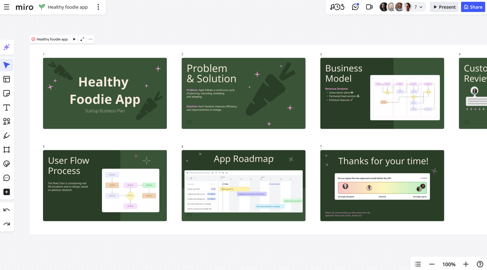

Miro Slides enables you to create interactive and engaging presentations directly in Miro. Use Miro Slides to present your deck with real-time co-creation, annotation, and brainstorming.

*Miro Slides enables co-creation and participation on a structured slide deck.*

## Feature description

Combining an interactive canvas with a structured slide deck, Miro Slides helps teams share and present more effectively.

Miro Slides is ideal for team meetings and workshops that require a dynamic and interactive slide deck.

### Effortless Slide management & presentation

Your Slides can include many types of content, for example text, sticky notes, and videos. You can also add Formats like Diagrams and Tables. You can drag and drop content from your Miro board onto your Slides. Apply styles to your entire deck, and drag Slides on your board to reorder your presentation.

You can also select existing frames on your board to transform other content into Slides.

Miro Slides includes a **Focus mode** for creating and editing one Slide at a time. Add presenter notes, and import and reorder your slides in **Focus mode**.

*Reorder your Slides and add presenter notes in **Focus mode**.*

You can start your presentation in focus mode, select **Present** and the presentation starts from the current slide, or directly from the board.

:::note
In the Miro mobile application, focus mode is unavailable for Slides.
:::

## Using Miro Slides

This section describes how to create, manage, and present Miro Slides.

### Create Miro Slides

To create a Slide, do one of the following:

- On a Miro board, from the creation bar select (**+**) **Tools, Media, and Integrations** > **Slides**.
- On a Miro board, select a frame or multiple frames. From the context menu select **Turn into slides**.
- From a Spaces sidebar, select (**+**) **Create new** > **Slides**.
- From your Miro dashboard, select **+ Create new** > **Slides**.

To add a Slide to your presentation, select the plus button (**+**) next to any Slide. You can also drag and drop a frame from anywhere on your board onto the deck.

:::tip
You can also add a Slide from the Slides context menu. Select the vertical three dots, then select **Add new frame**. For more information about the context menu, see How to manage Slides.
:::

### Share a Slides deck (Beta)

You can copy a unique link to share your Slides deck with team members, or external stakeholders without a Miro account.

1. From the Slides context menu, click the vertical three-dots to open the **More** menu.
2. Click **Share and export** > **Share presentation**.
   The **Share presentation** modal opens.
3. Click **Copy link**.
4. (Optional) Click **Preview in browser** to see how anyone with your link views your Slides deck.
5. Share your link.

:::note
For external users to access, your board must be public. External users can only view the Slides deck in presentation mode, and no other content on the canvas. If board permissions allow, external users can also comment.
:::

:::tip
You can also copy a shareable link in [Focus mode](#manage-slides). In the top-right, click the vertical three-dots to open the **More** menu. Then click **Share presentation**.
:::

### Import PDF files to Miro Slides

Import a presentation deck from another tool to Miro Slides.

Ensure that you export your deck from the other tool as a PDF file.

Follow these steps from the canvas:

1. To import the PDF to Miro Slides, do one of the following:
   - **Drag and drop**
     Drag the PDF file onto the Miro board.
   - **Upload**
     On the creation bar, select **Tools, Media, and Integrations**. Then search for and select the **Upload** tool. Select **My device**, and navigate to your PDF file and complete the upload.
2. On your board, select the PDF.
3. From the context menu, select **Turn into slides**.

:::tip
You can also import in focus mode. [Create Slides](#create-miro-slides), then from the context menu open focus mode. In the upper right, click the **Import** button.
:::

### Export Miro Slides to PDF

To export Miro Slides to PDF, select your presentation to access the context menu. Select the vertical three dots, then select **Share and export** > **Export as PDF**.

Choose the export file quality, then select **Export**.

:::tip
You can also export in focus mode. In the upper right, click the **vertical three dots** () icon and then select **Export as PDF**.
:::

### Export slides as image

You can export a given slide from your Miro Slides deck as JPG, PDF, or SVG. For example, you want to embed the slide in another document.

To export a slide as image, follow these steps:

1. From your deck, select a slide.
   The slide context menu appears.
2. In the context menu, click the vertical three-dots to open the **More** menu.
3. Click **Share and export** > **Export as image**.
   The **Export image as** modal opens, and the selection window contains your slide.
4. In the **Export image as** modal, select whether to export as JPG, PDF, or SVG.
   For JPG, you can optionally specify resolution as **Small**, (Default) **Medium**, or **Large**.
5. Click **Export**.

### Import PowerPoint files to Miro Slides

You can import a PowerPoint (.PPTX) file and convert your presentation to fully editable Miro Slides. The maximum file size to convert is 50MB.

Follow these steps:

1. On the Creation bar, click (**+**) **Tools, Media and Integrations**.
2. Click **Upload**.
   You can optionally search, or in the menu scroll to **Media** > **Upload**.
   The upload menu opens.
3. Click **My device**.
   Your computer file manager opens.
4. Select your PowerPoint (.PPTX) file.
5. Click **Open**.
   The **Import options** dialog opens.
6. Click **Convert to slides**.
   The PowerPoint file loads on your Miro board. Load time can vary depending on the file size, and size of images in the file.

:::tip
Alternatively, drag-and-drop your PowerPoint (.PPTX) file from your file manager onto the Miro board in your browser. The **Import options** dialog opens. Select **Convert to slides**.
:::

:::note
From **Import options**, if you click **Add as file**, then the presentation loads as view-only reference. The maximum file size to add as file is 30MB.
:::

### Manage Slides

Miro Slides includes a context menu that enables you to manage your presentation. You can start your presentation, apply styles, and export your Slides deck to PDF.

The Slides context menu includes the following options:

- **Start presentation**
  Opens the fullscreen presentation mode with a streamlined creation bar. Also includes a toolbar with Slide navigation, participation, and reactions tools, and preferences. You can end and share the presentation.

  > 💡 You can also share your presentation within the Miro mobile app. Select the Slides frame, then click the Play arrow in the toolbar.
- **Focus mode**
  Opens a dedicated view for editing Slides. You can add and arrange Slides. To exit **Focus mode**, select **Go to canvas**.
- **Precise resizing**
  When working in Focus mode, you can precisely resize widgets within your slides using pixel dimensions. **More information:** See [Precise resizing](../essential-tools/01-precise-resizing.md).
- **Multi-lane presentations**
  Slides can be arranged in multiple lanes within the same presentation, allowing easier organization and rearrangement of individual Slides. To add new lanes, hover below an existing lane and click the plus icon, or just drag and drop slides.
  *Multi-lane example of Slides*
- **More**
  A vertical three dots menu that includes styles, export as PDF, duplicate, linking, and more.

:::tip
You can copy and share a link to your Slides on the board or directly to **Focus mode**. From the **More** menu, select **Copy link**, or **Copy focus mode link**.
:::
