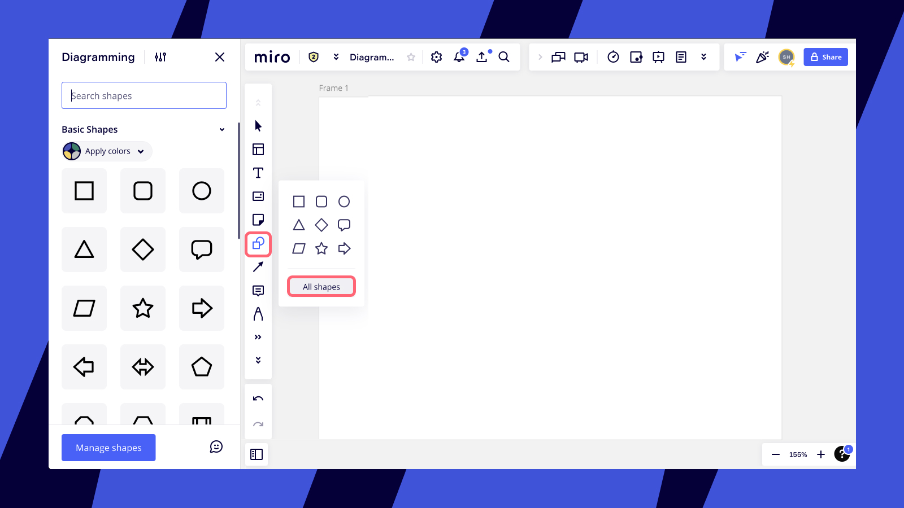
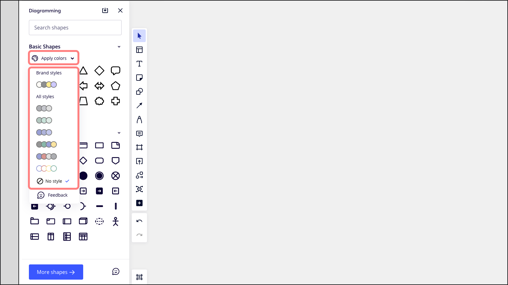
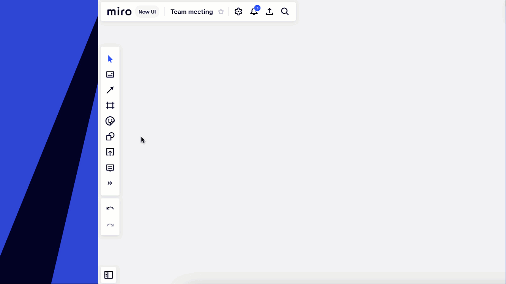
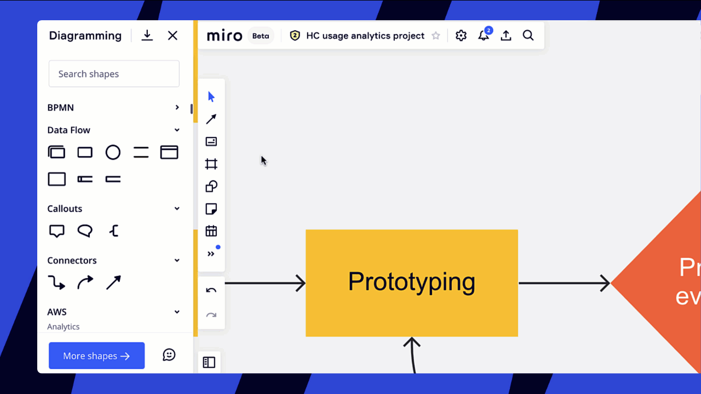
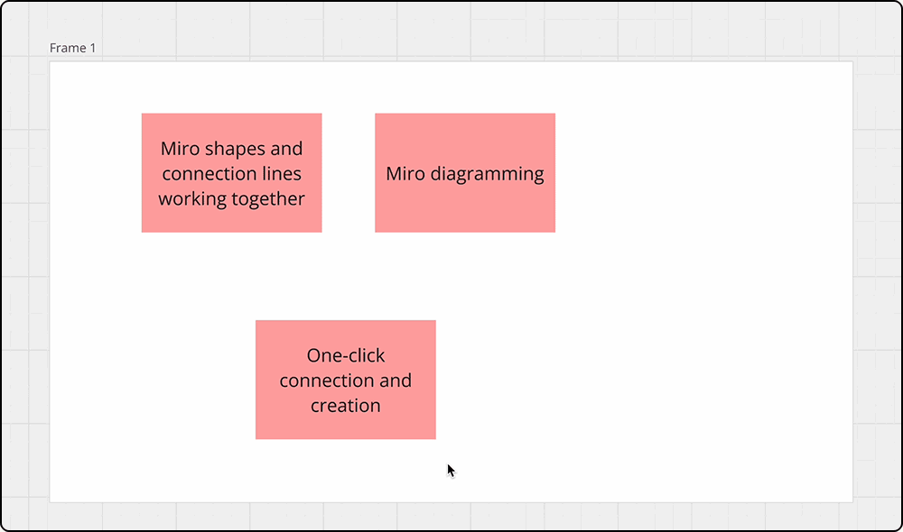
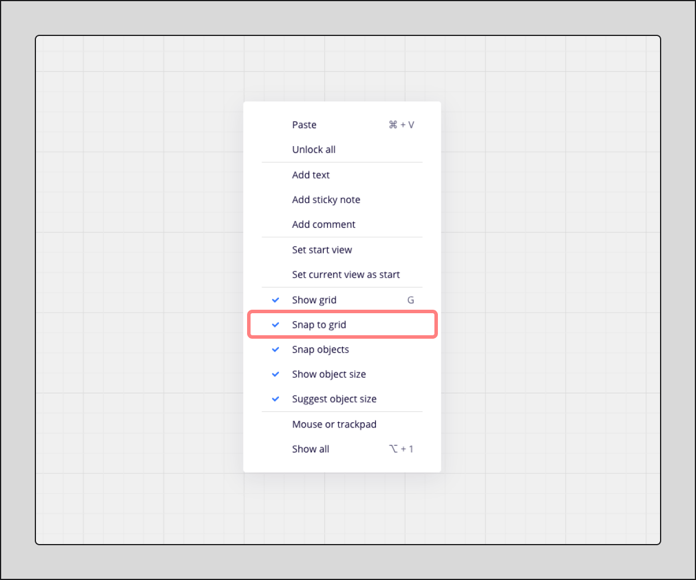
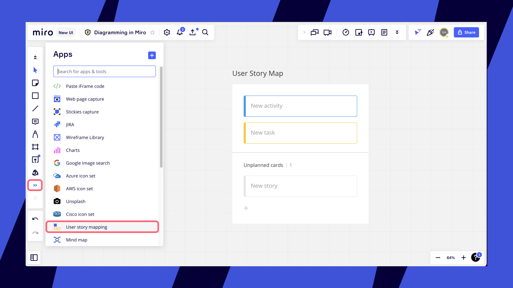

Miro provides a comprehensive suite of tools for all stages of your mapping and diagramming process, functioning as an all-in-one solution. You can start creating diagrams from scratch using intuitive tools and frameworks or leverage Miro's extensive library of pre-made templates. Miro's collaborative features allow you to easily share your work with teammates, enabling real-time discussions and refinements directly on the board. When your diagram is complete, you can effortlessly export and present it.

:::tip
Enhance your diagramming skills by taking the [Miro Academy course on technical diagramming](https://academy.miro.com/technical-diagramming-in-miro).
:::

## Create your first diagram in Miro

Miro offers a variety of tools and smart diagramming capabilities to suit your mapping and diagramming needs. This section will guide you through the available features to help you get started.

To begin, access the shape library by selecting the **shape tool** on the toolbar and then clicking **All shapes**. This action will open the **Diagramming** panel on the left-hand side of your board.

*Diagramming shapes panel on the left side of the board*

To add a shape to your board, you can either click the desired shape in the panel or drag and drop it onto the board.

You can customize your shape library by adding new shape packs:

1. In the Diagramming panel, click **Manage shapes**.
2. A list of available shape packs will appear. Check the box next to each shape pack you want to add to your library. Basic shapes, Flowchart, and Connectors are available for all users. Other specialized shape packs such as BPMN, Data flow, AWS, Azure, Cisco, etc., are available on Business, Enterprise, and Education plans (see the [Shape packs](#available-shape-packs) section for a full list).
3. Scroll down in the Diagramming panel to see and use the newly added shapes.

When you hover over a shape in the panel, its name or purpose (e.g., *Predefined Process* for a flowchart shape) will be displayed.

*Adding new shape packs to the Diagramming panel*

### Available shape packs

Miro offers a wide range of shape packs to support various diagramming requirements. These are organized by plan availability:

| **Available for all plans** | **Available for Business, Enterprise, and Education plans** |
| --- | --- |
| - Basic shapes - Callouts - Connectors - Flowchart | - AWS - Azure - BPMN - Cisco - Cloudflare - DFD (Data Flow Diagram) - Electrical Engineering - ERD (Entity Relationship Diagram) - Google Cloud - Kubernetes - Process Engineering - Salesforce - UML - Value Stream Map (VSM) - VMware |

#### Use custom shapes

> **Available for**: Business, Enterprise, and Education plans

In addition to the built-in shape packs, you can also create, save, and reuse [custom shapes](../../../product-announcements/diagramming/04-upload-your-own-custom-shapes-for-diagramming-(beta).md) in your diagrams. This feature allows you to tailor your visual library to specific project needs or branding requirements.

### Use Miro Diagrams for advanced diagramming

Miro’s smart diagramming capabilities extend beyond basic shape drawing, offering powerful tools to help you create structured and professional diagrams more efficiently.

[Miro Diagrams](02-miro-diagrams.md) provides a dedicated environment and features to enhance your diagramming experience, allowing you to:

- Work in **Focus mode**, a distraction-free workspace specifically tailored for diagramming tasks.
- Utilize **Miro AI** to generate diagrams automatically from a short text description.
- Organize complex diagrams using **layers**, which allow you to show or hide specific content by topic or team.
- Convert existing shapes on your board into a connected diagram with a single click.
- Maintain consistent structure and alignment with features like **snap-to-grid** and **automatic object dimensions**.

You can choose to start by manually adding shapes or let Miro AI assist with the initial creation, all while ensuring your diagrams remain neat, organized, and easy to manage.

### Apply diagram themes for consistent styling

To create visually appealing and consistent diagrams, you can choose from several pre-defined diagram Themes before you start building.

You can find diagram Themes in the Diagramming panel (**Shapes** > **All shapes**). The Themes are located just above your shape packs. Selecting a theme at the beginning of your diagramming process can save significant time on manual styling later.

:::tip
For a fully branded look, you can create diagrams using your organization’s [brand style](../../../administration/get-started-as-a-miro-admin/04-brand-center.md#how-to-apply-your-brand-style-to-diagram-shapes) (available on applicable plans) for professional-looking presentations and boards.
:::

:::note
Diagram Themes are currently available for Basic shapes and Flowchart shapes.
:::

*Selecting a Diagram Theme from the Diagramming panel*

### Organize diagrams with Swimlanes

Swimlanes help divide diagrams into logical areas, which is essential for visualizing complex information and designing for clarity and accountability. They are commonly used in Flowcharts, BPMN diagrams, and UML diagrams to show interdependencies, connections, and handoffs between different lanes (representing roles, departments, or phases). Adding Swimlanes can improve process efficiency by helping you identify waste and inefficiencies.

Swimlanes are included in the Flowchart, BPMN, and UML shape packs. To add Swimlanes:

1. Open the Diagramming panel by selecting **Shapes** > **All Shapes**.
2. Ensure the Flowchart, BPMN, or UML shape pack is enabled.
3. Find the Swimlane objects (vertical, horizontal, or Pools for grouping multiple lanes) within the respective shape pack.
4. Drag and drop a swimlane object onto your board to start.

Hover over the Swimlanes on your board to find control points. These allow you to add more lanes, resize them, or move them.

:::warning
Content placed within swimlanes currently cannot be [locked](../../working-on-the-board/17-locking-content-on-the-board.md) or [aligned using standard alignment tools for multiple objects](../../working-on-the-board/08-structuring-board-content.md#aligning). However, you can [group](../../working-on-the-board/08-structuring-board-content.md#grouping) objects within swimlanes, which is especially useful for BPMN and other process diagrams.
:::

*Working with Miro swimlanes*

### Add annotations with Callouts

Use Callouts to annotate your diagrams and draw attention to important information without cluttering the main visual. To add Callouts:

1. Open the Diagramming panel by selecting **Shapes** > **All Shapes**.
2. Ensure the **Callouts** shape pack is enabled.
3. Drag and drop a Callout shape onto your board.

*Adding Callouts to a diagram*

Callouts are available in three different shapes: a standard callout, a speech bubble, and brackets. You can connect the tail of a Callout to an object on the board; this will lock it, so if you move either the object or the Callout, the tail remains connected.

*Different types of Callouts connected to shapes*

### Create Entity Relationship Diagrams (ERD)

> **Available for**: Business, Enterprise, and Education plans

Miro's entity relationship modeling tool allows you to visualize high-level data models using three basic concepts: entities, attributes, and relationships. This is particularly useful for database design and system architecture.

Key features when creating ERDs include:

- Apply alternating colors to attributes within entities for better readability.
- Entities can be configured with single, double, or triple columns to represent different types of information.
- Easily add rows (attributes) to an entity using the **+** sign that appears or via the floating panel above or below the entity.
  
  *Adding and modifying entities in an ERD*
- Connect cardinalities (representing the numerical relationship between entities) to entities (shapes) or to specific attributes (rows within the shape).
- Connection lines automatically use cardinality notations when working with ERD entities.
  
  *Connecting entities with cardinality notations*

### Use quick diagram creation tools

Miro offers several tools to help you create, transform, and connect shapes more efficiently, speeding up the diagramming process.

:::note
Basic shapes are available for all users. Access to specialized [diagramming shape packs](#available-shape-packs) is available on Business, Enterprise, and Education plans.
:::

**Create and connect shapes quickly:**

1. Select the shape icon from the left-hand toolbar.
2. Choose any shape and add it to your board by clicking or dragging.
3. To duplicate an existing shape, select it and press **Enter**.
4. Alternatively, hover over a blue dot that appears on the sides of a selected shape. This will show you where a new shape or a connection line can be quickly created. Click the dot to add the suggested line or new shape.
5. If you want to connect a shape to another existing object that isn't automatically suggested, click and drag the blue dot, then draw the connection line to the target object as usual.

*One-click creation and connection of shapes in Miro*

**Insert a shape between two connected shapes:**

If you need to add a step or more information into an existing flow, you can easily insert a shape on a connection line.

1. Click the connection line between two shapes.
2. Click the **Insert shape** icon (it looks like a small shape with plus signs) in the object toolbar that appears.
3. Choose the object type you'd like to insert from the dropdown.

Note that there must be enough space on the connection line between the two connected objects for the insert shape option to be available.

*Inserting an object between two connected shapes*

**Switch object types easily:**

You can instantly change the type of an object on your board using the **Switch type** feature. This allows you to transform one object (e.g., a [sticky note](../../essential-tools/14-sticky-notes.md), [text box](../../essential-tools/16-text.md), or [card](../../essential-tools/02-cards.md)) into another type of object (like a [shape](../../essential-tools/11-shapes.md) from your diagramming packs) while preserving its content and connections where possible.

1. Click the object on the board that you wish to transform.
2. Click the **Switch type** icon on the object's context menu.
3. Select or search for a new object type from the dropdown menu.

The Switch type feature is available for basic shapes and shapes from [diagramming shape packs](#available-shape-packs).

*Searching for and transforming an object to a different type using the Switch type menu*

### Use Object dimensions for precision

Object dimensions help you create professional diagrams faster and with greater precision by allowing you to create objects of the same size consistently across your board.

This feature works with all Miro objects except for lines.

**How to enable Object dimensions:**

1. Click the three-dot menu () in the top-left corner of your board.
2. Navigate to **View** > **Object dimensions**.
3. Toggle **Object dimensions**.

**How to use Object dimensions:**

Once enabled, when you create new objects or resize existing ones, you will see a blue rectangle displaying the object’s width and height in pixels. Blue guidelines will also appear to help you align the current object with other objects on your board when their dimensions match.

*Working with Object dimensions to resize and align shapes*

### Customize background grid view

You can change the grid view on your board to help you create and align content with more precision.

1. Click the three-dot menu () in the top-left corner of your board.
2. Navigate to **View** > **Grid**.
3. Choose between three options: **None** (no grid), **Line grid**, or **Dot grid**.

*Selecting a background grid view in board settings*

The **Line grid** enables easier navigation and alignment with small squares. Both Line and Dot grids support snapping objects to the grid.

### Use Snap to grid

When a grid view (Line or Dot) is enabled, you can also enable snapping to the grid. To do this:

1. Right-click on an empty area of the canvas.
2. Toggle the **Snap to grid** option in the context menu.

*Toggling Snap to grid from the canvas context menu*

When Snap to grid is active, objects you add or move on the board will automatically snap to the nearest grid lines or dots, helping you align them accurately.

*Objects snapping to the grid lines*

To temporarily disable snap to grid while dragging an object, hold down **Cmd** (on macOS) or **Ctrl** (on Windows).

### Use Smart guides for alignment

Smart guides help you align objects with other objects on the board and maintain equal spacing.

1. Click the three-dot menu () in the top-left corner.
2. Navigate to **Preferences**.
3. Ensure **Align objects** is toggled on.

*Enabling Smart guides (Align objects) in Preferences*

When you place or move an object on the board, blue smart guidelines will appear, suggesting alignments (vertical or horizontal) with other objects and indicating equal spacing.

*Smart guides showing alignment and spacing suggestions*

### Customize your diagram elements

You have extensive options to customize the appearance of your diagrams. You can change a shape's fill color, border color, opacity, and text formatting. For connection lines, you can configure their type (e.g., straight, elbow, curved), color, thickness, and add text labels.

:::tip
You can also change the color of AWS icons in the AWS shape pack for Diagramming. This option is unavailable for icons pre-2025.
:::

Don't forget that you can also incorporate [cards](../../essential-tools/02-cards.md) and [sticky notes](../../essential-tools/14-sticky-notes.md) into your diagrams. You can easily [convert these objects](../../working-on-the-board/20-switch-type.md) to shapes (and vice versa) while often retaining their style and content.

You can select multiple items on the board to customize them simultaneously. Learn more about [how to select and move multiple objects](../../working-on-the-board/10-working-with-objects.md).

*Changing the style of a flowchart in Miro*

:::tip
For the best diagramming experience on tablets, try using [smart drawing](../../essential-tools/12-smart-drawing.md), which automatically converts your hand-drawn sketches into clean Miro shapes.
:::

## Shortest path with connector lines

To ensure that your connector line always finds the shortest path between objects, drag the connector line to the object body until a blue outline appears, then commit your connector.

The blue outline indicates a center-to-center connection. A center-to-center connection finds the shortest path between the connected objects. For example, you move a connected object to another position on the canvas.

:::note
If you do not commit the connector line, then the blue outline disappears after a few seconds. To refresh the blue outline, withdraw and drag the line again to the object body.
:::

 *Make a center-to-center connection to always find the shortest path between connected objects.*

A connection line at the edge of an object creates an anchor connection. Anchor connections do not adjust to find the shortest path when you move a connected object.

## Create Mind Maps

Miro provides a dedicated [Mind Map](../../advanced-tools/03-mind-map.md) tool to help you express ideas, map out flows, and organize brainstorming sessions. Start with a central concept and easily create branches and child nodes. You can choose between vertical or horizontal layouts for your mind map.

*Example of a Miro mind map*

With the Mind Map tool, you can change the position of child nodes, align them with a single click, customize the color and style of your mind map, reassign nodes, and link dependencies. [Learn more about Miro Mind Maps](../../advanced-tools/03-mind-map.md).

## Develop User Story Maps

The interactive [User Story Map framework](../../advanced-tools/07-user-story-mapping.md) in Miro offers an effective way to quickly add and organize user stories. You can start with a few cards and easily develop your User Story Map using intuitive controls and shortcuts. [Learn more about User Story Mapping in Miro](../../advanced-tools/07-user-story-mapping.md).

*Example of a User Story Map in Miro*

## Use pre-made templates

Kickstart your diagramming process with Miro's extensive Template Library. You'll find numerous professionally designed templates for various use cases, including customer journey maps, wireframes, organizational charts, flowcharts, and much more. You can access the library from your Miro board (via the "Templates" button on the toolbar), from your dashboard, or directly on the [Miro templates page](https://miro.com/templates/). You can choose to use a pre-filled template as a starting point or begin with a blank version of the template structure.

*Exploring mapping and diagramming templates in the Miro Template Library*

## Leverage apps and integrations

Enhance your mapping and diagramming capabilities by exploring Miro integrations with other services. Open the [Miro Marketplace](https://miro.com/marketplace/category/mapping-diagramming-apps/) and filter by the "Mapping & Diagramming" use case on the left to discover relevant apps.

*Mapping & Diagramming apps category in the Miro Marketplace*

Here are some apps that can enrich your diagramming experience:

- **Icon databases:** Apps like [Iconfinder](https://miro.com/marketplace/iconfinder/?backUrl=%2Fmarketplace%2Fcategory%2Fmapping-diagramming-apps%2F) and [Unsplash](https://miro.com/marketplace/unsplash/?backUrl=%2Fmarketplace%2Fcategory%2Fmapping-diagramming-apps%2F) allow you to easily search and add icons and images to visualize your technical diagrams without leaving Miro. Note that other icon packages are also available directly within the Miro [Shape library](#available-shape-packs).
- **Clusterizer by Refractive Strategy:** This app helps you organize tagged sticky notes and cards by automatically building diagrams from them. Select a group of tagged items, open Clusterizer, and click Build. The app will create replicas of your items connected with lines. [Learn more about Clusterizer](https://www.youtube.com/watch?v=vD6QYIdH2Ok).
- **Wireframes:** Miro has its own [Wireframe library](../../miroverse/prototyping/02-prototyping-library.md) that includes approximately 60 UI elements and a variety of interactive icons. You can easily change the style and type of these elements and link them to other objects on your board.
- **Task management integrations:** If your diagrams involve tasks or issues, Miro’s integrations with [Jira Cards](../../../integrations-apps/atlassian/03-jira-cards.md), [Asana Cards](../../../integrations-apps/asana/01-asana-cards-(legacy).md), and [Azure Cards](../../../integrations-apps/microsoft/03-azure-cards.md) can be beneficial. Import tasks and issues directly onto your boards as interactive cards to keep your workflow centralized in Miro.
- **Diagramming (Marketplace link):** This link in the Marketplace will direct you to Miro's native [diagramming library and tools](#create-your-first-diagram-in-miro).
- **Smart Diagrams by Appgami:** This app provides a library of pre-made, customizable diagram templates. [Learn more about Smart Diagrams](https://miro.com/marketplace/smart-diagrams/?backUrl=%2Fmarketplace%2Fcategory%2Fideation-brainstorming-apps%2F).

## Collaborate and refine your diagrams

Miro is built for collaboration. You can [share your Miro boards](../../sharing-boards/03-sharing-boards-and-inviting-collaborators.md) easily via email, by creating a public link, or by inviting specific team or project members to collaborate online in real-time or asynchronously.

Another effective way to share your diagrams is to [embed your Miro boards](../../import-and-export/export/02-embed-a-miro-board.md) into other platforms like [Confluence](../../../integrations-apps/atlassian/01-miro-for-confluence.md), [Jira issues](../../../integrations-apps/atlassian/02-miro-for-jira-cloud.md), [Microsoft Teams channels or chats](../../../integrations-apps/microsoft/microsoft-teams/05-embed-miro-boards-in-microsoft-teams.md), or [Trello cards](../../../integrations-apps/atlassian/20-trello.md). This allows users, even those not registered with Miro (depending on sharing settings), to view, comment, or even edit your diagrams directly within those applications.

Use [comments](../../facilitation-tools/asynchronous-tools/01-comments.md) and [sticky notes](../../essential-tools/14-sticky-notes.md) to leave feedback, ask questions, and initiate discussions directly on the diagram. To stay updated, set up integrations with [Slack](../../../integrations-apps/more-integrations/14-slack.md) or [Microsoft Teams](../../../integrations-apps/microsoft/microsoft-teams/05-embed-miro-boards-in-microsoft-teams.md) to receive notifications about board activity through different channels.

*Using comments to collaborate on a Miro board*

## Export and present your diagrams

When your diagram is ready, Miro offers several ways to present and share it:

- **Present directly in Miro:** Use Miro's presentation mode or simply guide collaborators by having them follow your view on the board. Hover over your avatar and click "Bring everyone to me" to have collaborators see what you are working on. [Learn more about presenting in Miro](../../facilitation-tools/04-attention-management.md).
- **Export your diagram:** Export your diagram as PDF, or as image. Export as image supports JPG, PDF, and SVG. To learn how, see [Miro Diagrams](02-miro-diagrams.md#export-your-diagram-as-image). To embed your diagram, ensure your [sharing settings](../../sharing-boards) allow the appropriate viewers.
  *In the Diagram Format context menu, export your diagram as PDF, image, or embed.*

:::tip
**Export your board:** You can optionally [export your entire board](../../import-and-export/export/03-how-to-export-your-board.md) or selected elements to share outside of Miro. Export supports JPG, PNG, PDF, and CSV depending on the content type, or [RTB](../../import-and-export/export/05-how-to-save-board-backup.md) as a board backup file.
:::

## Use keyboard navigation for mapping and diagramming

Miro provides a comprehensive set of keyboard commands to enhance navigation and interaction with widgets and diagrams on a board. Efficient navigation is particularly crucial for complex diagrams with many elements and connectors.

### Keyboard navigation commands

#### Linear navigation (sequential)

Press **Tab** to move to the next element on the board or **Shift + Tab** to move to the previous element sequentially.

#### Spatial navigation (directional)

Use **Cmd + Arrow keys** (on macOS) or **Ctrl + Arrow keys** (on Windows) to move focus to elements based on their spatial arrangement (up, down, left, or right) relative to the currently selected object.

### Navigate complex diagrams with the connector list

Many diagrams consist of intricate networks of connectors. For users relying on keyboard navigation or assistive technologies, Miro provides an organized list of all connectors linked to a selected object.

#### Access the connector list for a selected object

- **On macOS:** Press **Cmd + .** (Command key and period key).
- **On Windows:** Press **Ctrl + .** (Control key and period key).

This shortcut will display a categorized list of connectors associated with the currently selected object, grouped by:

- **Incoming:** Connectors with an arrow pointing towards the selected object.
- **Outgoing:** Connectors with an arrow pointing away from the selected object.
- **Circular:** Connectors that connect the object to itself.
- If a connector has two arrows (bi-directional), it will appear in both the Incoming and Outgoing groups.

#### Navigate within the connector list

- Press **Tab** to switch focus between the Incoming, Outgoing, and Circular groups within the list.
- Use the **Up** and **Down arrow keys** to navigate through the individual connectors within the currently selected group.
- Press **Enter** to move keyboard focus from the list to the actual selected connector on the board.
