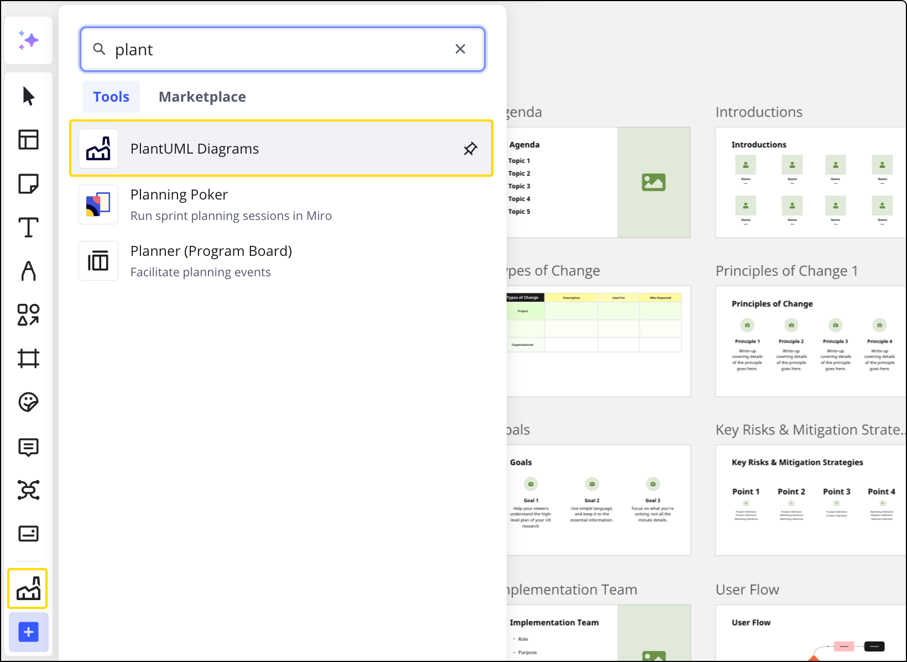
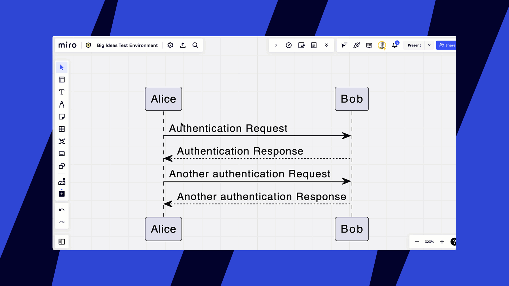

PlantUML app for Miro allows you to create and embed code-based diagrams directly into your Miro boards. This integration streamlines your workflow by enabling you to generate diagrams from text-based descriptions without leaving your Miro environment.

## Install the PlantUML app

You can install the PlantUML app to start creating diagrams on your Miro boards. The app is available from the Miro Marketplace or directly from your Miro board's creation toolbar.

1. In the Creation toolbar, select **Tools, Media and Integrations** (**+**). The **Tools, Media and Integrations** panel opens.
2. In the **Tools** tab, search for and select **PlantUML Diagrams**. The **PlantUML Diagrams** panel opens.
3. If prompted, select a Miro team and click **Install & authorize** to complete the installation.

:::warning
Non-admin users can't install apps if this is not allowed in team settings.
:::

You can also install the app directly from the [Miro Marketplace](http://miro.com/marketplace) or by following [this link](https://miro.com/marketplace/plantUML/).

## Create and add diagrams to Miro boards

Once the PlantUML app is installed, you can find it on the Creation toolbar. Follow these steps to create and add your diagrams:

*PlantUML Diagrams app on the Creation toolbar*

1. Open the PlantUML app from the Creation toolbar.
2. Enter your PlantUML code in the editor. The app includes a default sample to get you started. As you type or modify the code, the diagram preview on the right panel updates automatically.

*Changing a diagram*

3. Adjust the size of the code editor panel by dragging its right edge if needed.

*Changing the size of the code editor*

4. When your diagram is ready, click **Add to board** (or a similarly named button). This action generates an image of your diagram and places it on your Miro board.

*Adding a diagram to a board*

After adding the diagram to the board, you can download the image or [share the board with your collaborators](../../sharing-boards/03-sharing-boards-and-inviting-collaborators.md).

## Edit existing diagrams

You can edit PlantUML diagrams that are already on your Miro board. To modify a diagram:

1. Click the diagram on the board to select it.
2. Click the **PlantUML** icon in the Creation toolbar. The PlantUML editor will open with the diagram's code.
3. Make your changes to the code.
4. Click **Update Diagram**. You will be returned to your Miro board, and the diagram will be updated with your changes.

*Editing a diagram directly from Miro*

## Additional Information

For detailed information on PlantUML syntax and capabilities, refer to the [official PlantUML documentation](https://plantuml.com/). You can also quickly access the PlantUML documentation from the link in the bottom left corner of the app panel within Miro.

### Data processing

When you create or edit a PlantUML diagram, Miro uses the latest stable release of the official PlantUML library, running on a dedicated, Miro-hosted PlantUML server. This server is stateless — it does not persist or store any user data. When a diagram is rendered, the application frontend sends encoded diagram instructions directly to the server. The server processes this input and returns a generated image of the diagram.

Both the original diagram code and the resulting image are embedded within Miro board widgets, in the same way as other board content. This ensures full compatibility with Miro's collaboration and content management features.

All data remains fully within Miro’s infrastructure—nothing is shared or transmitted outside the Miro environment. All data generated by the app is encrypted with customer's Enterprise Key Management (EKM) keys.
