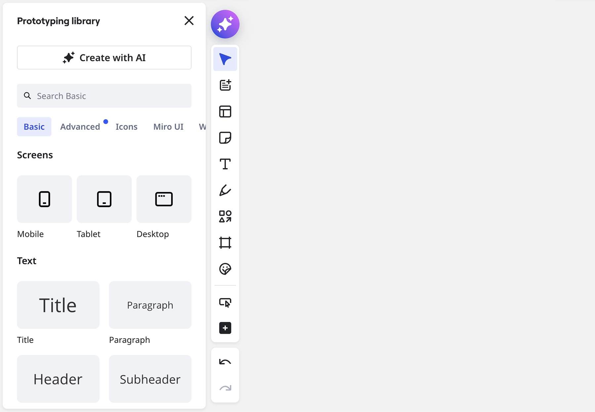

Use the **Prototyping library** to build prototype layouts directly on the Miro canvas. The library includes screens, UI components, and icons that help you visualize flows and structure ideas early.

You can use the Prototyping library to create static prototypes. Features such as **advanced components, connector lines, and interactive preview** require the **Miro Prototypes add-on**.

*The Prototyping library has all you need to manually create single and multi-screen flows in Miro*

## Open the Prototyping library

1. On the canvas, from the [Creation bar](../../working-on-the-board/02-miro's-new-simplified-user-interface.md) click **Tools, Media and Integrations** ().
2. Search and find Prototyping,then click**Prototyping library.**
3. The**Prototyping library** panel opens**.**

## What’s in the prototyping library

The Prototyping library is organized into tabs. All users can use the library to assemble static prototype layouts using screens, UI components, and icons.

:::tip
For AI-generated prototypes and interactive flows, use the Prototyping library together with [**Miro Prototypes**](../../miroverse/prototyping/03-miro-prototypes.md).
:::

### Screens

**Screens** are ready-made frames for prototyping flows. You can add **Mobile**, **Tablet**, or **Desktop** screens to your canvas and build layouts by dragging UI elements onto them.

#### **Work with screens**

- **Show or hide** the screen chrome (so it can look like a device frame or a simple frame)
- **Rotate** a screen
- **Resize** a screen by dragging to extend its height (vertical only)

### UI components

UI components are common interface elements you can drag onto screens, such as buttons, inputs, navigation bars, and form elements.

You can:

- Drag components onto a screen
- Resize and reposition components
- Edit text and basic styling from the context menu

:::note
Context menu options vary depending on which element you select.
:::

When the [**Miro Prototypes add-on**](../../miroverse/prototyping/07-miro-prototypes-add-on.md) is enabled, some UI components become **interactive in Preview mode**. For example, buttons, sliders, input fields, and dropdown menus respond to user actions based on the connector lines you’ve defined.

Some component sets, such as **Advanced components**, are available only with the **Miro Prototypes add-on**. If the add-on isn’t enabled, these components may appear in the library with an indicator.

### Icons

The **Icons** tab includes a searchable icon library you can use in prototypes.

#### **Add or replace an icon**

1. Drag an icon from the library onto the canvas.
2. Select the icon to update its color from the context menu.
3. Choose **Replace icon** to swap it with another icon without changing its position or size.

### Wireframes (legacy)

The **Wireframes** tab contains legacy wireframe elements. These elements remain available and editable for existing boards, but newer prototypes should use screens and UI components from the Prototyping library.

## Connector lines and interactivity (Miro Prototypes add-on)

**Connector lines** let you define navigation between screens in a prototype. When the [**Miro Prototypes add-on**](../../miroverse/prototyping/07-miro-prototypes-add-on.md) is enabled, you can create connector lines between elements and screens to build multi-step flows.

Connector lines also enable **interactive preview**. In Preview mode, connected screens behave like a clickable flow, and screens scroll vertically if they extend beyond the viewport. Without the add-on, connector lines and interactive behavior aren’t available.

:::tip
Some UI elements show a lightning icon when added to a screen. In multi-screen flows, drag the lightning icon to create a connector line between screens.
:::

## FAQ

**Can I add my own elements to the library?**

No. You can add custom content to your board, but you can’t add new elements to the Prototyping library itself.

**What’s different about the new Prototyping library?**

The Prototyping library supports screens, updated UI components, icons, and click-through interactive previews. Advanced and interactive features require the Miro Prototypes add-on.

**Is the Prototyping library available without the add-on?**

Yes. You can use the Prototyping library to create static prototype layouts. Interactive connections and advanced components require the Miro Prototypes add-on.

**Is the Wireframe library still available?**

Yes. The Wireframes tab is available in the Prototyping library, and existing wireframes continue to work.
