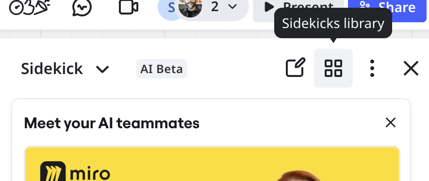
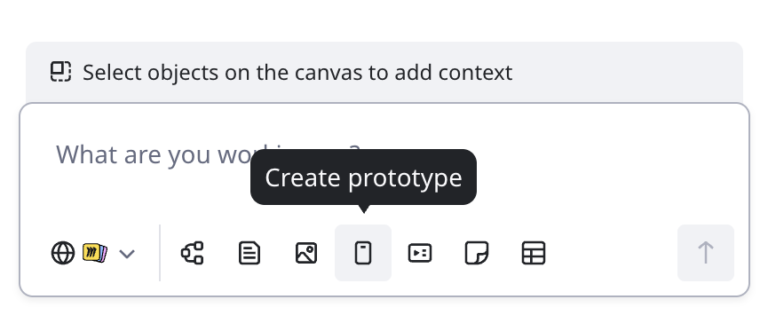
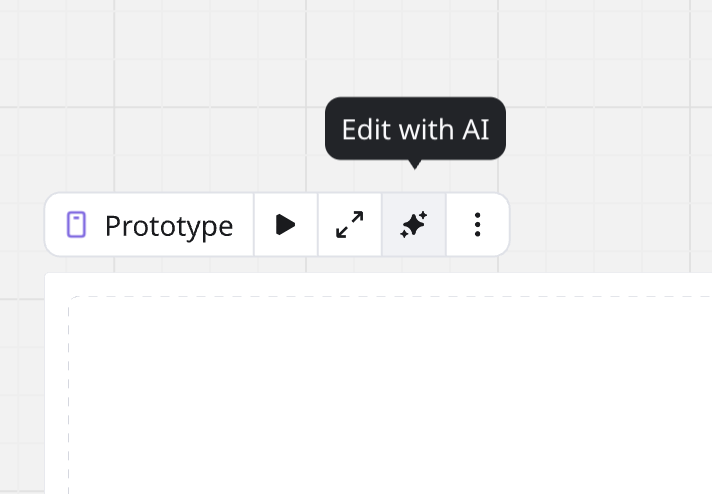
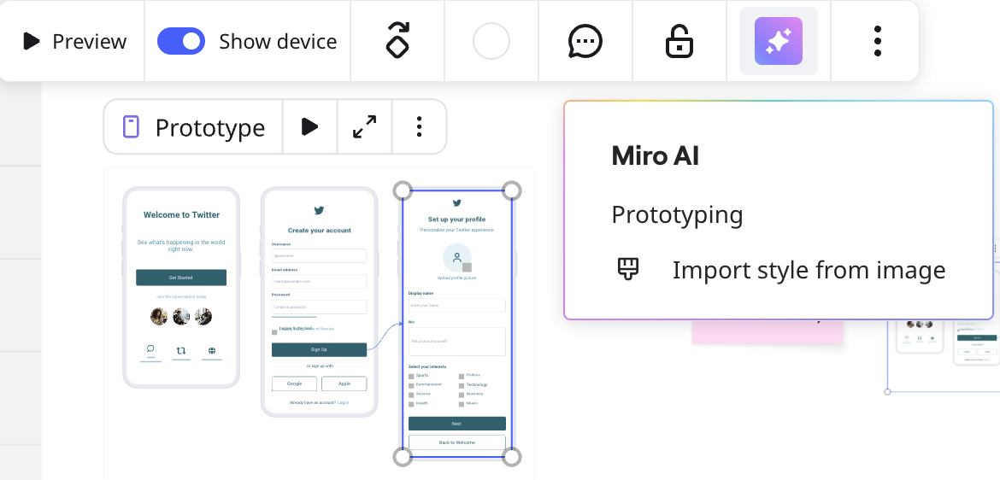
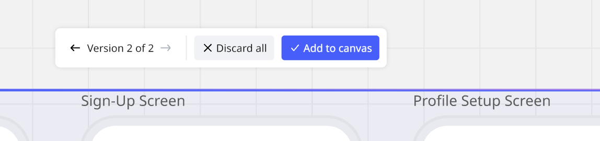
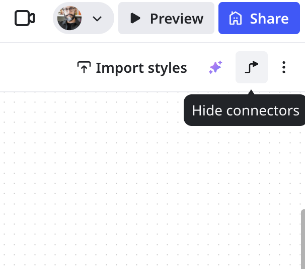
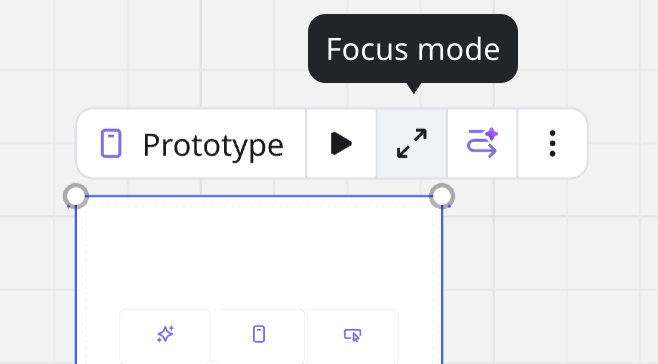
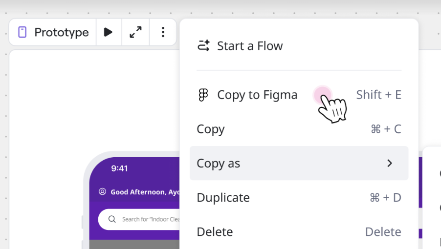
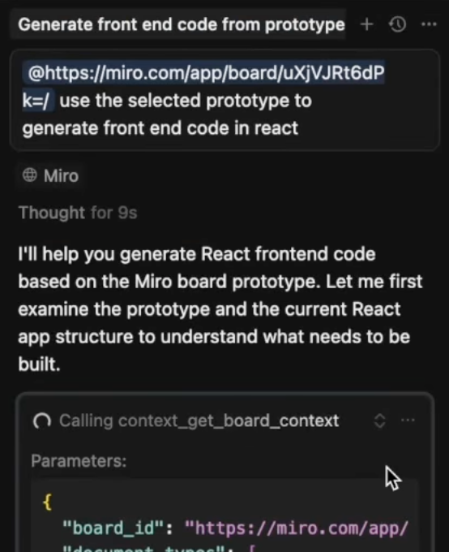

Miro Prototypes enables you to create user interfaces directly on the Miro canvas.

You can generate single and multi-screen flows, refine your designs and apply styles, and preview an interactive simulation of your prototype. Build your design in multiple, specific prompts that generate each element of your prototype. You can also refine your prompts to avoid starting over.

This article explains how to use Miro Prototypes features. For general information Miro Prototypes, see [Miro Prototypes overview](../../miroverse/prototyping/01-miro-prototypes-overview.md).

:::note
The Prototypes experience has moved to Sidekicks. Now in public beta, some users already have the updated, Sidekicks input for AI-generated prototypes. If you see your experience does not match the documentation, see [Create a prototype with Sidekicks (Beta)](#create-a-prototype-with-sidekicks-beta). Content that explains how to [refine and iterate](#iterate-your-prototype) your output is still applicable.
:::

**More information:** See [FAQ](#faq).

## Create a prototype with Miro AI

This section describes how to start prototyping with Miro AI. To learn how to get started manually, see [Prototyping library](../../miroverse/prototyping/02-prototyping-library.md).

### Start from scratch

1. On a Miro canvas, above the [Creation bar](https://realtimeboardhelp.zendesk.com/hc/articles/20967864443410) click [**Sidekicks**](../../miro-ai/06-sidekicks-overview.md).
   The **Sidekick** panel opens.
2. Click **Sidekicks library**.
   *Access Protoype in The Sidekicks library*
3. Click **Formats** > **Prototype**.
4. Specify whether you want to begin with a text prompt or a screenshot.
5. Specify the device type.
6. Specify a single screen, or a multi-screen prototype.
7. Follow the on-screen instructions to write your prompt or upload a screenshot. In the response box, you can optionally use the suggestion tags to begin your prompt.
8. Finish your prompt then click the **Send** arrow, or press **ENTER** on your keyboard.
   Miro AI generates a draft prototype on the canvas.
9. (Optional) To stop generation, on your prototype click **Stop**.
10. (Optional) To [iterate on your prototype](#iterate-your-prototype), continue to prompt in the **Prototype** panel.
    Each iteration [creates a version](#select-a-prototype-version) of your draft prototype.
11. On your draft prototype, choose one of the following:
    - **Apply to canvas**
      Your prototype is now editable on the canvas.
    - **Discard all**
      Your draft is removed from the canvas. You can refine your prompt and repeat steps 7–9.

### Create a prototype with Sidekicks (Beta)

Some users may already have the updated Sidekicks input for prototyping. This section describes how to start prototyping with Sidekicks. To learn how to get started manually, see [Prototyping library](../../miroverse/prototyping/02-prototyping-library.md).

:::tip
Create your prototype with Sidekicks to enable AI chat history, which recalls your prompts, enabling you to review options you have previously explored and resume on any board. For more information, see [Sidekicks evolve AI creation in Miro](https://help.miro.com/hc/articles/33881743175954), and [Miro Prototypes overview](../../miroverse/prototyping/01-miro-prototypes-overview.md).
:::

:::note
The Sidekicks update for Prototypes is currently in public beta. If your experience does not match the documentation in this section, see [Create a prototype with Miro AI](#create-a-prototype-with-miro-ai).
:::

Follow these steps:

1. On a Miro canvas, above the Creation bar click Sidekicks.
   The Sidekicks panel opens.
2. In the prompt box, click **Create prototype**.
   Sidekicks is ready to help you create your prototype.
   *Start your prototype in the Sidekicks panel.*

   > **TIP:** Alternatively, you can open the **Sidekicks** panel and start prompting immediately. Ensure that you state explicitly that you want to create a prototype, e.g. "Create a prototype for a checkout flow."

   > **TIP:** You can also access the Prototype Format from **Tools, Media and Integrations (+)** in the Creation bar.
3. Write your prompt to describe the prototype you want Sidekicks to generate.
4. Click the up arrow, or press **ENTER** on your keyboard.
5. (Optional) To stop generation, on your prototype click **Stop**.
6. (Optional) To [iterate on your prototype](#iterate-your-prototype), continue to prompt in the **Prototype** panel.
   Each iteration [creates a version](#select-a-prototype-version) of your draft prototype.
7. On your draft prototype, choose one of the following:
   - **Apply to canvas**
     Your prototype is now editable on the canvas.
   - **Discard all**
     Your draft is removed from the canvas. You can refine your prompt and repeat steps 3–6.

:::tip
Start small and be specific. Fewer screens generated at once produces more accurate results in less time. Explicitly state key elements you want for each screen, like buttons, sections, or actions.
:::

:::tip
Apply several prototype drafts to the canvas. You can compare and explore design decisions and continue to refine the best option.
:::

:::tip
A prototype can take 1–3 minutes to generate, depending on prompt complexity and content size. If your prototype takes longer to generate, simplify your prompt or reduce the number of screens.
:::

### Use canvas as prompt

Select content on the canvas to use in your prompt. For example, you have a design brief in a Doc or on Sticky notes. Prototypes can use the content as context to create your prototype.

Follow these steps:

1. Select canvas content. For example, a Doc or Sticky notes. You can optionally select multiple objects.
2. On a Miro canvas, above the [Creation bar](https://realtimeboardhelp.zendesk.com/hc/articles/20967864443410) click [**Sidekicks**](../../miro-ai/06-sidekicks-overview.md).
   The **Sidekick** panel opens.
   NOTE: If you have the updated...
3. Click **Sidekicks library**
   *Access Protoype in The Sidekicks library*
4. Click **Formats** > **Prototype**.
5. Select **A text prompt**.
6. Specify device type, then specify single or multi-screen.
   The response box shows the number of objects you selected in step 1.
7. Follow the on-screen instructions to generate your prototype.
   Miro generates your prototype from your specifications and selected canvas content.

:::tip
You can prompt Miro AI to use specific canvas objects by selecting them on the canvas. For example, in your prompt you can say "Use screenshots on the canvas as guides for building the prototype." If you have many similar objects on the canvas, describe explicitly which objects you want Miro AI to use.
:::

## Iterate your prototype

Your first draft may not be the perfect result. Before you apply your draft to the canvas, you can continue to iterate and create multiple versions of your prototype.

1. [Create a prototype](#create-a-prototype-with-miro-ai) with Miro AI. Do not apply to canvas.
   The next step in the **Prototype** panel is **What would you like to do next?**
2. Choose **Edit prototype**.
3. For a multi-screen flow, choose the screen you want to iterate.
4. In the response box, describe the changes you want.
5. Click the up arrow or press **Enter** on your keyboard.
   Miro generates [a new version](#select-a-prototype-version) of your prototype.

:::note
Edits can only be made one screen at a time.
:::

:::tip
Use canvas context.Select Docs, diagrams, Sticky notes, or other board content to prompt Miro AI.
:::

### Iterate with a screenshot as visual context

Before you apply your prototype to the canvas, you can use a screenshot, or another prototype already on the canvas, as context to iterate your draft.

1. [Create a prototype](#create-a-prototype-with-miro-ai) with Miro AI. Do not apply to canvas.
   The next step in the **Prototype** panel is **What would you like to do next?**
2. Click **Edit prototype**.
3. For a multi-screen flow, choose the screen you want to iterate.
4. Select a screenshot on the board.
5. In the response box, describe the changes you want based on the selected screenshot.
6. Click the up arrow or press **Enter** on your keyboard.
   Miro generates [a new version](#select-a-prototype-version) of your prototype.

:::tip
You can use existing prototype screens already on the board as visual context. Create and apply a prototype to the board. Select a screen.
:::

## Edit with AI

For any prototype already applied to the canvas, you can continue iterating with Edit with AI. Use Edit with AI to refine instead of rebuild, for example you want create a dark mode version of an existing prototype.

Follow these steps:

1. For any prototype applied to the canvas, in the context menu click **Edit with AI**.
   The **Sidekick** panel opens.
    *Edit with AI enables you to refine an existing prototype.*

   > **NOTE:** You can use Edit with AI and Sidekick with one prototype at a time. To switch, close the Sidekick and reopen **Edit with AI** from the target prototype.
2. In the prompt box, describe the changes you want to make. For example, "Convert to dark theme".
3. To execute your prompt, click the up-arrow button or press ENTER on your keyboard.
   Sidekick generates your refined prototype.
4. (Optional) Continue to prompt Sidekick and iterate on your prototype. You can [select a version](#select-a-prototype-version) before you apply your prototype to the canvas.
5. Above the drafted prototype, click **Add to canvas**.

:::note
For Miro Prototypes, all AI-enhanced prototyping features are available only with the [Prototypes add-on](../../miroverse/prototyping/07-miro-prototypes-add-on.md).
:::

## Apply prototype styles from a screenshot

If you want your prototype to match an existing website or product, you can extract styles from a screenshot and apply them to your screens.

1. [Create a Prototype](#create-a-prototype-with-miro-ai).
2. Select your prototype screen(s).
   The context menu appears.
3. Click on the **Miro AI** icon in the **Context menu**.
4. Select **Import style from image**.
   *Import styles and apply them to your prototype*
5. Choose the image file you’d like to import the style from.
6. The styles are applied to your prototype.

:::tip
Apply styles first or last.To ensure all elements in your prototype conform to a theme, apply your theme early in your prototype design, or as a final step.
:::

## Convert screenshots into prototypes you can edit

You can convert a screenshot of a design or competitor UI into an editable prototype.

1. Add the screenshot to your Miro board.
2. Click the image to open the context menu.
3. Click the **Convert to** button and then click **Prototype**.
4. In the submenu, choose the device type (Mobile, Tablet, Desktop, Custom).
5. AI will rebuild it as an editable prototype—text, buttons, layout, and other elements.
6. You can now modify, add to, or edit this version as needed.

:::tip
Convert a screenshot into an editable mockup. Then prompt Miro AI to continue editing. You can also use a screenshot as context in your prompt, and generate a prototype. To use multiple screenshots, select all screenshots and copy as image. Then use the image as context in your prompt.
:::

## Select a prototype version

Each refinement creates a prototype version. As you refine your prototype, the version selector is above the prototype draft.

Click the arrows to toggle between versions. When you have chosen a version, click **Add to canvas**. Your version is applied to the canvas.

 *Choose which refinement, or version, of your prototype to add to the canvas.*

:::tip
Before you click **Add to canvas**, you can select a screen from any version and copy-paste to the canvas. This ensures that you can save a screen from a version you may discard.
:::

:::warning
When you click **Add to canvas**, all other versions cannot be retrieved.
:::

## Preview a prototype

From the prototype context menu, click **Preview**. The preview loads.

:::tip
To get a fully interactive Prototype preview, use connector lines between screens.
:::

## Add Connector lines to make a prototype interactive

To add or change connections between objects in your Miro Prototype:

1. Click an element (like a button) on your prototype.
2. Drag the **Connector Line** icon to the screen it should link to.
3. In Preview mode, clicking the element will take users to the linked screen.

### Hide connector lines

For prototypes with many connectors, to simplify the view of your prototype you can hide the connectors.

In canvas mode, select your prototype. From the context menu, click the three-dots. Then select **Hide connectors.**

In [Focus mode](#focus-mode), in the top-left click the **Hide** | **Show** connectors button.

 *Hide or show connectors in Focus mode.*

Repeat the same steps to show the connectors.

:::tip
Use hotkeys to hide or show connectors. On your keyboard press **Shift + E**. In Canvas mode, to use hotkeys ensure you select your prototype.
:::

## Focus mode

Miro Prototypes includes Focus mode. Enter Focus mode to work on your prototype without any other board content in view, enabling you to work distraction-free.

To enter Focus mode, select your Miro Prototype. In the context menu, click **Focus mode**.

*Focus mode enables a distraction-free Miro Prototypes experience.*

## Copy to Figma

Provide your prototype to designers in Figma without rebuilding manually. You can copy your prototype, or individual screens.

### Copy a prototype to Figma

1. Click the prototype frame.
   The Format context menu appears.
2. In the context menu, click the vertical three-dots to open the **More** menu.
3. Click **Copy to Figma**.
   Miro copies your prototype to your clipboard.
   *Copy your prototype to Figma.*
4. In Figma, paste your prototype. You can use (Windows) **Ctrl + V** or (MacOS) **Command + V** hotkeys.
   Your prototype pastes in Figma.

### Copy a prototype screen to Figma

1. Click to select a prototype screen.
   The widget context menu appears.
2. In the context menu, click the vertical three-dots to open the **More** menu.
3. Click **Copy to Figma**.
   Miro copies your prototype screen to your clipboard.
4. In Figma, paste your prototype. You can use (Windows) **Ctrl + V** or (MacOS) **Command + V** hotkeys.
   Your prototype screen pastes in Figma.

## Share a link to your prototype (Beta)

You can copy a unique link to share with team members or external stakeholders without a Miro account.

1. From the prototype context menu, click the vertical three-dots to open the **More** menu.
2. Click **Share and export** > **Share prototype**.
   The **Share prototype** modal opens.
3. Click **Copy link**.
4. (Optional) Click **Preview in browser** to see how anyone with your link views your prototype.
5. Share your link.

:::note
For external users to access, your board must be public. External users can only access the prototype in Focus mode, and no other content on the canvas. They can interact with hotspots and prototype flow. If board permissions allow, external users can also comment.
:::

:::tip
You can also copy a shareable link in [Focus mode](#focus-mode): In the top-right, click the vertical three-dots. Then click **Share prototype**. And in [Preview mode](#preview-a-prototype): In the top-right, click **Share prototype**.
:::

## Export your prototype

You can export your prototype as SVG. You can also use the Miro [Model Context Protocol (MCP) Server](../../../integrations-apps/miro-mcp-server-beta/01-miro-mcp-server-overview.md) to export to a codebase AI editor; teams can use the export to generate working code and accelerate development.

### Export to SVG

1. From the prototype context menu, click the vertical three-dots.
2. Click **Share and export** > **Export as image**.
   A selection window, and the **Export image as** modal, opens.
3. Adjust the selection window so it covers your prototype.
4. In the **Export image as** modal, select **Vector** – **SVG**.
5. Click **Export**.

:::tip
You can export a single screen as SVG from the context menu. Select a screen in your prototype. From the context menu, click the vertical three-dots, then click **Export as image**. The **Export as image** modal opens, then select **Vector –** **SVG**.
:::

:::note
For prototype SVG exports with images, if you import the SVG to other software for editing, like Figma, images are replaced with placeholders.
:::

### Export with Miro MCP Server

To export your prototype to a codebase AI editor, for example Cursor, include the board URL with board ID in your prompt. Ensure that you provide instructions to generate code based on the prototype.

To learn more about using Miro MCP, see [Miro MCP Server overview](../../../integrations-apps/miro-mcp-server-beta/01-miro-mcp-server-overview.md).

*A codebase AI editor like Cursor accepts a Miro board URL with board ID to generate code based on your prototype.*

## FAQ

**What is Miro AI Prototyping?**

Miro Prototypes is a paid add-on for creating interactive, clickable prototypes directly on the Miro canvas. AI can generate screens from canvas context like sticky notes, screenshots, diagrams, or text prompts. You can then refine them with drag-and-drop components and brand styling, connect them into multi-screen flows with hotspots, and preview in full-screen for feedback. It’s designed to help teams explore ideas quickly, align early, and make confident decisions before investing in high-fidelity design or code.

**Who is Miro Prototypes for?**

Anyone involved in product development from Product Managers, Designers, Developers, Consultants, Marketers, and more. Especially helpful for non-designers to bring ideas to life and for designers to explore multiple directions quickly.

**How is this different from tools like Figma?**

Miro Prototypes are built for the earliest stage of product development. They make it simple for anyone in the team, from product managers and engineers to marketers and designers, to turn canvas context like notes, PRDs, and flows into clickable prototypes in one step. Because they are intentionally lower fidelity, teams can explore options together, gather input from more voices, and align on value and direction faster before moving into polished design work in tools like Figma.

**How is this different from vibe coding tools?**

Vibe coding tools are designed to generate production-ready applications, often one screen at a time and requiring technical setup or debugging. Miro Prototypes serve a different purpose. They let teams quickly map and visualize the entire flow, click through it together, and align on the right solution before code ever gets written. This makes collaboration easier, speeds up alignment, and helps teams avoid costly rework later.

**Can I use Miro Prototypes without enabling Miro AI?**

Miro AI unlocks the fastest way to generate and refine prototypes in Miro. You can still edit, connect, and preview flows without Miro AI, but enabling it gives you access to powerful AI generation and iteration.

**Is my data used to train your AI models?**

No. Your content stays private and secure. Miro doesn't use your prompts or outputs to train AI models or share them with third-party AI providers. Only AI interactions from Free Plan users may be used to improve Miro’s AI features. This does not apply to Education, Starter, Business, or Enterprise users. For more information, see [Miro AI quality improvements](../../miro-ai/19-miro-ai-quality-improvements.md).

**How does pricing work?**

Miro Prototypes is a paid add-on for Starter, Business, and Enterprise plans. Pricing includes a base fee plus flexible AI credits that you can scale to your team’s needs. Credits are shared across all Miro AI features, including Prototypes. Explore [pricing options](https://miro.com/pricing/).

**Is there a way to precisely resize widgets within my prototypes?**

Yes. You can use precise resizing for pixel-perfect widgets when working in Focus mode. **More information:** See [Precise resizing](../../essential-tools/01-precise-resizing.md).

**Can I use AI chat history with Prototypes?**

Yes. To use AI chat history with Prototypes, you must create your prototype with Sidekicks. AI chat history is a feature of Sidekicks, a unified AI-creation experience in Miro. However, boards with restricted access do not save your AI chat history. For more information, see [Sidekicks evolve AI creation in Miro](https://help.miro.com/hc/articles/33881743175954).
