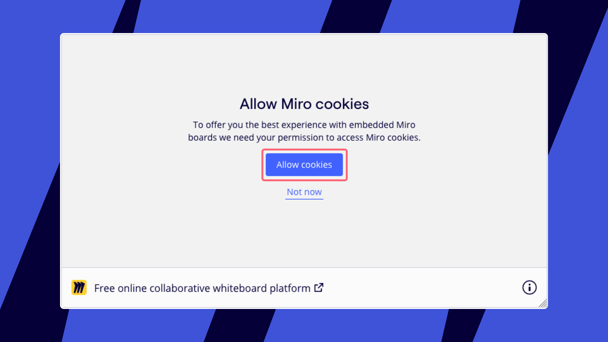
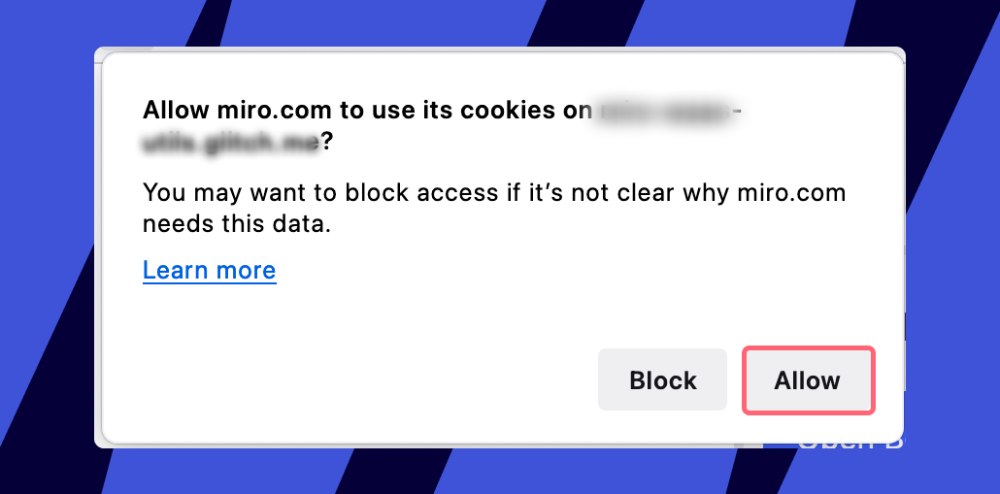
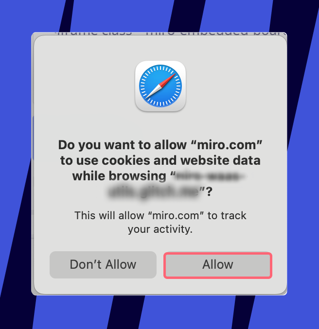
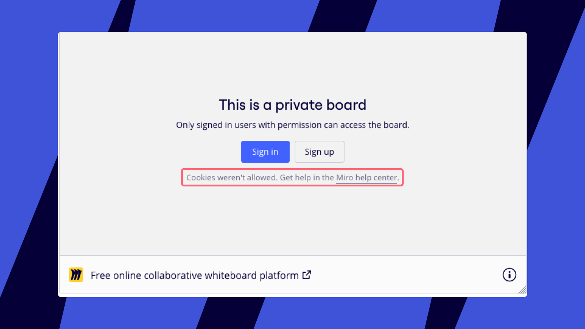
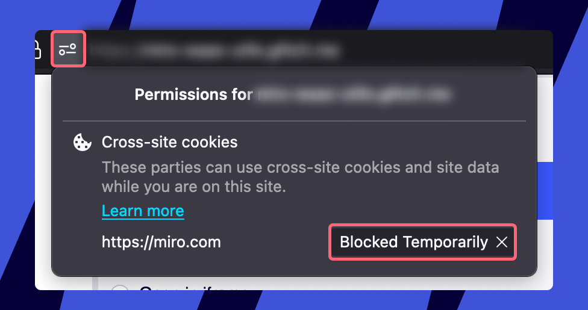
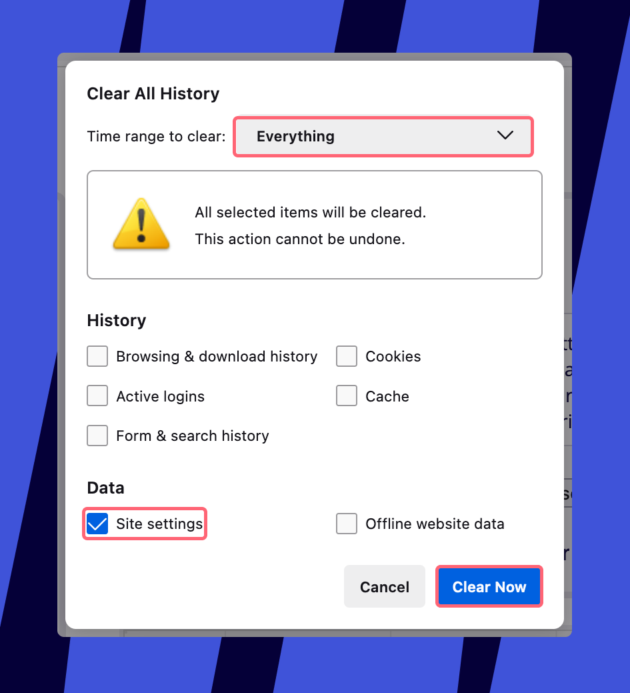
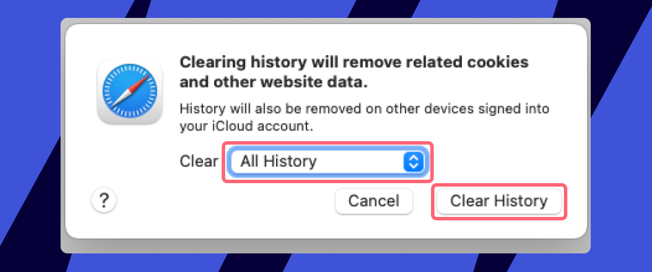

When you embed Miro content on another site, it may need access to Miro's cookies on your device. These cookies help maintain user sessions, preferences, and other functionalities. Users can choose to allow embedded boards to use Miro.com cookies.

## Benefits of allowing cookies

- Users signed into Miro stay logged in for embedded boards.
- After refreshing, users remain logged in to embedded boards.
- Ensures full functionality of cookie-dependent Miro features.

## How to allow cookies

1. Go to the website or app with the embedded Miro board.
2. When prompted, click **Allow cookies** and then confirm any additional prompts from your browser.
3. If you were already logged into Miro, you'll remain logged in for the embedded board. If not, simply log in again, and you'll be logged in the next time you access the embedded board.

:::note
Users need to log into Miro to access private boards, while public boards are accessible without logging in.
:::

*Allowing cookies for an embedded board*

*Cookie permission prompt in Firefox*

*Cookie permission prompt in Safari*

## Troubleshooting

If you see the message **Cookies weren’t allowed**, follow the troubleshooting steps for your browser to give consent.

*Cookies denied error message*

### Troubleshoot for Firefox and Safari

Firefox Safari

1. Click the **Permissions** icon in the address bar of your Firefox browser. If you see **Blocked** or **Blocked Temporarily** next to https://miro.com, click the **X** to remove it.

   
*Unblocking cookies for miro.com in Firefox*
2. If you're still encountering issues, clear your entire browser history:
   1. Open Firefox, click on **History** in the top menu, and then **Clear Recent History**.
   2. Set the time range to **Everything**, make sure **Site settings** is selected, and click **Clear Now**.
   3. Reload the webpage with the embedded Miro board and follow the steps to [allow cookies](#how-to-allow-cookies).

*Clearing Firefox history*

1. Ensure that you've recently visited miro.com using Safari. The browser may decline permissions if miro.com hasn't been accessed in the past 30 days. After visiting miro.com, reload the webpage with the embedded Miro board and follow the steps to [allow cookies](#how-to-allow-cookies).
2. If you're still encountering issues, clear your entire browser history:
   1. Open Safari, click on **History** in the top menu, and then click **Clear History**.
   2. Choose **All History** as the time range and confirm by clicking **Clear History** again.
   3. Reload the webpage with the embedded Miro board and follow the steps to [allow cookies](#how-to-allow-cookies).

*Clearing Safari history*
