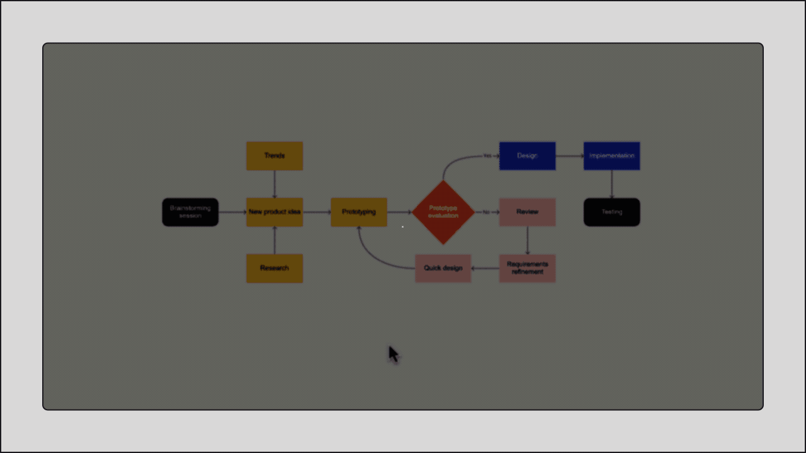
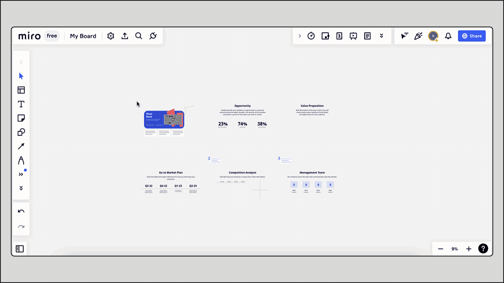
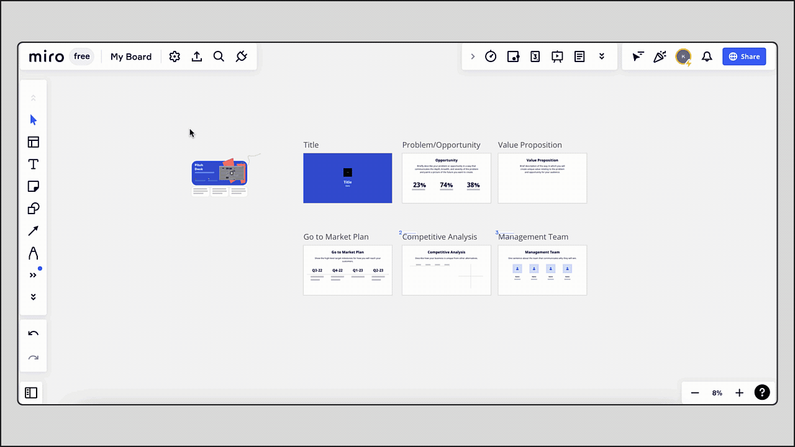
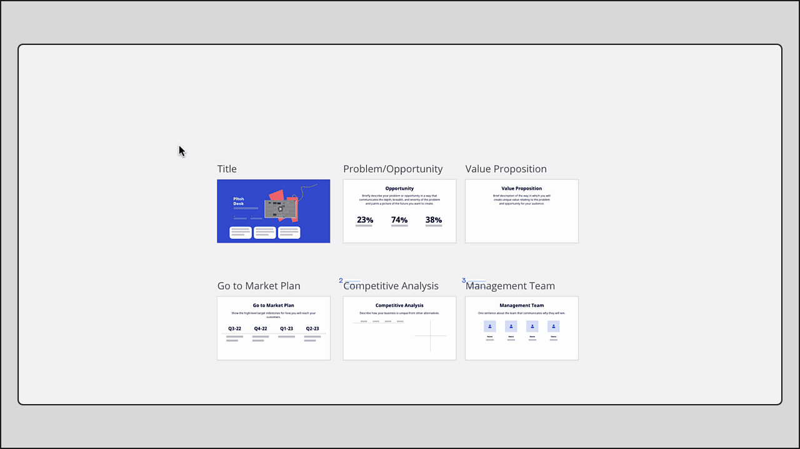

Easily transform your Miro boards into images, PDFs, or CSV files, ideal for sharing with colleagues, clients, or for documentation.

> 🚀  Give your work the audience it deserves. [Publish on Miroverse](https://miro.com/miroverse/submission/?backToUrl=/) to more than 60 million users.

## Export options depending on your plan, browser, and device

Some export options may not be available depending on your Miro plan, browser, and device. Note that export is available only if the board owner/co-owner **enables the option** for board collaborators in the [board content settings](../../sharing-boards/14-how-to-allow-or-restrict-copying-and-exporting-boards-and-content.md).

|  |  |  |  |  |  |
| --- | --- | --- | --- | --- | --- |
|  | Free plan | | Starter, Business, Enterprise, Education plans | | Export to CSV (all plans) |
|  | Low resolution | High resolution without watermark | Low  resolution | High resolution  without watermark |
| Google Chrome | ✔ | ✘ | ✔ | ✔ | ✔ |
| Safari | ✔ | ✘ | ✔ | ✔ | ✔ |
| Firefox | ✔ | ✘ | ✔ | ✔ | ✔ |
| Opera | ✔ | ✘ | ✔ | ✔ | ✘ |
| Edge < 79 | ✘ | ✘ | ✘ | ✔ | ✘ |
| [Desktop app](../../../getting-started/apps-for-devices/05-desktop-app.md) | ✔ | ✘ | ✔ | ✔ | ✔ |
| Tablet | ✔ | ✘ | ✔ | ✔ | ✘ |
| Mobile | ✘ | ✘ | ✘ | ✘ | ✘ |

## Save as image

:::warning
Edge (version < 79) supports **Vector export** only. Free plan supports export in small size only. Free plan users can export boards in Chrome, Firefox, Opera, Safari, Desktop app, or Tablet app.
:::

**To export a board as a JPG, PDF, or SVG image**:

1. Open the export sub-menu by clicking the three dots (**...**) icon and then the **Board** sub-menu in the top-left corner of the board.
2. Choose **Save as image**.
3. Select the area of the board that you’d like to save as an image.
4. Select the image size. Depending on your plan, you can export your board in **Small**, **Medium**, **Large**, or **Vector** size. Vector quality is saved as a PDF or SVG file. With vector export, you can preserve the image quality when exporting large boards.
5. Click **Export**.

*Saving the part of the board as an image*

**To export an individual frame as an image:**

1. Select a frame
2. Click the three dots on the context menu
3. Choose **Export as image**
4. Select the file size and click **Export**

*Saving the frame as an image*

**To export the whole board as an image:**

1. Select all objects on your board with the shortcut **Ctrl + A** (for Windows) or **⌘** + **A** (for Mac)
2. Click the three dots to create a frame around them
3. Click the three dots on the frame’s context menu and select **Export as image**

*Creating a frame around selected objects*

## Save as PDF

:::warning
Edge (version < 79) exports in **Best (Vector) quality** only. Free plan supports export in small size only. Free plan users can export boards in Chrome, Firefox, Opera, Safari, Desktop app or Tablet app.
:::

Export [frames](../../essential-tools/07-frames.md) as a PDF in **Small** or **Best** (**Vector**) quality.

**To export a board as a PDF file:**

1. Create at least one frame. Each frame will become a separate page in the saved PDF document.
2. To check in which order your frames will be listed in the PDF document, open the board overview in the bottom-left corner. To change the order of the pages in the exported PDF, change the order of the frames on the panel by dragging them.
3. Open the export sub-menu by clicking the three dots (**...**) icon and then the **Board** sub-menu in the top-left corner of the board.
4. Choose **Save as PDF**.
5. Select the file size: **Small file size** or **Best quality**. Note that Small file size PDFs do not support embedded links.
6. Click **Export**.

*Saving a board as a PDF*

When you export your board as a PDF, all frames are exported as a single file.

**To export certain frames as a PDF**:

1. Select the frames you’d like to export while holding **Shift**. Alternatively, you can drag the selection field across the content you’d like to export > click **Filter** on the context menu > select **Frames**
2. Click the three dots on the context menu and choose **Export as PDF**

*Exporting certain frames as a PDF*

**To export the whole board as a single-page PDF:**

Paid, Education plans Free plan

1. Select all objects on your board with the shortcut **Ctrl + A** (for Windows) or **⌘** + **A** (for Mac)
2. Click the three dots on the context menu in order to create a frame around them
3. Click the three dots on the frame’s context menu and choose **Export as image**
4. Select **Vector** quality, click **Export**
   **
*Exporting the whole board as PDF***

If you **don’t have frames** on your board:

1. Select all objects on your board with the shortcut **Ctrl + A** (for Windows) or **⌘** + **A** (for Mac)
2. Click three dots on the context menu in order to create a frame around them
3. Open the export menu in the top-left corner of the board, choose **Save as PDF**
4. Click **Export**

*Exporting the whole board as a PDF on Free plan if the board has no other frames*

If you already **have frames** on your board*:*

1. Select all objects on your board with the shortcut **Ctrl + A** (*for Windows*) or **⌘ + A** (*for Mac*) or by dragging the selection field.
2. On the context menu, click **Filter** and select **Frames**.
3. Delete the frames (but keep the content).
4. Select all objects on your board with the shortcut **Ctrl + A** (*for Windows*) or **⌘ + A** (*for Mac*) or by dragging the selection field.
5. Open the export sub-menu by clicking the three dots (**...**) icon and then the **Board** sub-menu in the top-left corner of the board. Then choose **Save as PDF**.
6. Click **Export**.
7. Undo the creation of the frame and removal of the frames by clicking the **undo** button under the left-side toolbar twice.

***Exporting a board as a PDF on Free plan*

:::note
Exporting frames with a large number of objects may cause a disruption in the export process (e.g. some text on the exported PDF files might be missing). For optimal performance, we recommend dividing large boards into several ones and exporting each board separately**.** Check [Board export issues](../../tools/troubleshooting/03-board-export-issues.md) to see more tips for optimizing board export.
:::

## Export to spreadsheet (CSV)

> **Available in:** [Chrome, Safari and Firefox browsers](../../troubleshooting-technical-questions/technical-guidelines/02-supported-browsers-&-browser-restrictions.md), [Desktop app](../../../getting-started/apps-for-devices/05-desktop-app.md)

The text on your board (on sticky notes, in tables, cards, text boxes, shapes) can be exported to a CSV file.

**To export text as a CSV file:**

1. Select a frame or board content. You can [select board content](../../working-on-the-board/10-working-with-objects.md) by dragging the selection filed or while holding **Shift**
2. Click the three dots on the context menu
3. Choose **Export to CSV**
4. As a result, you will have a CSV file with the board content put into a column in the following order: text, [card](../../essential-tools/02-cards.md) description/URL, sticky note/card tags

*Exporting frame to a CSV file*

You can also export the whole board in CSV by choosing the **Export to spreadsheet (CSV)** option on the board **Export** sub-menu.

*The option to export a board to spreadsheet (CSV)*

## Where exported files are saved

If you use Miro in a browser, the files will be stored in the folder where your browser downloads are saved by default (set up in the browser settings).

If you use the Miro Desktop app, please check the Downloads folder on your device.

## Limitations

- Miro board export may be restricted for users in the [board content settings](../../sharing-boards/14-how-to-allow-or-restrict-copying-and-exporting-boards-and-content.md)
- High-quality resolution export without the watermark is not available on Miro Free plan
- Edge (version < 79) supports Vector export only
- Miro export to CSV is not supported in Opera, Edge (<79), on tablet and mobile devices
- Miro board export is not supported in [developer teams](https://miro.com/api/)
- Miro board export is not supported on mobile devices
- Links are clickable on PDF files exported in **Vector** quality only
- Bitmap images on the board are compressed during the upload, whereas objects created in Miro (shapes, stickers, text, links, etc.) will keep their quality

## Print boards

To print your board, please export it as an [image](#save-as-image) or a [PDF](#save-as-pdf) following the instructions above and print the exported document. Learn [how to print a Miro board](04-how-to-print-your-board.md).

Learn about other export options:

- [Save board as a template](../../../getting-started/start-here/your-first-board/02-custom-templates.md)
- [Download board backup](05-how-to-save-board-backup.md)
- [Embed the board](02-embed-a-miro-board.md)
- [Save to Google Drive](../../../integrations-apps/google/05-google-drive.md#saving-your-board-to-google-drive)
- [Attach to Jira](../../../integrations-apps/atlassian/02-miro-for-jira-cloud.md)

## Frequently asked questions

*I don't have the option to export a Miro board. Why?*

The export option may be restricted in [board content settings](../../sharing-boards/14-how-to-allow-or-restrict-copying-and-exporting-boards-and-content.md) by the board owner. If board export is allowed in the board content settings but some export options are still missing, make sure that your plan, device, and browser support the board export - [check export availability](#export-options-depending-on-your-plan-browser-and-device).

*How do I allow my board collaborators to export the board?*

Check your [board content settings](../../sharing-boards/14-how-to-allow-or-restrict-copying-and-exporting-boards-and-content.md) and make sure that the option to copy board is available for board participants. You may also need to ask your admin to [allow copying board content to users outside the team](../../sharing-boards/14-how-to-allow-or-restrict-copying-and-exporting-boards-and-content.md).

*Can I export my board in PPT/PNG format?*

No. Currently, you can save your boards as PDF/JPG/SVG/CSV files.

*Are comments included in the exported document?*

No, but we have this feature in our backlog.

*Are frame titles shown on the exported document?*

No, but you can replace frame titles with [text widgets](../../essential-tools/16-text.md) that will be displayed in the document.

*Can I export voting results?*

No, please take a screenshot.

*When I'm working on my board, are all changes automatically saved?*

Yes. We also recommend saving the [board backups](05-how-to-save-board-backup.md) and exporting the board to ensure that your content is not deleted accidentally. If you work in [Web whiteboard](../../special-features/10-web-whiteboard.md) and don't have a Miro profile, [register with Miro](../../../getting-started/start-here/02-how-to-register-with-miro.md) to save your board and continue working on it after 24 hours.

*How do I export an individual element or set of elements?*

You can choose **Save as image** on the board **Export** menu and select the area with the image to capture. Another way is to [select the object(s)](../../working-on-the-board/10-working-with-objects.md), [create a frame around them](../../essential-tools/07-frames.md), and export it.

*Can I export my board into CSV with intelligent data?*

At the moment, CSV export doesn't keep board structure and relationships. However, if you export [tables](../../advanced-tools/05-grid.md) as CSV file, the structure is saved.

*Can I export files uploaded on the board?*

Yes, if this is allowed in the [board content settings](../../sharing-boards/14-how-to-allow-or-restrict-copying-and-exporting-boards-and-content.md). If the option is not restricted, select the file and click the download icon on the context menu.

:::note
If you experience issues exporting your Miro board, explore possible solutions in the article [Board export issues](../../tools/troubleshooting/03-board-export-issues.md).
:::
