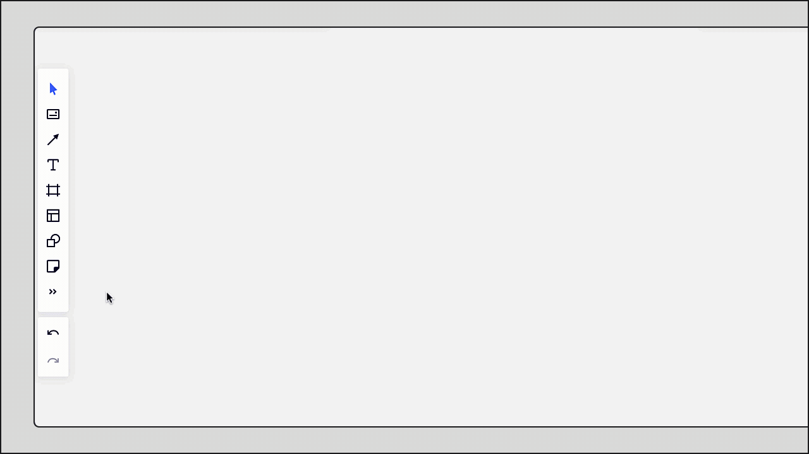
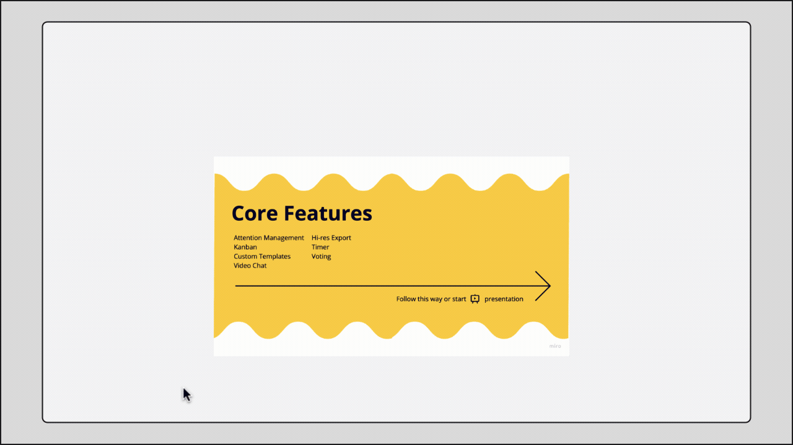

The easiest way to add files to your boards is to simply drag and drop them from your desktop. You can add images, PDF files, Google Drive documents, and MS Office files. The full list of supported file types is available in [this article](../../troubleshooting-technical-questions/technical-guidelines/03-supported-file-formats.md). New files can be added from your computer or from the web (maximum file size is 30 MB, maximum image resolution is 32 MP, maximum dimensions is 8192x4096 pixels).

### Adding files from your device

To upload files from your device choose **Upload** on the creation toolbar. If the option is hidden for you, click the **more tools** arrows (>>) and add the button to the toolbar. Click **My Device**.

*Upload button on the toolbar*

This will open a dialogue box, where you will be able to select the files that you wish to upload to the board. Once you select the files and click **Open**, they will be uploaded and will appear on the board.

Another simple way to upload files from your computer is to drag and place them on the board.

:::note
Check the list of supported file formats [here](../../troubleshooting-technical-questions/technical-guidelines/03-supported-file-formats.md).
:::

You can interact with uploaded files: change the size, rotate them, turn and extract pages.

*Interacting with an uploaded PDF file*

If you use the [Mobile app](../../../getting-started/apps-for-devices/08-mobile-app.md), push the plus icon in the bottom-right corner of the board, choose **Upload**. You can paste a file from the clipboard, take a photo, or choose an image from the mobile library. Uploading PDF files from mobile devices is not currently supported.

*Uploading a file from a mobile device*

### Adding files via URL links

To upload files from the web using a direct link to the source, choose **Upload via** **URL.**

***Upload via URL on the toolbar*

Then paste a direct URL link to a file from the web, such as a YouTube or Vimeo video.

*Uploading via a URL link*

:::note
Embedded video playback is unavailable on Free plans and for users with a Basic license.
:::

To watch a video, double-click on the **Play** icon (the added file won't autoplay). You will also be able to go to the **Source**page and use other functions in the context menu.

You can fast-forward a video added to Miro, as well as add subtitles and change the video quality — manage the uploaded videos directly from your boards.

*The option to go to the video source*

Another option is to post a link to a file directly on a board using **Ctrl+C**/**Ctrl+V**(*for Windows*) or **Cmd+C/Cmd+V**(*for Mac*) shortcuts.

To paste the URL link on a board without preview, use the [text tool](../../essential-tools/16-text.md) and paste the link into the text box.

### Uploading files from other services

You can also upload files from [Google Drive](../../../integrations-apps/google/05-google-drive.md), [Dropbox](../../../integrations-apps/more-integrations/06-dropbox.md), [Box](../../../integrations-apps/more-integrations/05-box-legacy.md), [OneDrive](../../../integrations-apps/microsoft/06-onedrive.md). All of the options are available in the **Upload** menu. Check the corresponding articles to learn more.

Note that [visitors](../../sharing-boards/08-collaboration-with-visitors.md) cannot use this option.

*The option to upload files from different storage services*

### Saving uploaded files to the library

You can save the uploaded files to your Miro library for future use in this team by selecting the file, clicking the three dots on the context menu, and selecting **Add to Saved Files**. This works for PDFs, images, presentations, Google Documents, and other files.

*The option to add a file to Saved files*

Saved files are available in the **Saved files**folder in the **Upload** menu on the toolbar. To add a file from the library, click on it, or drag and drop it to the board. Please note that the Saved files will only be accessible on boards in the team that the board from which they were saved belongs to.

*Saved files on the toolbar*

To delete a file from the library, hover over it and click the **Trash** icon.

*Delete a file from Saved files by clicking the trash icon*

If the option **Add to Saved files** is inactive (grey) and the error message says **This tool is unavailable on this board**, it means you don’t have enough rights to complete the action because you are not a member of the team where the board is stored.

### Splitting multipage docs

> **Available on:** browser version, [Desktop App](../../../getting-started/apps-for-devices/05-desktop-app.md)

A way for your team to collaborate on documents or PDF or Powerpoint files — expand any pages, lay them out on the board, and leave comments directly on pages.

To divide a PDF or a Powerpoint file into a certain number of pages:

1. Upload the file to the board.
2. Click on the file, in the context menu choose the **Extract pages** icon.

   > ✏️ The option is available in the [cursor (select) mode](#mini) only. If the option doesn't appear on the menu, press **V** or select the cursor on the toolbar and click the object again.
3. In the dialog, choose how you want to split the file — all or just specific pages and click **Extract.**

Expanded pages will appear right under the original file. If there is no need in the original file you can delete it — all extracted pages will stay on the board.

### Possible issues with uploading PDF files

Some PDF files fail to upload on a Miro board - they get stuck with the loading wheel or become grey images with an error sign. If you’re facing this issue, please make sure to check:

- Your PDF file is not larger than 30MB
- You’re using a stable internet connection
- Your device matches the minimum [system requirements](../../troubleshooting-technical-questions/technical-guidelines/01-system-requirements.md)

If you still struggle with uploading a file to your board it may be the file itself causing the issue. Some complex PDF files can’t be rendered on boards due to our technical limitations. This usually happens with PDFs that have many elements or small details on them. We’re working on improving our rendering tool but for now, please use a workaround:

- Save the file in PNG or JPEG format in the software you used to create it
- Or convert a PDF file to PNG or JPEG using an online file converter (you can use any converter you like, e.g. `https://www.freepdfconvert.com/pdf-to-png` or `https://cloudconvert.com/`)

:::note
If you experience any other issues uploading files to Miro boards, please try troubleshooting steps from [this article](../../tools/troubleshooting/07-how-to-troubleshoot-and-report-a-bug.md).
:::

## FAQ

**Can I upload video files from my device to Miro boards?**

No, but you can easily embed videos. Please check this guide: [Embedding media to boards](../../../integrations-apps/integrations-basics/03-embed-integrations-on-a-miro-board.md).

**Can I import editable data from an Excel or CSV file?**

Spreadsheets, including .xslx and CSV files, can be imported as view-only files, or can be used to create a Table or Grid. For more information: [Tables](../../formats/14-tables.md) or [Grid](../../advanced-tools/05-grid.md).

**Can I download files from a board?**

Yes, if this is allowed in the [board content settings](../../sharing-boards/14-how-to-allow-or-restrict-copying-and-exporting-boards-and-content.md). To download a file, select it and choose **Download** on the context menu.

**Can I click links in uploaded PDF files?**

No, this is not currently supported.
