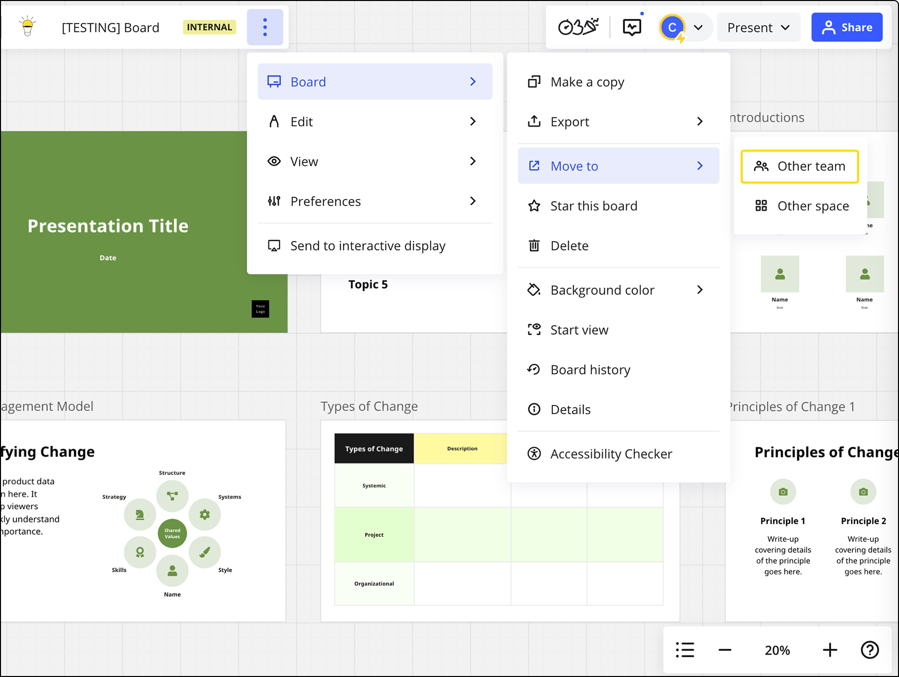
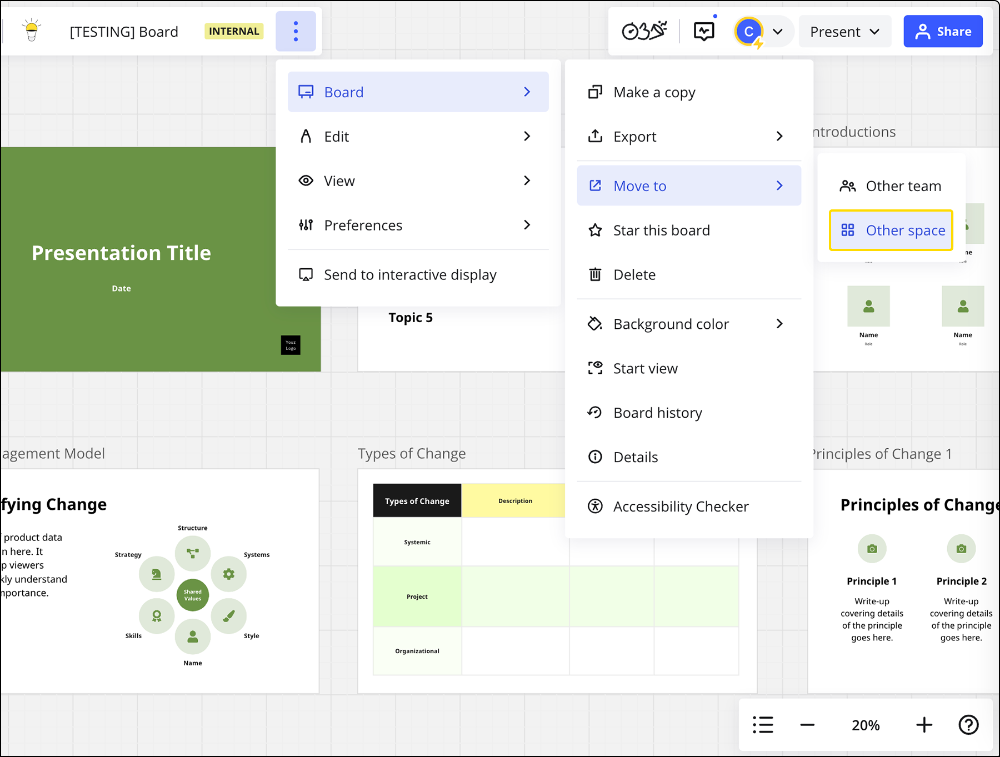
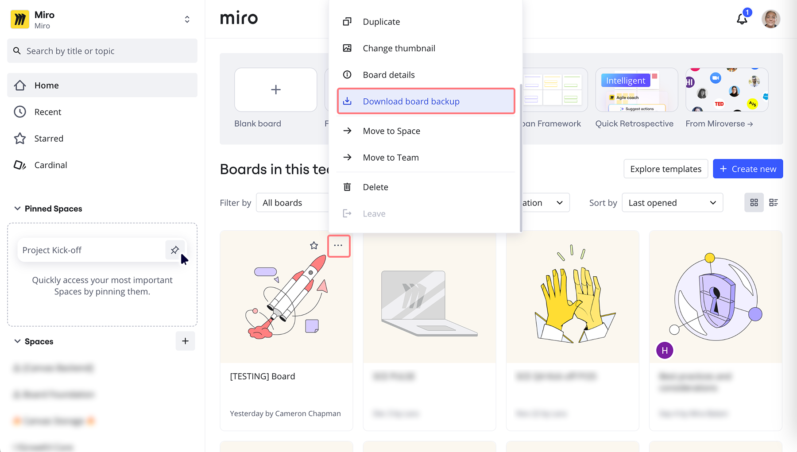
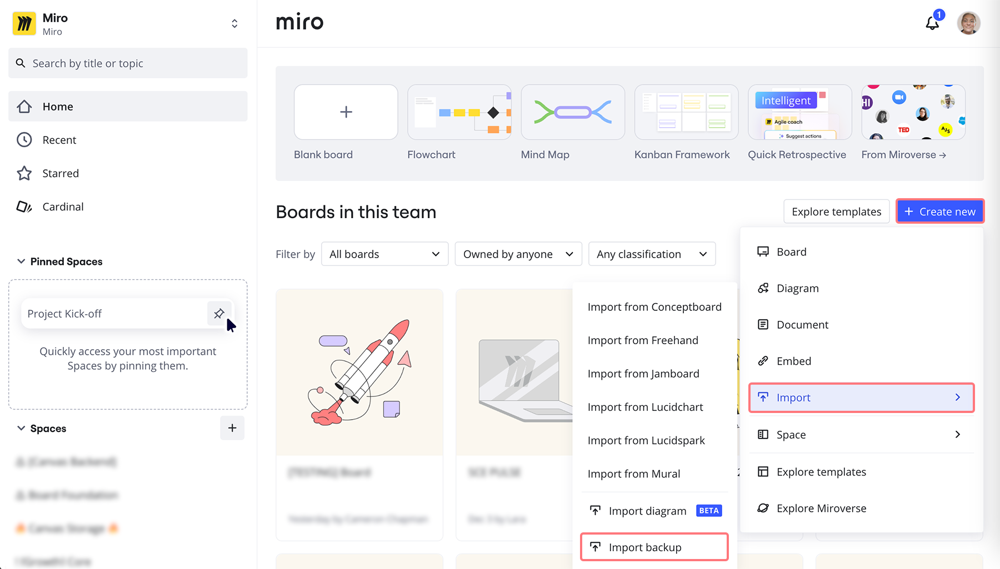
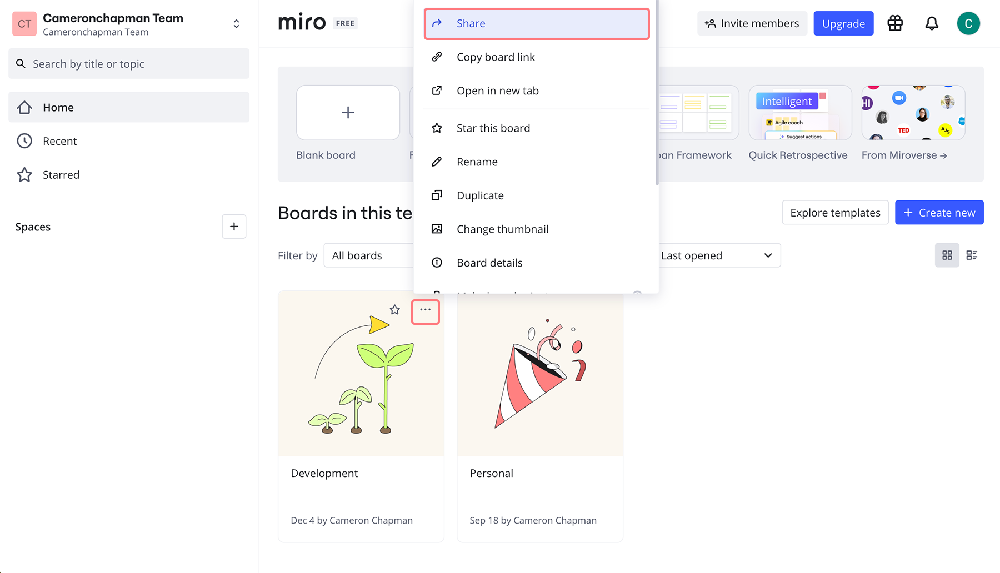
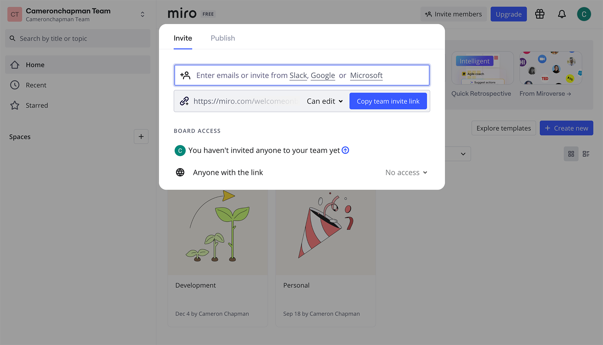

Every Miro user can be a member of multiple teams. Your Miro profile is your email address. You can move a Miro board from one team to another, or transfer your Miro board to another profile.

:::note
On Enterprise plans, board Co-owners and Content admins can move boards using the [Miro REST API](https://developers.miro.com/reference/update-board), which differs intentionally from the Miro UI experience, where only Owners can move their boards.
:::

:::note
Enterprise plan Company Admins can [restrict the option to move boards to and from a team](../../enterprise-administration/canvas-25-admin-features/data-security/07-sharing-policy-on-enterprise-plan.md#restrict-ability-to-move-boards-to-other-teams-team-level) for all non-admin users and board owners.
:::

## Common scenarios

Here are several common scenarios that involve moving boards, along with the section of this article that explains how to do it:

- You have **two Miro profiles** (email addresses associated with Miro) and you want to move boards from one profile to another.
  *Follow the steps in* [*this section*](04-how-to-move-a-board.md#how-to-move-boards-between-profiles)*, using the **Free plan** tab.*
- You have **upgraded from a Free plan to a paid plan** and want to move boards to the paid plan.
  *Follow the steps in* [*this section*](04-how-to-move-a-board.md#how-to-move-boards-between-profiles)*, using the **Free plan** tab.*
- You want to **move boards between two paid teams**.
  *Follow the steps in* [*this section*](04-how-to-move-a-board.md#how-to-move-boards-between-profiles)*, using the **Paid, Education plans** tab.*

## Moving boards between teams

:::warning
When you move a board to another team, its [version history](12-board-history-versions.md) will be lost. If you would like to keep the version history, we recommend [copying the board content](../working-on-the-board/09-copy-as-text-or-as-an-image.md) instead.
:::

To move a board between teams, you must:

- own the board
- be a member of both teams

There are two ways to move a board to a different team: from the dashboard, or directly within a board.

### How to move a board directly within the board

1. Open your board and click the three dots (**...**) icon to the right of your board name (top-left corner)
2. Navigate to **Board > Move to > Other team**

### How to move a board using the dashboard

1. Go to your dashboard to see all boards in a team.
2. Hover over the card of the board you want to move.
3. Click the three dots, then click **Move to team**.
   A dialog opens.
4. Select the organization where you want to move the board.
5. Select a team in that organization.
6. Click **Move**.

### How to move a board to a different space

1. Open your board and click the three dots (**...**) icon directly to the right of your board name (top-left corner)
2. Navigate to **Board > Move to > Other space.** You can additionally choose to notify team members that the board has been moved to another space.*Moving a board to another space*

### User denied access

If any board collaborators are not part of the team where the board is moving, you’ll see a denied access message.

There are two ways to see which user emails will lose access to the board after you move it. If the number of users is less than 10, you can see the email list by clicking **View users emails** in the **Denied access message.** If the number is greater than 10, there will be a link to download the email list.

To make sure that all collaborators maintain access to the board, you can [invite members to the new team](../sharing-boards/03-sharing-boards-and-inviting-collaborators.md) before moving the board.

You can also choose **Move anyway** and add collaborators to the board again after it's moved.

*Denied access message when moving a board from one team to another*

**If you move a board to a free team**, it will be shared with all team members.

*Private boards are not available in free teams*

## Moving boards between profiles

Your profile in Miro is the email address you registered with. If you registered with two different emails, it means that you have two profiles. You can transfer a board from one profile to another.

### How to move boards between profiles

Paid, Education plans Free plan

If the board is located in a paid or Education team and you would like to move it to another paid or Education team, simply save the board backup and upload it to that team.

1. Open your dashboard.
2. Hover over the card of the board you want to move.
3. Click the three dots.
4. Click **Download board backup**.
5. The .rtb file will be saved to your device.

   
6. Log in to your second Miro profile.
7. Switch to the team where you want to move the board.
8. Click **+ Create new** > **Import** > **Import backup**.
9. The file picker will open.
10. Choose the .rtb backup file you previously saved and click **Open**. The board will then be available from your dashboard.

    

Follow these steps if your board is located in a free team or you need to move a board to a free team.

1. Log in to Miro under profile #1.
2. Share the board with profile #2. Click **Share**.
   
3. Enter the email for profile #2 > click **Send invitations**.

   
4. Transfer ownership of the board from profile #1 to profile #2. Click the **Share** button > **Sharing settings** > choose profile #2 > select **Owner** in the dropdown.
5. Log in to Miro under profile #2 where you'll see the board.
6. [Move the board to another team](#how-to-move-a-board-using-the-dashboard).

:::warning
If your second profile is on Free Plan, and you invite your free profile to a paid profile, you are taking up a seat (license) in your paid plan. If this exceeds the number of seats in your plan, you may be charged for an extra seat (license).
:::

## Frequently asked questions

**Why don’t I see the option to move to a team on my board menu?**

Only board owners who are members of several teams can move boards between them. If you are not the board owner, you can [duplicate the board](03-how-to-duplicate-a-board.md) (if this is allowed in [board content settings](../sharing-boards/14-how-to-allow-or-restrict-copying-and-exporting-boards-and-content.md)) and move the board copy.

The option to move boards may also be restricted by Company Admins on Enterprise plan.

**How can I pass ownership of my board to another user?**

Learn how to [transfer board ownership to another collaborator](05-how-to-transfer-board-ownership.md).

**Does the board link change when I move the board to another team?**

No, the board URL does not change.

**Can I move a template board to another user's team?**

Yes, you can either ask the user to invite you to their team and then move the board, or [share the board](../sharing-boards/03-sharing-boards-and-inviting-collaborators.md) and allow them to [duplicate your board](03-how-to-duplicate-a-board.md) in the [board content settings](../sharing-boards/14-how-to-allow-or-restrict-copying-and-exporting-boards-and-content.md).

**Can I move Spaces between teams?**

No, you can only move separate boards.

**Can I move multiple boards in bulk?**

No, this is not supported at the moment.

**I try to move my board and nothing happens or an error message appears - what do I do?**

Please try moving the board in another browser or in incognito mode. You can also try switching to another network or device.

Another option is to [duplicate the board](03-how-to-duplicate-a-board.md) and move the board copy. If that doesn't help, [report the issue to Miro Support](../tools/troubleshooting/06-contacting-miro-support.md).
