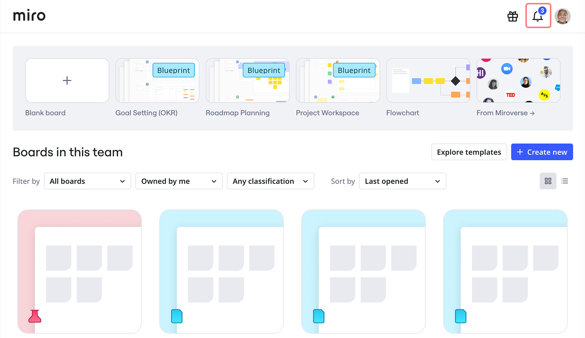
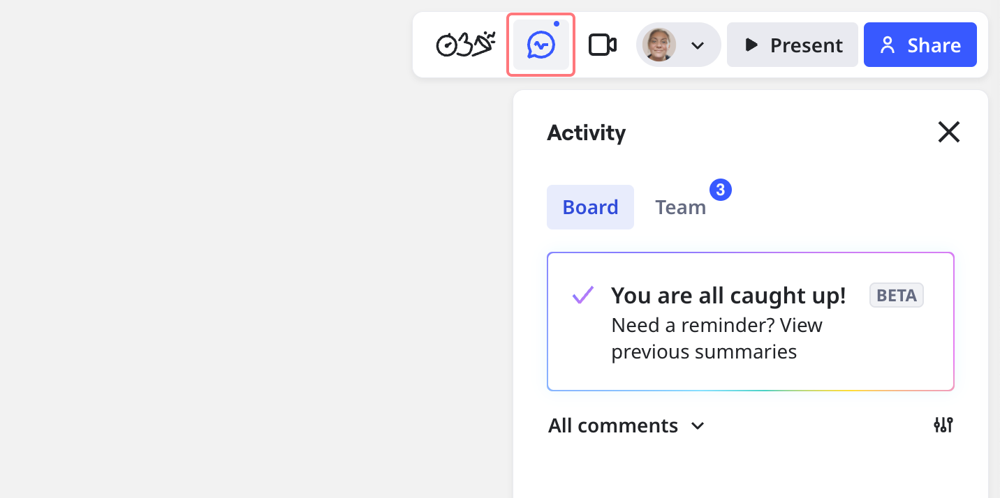

Feed is an in-product notification center created to help you always stay on top of collaboration happening in your team. The feed aggregates the most important updates from your boards, allowing you to manage all your notifications in one place while on the board.

## Stay focused with centralized notifications

By using the feed, you can:

- Never miss important notifications.
- Get a quick snapshot of collaboration happening on your boards in one place.
- Interact with notifications without switching between apps and losing focus.

## Keep your team aligned

The feed is especially useful for the following users:

- Distributed teams working across different time zones.
- Project managers working on several projects and having to work through many notifications from multiple boards every day.
- Anyone who wants to have visibility into collaboration happening in their team.

## Track key board updates

Your feed contains the following types of updates:

- [Mentions](../facilitation-tools/01-@mentioning-people-on-the-board.md) with up-to-date board previews for all boards you have access to.
- All [comments](../facilitation-tools/asynchronous-tools/01-comments.md) from the boards you own.
- [Invites](../sharing-boards/03-sharing-boards-and-inviting-collaborators.md) to boards, both personal and team-shared.
- [Requests](../sharing-boards/01-board-access-rights.md#how-to-request-access-to-a-board) for board access and editing rights.

## Access and interact with your feed

You can find the feed icon in the top-right corner of your dashboard.

When you are on a board, you can access the feed by clicking the **Activity** icon on the collaboration toolbar in the top-right corner. From there, you can switch between board-specific activity and notifications for your entire team.

You can streamline a team discussion by replying to a [mention](../facilitation-tools/01-@mentioning-people-on-the-board.md) directly from the feed without opening the board. To get the full context of a discussion, click on a comment to go directly to its location on the board. You can also hover over a user's name in the feed to see their profile card.

## Feed organization and notifications

### How the feed is organized

Your feed is organized in the following way:

- All updates are grouped by board.
- Your most recent updates are listed first in reverse chronological order.
- All new updates appear on the **Unread** tab. Once you take action on an update (such as replying or accepting a request), it moves to the **All updates** tab, where it is stored for 30 days. To revisit an item later, you can mark it as unread to move it back to the **Unread** tab.

### Toast notifications

Toast notifications appear when you have any missed or unread updates, mentions and access requests. You can see toast notifications in the top-right corner of your dashboard and board.
